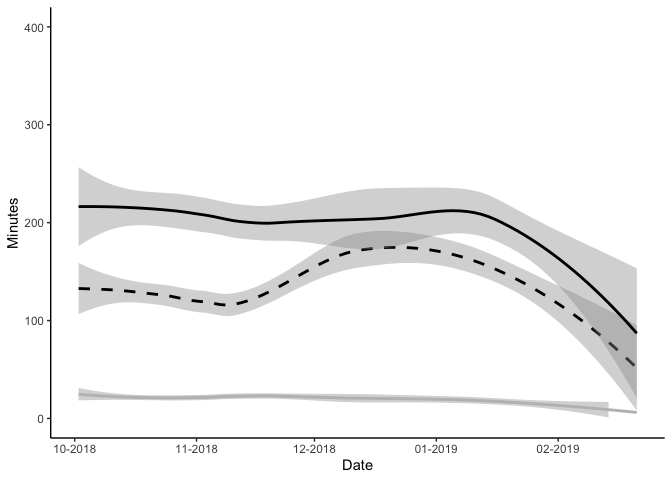
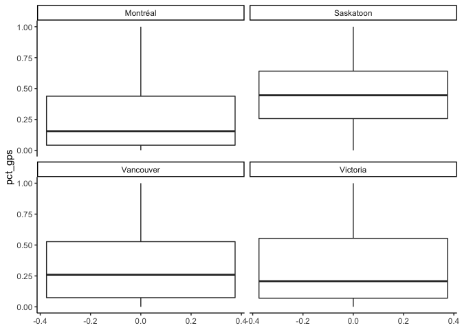
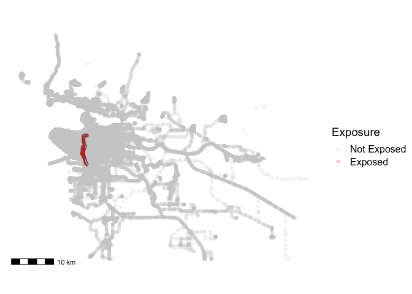
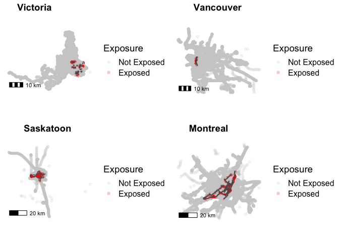
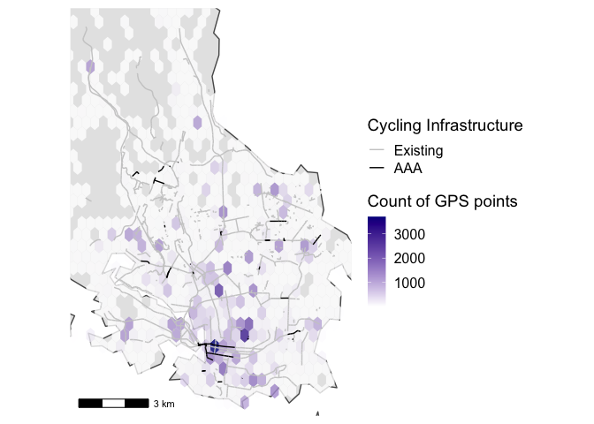
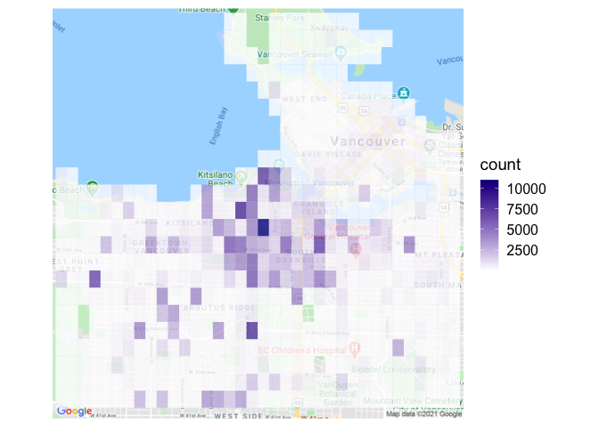
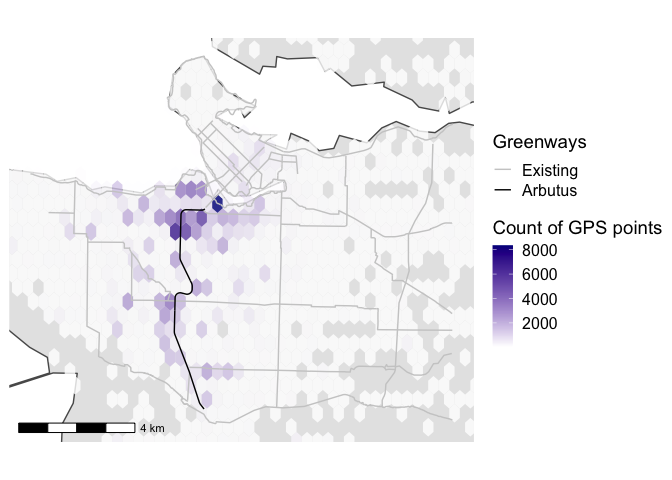
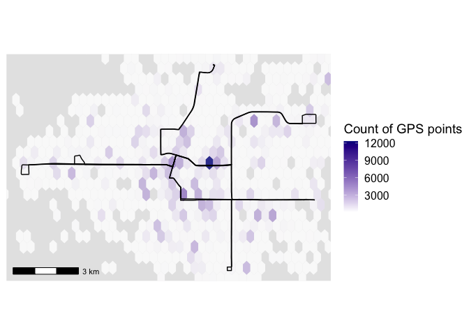
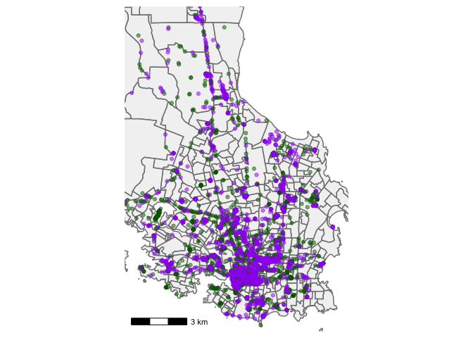

## Code for INTERACT baseline paper

To be submitted for a special issue of Health and Place (MoHeaP 2020 special issue). Submission deadline is January 15, 2020. 

## Required packages

```r
library(tidyverse)
```

```
## ── Attaching packages ─────────────────────────────────────────────────────────────────────────────────────── tidyverse 1.3.0 ──
```

```
## ✓ ggplot2 3.3.2     ✓ purrr   0.3.4
## ✓ tibble  3.0.3     ✓ dplyr   1.0.2
## ✓ tidyr   1.1.2     ✓ stringr 1.4.0
## ✓ readr   1.3.1     ✓ forcats 0.5.0
```

```
## ── Conflicts ────────────────────────────────────────────────────────────────────────────────────────── tidyverse_conflicts() ──
## x dplyr::filter() masks stats::filter()
## x dplyr::lag()    masks stats::lag()
```

```r
library(lubridate)
```

```
## 
## Attaching package: 'lubridate'
```

```
## The following objects are masked from 'package:base':
## 
##     date, intersect, setdiff, union
```

```r
library(ggplot2)
library(naniar)
library(ggmap)
```

```
## Google's Terms of Service: https://cloud.google.com/maps-platform/terms/.
```

```
## Please cite ggmap if you use it! See citation("ggmap") for details.
```

```r
library(ggthemes)
library(sf)
```

```
## Linking to GEOS 3.8.1, GDAL 3.1.1, PROJ 6.3.1
```

```r
library(rgeos)
```

```
## Loading required package: sp
```

```
## rgeos version: 0.5-5, (SVN revision 640)
##  GEOS runtime version: 3.8.1-CAPI-1.13.3 
##  Linking to sp version: 1.4-2 
##  Polygon checking: TRUE
```

```r
library(cancensus)
```

```
## Census data is currently stored temporarily.
## 
##  In order to speed up performance, reduce API quota usage, and reduce unnecessary network calls, please set up a persistent cache directory by setting options(cancensus.cache_path = '<path to cancensus cache directory>')
## 
##  You may add this option, together with your API key, to your .Rprofile.
```

```r
library(cowplot)
```

```
## 
## Attaching package: 'cowplot'
```

```
## The following object is masked from 'package:ggthemes':
## 
##     theme_map
```

```
## The following object is masked from 'package:ggmap':
## 
##     theme_nothing
```

```
## The following object is masked from 'package:lubridate':
## 
##     stamp
```

```r
library(ggspatial)
library(knitr)

setwd("/Users/dfuller/Dropbox/Projects/INTERACT_github/publications/baseline_paper_2021_Fuller")
```


## Analysis Plan 

1. Health Survey (and Canadian Census Comparisons)
2. Participant data flow
3. SenseDoc (Accelerometer)
4. Ethica (Accelerometer)
5. VERITAS - Sensedoc activity space

## Eligibility Data


```r
data_temp <- NULL

data_temp <- dir(path = "/Users/dfuller/Documents/INTERACT/data/eligibility", full.names = TRUE, pattern = "*1884baf.csv", recursive = TRUE) %>%
   purrr::map(function(i){
     dfhx <- read.csv(i, header = TRUE)
     temp <- bind_rows(data_temp, dfhx)
   })

elig_data <- bind_rows(data_temp)
rm(data_temp)

elig_data$elig <- 1
```

## Health Survey Data


```r
data_temp <- NULL

data_temp <- dir(path = "/Users/dfuller/Documents/INTERACT/data/health", full.names = TRUE, pattern = "*1884baf.csv", recursive = TRUE) %>%
   purrr::map(function(i){
     dfhx <- read.csv(i, header = TRUE)
     temp <- bind_rows(data_temp, dfhx)
   })

individual_data <- bind_rows(data_temp)
rm(data_temp)

individual_data$health <- 1
```

## Joining health and eligibility


```r
data <- left_join(individual_data, elig_data, by = c("interact_id"))

data <- data %>%
          rename(
            city_id = city_id.x,
            date_of_survey = date_of_survey.x
          )
```

## Age Survey


```r
age_table <- data %>%
                group_by(city_id) %>%
                  summarize(
                    mean_age = mean(age, na.rm = TRUE), 
                    sd_age = sd(age, na.rm = TRUE), 
                    na_count = sum(is.na(age)), 
                    count = n()
                  )
```

```
## `summarise()` ungrouping output (override with `.groups` argument)
```

```r
data$birth_date <- ymd(data$birth_date)
data$birth_year <- year(data$birth_date)

data$age_sk <- 2021 - data$birth_year

table(data$age_sk)
```

```
## 
##    1    2   21   22   23   24   25   26   27   28   29   30   31   32   33   34 
##    1    3   17   23   30   28   34   19   26   33   39   43   37   48   44   53 
##   35   36   37   38   39   40   41   42   43   44   45   46   47   48   49   50 
##   47   43   53   58   42   52   51   43   34   37   28   36   32   45   30   25 
##   51   52   53   54   55   56   57   58   59   60   61   62   63   64   65   66 
##   34   30   31   35   33   35   36   39   39   28   40   45   34   37   35   33 
##   67   68   69   70   71   72   73   74   75   76   77   78   79   80   81   82 
##   34   36   35   18   21   19   25   28   20   18    9   14   11   13   12    5 
##   83   84   85   86   87   88   89   92 1941 
##    5    3    5    1    1    1    1    2    1
```

```r
data$age_sk <- as.numeric(data$age_sk)

data <- data %>%
          mutate(age_recode = case_when(
            age <= 19 ~ "15_19",
            age > 19 & age <= 29 ~ "20_29",
            age > 29 & age <= 39 ~ "30_39",     
            age > 39 & age <= 49 ~ "40_49",      
            age > 59 & age <= 64 ~ "50_64",      
            age > 64 ~ "65+"  
           ))

data <- data %>%
          mutate(age_sk_recode = case_when(
            age_sk <= 19 ~ "15_19",
            age_sk > 19 & age_sk <= 29 ~ "20_29",
            age_sk > 29 & age_sk <= 39 ~ "30_39",     
            age_sk > 39 & age_sk <= 49 ~ "40_49",      
            age_sk > 59 & age_sk <= 64 ~ "50_64",      
            age_sk > 64 ~ "65+"  
           ))

table(data$age_recode, data$age)
```

```
##        
##         18 19 20 21 22 23 24 25 26 27 28 29 30 31 32 33 34 35 36 37 38 39 40 41
##   15_19  6  8  0  0  0  0  0  0  0  0  0  0  0  0  0  0  0  0  0  0  0  0  0  0
##   20_29  0  0  9 13 16 17 25 27 36 34 44 34  0  0  0  0  0  0  0  0  0  0  0  0
##   30_39  0  0  0  0  0  0  0  0  0  0  0  0 40 39 36 44 45 46 46 37 36 36  0  0
##   40_49  0  0  0  0  0  0  0  0  0  0  0  0  0  0  0  0  0  0  0  0  0  0 26 39
##   50_64  0  0  0  0  0  0  0  0  0  0  0  0  0  0  0  0  0  0  0  0  0  0  0  0
##   65+    0  0  0  0  0  0  0  0  0  0  0  0  0  0  0  0  0  0  0  0  0  0  0  0
##        
##         42 43 44 45 46 47 48 49 50 51 52 53 54 55 56 57 58 59 60 61 62 63 64 65
##   15_19  0  0  0  0  0  0  0  0  0  0  0  0  0  0  0  0  0  0  0  0  0  0  0  0
##   20_29  0  0  0  0  0  0  0  0  0  0  0  0  0  0  0  0  0  0  0  0  0  0  0  0
##   30_39  0  0  0  0  0  0  0  0  0  0  0  0  0  0  0  0  0  0  0  0  0  0  0  0
##   40_49 27 32 27 38 31 28 26 28  0  0  0  0  0  0  0  0  0  0  0  0  0  0  0  0
##   50_64  0  0  0  0  0  0  0  0  0  0  0  0  0  0  0  0  0  0 36 38 29 35 38  0
##   65+    0  0  0  0  0  0  0  0  0  0  0  0  0  0  0  0  0  0  0  0  0  0  0 27
##        
##         66 67 68 69 70 71 72 73 74 75 76 77 78 79 80 81 82 83 85 86 88
##   15_19  0  0  0  0  0  0  0  0  0  0  0  0  0  0  0  0  0  0  0  0  0
##   20_29  0  0  0  0  0  0  0  0  0  0  0  0  0  0  0  0  0  0  0  0  0
##   30_39  0  0  0  0  0  0  0  0  0  0  0  0  0  0  0  0  0  0  0  0  0
##   40_49  0  0  0  0  0  0  0  0  0  0  0  0  0  0  0  0  0  0  0  0  0
##   50_64  0  0  0  0  0  0  0  0  0  0  0  0  0  0  0  0  0  0  0  0  0
##   65+   33 15 19 23 24 23 17 16 12 14 10 12  9  3  6  3  3  2  1  1  2
```

```r
table(data$age_sk_recode, data$city_id)
```

```
##        
##         Montréal Saskatoon Vancouver Victoria
##   15_19        0         4         0        0
##   20_29      113       111        10       15
##   30_39      283        73        38       74
##   40_49      243        45        28       72
##   50_64      105         7        40       32
##   65+        226         7       133       40
```

## Age Census


```r
options(cancensus.api_key = "CensusMapper_159fe4a88e8c934fece317e847beef84")
options(cancensus.cache_path = 'safe data/cache')
options(cancensus.cache_path = "/Users/dfuller/Desktop/cancensus") ##.rda files will be stored here
options(scipen = 99, digits = 12)

regions <- c("59933", "47725", "59935", "24462")

age <- find_census_vectors("age", dataset = "CA16", type = "total", query_type = "exact")
age
```

```
## # A tibble: 1,639 x 4
##    vector   type  label                    details                              
##    <chr>    <fct> <chr>                    <chr>                                
##  1 v_CA16_… Total Population percentage c… Population and Dwellings; Population…
##  2 v_CA16_1 Total Total - Age              Total - Age                          
##  3 v_CA16_4 Total 0 to 14 years            Total - Age; 0 to 14 years           
##  4 v_CA16_7 Total 0 to 4 years             Total - Age; 0 to 14 years; 0 to 4 y…
##  5 v_CA16_… Total Under 1 year             Total - Age; 0 to 14 years; 0 to 4 y…
##  6 v_CA16_… Total 1                        Total - Age; 0 to 14 years; 0 to 4 y…
##  7 v_CA16_… Total 2                        Total - Age; 0 to 14 years; 0 to 4 y…
##  8 v_CA16_… Total 3                        Total - Age; 0 to 14 years; 0 to 4 y…
##  9 v_CA16_… Total 4                        Total - Age; 0 to 14 years; 0 to 4 y…
## 10 v_CA16_… Total 5 to 9 years             Total - Age; 0 to 14 years; 5 to 9 y…
## # … with 1,629 more rows
```

```r
age_list <- c("v_CA16_64", "v_CA16_82", "v_CA16_100", "v_CA16_118", "v_CA16_136", "v_CA16_154", "v_CA16_172", "v_CA16_190", "v_CA16_208", "v_CA16_226", "v_CA16_244")

age_census <- get_census(dataset='CA16', regions=list(CMA=regions),
                          vectors=age_list,
                          level='CMA', use_cache = TRUE)
```

```
## Reading vectors data from local cache.
```

```r
age_census <- age_census %>% 
    gather("age", "pop", 10:20) %>%
        select("GeoUID", "Population", "Region Name", "age", "pop")   

table(age_census$age)
```

```
## 
##    v_CA16_100: 25 to 29 years    v_CA16_118: 30 to 34 years 
##                             4                             4 
##    v_CA16_136: 35 to 39 years    v_CA16_154: 40 to 44 years 
##                             4                             4 
##    v_CA16_172: 45 to 49 years    v_CA16_190: 50 to 54 years 
##                             4                             4 
##    v_CA16_208: 55 to 59 years    v_CA16_226: 60 to 64 years 
##                             4                             4 
## v_CA16_244: 65 years and over     v_CA16_64: 15 to 19 years 
##                             4                             4 
##     v_CA16_82: 20 to 24 years 
##                             4
```

```r
age_census$age_cat <- recode(age_census$age,
                                        "v_CA16_64: 15 to 19 years" = "15_19", 
                                        "v_CA16_82: 20 to 24 years" = "20_29", 
                                        "v_CA16_100: 25 to 29 years" = "20_29", 
                                        "v_CA16_118: 30 to 34 years" = "30_39", 
                                        "v_CA16_136: 35 to 39 years" = "30_39", 
                                        "v_CA16_154: 40 to 44 years" = "40_49", 
                                        "v_CA16_172: 45 to 49 years" = "40_49", 
                                        "v_CA16_190: 50 to 54 years" = "50_64", 
                                        "v_CA16_208: 55 to 59 years" = "50_64", 
                                        "v_CA16_226: 60 to 64 years" = "50_64", 
                                        "v_CA16_244: 65 years and over" = "65+")
table(age_census$age, age_census$age_cat)
```

```
##                                
##                                 15_19 20_29 30_39 40_49 50_64 65+
##   v_CA16_100: 25 to 29 years        0     4     0     0     0   0
##   v_CA16_118: 30 to 34 years        0     0     4     0     0   0
##   v_CA16_136: 35 to 39 years        0     0     4     0     0   0
##   v_CA16_154: 40 to 44 years        0     0     0     4     0   0
##   v_CA16_172: 45 to 49 years        0     0     0     4     0   0
##   v_CA16_190: 50 to 54 years        0     0     0     0     4   0
##   v_CA16_208: 55 to 59 years        0     0     0     0     4   0
##   v_CA16_226: 60 to 64 years        0     0     0     0     4   0
##   v_CA16_244: 65 years and over     0     0     0     0     0   4
##   v_CA16_64: 15 to 19 years         4     0     0     0     0   0
##   v_CA16_82: 20 to 24 years         0     4     0     0     0   0
```

```r
### Create new columns for total within a city and pct of total within a city
age_census <- age_census %>%
  group_by(GeoUID) %>%
  mutate(
    pct_age_city = (pop / Population*100),
    )

age_census_table <- age_census %>%
                    group_by(GeoUID, age_cat) %>%
                    summarize(
                      age_pct = sum(pct_age_city, na.rm = TRUE),
                      city = first(`Region Name`)
                      )
```

```
## `summarise()` regrouping output by 'GeoUID' (override with `.groups` argument)
```

```r
age_census_table
```

```
## # A tibble: 24 x 4
## # Groups:   GeoUID [4]
##    GeoUID age_cat age_pct city         
##    <chr>  <chr>     <dbl> <fct>        
##  1 24462  15_19      5.50 Montréal (B) 
##  2 24462  20_29     13.2  Montréal (B) 
##  3 24462  30_39     14.0  Montréal (B) 
##  4 24462  40_49     13.5  Montréal (B) 
##  5 24462  50_64     20.5  Montréal (B) 
##  6 24462  65+       16.4  Montréal (B) 
##  7 47725  15_19      5.98 Saskatoon (B)
##  8 47725  20_29     16.0  Saskatoon (B)
##  9 47725  30_39     15.4  Saskatoon (B)
## 10 47725  40_49     12.3  Saskatoon (B)
## # … with 14 more rows
```

## Income


```r
income <- find_census_vectors("income", dataset = "CA16", type = "total", query_type = "exact")
income
```

```
## # A tibble: 217 x 4
##    vector   type  label                          details                        
##    <chr>    <fct> <chr>                          <chr>                          
##  1 v_CA16_… Total Total - Income statistics in … Income; Individuals; Total - I…
##  2 v_CA16_… Total Number of total income recipi… Income; Individuals; Total - I…
##  3 v_CA16_… Total Median total income in 2015 a… Income; Individuals; Total - I…
##  4 v_CA16_… Total Number of after-tax income re… Income; Individuals; Total - I…
##  5 v_CA16_… Total Median after-tax income in 20… Income; Individuals; Total - I…
##  6 v_CA16_… Total Number of market income recip… Income; Individuals; Total - I…
##  7 v_CA16_… Total Median market income in 2015 … Income; Individuals; Total - I…
##  8 v_CA16_… Total Number of government transfer… Income; Individuals; Total - I…
##  9 v_CA16_… Total Median government transfers i… Income; Individuals; Total - I…
## 10 v_CA16_… Total Number of employment income r… Income; Individuals; Total - I…
## # … with 207 more rows
```

```r
income_list <- c("v_CA16_2406", "v_CA16_2407", "v_CA16_2408", "v_CA16_2409", "v_CA16_2410", "v_CA16_2411", "v_CA16_2412", "v_CA16_2413", "v_CA16_2414", "v_CA16_2415", "v_CA16_2416", "v_CA16_2417", "v_CA16_2418", "v_CA16_2419", "v_CA16_2420", "v_CA16_2422", "v_CA16_2423", "v_CA16_2424", "v_CA16_2425")

income_census <- get_census(dataset='CA16', regions=list(CMA=regions),
                          vectors=income_list,
                          level='CMA', use_cache = TRUE)
```

```
## Reading vectors data from local cache.
```

```r
income_census <- income_census %>% 
    gather("income", "pop", 10:28) %>%
        select("GeoUID", "Households", "Region Name", "income", "pop")   

table(income_census$income)
```

```
## 
##         v_CA16_2406: Under $5,000     v_CA16_2407: $5,000 to $9,999 
##                                 4                                 4 
##   v_CA16_2408: $10,000 to $14,999   v_CA16_2409: $15,000 to $19,999 
##                                 4                                 4 
##   v_CA16_2410: $20,000 to $24,999   v_CA16_2411: $25,000 to $29,999 
##                                 4                                 4 
##   v_CA16_2412: $30,000 to $34,999   v_CA16_2413: $35,000 to $39,999 
##                                 4                                 4 
##   v_CA16_2414: $40,000 to $44,999   v_CA16_2415: $45,000 to $49,999 
##                                 4                                 4 
##   v_CA16_2416: $50,000 to $59,999   v_CA16_2417: $60,000 to $69,999 
##                                 4                                 4 
##   v_CA16_2418: $70,000 to $79,999   v_CA16_2419: $80,000 to $89,999 
##                                 4                                 4 
##   v_CA16_2420: $90,000 to $99,999 v_CA16_2422: $100,000 to $124,999 
##                                 4                                 4 
## v_CA16_2423: $125,000 to $149,999 v_CA16_2424: $150,000 to $199,999 
##                                 4                                 4 
##    v_CA16_2425: $200,000 and over 
##                                 4
```

```r
income_census$income_cat <- recode(income_census$income,
                                        "v_CA16_2406: Under $5,000" = "0_19 999", 
                                        "v_CA16_2407: $5,000 to $9,999" = "0_19 999", 
                                        "v_CA16_2408: $10,000 to $14,999" = "0_19 999", 
                                        "v_CA16_2409: $15,000 to $19,999" = "0_19 999", 
                                        "v_CA16_2410: $20,000 to $24,999" = "20_49 999", 
                                        "v_CA16_2411: $25,000 to $29,999" = "20_49 999", 
                                        "v_CA16_2412: $30,000 to $34,999" = "20_49 999",
                                        "v_CA16_2413: $35,000 to $39,999" = "20_49 999",
                                        "v_CA16_2414: $40,000 to $44,999" = "20_49 999", 
                                        "v_CA16_2415: $45,000 to $49,999" = "20_49 999", 
                                        "v_CA16_2416: $50,000 to $59,999" = "50_99 999", 
                                        "v_CA16_2417: $60,000 to $69,999" = "50_99 999", 
                                        "v_CA16_2418: $70,000 to $79,999" = "50_99 999", 
                                        "v_CA16_2419: $80,000 to $89,999" = "50_99 999", 
                                        "v_CA16_2420: $90,000 to $99,999" = "50_99 999", 
                                        "v_CA16_2422: $100,000 to $124,999" = "100_200", 
                                        "v_CA16_2423: $125,000 to $149,999" = "100_200",                                            
                                        "v_CA16_2424: $150,000 to $199,999" = "100_200",        
                                        "v_CA16_2425: $200,000 and over" = "200+")

table(income_census$income, income_census$income_cat)
```

```
##                                    
##                                     0_19 999 100_200 20_49 999 200+ 50_99 999
##   v_CA16_2406: Under $5,000                4       0         0    0         0
##   v_CA16_2407: $5,000 to $9,999            4       0         0    0         0
##   v_CA16_2408: $10,000 to $14,999          4       0         0    0         0
##   v_CA16_2409: $15,000 to $19,999          4       0         0    0         0
##   v_CA16_2410: $20,000 to $24,999          0       0         4    0         0
##   v_CA16_2411: $25,000 to $29,999          0       0         4    0         0
##   v_CA16_2412: $30,000 to $34,999          0       0         4    0         0
##   v_CA16_2413: $35,000 to $39,999          0       0         4    0         0
##   v_CA16_2414: $40,000 to $44,999          0       0         4    0         0
##   v_CA16_2415: $45,000 to $49,999          0       0         4    0         0
##   v_CA16_2416: $50,000 to $59,999          0       0         0    0         4
##   v_CA16_2417: $60,000 to $69,999          0       0         0    0         4
##   v_CA16_2418: $70,000 to $79,999          0       0         0    0         4
##   v_CA16_2419: $80,000 to $89,999          0       0         0    0         4
##   v_CA16_2420: $90,000 to $99,999          0       0         0    0         4
##   v_CA16_2422: $100,000 to $124,999        0       4         0    0         0
##   v_CA16_2423: $125,000 to $149,999        0       4         0    0         0
##   v_CA16_2424: $150,000 to $199,999        0       4         0    0         0
##   v_CA16_2425: $200,000 and over           0       0         0    4         0
```

```r
### Create new columns for total within a city and pct of total within a city
income_census <- income_census %>%
  group_by(GeoUID) %>%
  mutate(
    pct_inc_city = (pop / Households*100),
    )

income_census_table <- income_census %>%
                    group_by(GeoUID, income_cat) %>%
                    summarize(
                      inc_pct = sum(pct_inc_city, na.rm = TRUE),
                      city = first(`Region Name`)
                      )
```

```
## `summarise()` regrouping output by 'GeoUID' (override with `.groups` argument)
```

```r
income_census_table
```

```
## # A tibble: 20 x 4
## # Groups:   GeoUID [4]
##    GeoUID income_cat inc_pct city         
##    <chr>  <chr>        <dbl> <fct>        
##  1 24462  0_19 999     11.6  Montréal (B) 
##  2 24462  100_200      21.5  Montréal (B) 
##  3 24462  20_49 999    28.3  Montréal (B) 
##  4 24462  200+          5.00 Montréal (B) 
##  5 24462  50_99 999    33.7  Montréal (B) 
##  6 47725  0_19 999      6.94 Saskatoon (B)
##  7 47725  100_200      31.6  Saskatoon (B)
##  8 47725  20_49 999    21.0  Saskatoon (B)
##  9 47725  200+          8.64 Saskatoon (B)
## 10 47725  50_99 999    31.8  Saskatoon (B)
## 11 59933  0_19 999     11.5  Vancouver (B)
## 12 59933  100_200      26.5  Vancouver (B)
## 13 59933  20_49 999    22.7  Vancouver (B)
## 14 59933  200+          8.09 Vancouver (B)
## 15 59933  50_99 999    31.2  Vancouver (B)
## 16 59935  0_19 999     10.2  Victoria (B) 
## 17 59935  100_200      26.1  Victoria (B) 
## 18 59935  20_49 999    24.5  Victoria (B) 
## 19 59935  200+          5.75 Victoria (B) 
## 20 59935  50_99 999    33.5  Victoria (B)
```

```r
table(data$income)
```

```
## 
##   1   2   3   4   5   6   7   8   9  10  11  77 
##  13  51  61  49 111 103 146 623 389 182 135 223
```

```r
data$income_recode <- recode(data$income,
                                        "1" = "0_19 999", 
                                        "2" = "0_19 999", 
                                        "3" = "0_19 999", 
                                        "4" = "0_19 999", 
                                        "5" = "20_49 999", 
                                        "6" = "20_49 999", 
                                        "7" = "20_49 999", 
                                        "8" = "50_99 999", 
                                        "9" = "100_200", 
                                        "10" = "100_200", 
                                        "11" = "200+", 
                                        "77" = "Don't know/prefer no answer")

table(data$income_recode, data$city_id)
```

```
##                              
##                               Montréal Saskatoon Vancouver Victoria
##   0_19 999                          79        71        14       10
##   100_200                          319        56        97       99
##   20_49 999                        215        69        40       36
##   200+                              69         8        49        9
##   50_99 999                        378        61        77      107
##   Don't know/prefer no answer       95        51        57       20
```

## Gender


```r
table(data$gender)
```

```
## 
##    1    2    3    5   99 
##  549 1242    2    9    3
```

```r
table(data$gender_vic.x)
```

```
## 
## [1, 4]    [1]    [2]    [3]    [4] 
##      1    131    146      1      2
```

```r
data$gender_recode_vic <- recode(data$gender_vic.x,
                                        "[1, 4]" = "Trans", 
                                        "[1]" = "Man", 
                                        "[2]" = "Woman", 
                                        "[3]" = "Trans", 
                                        "[4]" = "Trans", 
                                        "99" = "Don't know/prefer no answer")

data$gender_recode <- recode(data$gender,
                                        "1" = "Man", 
                                        "2" = "Woman", 
                                        "3" = "Trans", 
                                        "4" = "Trans", 
                                        "5" = "Genderqueer", 
                                        "99" = "Don't know/prefer no answer")

table(data$gender_vic.x, data$gender_recode_vic)
```

```
##         
##          Man Trans Woman
##   [1, 4]   0     1     0
##   [1]    131     0     0
##   [2]      0     0   146
##   [3]      0     1     0
##   [4]      0     2     0
```

```r
table(data$gender, data$gender_recode)
```

```
##     
##      Don't know/prefer no answer Genderqueer  Man Trans Woman
##   1                            0           0  549     0     0
##   2                            0           0    0     0  1242
##   3                            0           0    0     2     0
##   5                            0           9    0     0     0
##   99                           3           0    0     0     0
```

```r
data$gender_recode1 <- paste(data$gender_recode, data$gender_recode_vic)

table(data$gender_recode1)
```

```
## 
## Don't know/prefer no answer NA                 Genderqueer NA 
##                              3                              9 
##                         Man NA                         NA Man 
##                            549                            131 
##                       NA Trans                       NA Woman 
##                              4                            146 
##                       Trans NA                       Woman NA 
##                              2                           1242
```

```r
data$gender_recode2 <- recode(data$gender_recode1,
                                        "NA Man" = "Man",
                                        "Man NA" = "Man", 
                                        "Woman NA" = "Woman", 
                                        "NA Woman" = "Woman",
                                        "NA Trans" = "Transgender",
                                        "Trans NA" = "Transgender",
                                        "Genderqueer NA" = "Genderqueer", 
                                        "Don't know/prefer no answer NA" = "Don't know/prefer no answer")

table(data$gender_recode2, data$city_id, useNA = "always")
```

```
##                              
##                               Montréal Saskatoon Vancouver Victoria <NA>
##   Don't know/prefer no answer        3         0         0        0    0
##   Genderqueer                        6         2         1        0    0
##   Man                              359        80       110      131    0
##   Transgender                        1         1         0        4    0
##   Woman                            786       233       223      146    0
##   <NA>                               0         0         0        0    0
```

### Education 


```r
education <- find_census_vectors("education", dataset = "CA16", type = "total", query_type = "exact")
education
```

```
## # A tibble: 184 x 4
##    vector   type  label                          details                        
##    <chr>    <fct> <chr>                          <chr>                          
##  1 v_CA16_… Total Total - Highest certificate, … 25% Data; Education; Certifica…
##  2 v_CA16_… Total No certificate, diploma or de… 25% Data; Education; Certifica…
##  3 v_CA16_… Total Secondary (high) school diplo… 25% Data; Education; Certifica…
##  4 v_CA16_… Total Postsecondary certificate, di… 25% Data; Education; Certifica…
##  5 v_CA16_… Total Apprenticeship or trades cert… 25% Data; Education; Certifica…
##  6 v_CA16_… Total Trades certificate or diploma… 25% Data; Education; Certifica…
##  7 v_CA16_… Total Certificate of Apprenticeship… 25% Data; Education; Certifica…
##  8 v_CA16_… Total College, CEGEP or other non-u… 25% Data; Education; Certifica…
##  9 v_CA16_… Total University certificate or dip… 25% Data; Education; Certifica…
## 10 v_CA16_… Total University certificate, diplo… 25% Data; Education; Certifica…
## # … with 174 more rows
```

```r
education_list <- c("v_CA16_5096", "v_CA16_5099", "v_CA16_5102", "v_CA16_5105", "v_CA16_5108", "v_CA16_5111", "v_CA16_5114", "v_CA16_5117", "v_CA16_5120", "v_CA16_5123", "v_CA16_5126", "v_CA16_5129", "v_CA16_5132", "v_CA16_5135", "v_CA16_5138")

education_census <- get_census(dataset='CA16', regions=list(CMA=regions),
                          vectors=education_list,
                          level='CMA', use_cache = TRUE)
```

```
## Reading vectors data from local cache.
```

```r
glimpse(education_census)
```

```
## Rows: 4
## Columns: 24
## $ GeoUID                                                                                                                                       <chr> …
## $ Type                                                                                                                                         <fct> …
## $ `Region Name`                                                                                                                                <fct> …
## $ `Area (sq km)`                                                                                                                               <dbl> …
## $ Population                                                                                                                                   <dbl> …
## $ Dwellings                                                                                                                                    <dbl> …
## $ Households                                                                                                                                   <dbl> …
## $ PR_UID                                                                                                                                       <chr> …
## $ C_UID                                                                                                                                        <chr> …
## $ `v_CA16_5096: Total - Highest certificate, diploma or degree for the population aged 25 to 64 years in private households - 25% sample data` <dbl> …
## $ `v_CA16_5099: No certificate, diploma or degree`                                                                                             <dbl> …
## $ `v_CA16_5102: Secondary (high) school diploma or equivalency certificate`                                                                    <dbl> …
## $ `v_CA16_5105: Postsecondary certificate, diploma or degree`                                                                                  <dbl> …
## $ `v_CA16_5108: Apprenticeship or trades certificate or diploma`                                                                               <dbl> …
## $ `v_CA16_5111: Trades certificate or diploma other than Certificate of Apprenticeship or Certificate of Qualification`                        <dbl> …
## $ `v_CA16_5114: Certificate of Apprenticeship or Certificate of Qualification`                                                                 <dbl> …
## $ `v_CA16_5117: College, CEGEP or other non-university certificate or diploma`                                                                 <dbl> …
## $ `v_CA16_5120: University certificate or diploma below bachelor level`                                                                        <dbl> …
## $ `v_CA16_5123: University certificate, diploma or degree at bachelor level or above`                                                          <dbl> …
## $ `v_CA16_5126: Bachelor's degree`                                                                                                             <dbl> …
## $ `v_CA16_5129: University certificate or diploma above bachelor level`                                                                        <dbl> …
## $ `v_CA16_5132: Degree in medicine, dentistry, veterinary medicine or optometry`                                                               <dbl> …
## $ `v_CA16_5135: Master's degree`                                                                                                               <dbl> …
## $ `v_CA16_5138: Earned doctorate`                                                                                                              <dbl> …
```

```r
education_census <- education_census %>% 
    gather("education", "pop", 11:24) %>%
        select("GeoUID", "Population", "Region Name", "v_CA16_5096: Total - Highest certificate, diploma or degree for the population aged 25 to 64 years in private households - 25% sample data", "education", "pop")   

education_census$pop25 <- education_census$`v_CA16_5096: Total - Highest certificate, diploma or degree for the population aged 25 to 64 years in private households - 25% sample data`

education_census$`v_CA16_5096: Total - Highest certificate, diploma or degree for the population aged 25 to 64 years in private households - 25% sample data` <- NULL

table(education_census$education)
```

```
## 
##                                                                      v_CA16_5099: No certificate, diploma or degree 
##                                                                                                                   4 
##                                             v_CA16_5102: Secondary (high) school diploma or equivalency certificate 
##                                                                                                                   4 
##                                                           v_CA16_5105: Postsecondary certificate, diploma or degree 
##                                                                                                                   4 
##                                                        v_CA16_5108: Apprenticeship or trades certificate or diploma 
##                                                                                                                   4 
## v_CA16_5111: Trades certificate or diploma other than Certificate of Apprenticeship or Certificate of Qualification 
##                                                                                                                   4 
##                                          v_CA16_5114: Certificate of Apprenticeship or Certificate of Qualification 
##                                                                                                                   4 
##                                          v_CA16_5117: College, CEGEP or other non-university certificate or diploma 
##                                                                                                                   4 
##                                                 v_CA16_5120: University certificate or diploma below bachelor level 
##                                                                                                                   4 
##                                   v_CA16_5123: University certificate, diploma or degree at bachelor level or above 
##                                                                                                                   4 
##                                                                                      v_CA16_5126: Bachelor's degree 
##                                                                                                                   4 
##                                                 v_CA16_5129: University certificate or diploma above bachelor level 
##                                                                                                                   4 
##                                        v_CA16_5132: Degree in medicine, dentistry, veterinary medicine or optometry 
##                                                                                                                   4 
##                                                                                        v_CA16_5135: Master's degree 
##                                                                                                                   4 
##                                                                                       v_CA16_5138: Earned doctorate 
##                                                                                                                   4
```

```r
education_census$education_cat <- recode(education_census$education,
              "v_CA16_5099: No certificate, diploma or degree" = "Primary/Elementary", 
              "v_CA16_5102: Secondary (high) school diploma or equivalency certificate" = "Secondary",
              "v_CA16_5105: Postsecondary certificate, diploma or degree" = "", 
              "v_CA16_5108: Apprenticeship or trades certificate or diploma" = "Trade/Technical", 
              
              "v_CA16_5111: Trades certificate or diploma other than Certificate of Apprenticeship or Certificate of Qualification" = "", 
              "v_CA16_5114: Certificate of Apprenticeship or Certificate of Qualification" = "", 
              "v_CA16_5117: College, CEGEP or other non-university certificate or diploma" = "Trade/Technical", 
              "v_CA16_5120: University certificate or diploma below bachelor level" = "", 
              "v_CA16_5123: University certificate, diploma or degree at bachelor level or above" = "University degree", 
              "v_CA16_5126: Bachelor's degree" = "", 
              "v_CA16_5129: University certificate or diploma above bachelor level" = "Graduate degree", 
              "v_CA16_5132: Degree in medicine, dentistry, veterinary medicine or optometry" = "", 
              "v_CA16_5135: Master's degree" = "", 
              "v_CA16_5138: Earned doctorate" = ""
                      )

table(education_census$education_cat, education_census$education)
```

```
##                     
##                      v_CA16_5099: No certificate, diploma or degree
##                                                                   0
##   Graduate degree                                                 0
##   Primary/Elementary                                              4
##   Secondary                                                       0
##   Trade/Technical                                                 0
##   University degree                                               0
##                     
##                      v_CA16_5102: Secondary (high) school diploma or equivalency certificate
##                                                                                            0
##   Graduate degree                                                                          0
##   Primary/Elementary                                                                       0
##   Secondary                                                                                4
##   Trade/Technical                                                                          0
##   University degree                                                                        0
##                     
##                      v_CA16_5105: Postsecondary certificate, diploma or degree
##                                                                              4
##   Graduate degree                                                            0
##   Primary/Elementary                                                         0
##   Secondary                                                                  0
##   Trade/Technical                                                            0
##   University degree                                                          0
##                     
##                      v_CA16_5108: Apprenticeship or trades certificate or diploma
##                                                                                 0
##   Graduate degree                                                               0
##   Primary/Elementary                                                            0
##   Secondary                                                                     0
##   Trade/Technical                                                               4
##   University degree                                                             0
##                     
##                      v_CA16_5111: Trades certificate or diploma other than Certificate of Apprenticeship or Certificate of Qualification
##                                                                                                                                        4
##   Graduate degree                                                                                                                      0
##   Primary/Elementary                                                                                                                   0
##   Secondary                                                                                                                            0
##   Trade/Technical                                                                                                                      0
##   University degree                                                                                                                    0
##                     
##                      v_CA16_5114: Certificate of Apprenticeship or Certificate of Qualification
##                                                                                               4
##   Graduate degree                                                                             0
##   Primary/Elementary                                                                          0
##   Secondary                                                                                   0
##   Trade/Technical                                                                             0
##   University degree                                                                           0
##                     
##                      v_CA16_5117: College, CEGEP or other non-university certificate or diploma
##                                                                                               0
##   Graduate degree                                                                             0
##   Primary/Elementary                                                                          0
##   Secondary                                                                                   0
##   Trade/Technical                                                                             4
##   University degree                                                                           0
##                     
##                      v_CA16_5120: University certificate or diploma below bachelor level
##                                                                                        4
##   Graduate degree                                                                      0
##   Primary/Elementary                                                                   0
##   Secondary                                                                            0
##   Trade/Technical                                                                      0
##   University degree                                                                    0
##                     
##                      v_CA16_5123: University certificate, diploma or degree at bachelor level or above
##                                                                                                      0
##   Graduate degree                                                                                    0
##   Primary/Elementary                                                                                 0
##   Secondary                                                                                          0
##   Trade/Technical                                                                                    0
##   University degree                                                                                  4
##                     
##                      v_CA16_5126: Bachelor's degree
##                                                   4
##   Graduate degree                                 0
##   Primary/Elementary                              0
##   Secondary                                       0
##   Trade/Technical                                 0
##   University degree                               0
##                     
##                      v_CA16_5129: University certificate or diploma above bachelor level
##                                                                                        0
##   Graduate degree                                                                      4
##   Primary/Elementary                                                                   0
##   Secondary                                                                            0
##   Trade/Technical                                                                      0
##   University degree                                                                    0
##                     
##                      v_CA16_5132: Degree in medicine, dentistry, veterinary medicine or optometry
##                                                                                                 4
##   Graduate degree                                                                               0
##   Primary/Elementary                                                                            0
##   Secondary                                                                                     0
##   Trade/Technical                                                                               0
##   University degree                                                                             0
##                     
##                      v_CA16_5135: Master's degree v_CA16_5138: Earned doctorate
##                                                 4                             4
##   Graduate degree                               0                             0
##   Primary/Elementary                            0                             0
##   Secondary                                     0                             0
##   Trade/Technical                               0                             0
##   University degree                             0                             0
```

```r
### Create new columns for total within a city and pct of total within a city
education_census <- education_census %>%
  group_by(GeoUID) %>%
  mutate(
    pct_educ_city = (pop / pop25*100),
    )

education_census_table <- education_census %>%
                    group_by(GeoUID, education_cat) %>%
                    summarize(
                      educt_pct = sum(pct_educ_city, na.rm = TRUE),
                      city = first(`Region Name`)
                      )
```

```
## `summarise()` regrouping output by 'GeoUID' (override with `.groups` argument)
```

```r
education_census_table
```

```
## # A tibble: 24 x 4
## # Groups:   GeoUID [4]
##    GeoUID education_cat        educt_pct city         
##    <chr>  <chr>                    <dbl> <fct>        
##  1 24462  ""                      119.   Montréal (B) 
##  2 24462  "Graduate degree"         2.93 Montréal (B) 
##  3 24462  "Primary/Elementary"     11.3  Montréal (B) 
##  4 24462  "Secondary"              18.3  Montréal (B) 
##  5 24462  "Trade/Technical"        34.1  Montréal (B) 
##  6 24462  "University degree"      31.9  Montréal (B) 
##  7 47725  ""                      109.   Saskatoon (B)
##  8 47725  "Graduate degree"         1.30 Saskatoon (B)
##  9 47725  "Primary/Elementary"      8.20 Saskatoon (B)
## 10 47725  "Secondary"              26.1  Saskatoon (B)
## # … with 14 more rows
```

```r
table(data$education)
```

```
## 
##   1   2   3   4   5  77 
##   1 157 264 649 716  18
```

```r
data$education_recode <- recode(data$education,
                                        "1" = "Primary/Elementary", 
                                        "2" = "Secondary", 
                                        "3" = "Trade/Technical", 
                                        "4" = "University degree", 
                                        "5" = "Graduate degree", 
                                        "77" = "Prefer not to answer")


table(data$education, data$education_recode, useNA = "always")
```

```
##       
##        Graduate degree Prefer not to answer Primary/Elementary Secondary
##   1                  0                    0                  1         0
##   2                  0                    0                  0       157
##   3                  0                    0                  0         0
##   4                  0                    0                  0         0
##   5                716                    0                  0         0
##   77                 0                   18                  0         0
##   <NA>               0                    0                  0         0
##       
##        Trade/Technical University degree <NA>
##   1                  0                 0    0
##   2                  0                 0    0
##   3                264                 0    0
##   4                  0               649    0
##   5                  0                 0    0
##   77                 0                 0    0
##   <NA>               0                 0  281
```

```r
table(data$education_recode, data$city_id)
```

```
##                       
##                        Montréal Saskatoon Vancouver Victoria
##   Graduate degree           520        58       138        0
##   Prefer not to answer        3        10         5        0
##   Primary/Elementary          0         1         0        0
##   Secondary                  44        85        28        0
##   Trade/Technical           169        49        46        0
##   University degree         419       113       117        0
```

```r
vic2 <- read_csv("/Users/dfuller/Documents/INTERACT/data/health_2vic_main_1884baf.csv") 
```

```
## Parsed with column specification:
## cols(
##   .default = col_double(),
##   city_id = col_character(),
##   date_of_survey = col_date(format = ""),
##   preferred_mode_f_txt = col_character(),
##   car_share = col_character(),
##   car_share_txt = col_character(),
##   house_tenure_txt = col_logical(),
##   dwelling_type_txt = col_character(),
##   strava_how_txt = col_character(),
##   tracking1_txt = col_character(),
##   gender_txt = col_logical(),
##   sex_txt = col_logical(),
##   living_arrange = col_character(),
##   living_arrange_txt = col_character(),
##   residence = col_date(format = ""),
##   group_id = col_character(),
##   employment_txt = col_character()
## )
```

```
## See spec(...) for full column specifications.
```

```r
vic2_new <- read_csv("/Users/dfuller/Documents/INTERACT/data/health_2vicnew_main_1884baf.csv") 
```

```
## Parsed with column specification:
## cols(
##   .default = col_double(),
##   city_id = col_character(),
##   date_of_survey = col_date(format = ""),
##   preferred_mode_f_txt = col_character(),
##   car_share = col_character(),
##   car_share_txt = col_character(),
##   house_tenure_txt = col_character(),
##   dwelling_type_txt = col_character(),
##   strava_how_txt = col_character(),
##   tracking1_txt = col_character(),
##   gender_txt = col_character(),
##   sex_txt = col_logical(),
##   living_arrange = col_character(),
##   living_arrange_txt = col_character(),
##   residence = col_date(format = ""),
##   group_id = col_character(),
##   employment_txt = col_character()
## )
## See spec(...) for full column specifications.
```

```r
table(vic2$education, useNA = "ifany")
```

```
## 
##  2  3  4  5 77 
##  6 26 57 73  2
```

```r
table(vic2_new$education, useNA = "ifany")
```

```
## 
##  2  3  4  5 
##  5 16 50 52
```

### Ethnicity 


```r
ethnicity <- find_census_vectors("minority", dataset = "CA16", type = "total", query_type = "semantic")
```

```
## Multiple possible matches. Results ordered by closeness.
```

```r
ethnicity
```

```
## # A tibble: 296 x 4
##    vector   type  label                          details                        
##    <chr>    <fct> <chr>                          <chr>                          
##  1 v_CA16_… Total Official language minority (n… Language; Official Language; O…
##  2 v_CA16_… Total Official language minority (p… Language; Official Language; O…
##  3 v_CA16_… Total Total - Visible minority for … 25% Data; Minority / Origin; T…
##  4 v_CA16_… Total Total visible minority popula… 25% Data; Minority / Origin; T…
##  5 v_CA16_… Total South Asian                    25% Data; Minority / Origin; T…
##  6 v_CA16_… Total Chinese                        25% Data; Minority / Origin; T…
##  7 v_CA16_… Total Black                          25% Data; Minority / Origin; T…
##  8 v_CA16_… Total Filipino                       25% Data; Minority / Origin; T…
##  9 v_CA16_… Total Latin American                 25% Data; Minority / Origin; T…
## 10 v_CA16_… Total Arab                           25% Data; Minority / Origin; T…
## # … with 286 more rows
```

```r
ethnicity_list <- c("v_CA16_3954", "v_CA16_3957", "v_CA16_3960", "v_CA16_3963", "v_CA16_3966", "v_CA16_3969", "v_CA16_3972", "v_CA16_3975", "v_CA16_3978", "v_CA16_3981", "v_CA16_3984", "v_CA16_3987", "v_CA16_3996", "v_CA16_4002", "v_CA16_4005", "v_CA16_4008", "v_CA16_4011")

ethnicity_census <- get_census(dataset='CA16', regions=list(CMA=regions),
                          vectors=ethnicity_list,
                          level='CMA', use_cache = TRUE)
```

```
## Reading vectors data from local cache.
```

```r
glimpse(ethnicity_census)
```

```
## Rows: 4
## Columns: 26
## $ GeoUID                                                                                             <chr> …
## $ Type                                                                                               <fct> …
## $ `Region Name`                                                                                      <fct> …
## $ `Area (sq km)`                                                                                     <dbl> …
## $ Population                                                                                         <dbl> …
## $ Dwellings                                                                                          <dbl> …
## $ Households                                                                                         <dbl> …
## $ PR_UID                                                                                             <chr> …
## $ C_UID                                                                                              <chr> …
## $ `v_CA16_3954: Total - Visible minority for the population in private households - 25% sample data` <dbl> …
## $ `v_CA16_3957: Total visible minority population`                                                   <dbl> …
## $ `v_CA16_3960: South Asian`                                                                         <dbl> …
## $ `v_CA16_3963: Chinese`                                                                             <dbl> …
## $ `v_CA16_3966: Black`                                                                               <dbl> …
## $ `v_CA16_3969: Filipino`                                                                            <dbl> …
## $ `v_CA16_3972: Latin American`                                                                      <dbl> …
## $ `v_CA16_3975: Arab`                                                                                <dbl> …
## $ `v_CA16_3978: Southeast Asian`                                                                     <dbl> …
## $ `v_CA16_3981: West Asian`                                                                          <dbl> …
## $ `v_CA16_3984: Korean`                                                                              <dbl> …
## $ `v_CA16_3987: Japanese`                                                                            <dbl> …
## $ `v_CA16_3996: Not a visible minority`                                                              <dbl> …
## $ `v_CA16_4002: North American Aboriginal origins`                                                   <dbl> …
## $ `v_CA16_4005: First Nations (North American Indian)`                                               <dbl> …
## $ `v_CA16_4008: Inuit`                                                                               <dbl> …
## $ `v_CA16_4011: Métis`                                                                               <dbl> …
```

```r
ethnicity_census <- ethnicity_census %>% 
    gather("ethnicity", "pop", 12:26) %>%
        select("GeoUID", "Population", "Region Name", "ethnicity", "pop")   

table(ethnicity_census$ethnicity)
```

```
## 
##                           v_CA16_3960: South Asian 
##                                                  4 
##                               v_CA16_3963: Chinese 
##                                                  4 
##                                 v_CA16_3966: Black 
##                                                  4 
##                              v_CA16_3969: Filipino 
##                                                  4 
##                        v_CA16_3972: Latin American 
##                                                  4 
##                                  v_CA16_3975: Arab 
##                                                  4 
##                       v_CA16_3978: Southeast Asian 
##                                                  4 
##                            v_CA16_3981: West Asian 
##                                                  4 
##                                v_CA16_3984: Korean 
##                                                  4 
##                              v_CA16_3987: Japanese 
##                                                  4 
##                v_CA16_3996: Not a visible minority 
##                                                  4 
##     v_CA16_4002: North American Aboriginal origins 
##                                                  4 
## v_CA16_4005: First Nations (North American Indian) 
##                                                  4 
##                                 v_CA16_4008: Inuit 
##                                                  4 
##                                 v_CA16_4011: Métis 
##                                                  4
```

```r
ethnicity_census$ethnicity_cat <- recode(ethnicity_census$ethnicity,
              "v_CA16_3960: South Asian" = "Asian", 
              "v_CA16_3963: Chinese" = "Asian",
              "v_CA16_3966: Black" = "Black", 
              "v_CA16_3969: Filipino" = "Asian", 
              "v_CA16_3972: Latin American" = "Latin American", 
              "v_CA16_3975: Arab" = "Middle Eastern", 
              "v_CA16_3978: Southeast Asian" = "Asian", 
              "v_CA16_3981: West Asian" = "Middle Eastern", 
              "v_CA16_3984: Korean" = "Asian", 
              "v_CA16_3987: Japanese" = "Asian", 
              "v_CA16_3996: Not a visible minority" = "White", 
              "v_CA16_4002: North American Aboriginal origins" = "Indigenous", 
              "v_CA16_4005: First Nations (North American Indian)" = "", 
              "v_CA16_4008: Inuit" = "",
              "v_CA16_4011: Métis" = "",              
                      )


table(ethnicity_census$ethnicity_cat, ethnicity_census$ethnicity)
```

```
##                 
##                  v_CA16_3960: South Asian v_CA16_3963: Chinese
##                                         0                    0
##   Asian                                 4                    4
##   Black                                 0                    0
##   Indigenous                            0                    0
##   Latin American                        0                    0
##   Middle Eastern                        0                    0
##   White                                 0                    0
##                 
##                  v_CA16_3966: Black v_CA16_3969: Filipino
##                                   0                     0
##   Asian                           0                     4
##   Black                           4                     0
##   Indigenous                      0                     0
##   Latin American                  0                     0
##   Middle Eastern                  0                     0
##   White                           0                     0
##                 
##                  v_CA16_3972: Latin American v_CA16_3975: Arab
##                                            0                 0
##   Asian                                    0                 0
##   Black                                    0                 0
##   Indigenous                               0                 0
##   Latin American                           4                 0
##   Middle Eastern                           0                 4
##   White                                    0                 0
##                 
##                  v_CA16_3978: Southeast Asian v_CA16_3981: West Asian
##                                             0                       0
##   Asian                                     4                       0
##   Black                                     0                       0
##   Indigenous                                0                       0
##   Latin American                            0                       0
##   Middle Eastern                            0                       4
##   White                                     0                       0
##                 
##                  v_CA16_3984: Korean v_CA16_3987: Japanese
##                                    0                     0
##   Asian                            4                     4
##   Black                            0                     0
##   Indigenous                       0                     0
##   Latin American                   0                     0
##   Middle Eastern                   0                     0
##   White                            0                     0
##                 
##                  v_CA16_3996: Not a visible minority
##                                                    0
##   Asian                                            0
##   Black                                            0
##   Indigenous                                       0
##   Latin American                                   0
##   Middle Eastern                                   0
##   White                                            4
##                 
##                  v_CA16_4002: North American Aboriginal origins
##                                                               0
##   Asian                                                       0
##   Black                                                       0
##   Indigenous                                                  4
##   Latin American                                              0
##   Middle Eastern                                              0
##   White                                                       0
##                 
##                  v_CA16_4005: First Nations (North American Indian)
##                                                                   4
##   Asian                                                           0
##   Black                                                           0
##   Indigenous                                                      0
##   Latin American                                                  0
##   Middle Eastern                                                  0
##   White                                                           0
##                 
##                  v_CA16_4008: Inuit v_CA16_4011: Métis
##                                   4                  4
##   Asian                           0                  0
##   Black                           0                  0
##   Indigenous                      0                  0
##   Latin American                  0                  0
##   Middle Eastern                  0                  0
##   White                           0                  0
```

```r
### Create new columns for total within a city and pct of total within a city
ethnicity_census <- ethnicity_census %>%
  group_by(GeoUID) %>%
  mutate(
    pct_eth_city = (pop / Population*100),
    )

ethnicity_census_table <- ethnicity_census %>%
                    group_by(GeoUID, ethnicity_cat) %>%
                    summarize(
                      eth_pct = sum(pct_eth_city, na.rm = TRUE),
                      city = first(`Region Name`)
                      )
```

```
## `summarise()` regrouping output by 'GeoUID' (override with `.groups` argument)
```

```r
ethnicity_census_table
```

```
## # A tibble: 28 x 4
## # Groups:   GeoUID [4]
##    GeoUID ethnicity_cat    eth_pct city         
##    <chr>  <chr>              <dbl> <fct>        
##  1 24462  ""                  2.93 Montréal (B) 
##  2 24462  "Asian"             6.71 Montréal (B) 
##  3 24462  "Black"             6.61 Montréal (B) 
##  4 24462  "Indigenous"        2.88 Montréal (B) 
##  5 24462  "Latin American"    2.69 Montréal (B) 
##  6 24462  "Middle Eastern"    5.37 Montréal (B) 
##  7 24462  "White"            75.8  Montréal (B) 
##  8 47725  ""                 11.7  Saskatoon (B)
##  9 47725  "Asian"            12.2  Saskatoon (B)
## 10 47725  "Black"             1.89 Saskatoon (B)
## # … with 18 more rows
```

```r
### White
data <- data %>%
          mutate(white = case_when(
            group_id_4 == 1 ~ 1,
            data$group_id_mtl_2 == 1 ~ 1,
            data$group_id_skt_2 == 1 ~ 1
          ))

table(data$white, data$city_id)
```

```
##    
##     Montréal Saskatoon Vancouver Victoria
##   1     1056       225       285      251
```

```r
### Asian
data <- data %>%
          mutate(asian = case_when(
            group_id_2 == 1 ~ 1,
            data$group_id_mtl_3 == 1 ~ 1,
            data$group_id_mtl_4 == 1 ~ 1,
            data$group_id_mtl_6 == 1 ~ 1,
            data$group_id_mtl_9 == 1 ~ 1,
            data$group_id_mtl_11 == 1 ~ 1,
            data$group_id_mtl_12 == 1 ~ 1,            
            data$group_id_skt_3 == 1 ~ 1,
            data$group_id_skt_4 == 1 ~ 1,
            data$group_id_skt_6 == 1 ~ 1,
            data$group_id_skt_9 == 1 ~ 1,
            data$group_id_skt_11 == 1 ~ 1,
            data$group_id_skt_12 == 1 ~ 1
          ))

table(data$asian, data$city_id)
```

```
##    
##     Montréal Saskatoon Vancouver Victoria
##   1       51        45        34       19
```

```r
### Indigenous
data <- data %>%
          mutate(indigenous = case_when(
            group_id_1 == 1 ~ 1,
            data$group_id_mtl_1 == 1 ~ 1,
            data$group_id_skt_1 == 1 ~ 1
          ))

table(data$indigenous, data$city_id)
```

```
##    
##     Montréal Saskatoon Vancouver Victoria
##   1        6        22         4        4
```

```r
### Black
data <- data %>%
          mutate(black = case_when(
            group_id_3 == 1 ~ 1,
            data$group_id_mtl_5 == 1 ~ 1,
            data$group_id_skt_5 == 1 ~ 1
          ))

table(data$black, data$city_id)
```

```
##    
##     Montréal Saskatoon Vancouver Victoria
##   1       13         9         2        0
```

```r
### Latin American
data <- data %>%
          mutate(latin_american = case_when(
            group_id_5 == 1 ~ 1,
            data$group_id_mtl_7 == 1 ~ 1,
            data$group_id_skt_4 == 1 ~ 1
          ))

table(data$latin_american, data$city_id)
```

```
##    
##     Montréal Saskatoon Vancouver Victoria
##   1       28        12        10        4
```

```r
### Middle Eastern
data <- data %>%
          mutate(middle_eastern = case_when(
            group_id_6 == 1 ~ 1,
            data$group_id_mtl_8 == 1 ~ 1,
            data$group_id_mtl_10 == 1 ~ 1,
            data$group_id_skt_8 == 1 ~ 1,
            data$group_id_skt_10 == 1 ~ 1
          ))

table(data$middle_eastern, data$city_id)
```

```
##    
##     Montréal Saskatoon Vancouver Victoria
##   1       19        11         2        1
```

```r
### Other Ethnicity

data <- data %>%
          mutate(other_ethnicity = case_when(
            group_id_7 == 1 ~ 1,
            data$group_id_mtl_13 == 1 ~ 1,
            data$group_id_skt_13 == 1 ~ 1
          ))

table(data$other_ethnicity, data$city_id)
```

```
##    
##     Montréal Saskatoon Vancouver Victoria
##   1       31        10        12        0
```

```r
### No Answer

data <- data %>%
          mutate(no_answer = case_when(
            group_id_77 == 1 ~ 1,
            data$group_id_mtl_77 == 1 ~ 1,
            data$group_id_skt_77 == 1 ~ 1
          ))

table(data$no_answer, data$city_id)
```

```
##    
##     Montréal Saskatoon Vancouver Victoria
##   1       14         6         3       10
```

# Well-Being

### Personal Wellbeing Index-A 


```r
summary(data$pwb_wellbeing)
```

```
##        Min.     1st Qu.      Median        Mean     3rd Qu.        Max. 
##  0.00000000  6.60000000  7.60000000  7.28647179  8.40000000 10.00000000 
##        NA's 
##         615
```

```r
table(data$pwb_wellbeing)
```

```
## 
##   0 0.9   1 1.4 1.9   2 2.1 2.3 2.4 2.6 2.7 2.9   3 3.1 3.3 3.6 3.7 3.9   4 4.1 
##   2   1   1   2   2   1   1   2   4   3   1   2  10   3   4   6  10  11   6   4 
## 4.3 4.4 4.6 4.7 4.9   5 5.1 5.3 5.4 5.6 5.7 5.9   6 6.1 6.3 6.4 6.6 6.7 6.9   7 
##  11   8   6  13  15   8  16  10  12  26  33  21  17  19  33  40  33  41  59  46 
## 7.1 7.3 7.4 7.6 7.7 7.9   8 8.1 8.3 8.4 8.6 8.7 8.9   9 9.1 9.3 9.4 9.6 9.7 9.9 
##  47  54  56  68  81  66  68  62  53  56  56  48  44  38  33  22  20  15  14   4 
##  10 
##  23
```

```r
pwb_wellbeing_table <- data %>%
                group_by(city_id) %>%
                  summarize(
                    mean_pwb = mean(pwb_wellbeing, na.rm = TRUE), 
                    sd_pwb = sd(pwb_wellbeing, na.rm = TRUE), 
                    na_count = sum(is.na(pwb_wellbeing)), 
                    count = n()
                  )
```

```
## `summarise()` ungrouping output (override with `.groups` argument)
```

```r
pwb_wellbeing_table
```

```
## # A tibble: 4 x 5
##   city_id   mean_pwb sd_pwb na_count count
##   <chr>        <dbl>  <dbl>    <int> <int>
## 1 Montréal      7.39   1.54        0  1155
## 2 Saskatoon     6.91   1.65        0   316
## 3 Vancouver   NaN     NA         334   334
## 4 Victoria    NaN     NA         281   281
```

```r
summary(data$pwb_vic_wellbeing)
```

```
##       Min.    1st Qu.     Median       Mean    3rd Qu.       Max.       NA's 
## 1.00000000 1.90000000 2.60000000 2.88390244 3.60000000 9.10000000       1471
```

```r
table(data$pwb_vic_wellbeing)
```

```
## 
##   1 1.1 1.3 1.4 1.6 1.7 1.9   2 2.1 2.3 2.4 2.6 2.7 2.9   3 3.1 3.3 3.4 3.6 3.7 
##  16  18  22  24  27  22  39  55  28  30  23  26  31  24  25  21  14  14   8  11 
## 3.9   4 4.1 4.3 4.4 4.6 4.7 4.9   5 5.1 5.3 5.4 5.6 5.7 5.9   6 6.1 6.3 6.4 6.6 
##   5  11  10  11  11  12   8   9   8   4   3   3   4   9   4   2   2   3   4   3 
##   7 7.3 7.6 7.9 8.1 8.4 8.6   9 9.1 
##   1   2   1   2   1   1   1   1   1
```

```r
pwb_wellbeing_table_vic <- data %>%
                group_by(city_id) %>%
                  summarize(
                    mean_pwb = mean(pwb_vic_wellbeing, na.rm = TRUE), 
                    sd_pwb = sd(pwb_vic_wellbeing, na.rm = TRUE), 
                    na_count = sum(is.na(pwb_vic_wellbeing)), 
                    count = n()
                  )
```

```
## `summarise()` ungrouping output (override with `.groups` argument)
```

```r
pwb_wellbeing_table_vic
```

```
## # A tibble: 4 x 5
##   city_id   mean_pwb sd_pwb na_count count
##   <chr>        <dbl>  <dbl>    <int> <int>
## 1 Montréal    NaN     NA        1155  1155
## 2 Saskatoon   NaN     NA         316   316
## 3 Vancouver     2.93   1.47        0   334
## 4 Victoria      2.83   1.44        0   281
```

### Subjective happiness scale


```r
summary(data$gwb_happiness)
```

```
##       Min.    1st Qu.     Median       Mean    3rd Qu.       Max.       NA's 
## 1.00000000 4.50000000 5.50000000 5.25192698 6.30000000 7.00000000        114
```

```r
table(data$gwb_happiness)
```

```
## 
##   1 1.3 1.5 1.8   2 2.3 2.5 2.8   3 3.3 3.5 3.8   4 4.3 4.5 4.8   5 5.3 5.5 5.8 
##   3   3   3   7  11  17  28  27  27  46  62  58  74  83 105  98 137 146 166 187 
##   6 6.3 6.5 6.8   7 
## 186 172 115 102 109
```

```r
gwb_happiness_table <- data %>%
                group_by(city_id) %>%
                  summarize(
                    mean_happy = mean(gwb_happiness, na.rm = TRUE), 
                    sd_happy = sd(gwb_happiness, na.rm = TRUE), 
                    na_count = sum(is.na(gwb_happiness)), 
                    count = n()
                  )
```

```
## `summarise()` ungrouping output (override with `.groups` argument)
```

```r
gwb_happiness_table
```

```
## # A tibble: 4 x 5
##   city_id   mean_happy sd_happy na_count count
##   <chr>          <dbl>    <dbl>    <int> <int>
## 1 Montréal        5.31    1.21         0  1155
## 2 Saskatoon       4.85    1.22         0   316
## 3 Vancouver       5.35    1.22         0   334
## 4 Victoria        5.40    0.993      114   281
```

# Social Connectedness

## Sense of Community Belonging

Scale  

1.	Very strong	
2.	Somewhat strong	
3.	Somewhat weak	
4.	Very weak	
77.	I don’t know


```r
summary(data$belonging)
```

```
##        Min.     1st Qu.      Median        Mean     3rd Qu.        Max. 
##  1.00000000  2.00000000  3.00000000  6.28448276  3.00000000 99.00000000 
##        NA's 
##         114
```

```r
table(data$belonging)
```

```
## 
##   1   2   3   4  77  99 
## 172 798 654 249  97   2
```

```r
data <- data %>%
          naniar::replace_with_na(replace = list(belonging = c(77, 99)))

table(data$belonging)
```

```
## 
##   1   2   3   4 
## 172 798 654 249
```

```r
data <- data %>% 
          mutate(belonging_cat = case_when(
            belonging == 1 ~ 1, 
            belonging == 2 ~ 1, 
            belonging == 3 ~ 0, 
            belonging == 4 ~ 0, 
            belonging == 5 ~ 0
            ))

table(data$city_id, data$belonging_cat)
```

```
##            
##               0   1
##   Montréal  572 514
##   Saskatoon 158 142
##   Vancouver 122 200
##   Victoria   51 114
```

```r
belonging_table <- data %>%
                group_by(city_id) %>%
                  summarize(
                    mean_belong = mean(belonging, na.rm = TRUE), 
                    sd_belong = sd(belonging, na.rm = TRUE), 
                    na_count = sum(is.na(belonging)), 
                    count = n()
                  )
```

```
## `summarise()` ungrouping output (override with `.groups` argument)
```

```r
belonging_table
```

```
## # A tibble: 4 x 5
##   city_id   mean_belong sd_belong na_count count
##   <chr>           <dbl>     <dbl>    <int> <int>
## 1 Montréal         2.62     0.803       69  1155
## 2 Saskatoon        2.60     0.861       16   316
## 3 Vancouver        2.28     0.852       12   334
## 4 Victoria         2.21     0.810      116   281
```

## Social Cohesion and Trust

Scale 

1. Strongly disagree
2. Disagree
3. Neither agree nor disagree
4. Agree
5. Strongly agree


```r
summary(data$spat_soc_cohesion)
```

```
##       Min.    1st Qu.     Median       Mean    3rd Qu.       Max.       NA's 
## 1.00000000 3.00000000 4.00000000 3.49087221 4.00000000 5.00000000        114
```

```r
table(data$spat_soc_cohesion)
```

```
## 
##   1   2   3   4   5 
##   7 133 841 867 124
```

```r
soc_cohesion_table <- data %>%
                group_by(city_id) %>%
                  summarize(
                    mean_soc_cohesion = mean(spat_soc_cohesion, na.rm = TRUE), 
                    sd_soc_cohesion = sd(spat_soc_cohesion, na.rm = TRUE), 
                    na_count = sum(is.na(spat_soc_cohesion)), 
                    count = n()
                  )
```

```
## `summarise()` ungrouping output (override with `.groups` argument)
```

```r
soc_cohesion_table
```

```
## # A tibble: 4 x 5
##   city_id   mean_soc_cohesion sd_soc_cohesion na_count count
##   <chr>                 <dbl>           <dbl>    <int> <int>
## 1 Montréal               3.48           0.724        0  1155
## 2 Saskatoon              3.34           0.700        0   316
## 3 Vancouver              3.56           0.787        0   334
## 4 Victoria               3.72           0.629      114   281
```

# Physical Activity

### Reading in the physical activity data from SenseDoc

```r
data_temp <- NULL

data_temp <- dir(path = "/Users/dfuller/Documents/INTERACT/data/sensors/", full.names = TRUE, pattern = "*_sd.csv", recursive = TRUE) %>%
   purrr::map(function(i){
     dfhx <- read.csv(i, header = TRUE)
     temp <- bind_rows(data_temp, dfhx)
   })

sd_data <- bind_rows(data_temp)
rm(data_temp)
table(sd_data$city)
```

```
## 
##  montreal saskatoon vancouver  victoria 
##   1196346    608068   1116693   1163567
```

### Reading in the physical activity data from Ethica

```r
data_temp <- NULL

data_temp <- dir(path = "/Users/dfuller/Documents/INTERACT/data/sensors/", full.names = TRUE, pattern = "*_ethica.csv", recursive = TRUE) %>%
   purrr::map(function(i){
     dfhx <- read.csv(i, header = TRUE)
     temp <- bind_rows(data_temp, dfhx)
   })

ethica_data <- bind_rows(data_temp)
rm(data_temp)
table(ethica_data$city)
```

```
## 
##  montreal saskatoon vancouver  victoria 
##    738181    428262    248729    275592
```

## Some basic cleaning


```r
# Filter out if they are not in the city, Reason: No CTUID for out of the city
sd_data <- sd_data %>% filter(in_city == 1 & wearing == 1)
ethica_data <- ethica_data %>% filter(in_city == 1& wearing == 1)

sd_data <- sd_data %>%
	mutate(activity_levels = case_when(
		x_count < 100 ~ "sedentary",
		x_count >= 100 & x_count <= 1951 ~ "light",
		x_count >= 1951 & x_count <= 5724 ~ "moderate",
	  x_count >= 5725 ~ "vigorous"
	))

ethica_data <- ethica_data %>%
	mutate(activity_levels = case_when(
		x_count < 100 ~ "sedentary",
		x_count >= 100 & x_count <= 1951 ~ "light",
		x_count >= 1951 & x_count <= 5724 ~ "moderate",
	  x_count >= 5725 ~ "vigorous"
	))
```

## Create a date column and add a minutes in census tract by id, date, and census tract column 


```r
#### SenseDoc
table(sd_data$city_id)
```

```
## 
##  montreal saskatoon vancouver  victoria 
##    547235    353822    547167    708729
```

```r
sd_data$date <- sd_data$utcdate %>% as.Date()
sd_data$minutes <- 1

sd_data <- sd_data %>% 
  group_by(interact_id, date, city_id) %>% 
  mutate(
      minutes_id_date_city = sum(minutes)
  )

### Ethica

table(ethica_data$city_id)
```

```
## 
##  montreal saskatoon vancouver  victoria 
##    635184    227610    169877     97342
```

```r
ethica_data$date <- ethica_data$utcdate %>% as.Date()
ethica_data$minutes <- 1

ethica_data <- ethica_data %>% 
  group_by(interact_id, date, city_id) %>% 
  mutate(
      minutes_id_date_city = sum(minutes)
  )
```

### MPVA Minutes SenseDoc


```r
table(sd_data$activity_levels)
```

```
## 
##     light  moderate sedentary  vigorous 
##    726847    139451   1278798     11857
```

```r
table(sd_data$wearing)
```

```
## 
##       1 
## 2156953
```

```r
### MVPA Minutes
sd_data <- sd_data %>%
	mutate(mvpa = case_when(
		activity_levels == "light" ~ 0,
		activity_levels == "sedentary" ~ 0,
		activity_levels == "moderate" ~ 1,
		activity_levels == "vigorous" ~ 1
	))

### Sed Minutes
sd_data <- sd_data %>%
	mutate(sed = case_when(
		activity_levels == "light" ~ 0,
		activity_levels == "sedentary" ~ 1,
		activity_levels == "moderate" ~ 0,
		activity_levels == "vigorous" ~ 0
	))

### Sed Minutes
sd_data <- sd_data %>%
	mutate(light_pa = case_when(
		activity_levels == "light" ~ 1,
		activity_levels == "sedentary" ~ 0,
		activity_levels == "moderate" ~ 0,
		activity_levels == "vigorous" ~ 0
	))

sd_data <- sd_data %>% 
    group_by(interact_id, date, city_id) %>% 
      mutate(
        total_mvpa_minutes = sum(mvpa),
        total_sed_minutes = sum(sed),
        total_light_pa_minutes = sum(light_pa)
        )

sd_pa_table <- sd_data %>%
                group_by(interact_id, date, city_id) %>%
                  summarize(
                    time = mean(minutes_id_date_city, na.rm = TRUE),
                    wearing = mean(wearing, na.rm = TRUE),
                    mean_mpva_sd = mean(total_mvpa_minutes, na.rm = TRUE), 
                    sd_mpva_sd = sd(total_mvpa_minutes, na.rm = TRUE), 
                    mean_sed_sd = mean(total_sed_minutes, na.rm = TRUE), 
                    sd_sed_sd = sd(total_sed_minutes, na.rm = TRUE), 
                    mean_light_sd = mean(total_light_pa_minutes, na.rm = TRUE), 
                    sd_light_sd = sd(total_light_pa_minutes, na.rm = TRUE), 
                    na_count = sum(is.na(total_mvpa_minutes)), 
                    count = n()
                  )
```

```
## `summarise()` regrouping output by 'interact_id', 'date' (override with `.groups` argument)
```

```r
sd_pa_table
```

```
## # A tibble: 5,540 x 13
## # Groups:   interact_id, date [5,540]
##    interact_id date       city_id  time wearing mean_mpva_sd sd_mpva_sd
##          <int> <date>     <chr>   <dbl>   <dbl>        <dbl>      <dbl>
##  1   101001706 2017-10-23 victor…    45       1            0          0
##  2   101001706 2017-10-24 victor…   549       1            6          0
##  3   101001706 2017-10-25 victor…   728       1           17          0
##  4   101001706 2017-10-26 victor…   490       1            7          0
##  5   101001706 2017-10-27 victor…   700       1           13          0
##  6   101001706 2017-10-28 victor…   554       1           13          0
##  7   101001706 2017-10-29 victor…   552       1           13          0
##  8   101001706 2017-10-30 victor…   583       1           13          0
##  9   101001706 2017-10-31 victor…   609       1           11          0
## 10   101001706 2017-11-01 victor…    28       1            3          0
## # … with 5,530 more rows, and 6 more variables: mean_sed_sd <dbl>,
## #   sd_sed_sd <dbl>, mean_light_sd <dbl>, sd_light_sd <dbl>, na_count <int>,
## #   count <int>
```

```r
sd_sum_table <- sd_pa_table %>%
                group_by(city_id) %>%
                  summarize(
                    time = mean(time, na.rm = TRUE), 
                    wearing = mean(wearing, na.rm = TRUE), 
                    mean_mpva_sd = mean(mean_mpva_sd, na.rm = TRUE), 
                    mean_sed_sd = mean(mean_sed_sd, na.rm = TRUE), 
                    mean_light_sd = mean(mean_light_sd, na.rm = TRUE), 
                    na_count = sum(is.na(time)), 
                    count = n()
                  )
```

```
## `summarise()` ungrouping output (override with `.groups` argument)
```

```r
sd_sum_table
```

```
## # A tibble: 4 x 8
##   city_id    time wearing mean_mpva_sd mean_sed_sd mean_light_sd na_count count
##   <chr>     <dbl>   <dbl>        <dbl>       <dbl>         <dbl>    <int> <int>
## 1 montreal   330.       1         24.1        199.          107.        0  1658
## 2 saskatoon  459.       1         20.7        301.          137.        0   771
## 3 vancouver  360.       1         32.5        207.          121.        0  1520
## 4 victoria   445.       1         28.9        252.          164.        0  1591
```

### SD Activity Figures by city


```r
##  formula = y ~ s(x, bs = "cs") with method = "REML".

saskatoon_activity <-  sd_pa_table %>% 
              filter(city_id == "saskatoon") %>% 
              ggplot() + 
                    geom_smooth(aes(x = date, y = mean_light_sd), colour = "black", linetype = "dashed") +
                    geom_smooth(aes(x = date, y = mean_mpva_sd), colour = "grey") + 
                    geom_smooth(aes(x = date, y = mean_sed_sd),  colour = "black") +    
                  scale_x_date(date_breaks = "1 month", date_labels = "%m-%Y") +
                  ylim(0, 400) +
                  labs(x = "Date", y = "Minutes") +
                  theme_classic()
plot(saskatoon_activity)
```

```
## `geom_smooth()` using method = 'loess' and formula 'y ~ x'
```

```
## Warning: Removed 6 rows containing non-finite values (stat_smooth).
```

```
## `geom_smooth()` using method = 'loess' and formula 'y ~ x'
## `geom_smooth()` using method = 'loess' and formula 'y ~ x'
```

```
## Warning: Removed 239 rows containing non-finite values (stat_smooth).
```

<!-- -->

```r
ggsave("saskatoon_activity.jpg", dpi = 150, height = 4, width = 6)
```

```
## `geom_smooth()` using method = 'loess' and formula 'y ~ x'
```

```
## Warning: Removed 6 rows containing non-finite values (stat_smooth).
```

```
## `geom_smooth()` using method = 'loess' and formula 'y ~ x'
## `geom_smooth()` using method = 'loess' and formula 'y ~ x'
```

```
## Warning: Removed 239 rows containing non-finite values (stat_smooth).
```


```r
montreal_activity <-  sd_pa_table %>% 
              filter(city_id == "montreal") %>% 
              ggplot() + 
                    geom_smooth(aes(x = date, y = mean_light_sd), colour = "black", linetype = "dashed") +
                    geom_smooth(aes(x = date, y = mean_mpva_sd), colour = "grey") + 
                    geom_smooth(aes(x = date, y = mean_sed_sd), colour = "black") +    
                  scale_x_date(date_breaks = "1 month", date_labels = "%m-%Y") +
                  ylim(0, 400) +
                  labs(x = "Date", y = "Minutes") +
                  theme_classic()
plot(montreal_activity)
```

```
## `geom_smooth()` using method = 'gam' and formula 'y ~ s(x, bs = "cs")'
```

```
## Warning: Removed 8 rows containing non-finite values (stat_smooth).
```

```
## `geom_smooth()` using method = 'gam' and formula 'y ~ s(x, bs = "cs")'
## `geom_smooth()` using method = 'gam' and formula 'y ~ s(x, bs = "cs")'
```

```
## Warning: Removed 206 rows containing non-finite values (stat_smooth).
```

<!-- -->

```r
ggsave("montreal_activity.jpg", dpi = 150, height = 4, width = 6)
```

```
## `geom_smooth()` using method = 'gam' and formula 'y ~ s(x, bs = "cs")'
```

```
## Warning: Removed 8 rows containing non-finite values (stat_smooth).
```

```
## `geom_smooth()` using method = 'gam' and formula 'y ~ s(x, bs = "cs")'
## `geom_smooth()` using method = 'gam' and formula 'y ~ s(x, bs = "cs")'
```

```
## Warning: Removed 206 rows containing non-finite values (stat_smooth).
```


```r
vancouver_activity <-  sd_pa_table %>% 
              filter(city_id == "vancouver") %>% 
              ggplot() + 
                    geom_smooth(aes(x = date, y = mean_light_sd), colour = "black", linetype = "dashed") +
                    geom_smooth(aes(x = date, y = mean_mpva_sd), colour = "grey") + 
                    geom_smooth(aes(x = date, y = mean_sed_sd), colour = "black") +           
                  scale_x_date(date_breaks = "1 month", date_labels = "%m-%Y") +
                  ylim(0, 400) +
                  labs(x = "Date", y = "Minutes") +  
                  theme_classic()
plot(vancouver_activity)
```

```
## `geom_smooth()` using method = 'gam' and formula 'y ~ s(x, bs = "cs")'
```

```
## Warning: Removed 12 rows containing non-finite values (stat_smooth).
```

```
## `geom_smooth()` using method = 'gam' and formula 'y ~ s(x, bs = "cs")'
## `geom_smooth()` using method = 'gam' and formula 'y ~ s(x, bs = "cs")'
```

```
## Warning: Removed 190 rows containing non-finite values (stat_smooth).
```

<!-- -->

```r
ggsave("vancouver_activity.jpg", dpi = 150, height = 4, width = 6)
```

```
## `geom_smooth()` using method = 'gam' and formula 'y ~ s(x, bs = "cs")'
```

```
## Warning: Removed 12 rows containing non-finite values (stat_smooth).
```

```
## `geom_smooth()` using method = 'gam' and formula 'y ~ s(x, bs = "cs")'
## `geom_smooth()` using method = 'gam' and formula 'y ~ s(x, bs = "cs")'
```

```
## Warning: Removed 190 rows containing non-finite values (stat_smooth).
```


```r
victoria_activity <-  sd_pa_table %>% 
          filter(city_id == "victoria") %>% 
          ggplot() + 
                    geom_smooth(aes(x = date, y = mean_light_sd), colour = "black", linetype = "dashed") +
                    geom_smooth(aes(x = date, y = mean_mpva_sd), colour = "grey") + 
                    geom_smooth(aes(x = date, y = mean_sed_sd), colour = "black") +     
                scale_x_date(date_breaks = "1 month", date_labels = "%m-%Y") +
                ylim(0, 400) +
                labs(x = "Date", y = "Minutes") +
                theme_classic()
plot(victoria_activity)
```

```
## `geom_smooth()` using method = 'gam' and formula 'y ~ s(x, bs = "cs")'
```

```
## Warning: Removed 48 rows containing non-finite values (stat_smooth).
```

```
## `geom_smooth()` using method = 'gam' and formula 'y ~ s(x, bs = "cs")'
## `geom_smooth()` using method = 'gam' and formula 'y ~ s(x, bs = "cs")'
```

```
## Warning: Removed 297 rows containing non-finite values (stat_smooth).
```

<!-- -->

```r
ggsave("victoria_activity.jpg", dpi = 150, height = 4, width = 6)
```

```
## `geom_smooth()` using method = 'gam' and formula 'y ~ s(x, bs = "cs")'
```

```
## Warning: Removed 48 rows containing non-finite values (stat_smooth).
```

```
## `geom_smooth()` using method = 'gam' and formula 'y ~ s(x, bs = "cs")'
## `geom_smooth()` using method = 'gam' and formula 'y ~ s(x, bs = "cs")'
```

```
## Warning: Removed 297 rows containing non-finite values (stat_smooth).
```

### MPVA Minutes Ethica


```r
table(ethica_data$activity_levels)
```

```
## 
##     light  moderate sedentary  vigorous 
##    173191     88591    734283    133948
```

```r
table(ethica_data$wearing)
```

```
## 
##       1 
## 1130013
```

```r
### MVPA Minutes
ethica_data <- ethica_data %>%
	mutate(mvpa = case_when(
		activity_levels == "light" ~ 0,
		activity_levels == "sedentary" ~ 0,
		activity_levels == "moderate" ~ 1,
		activity_levels == "vigorous" ~ 1
	))

### Sed Minutes
ethica_data <- ethica_data %>%
	mutate(sed = case_when(
		activity_levels == "light" ~ 0,
		activity_levels == "sedentary" ~ 1,
		activity_levels == "moderate" ~ 0,
		activity_levels == "vigorous" ~ 0
	))

### Sed Minutes
ethica_data <- ethica_data %>%
	mutate(light_pa = case_when(
		activity_levels == "light" ~ 1,
		activity_levels == "sedentary" ~ 0,
		activity_levels == "moderate" ~ 0,
		activity_levels == "vigorous" ~ 0
	))

ethica_data <- ethica_data %>% 
    group_by(interact_id, date, city_id) %>% 
      mutate(
        total_mvpa_minutes = sum(mvpa),
        total_sed_minutes = sum(sed),
        total_light_pa_minutes = sum(light_pa)
        )

ethica_pa_table <- ethica_data %>%
                group_by(interact_id, date, city_id) %>%
                  summarize(
                    time = mean(minutes_id_date_city, na.rm = TRUE),
                    wearing = mean(wearing, na.rm = TRUE),
                    mean_mvpa = mean(total_mvpa_minutes, na.rm = TRUE), 
                    sd_mvpa = sd(total_mvpa_minutes, na.rm = TRUE), 
                    mean_sed = mean(total_sed_minutes, na.rm = TRUE), 
                    sd_sed = sd(total_sed_minutes, na.rm = TRUE), 
                    mean_light = mean(total_light_pa_minutes, na.rm = TRUE), 
                    sd_light = sd(total_light_pa_minutes, na.rm = TRUE), 
                    na_count = sum(is.na(total_mvpa_minutes)), 
                    count = n()
                  )
```

```
## `summarise()` regrouping output by 'interact_id', 'date' (override with `.groups` argument)
```

```r
ethica_pa_table
```

```
## # A tibble: 8,172 x 13
## # Groups:   interact_id, date [8,172]
##    interact_id date       city_id  time wearing mean_mvpa sd_mvpa mean_sed
##          <int> <date>     <chr>   <dbl>   <dbl>     <dbl>   <dbl>    <dbl>
##  1   101005415 2017-10-09 victor…   237       1        94       0      120
##  2   101005415 2017-10-10 victor…    10       1         0       0       10
##  3   101011680 2017-07-22 victor…    61       1        31       0       19
##  4   101011680 2017-07-23 victor…    41       1         7       0       26
##  5   101011680 2017-07-24 victor…    46       1         9       0       24
##  6   101011680 2017-07-25 victor…    33       1         7       0       10
##  7   101011680 2017-07-26 victor…    44       1         0       0       44
##  8   101011680 2017-07-27 victor…    38       1         7       0        6
##  9   101011680 2017-07-28 victor…    10       1         2       0        0
## 10   101011680 2017-07-29 victor…    78       1        24       0       45
## # … with 8,162 more rows, and 5 more variables: sd_sed <dbl>, mean_light <dbl>,
## #   sd_light <dbl>, na_count <int>, count <int>
```

```r
ethica_sum_table <- ethica_pa_table %>%
                group_by(city_id) %>%
                  summarize(
                    time = mean(time, na.rm = TRUE), 
                    wearing = mean(wearing, na.rm = TRUE), 
                    mean_mpva = mean(mean_mvpa, na.rm = TRUE), 
                    mean_sed = mean(sd_mvpa, na.rm = TRUE), 
                    mean_light = mean(mean_light, na.rm = TRUE), 
                    na_count = sum(is.na(time)), 
                    count = n()
                  )
```

```
## `summarise()` ungrouping output (override with `.groups` argument)
```

```r
ethica_sum_table
```

```
## # A tibble: 4 x 8
##   city_id    time wearing mean_mpva mean_sed mean_light na_count count
##   <chr>     <dbl>   <dbl>     <dbl>    <dbl>      <dbl>    <int> <int>
## 1 montreal  135.        1      5.17        0       23.4        0  4715
## 2 saskatoon 219.        1    102.          0       29.6        0  1041
## 3 vancouver 142.        1     55.0         0       13.8        0  1196
## 4 victoria   79.8       1     21.4         0       12.8        0  1220
```

# Ethica Data Phone types


```r
ethica_phone <- read_csv("/Users/dfuller/Documents/INTERACT/data/ethica_phone_details-2021-02-11.csv")
```

```
## Parsed with column specification:
## cols(
##   owner_id = col_double(),
##   device_id = col_character(),
##   manufacturer = col_character(),
##   model = col_character(),
##   bt_mac = col_character(),
##   wifi_mac = col_character(),
##   created_at = col_datetime(format = ""),
##   app_updated_at = col_datetime(format = ""),
##   cur_app_version = col_double(),
##   last_app_version = col_double(),
##   cur_os_version = col_character(),
##   last_os_version = col_character(),
##   os_updated_at = col_datetime(format = "")
## )
```

```r
table(ethica_phone$manufacturer) ## 23 difference manufacturers
```

```
## 
##                       Acer            AlcatelOneTouch 
##                          5                          1 
##                       Alco                 Apple Inc. 
##                          1                        837 
##                       asus                 blackberry 
##                          9                          1 
##                 BlackBerry         Chrome for Desktop 
##                          3                          2 
##          Chrome for Mobile          Chrome for Tablet 
##                         14                          1 
##         Essential Products                  Fairphone 
##                          1                          1 
##        Firefox for Desktop         Firefox for Mobile 
##                          1                          1 
##                     Google                 HMD Global 
##                         76                          3 
##                        HTC                     Huawei 
##                          7                          2 
##                     HUAWEI                    Infinix 
##                         29                          1 
##                   LeMobile                        LGE 
##                          1                         78 
## Microsoft Edge for Desktop                   motorola 
##                          1                         45 
##                    OnePlus         Safari for Desktop 
##                          7                          1 
##          Safari for Mobile          Safari for Tablet 
##                         27                          1 
##                    samsung                       Sony 
##                        323                         10 
##                        TCL       TCL ALCATEL ONETOUCH 
##                          2                          2 
##                     Xiaomi                        ZTE 
##                         15                          1
```

```r
ethica_phone <- ethica_phone %>%
                  mutate(manufacturer_clean = case_when(
                    manufacturer == "Acer" ~ "Acer",
                    manufacturer == "blackberry" ~ "Blackberry",     
                    manufacturer == "BlackBerry" ~ "Blackberry",                    
                    manufacturer == "TCL" ~ "TCL",  
                    manufacturer == "TCL ALCATEL ONETOUCH" ~ "TCL",  
                    manufacturer == "Essential Products" ~ "Essential Products",     
                    manufacturer == "HMD Global" ~ "HMD Global",   
                    manufacturer == "LeMobilel" ~ "LeMobilel",  
                    manufacturer == "AlcatelOneTouch" ~ "AlcatelOneTouch",    
                    manufacturer == "Fairphone" ~ "Fairphone", 
                    manufacturer == "HTC" ~ "HTC", 
                    manufacturer == "LGE" ~ "LGE", 
                    manufacturer == "Alco" ~ "Alco", 
                    manufacturer == "Huawei" ~ "Huawei",
                    manufacturer == "Xiaomi" ~ "Xiaomi", 
                    manufacturer == "Apple Inc." ~ "Apple", 
                    manufacturer == "HUAWEI" ~ "Huawei", 
                    manufacturer == "motorola" ~ "Motorola", 
                    manufacturer == "samsung" ~ "Samsung", 
                    manufacturer == "ZTE" ~ "ZTE", 
                    manufacturer == "asus" ~ "Asus", 
                    manufacturer == "Google" ~ "Google", 
                    manufacturer == "Infinix" ~ "Infinix", 
                    manufacturer == "OnePlus" ~ "OnePlus", 
                    manufacturer == "Sony" ~ "Sony", 
                    TRUE ~ "NA"
                  ))

table(ethica_phone$manufacturer_clean)
```

```
## 
##               Acer    AlcatelOneTouch               Alco              Apple 
##                  5                  1                  1                837 
##               Asus         Blackberry Essential Products          Fairphone 
##                  9                  4                  1                  1 
##             Google         HMD Global                HTC             Huawei 
##                 76                  3                  7                 31 
##            Infinix                LGE           Motorola                 NA 
##                  1                 78                 45                 53 
##            OnePlus            Samsung               Sony                TCL 
##                  7                323                 10                  4 
##             Xiaomi                ZTE 
##                 15                  1
```

```r
length(table(ethica_phone$manufacturer_clean)) 
```

```
## [1] 22
```

```r
length(table(ethica_phone$model))
```

```
## [1] 262
```

```r
ethica_phone$cur_os_version_num <- as.numeric(ethica_phone$cur_os_version)
```

```
## Warning: NAs introduced by coercion
```

```r
ethica_phone$last_os_version_num <- as.numeric(ethica_phone$last_os_version)
```

```
## Warning: NAs introduced by coercion
```

```r
ethica_phone$os_out_of_date <- ethica_phone$last_os_version_num - ethica_phone$cur_os_version_num
```


```r
apple <- ethica_phone %>% filter(manufacturer_clean == "Apple")

table(apple$cur_os_version_num) # 12 unique os with 208 devices 
```

```
## 
## 12.1 12.4   13 13.2 13.3 13.6 13.7   14 14.1 14.2 14.3 14.4 
##    1    1    1    1   34    2   35    2   24   46   34   27
```

```r
table(apple$os_out_of_date) # 79 out of date
```

```
## 
##                -0.5                -0.4  -0.200000000000001  -0.100000000000001 
##                   4                  11                   3                  17 
## -0.0999999999999996 
##                  39
```

```r
major_android <- ethica_phone %>% filter(manufacturer_clean == "Goggle" |  manufacturer_clean == "Samsung" | manufacturer_clean == "LGE" | manufacturer_clean == "Huawei")

table(major_android$cur_os_version_num) # 6 unique os with 124 devices 
```

```
## 
##  5  6  7  9 10 11 
##  1  1 14 60 38 10
```

```r
table(major_android$os_out_of_date) # 17 out of date
```

```
## 
## -1 
## 17
```

# VERTIAS Data


```r
veritas_hull <- read_csv("/Users/dfuller/Documents/INTERACT/veritas_gps/as_cvxhull.csv")
```

```
## Parsed with column specification:
## cols(
##   interact_id = col_double(),
##   veritas_cvxhull_area = col_double(),
##   gps_cvxhull_area = col_double(),
##   intersect_cvxhull_area = col_double()
## )
```

```r
data_small <- data %>% select(interact_id, city_id)

veritas_hul_city <- left_join(veritas_hull, data_small)
```

```
## Joining, by = "interact_id"
```

```r
table(veritas_hul_city$city_id)
```

```
## 
##  Montréal Saskatoon Vancouver  Victoria 
##       154        81       127       120
```

```r
veritas_hul_city <- veritas_hul_city %>%
                      mutate(
                        pct_gps = intersect_cvxhull_area/gps_cvxhull_area,
                        pct_veritas = intersect_cvxhull_area/veritas_cvxhull_area
                      )

summary(veritas_hul_city$pct_veritas)
```

```
##          Min.       1st Qu.        Median          Mean       3rd Qu. 
## 0.00160308211 0.62846639785 0.90730344456 0.77561436650 0.99999999685 
##          Max. 
## 1.00000001402
```

```r
summary(veritas_hul_city$pct_gps)
```

```
##           Min.        1st Qu.         Median           Mean        3rd Qu. 
## 0.000236983435 0.071765662615 0.251072596467 0.330719407726 0.539335918769 
##           Max. 
## 1.000000005609
```

```r
veritas_hul_city %>%
                  group_by(city_id) %>%
                      summarize(
                        mean_veritas = mean(pct_veritas, na.rm = TRUE),
                        sd_vertis = sd(pct_veritas, na.rm = TRUE),
                        median_veritas = median(pct_veritas, na.rm = TRUE),
                        iqr_veritas = IQR(pct_veritas, na.rm = TRUE)
                      )
```

```
## `summarise()` ungrouping output (override with `.groups` argument)
```

```
## # A tibble: 4 x 5
##   city_id   mean_veritas sd_vertis median_veritas iqr_veritas
##   <chr>            <dbl>     <dbl>          <dbl>       <dbl>
## 1 Montréal         0.794     0.286          0.956       0.346
## 2 Saskatoon        0.749     0.266          0.819       0.373
## 3 Vancouver        0.789     0.268          0.900       0.374
## 4 Victoria         0.756     0.288          0.882       0.421
```

```r
plot_v_hull <- ggplot(veritas_hul_city) + 
                      geom_boxplot(aes(pct_veritas)) + 
                      coord_flip() +
                      facet_wrap(~ city_id) + 
                      xlab("Percentage") + 
                      theme_bw()
plot(plot_v_hull)
```

<!-- -->

```r
ggsave("plot_v_hull.jpg", dpi = 150, height = 4, width = 6)

plot_v_hull_gps <- ggplot(veritas_hul_city) + 
                      geom_boxplot(aes(pct_gps)) + 
                      coord_flip() +
                      facet_wrap(~ city_id) + 
                      theme_classic()
plot(plot_v_hull_gps)
```

<!-- -->

```r
ggsave("plot_v_hull_gps.jpg", dpi = 150, height = 4, width = 6)


glimpse(veritas_hul_city)
```

```
## Rows: 482
## Columns: 7
## $ interact_id            <dbl> 302045191, 101668945, 401760345, 101474667, 10…
## $ veritas_cvxhull_area   <dbl> 6200321.85857, 12978836.45161, 5403637.12146, …
## $ gps_cvxhull_area       <dbl> 22296720.2877, 142554352.0767, 58422331.6081, …
## $ intersect_cvxhull_area <dbl> 3024192.45655, 11167685.67864, 5403637.12386, …
## $ city_id                <chr> "Saskatoon", "Victoria", "Montréal", "Victoria…
## $ pct_gps                <dbl> 0.13563395950255, 0.07833984382766, 0.09249266…
## $ pct_veritas            <dbl> 0.4877476565782, 0.8604535329709, 1.0000000004…
```

```r
veritas_wearing <- read_csv("/Users/dfuller/Documents/INTERACT/veritas_gps/gps_veritas_wearing.csv")
```

```
## Parsed with column specification:
## cols(
##   interact_id = col_double(),
##   nb_gps_fix_total = col_double(),
##   nb_gps_fix_within100m = col_double(),
##   nb_gps_fix_within250m = col_double(),
##   nb_gps_fix_within500m = col_double(),
##   nb_gps_fix_within1000m = col_double(),
##   total_time_survey = col_character(),
##   time_spent_within100m = col_character(),
##   time_spent_within250m = col_character(),
##   time_spent_within500m = col_character(),
##   time_spent_within1000m = col_character(),
##   total_time_survey_sec = col_double(),
##   time_spent_within100m_sec = col_double(),
##   time_spent_within250m_sec = col_double(),
##   time_spent_within500m_sec = col_double(),
##   time_spent_within1000m_sec = col_double()
## )
```

# Ecological Momentary Assessment

Short Mood Scale

# Interventions SenseDoc Data

### Victoria


```r
vic_cma <- get_census(dataset='CA16', regions=list(CMA="59935"),
                          level='CMA', use_cache = TRUE, geo_format = "sf")
```

```
## Reading geo data from local cache.
```

```r
vic_sd <- sd_data %>% filter(city_id == "victoria" & in_city == 1) 
sd_vic_days <- as.data.frame(unique(vic_sd$date))

vic_int <- st_read("/Users/dfuller/Documents/INTERACT/data/intervention/victoria/IBIMS_2017.shp")
```

```
## Reading layer `IBIMS_2017' from data source `/Users/dfuller/Documents/INTERACT/data/intervention/victoria/IBIMS_2017.shp' using driver `ESRI Shapefile'
## Simple feature collection with 2657 features and 9 fields
## geometry type:  LINESTRING
## dimension:      XY
## bbox:           xmin: 467396.862 ymin: 5361697.2745 xmax: 478358.9694 ymax: 5377670.0528
## projected CRS:  NAD83 / UTM zone 10N
```

```r
st_crs(vic_int)
```

```
## Coordinate Reference System:
##   User input: NAD83 / UTM zone 10N 
##   wkt:
## PROJCRS["NAD83 / UTM zone 10N",
##     BASEGEOGCRS["NAD83",
##         DATUM["North American Datum 1983",
##             ELLIPSOID["GRS 1980",6378137,298.257222101,
##                 LENGTHUNIT["metre",1]]],
##         PRIMEM["Greenwich",0,
##             ANGLEUNIT["degree",0.0174532925199433]],
##         ID["EPSG",4269]],
##     CONVERSION["UTM zone 10N",
##         METHOD["Transverse Mercator",
##             ID["EPSG",9807]],
##         PARAMETER["Latitude of natural origin",0,
##             ANGLEUNIT["Degree",0.0174532925199433],
##             ID["EPSG",8801]],
##         PARAMETER["Longitude of natural origin",-123,
##             ANGLEUNIT["Degree",0.0174532925199433],
##             ID["EPSG",8802]],
##         PARAMETER["Scale factor at natural origin",0.9996,
##             SCALEUNIT["unity",1],
##             ID["EPSG",8805]],
##         PARAMETER["False easting",500000,
##             LENGTHUNIT["metre",1],
##             ID["EPSG",8806]],
##         PARAMETER["False northing",0,
##             LENGTHUNIT["metre",1],
##             ID["EPSG",8807]]],
##     CS[Cartesian,2],
##         AXIS["(E)",east,
##             ORDER[1],
##             LENGTHUNIT["metre",1]],
##         AXIS["(N)",north,
##             ORDER[2],
##             LENGTHUNIT["metre",1]],
##     ID["EPSG",26910]]
```

```r
vic_int_t <- st_transform(vic_int, crs = 4326, "+proj=longlat +ellps=WGS84 +datum=WGS84")
st_crs(vic_int_t)
```

```
## Coordinate Reference System:
##   User input: EPSG:4326 
##   wkt:
## GEOGCRS["WGS 84",
##     DATUM["World Geodetic System 1984",
##         ELLIPSOID["WGS 84",6378137,298.257223563,
##             LENGTHUNIT["metre",1]]],
##     PRIMEM["Greenwich",0,
##         ANGLEUNIT["degree",0.0174532925199433]],
##     CS[ellipsoidal,2],
##         AXIS["geodetic latitude (Lat)",north,
##             ORDER[1],
##             ANGLEUNIT["degree",0.0174532925199433]],
##         AXIS["geodetic longitude (Lon)",east,
##             ORDER[2],
##             ANGLEUNIT["degree",0.0174532925199433]],
##     USAGE[
##         SCOPE["unknown"],
##         AREA["World"],
##         BBOX[-90,-180,90,180]],
##     ID["EPSG",4326]]
```

```r
vic_int_t
```

```
## Simple feature collection with 2657 features and 9 fields
## geometry type:  LINESTRING
## dimension:      XY
## bbox:           xmin: -123.441753799 ymin: 48.4078745718 xmax: -123.29276167 ymax: 48.5512877001
## geographic CRS: WGS 84
## First 10 features:
##          Date            Facility Notes          Length        Length_km
## 1  2017-01-01     Off-Street Path  <NA>  12.33893564110 0.01233893564110
## 2  2017-01-01     Off-Street Path  <NA>  82.53371193320 0.08253371193320
## 3  2017-01-01 Residential Bikeway  <NA>  44.28716218180 0.04428716218180
## 4  2017-01-01        Painted Lane  <NA> 332.14422417400 0.33214422417400
## 5  2017-01-01        Painted Lane  <NA>   9.99369095440 0.00999369095440
## 6  2017-01-01        Painted Lane  <NA> 326.59134600000 0.32659134600000
## 7  2017-01-01        Painted Lane  <NA>  10.14311651010 0.01014311651010
## 8  2017-01-01     Off-Street Path  <NA>   9.99580908846 0.00999580908846
## 9  2017-01-01     Off-Street Path  <NA> 178.63143105300 0.17863143105300
## 10 2017-01-01     Off-Street Path  <NA>  33.25548566400 0.03325548566400
##    Municipali Dual_Fac InstallCod  AAA                       geometry
## 1     Saanich     <NA>          1 <NA> LINESTRING (-123.344041926 ...
## 2     Saanich     <NA>          1 <NA> LINESTRING (-123.310139115 ...
## 3    Victoria     <NA>          1 <NA> LINESTRING (-123.3559541 48...
## 4     Saanich     <NA>          1 <NA> LINESTRING (-123.4035652 48...
## 5    Victoria     <NA>          1 <NA> LINESTRING (-123.3631926 48...
## 6    Victoria     <NA>          1 <NA> LINESTRING (-123.363218772 ...
## 7    Victoria     <NA>          1 <NA> LINESTRING (-123.364161782 ...
## 8     Saanich     <NA>          1 <NA> LINESTRING (-123.380715693 ...
## 9     Saanich     <NA>          1 <NA> LINESTRING (-123.380843588 ...
## 10    Saanich     <NA>          1 <NA> LINESTRING (-123.409202199 ...
```

```r
vic_int_t$AAA <- vic_int_t$AAA %>% replace_na(0)

vic_int_plot <- ggplot() + 
                  geom_sf(data = vic_cma) +
                  geom_hex(aes(x = lon, y = lat), binwidth = c(0.005, 0.005), data = vic_sd, alpha = 0.8) +
                  scale_fill_gradient2(name="Count of GPS points", low="lightblue", high = "darkblue") +
                  geom_sf(data = vic_int_t, aes(colour = AAA)) +
                  coord_sf(
                      xlim = sf::st_bbox(vic_int_t)[c(1,3)],
                      ylim = sf::st_bbox(vic_int_t)[c(2,4)]) + 
                  scale_color_manual(name="Cycling Infrastructure", labels=c("Existing", "AAA"), values=c("grey80", "black")) +
                  annotation_scale() + 
                  theme_map()

plot(vic_int_plot)
```

<!-- -->

```r
ggsave("vic_int_plot.jpg", dpi = 150, height = 4, width = 6)
```

### Vancouver


```r
van_cma <- get_census(dataset='CA16', regions=list(CMA="59933"),
                          level='CMA', use_cache = TRUE, geo_format = "sf")
```

```
## Reading geo data from local cache.
```

```r
van_sd <- sd_data %>% filter(city_id == "vancouver" & in_city == 1) 
sd_van_days <- as.data.frame(unique(van_sd$date))

van_int <- st_read("/Users/dfuller/Documents/INTERACT/data/intervention/vancouver/greenways.shp")
```

```
## Reading layer `greenways' from data source `/Users/dfuller/Documents/INTERACT/data/intervention/vancouver/greenways.shp' using driver `ESRI Shapefile'
## Simple feature collection with 23 features and 1 field
## geometry type:  MULTILINESTRING
## dimension:      XY
## bbox:           xmin: -123.223763798 ymin: 49.2003046203 xmax: -123.023328099 ymax: 49.3140387464
## geographic CRS: WGS 84
```

```r
st_crs(van_int)
```

```
## Coordinate Reference System:
##   User input: WGS 84 
##   wkt:
## GEOGCRS["WGS 84",
##     DATUM["World Geodetic System 1984",
##         ELLIPSOID["WGS 84",6378137,298.257223563,
##             LENGTHUNIT["metre",1]]],
##     PRIMEM["Greenwich",0,
##         ANGLEUNIT["degree",0.0174532925199433]],
##     CS[ellipsoidal,2],
##         AXIS["latitude",north,
##             ORDER[1],
##             ANGLEUNIT["degree",0.0174532925199433]],
##         AXIS["longitude",east,
##             ORDER[2],
##             ANGLEUNIT["degree",0.0174532925199433]],
##     ID["EPSG",4326]]
```

```r
table(van_int$name)
```

```
## 
##                        Arbutus                     BC Parkway 
##                              1                              1 
##                        Carrall                 Central Valley 
##                              1                              1 
##           City Centre Proposed                 Comox-Helmcken 
##                              1                              1 
##        Comox-Helmcken Proposed Downtown Historic Trail Propos 
##                              1                              1 
##     Eastside Crosscut Proposed             Fraser River Trail 
##                              1                              1 
##    Fraser River Trail Proposed                      Granville 
##                              1                              1 
##             Granville Proposed                Lagoon Proposed 
##                              1                              1 
##                  Masumi Mitsui         Masumi Mitsui Proposed 
##                              1                              1 
##           Midtown Way Proposed                        Ontario 
##                              1                              1 
##              Portside Proposed                       Ridgeway 
##                              1                              1 
##                        Seaside               Seaside Proposed 
##                              1                              1 
##          Spirit Trail Proposed 
##                              1
```

```r
van_int$arbutus <- if_else(van_int$name == "Arbutus", 1, 0)
van_int$arbutus <- as.factor(van_int$arbutus)

ggplot() + geom_sf(data = van_int, aes(colour = arbutus))
```

<!-- -->

```r
van_int_plot <- ggplot() + 
                  geom_sf(data = van_cma) +
                  geom_hex(aes(x = lon, y = lat), binwidth = c(0.005, 0.005), data = van_sd, alpha = 0.8) +
                  scale_fill_gradient2(name="Count of GPS points", low="lightblue", high = "darkblue") +
                  geom_sf(data = van_int, aes(colour = arbutus)) +
                  coord_sf(
                      xlim = sf::st_bbox(van_int)[c(1,3)],
                      ylim = sf::st_bbox(van_int)[c(2,4)]) + 
                  scale_color_manual(name="Greenways", labels=c("Existing", "Arbutus"), values=c("grey80", "black")) +
                  annotation_scale() + 
                  theme_map()
plot(van_int_plot)
```

<!-- -->

```r
ggsave("van_int_plot.jpg", dpi = 150, height = 4, width = 6)
```

### Saskatoon


```r
sk_cma <- get_census(dataset='CA16', regions=list(CMA="47725"),
                          level='CMA', use_cache = TRUE, geo_format = "sf")
```

```
## Reading geo data from local cache.
```

```r
sk_sd <- sd_data %>% filter(city_id == "saskatoon" & in_city == 1) 
sd_sk_days <- as.data.frame(unique(sk_sd$date))

sk_int <- st_read("/Users/dfuller/Documents/INTERACT/data/intervention/saskatoon/BRT_lines.shp")
```

```
## Reading layer `BRT_lines' from data source `/Users/dfuller/Documents/INTERACT/data/intervention/saskatoon/BRT_lines.shp' using driver `ESRI Shapefile'
## Simple feature collection with 6 features and 18 fields
## geometry type:  LINESTRING
## dimension:      XY
## bbox:           xmin: -106.76398 ymin: 52.08557 xmax: -106.56585 ymax: 52.170589
## geographic CRS: WGS 84
```

```r
st_crs(sk_int)
```

```
## Coordinate Reference System:
##   User input: WGS 84 
##   wkt:
## GEOGCRS["WGS 84",
##     DATUM["World Geodetic System 1984",
##         ELLIPSOID["WGS 84",6378137,298.257223563,
##             LENGTHUNIT["metre",1]]],
##     PRIMEM["Greenwich",0,
##         ANGLEUNIT["degree",0.0174532925199433]],
##     CS[ellipsoidal,2],
##         AXIS["latitude",north,
##             ORDER[1],
##             ANGLEUNIT["degree",0.0174532925199433]],
##         AXIS["longitude",east,
##             ORDER[2],
##             ANGLEUNIT["degree",0.0174532925199433]],
##     ID["EPSG",4326]]
```

```r
sk_int_t <- st_transform(sk_int, "+proj=longlat +ellps=WGS84 +datum=WGS84")
st_crs(sk_int_t)
```

```
## Coordinate Reference System:
##   User input: WGS 84 
##   wkt:
## GEOGCRS["WGS 84",
##     DATUM["World Geodetic System 1984",
##         ELLIPSOID["WGS 84",6378137,298.257223563,
##             LENGTHUNIT["metre",1]]],
##     PRIMEM["Greenwich",0,
##         ANGLEUNIT["degree",0.0174532925199433]],
##     CS[ellipsoidal,2],
##         AXIS["latitude",north,
##             ORDER[1],
##             ANGLEUNIT["degree",0.0174532925199433]],
##         AXIS["longitude",east,
##             ORDER[2],
##             ANGLEUNIT["degree",0.0174532925199433]],
##     ID["EPSG",4326]]
```

```r
sk_int_t
```

```
## Simple feature collection with 6 features and 18 fields
## geometry type:  LINESTRING
## dimension:      XY
## bbox:           xmin: -106.76398 ymin: 52.08557 xmax: -106.56585 ymax: 52.170589
## geographic CRS: WGS 84
##                 full_name    dir_id dir_name pattern line_id    line_name
## 1   2 BRT, Blue - inbound 102281940  inbound       A 62c0cd2  2 BRT, Blue
## 2  2 BRT, Blue - outbound 102281941 outbound       A 62c0cd2  2 BRT, Blue
## 3  3 BRT, Green - inbound 102281942  inbound       A cef36b4 3 BRT, Green
## 4 3 BRT, Green - outbound 102281943 outbound       A cef36b4 3 BRT, Green
## 5    1 BRT, Red - inbound 102281938  inbound       A eede7c2   1 BRT, Red
## 6   1 BRT, Red - outbound 102281939 outbound       A eede7c2   1 BRT, Red
##    map_id              map_name
## 1 1424e21 HDR Future Network V3
## 2 1424e21 HDR Future Network V3
## 3 1424e21 HDR Future Network V3
## 4 1424e21 HDR Future Network V3
## 5 1424e21 HDR Future Network V3
## 6 1424e21 HDR Future Network V3
##                                                               url     km
## 1 https://platform.remix.com/map/1424e21/line/62c0cd2?pat=A&dir=0 15.039
## 2 https://platform.remix.com/map/1424e21/line/62c0cd2?pat=A&dir=1 14.282
## 3 https://platform.remix.com/map/1424e21/line/cef36b4?pat=A&dir=0 16.503
## 4 https://platform.remix.com/map/1424e21/line/cef36b4?pat=A&dir=1 12.903
## 5 https://platform.remix.com/map/1424e21/line/eede7c2?pat=A&dir=0 16.307
## 6 https://platform.remix.com/map/1424e21/line/eede7c2?pat=A&dir=1 15.682
##      hours_year     cost_year vehicle_ty vehicle_co minheadway maxheadway
## 1 46294.8750000 4629487.50000       <NA>          0         10         20
## 2 46294.8750000 4629487.50000       <NA>          0         10         20
## 3 45151.7916667 4515179.16667       <NA>          0         10         20
## 4 45151.7916667 4515179.16667       <NA>          0         10         20
## 5 48384.3250000 4838432.50000       <NA>          0         10         22
## 6 48384.3250000 4838432.50000       <NA>          0         10         22
##   minkph maxkph                       geometry
## 1     22     22 LINESTRING (-106.634 52.170...
## 2     22     22 LINESTRING (-106.62254 52.0...
## 3     22     22 LINESTRING (-106.57479 52.1...
## 4     22     22 LINESTRING (-106.72153 52.1...
## 5     22     22 LINESTRING (-106.75878 52.1...
## 6     22     22 LINESTRING (-106.56664 52.1...
```

```r
ggplot() + geom_sf(data = sk_int_t, aes(colour = line_name))
```

<!-- -->

```r
sk_int_plot <- ggplot() + 
                  geom_sf(data = sk_cma) +
                  geom_hex(aes(x = lon, y = lat), binwidth = c(0.005, 0.005), data = sk_sd, alpha = 0.8) +
                  scale_fill_gradient2(name="Count of GPS points", low="lightblue", high = "darkblue") +
                  geom_sf(data = sk_int_t, aes(colour = line_name)) +
                  coord_sf(
                      xlim = sf::st_bbox(sk_int_t)[c(1,3)],
                      ylim = sf::st_bbox(sk_int_t)[c(2,4)]) + 
                  scale_color_manual(name="BRT Routes", labels=c("Route 1", "Route 2", "Route 3"), values=c("grey20", "grey50", "grey80")) +
                  annotation_scale() + 
                  theme_map()
plot(sk_int_plot)
```

<!-- -->

```r
ggsave("sk_int_plot.jpg", dpi = 200, height = 4, width = 6)
```

### Montreal


```r
mtl_cma <- get_census(dataset='CA16', regions=list(CMA="47725"),
                          level='CMA', use_cache = TRUE, geo_format = "sf")
```

```
## Reading geo data from local cache.
```

```r
mtl_sd <- sd_data %>% filter(city_id == "montreal" & in_city == 1) 
sd_mtl_days <- as.data.frame(unique(mtl_sd$date))

mtl_cyc <- st_read("/Users/dfuller/Documents/INTERACT/data/intervention/montreal/pistes-cyclables.shp")
```

```
## Reading layer `pistes-cyclables' from data source `/Users/dfuller/Documents/INTERACT/data/intervention/montreal/pistes-cyclables.shp' using driver `ESRI Shapefile'
## Simple feature collection with 6395 features and 11 fields
## geometry type:  MULTILINESTRING
## dimension:      XYZ
## bbox:           xmin: 267983.718702 ymin: 5029290.98966 xmax: 306349.241757 ymax: 5062582.3718
## z_range:        zmin: 0 zmax: 0
## projected CRS:  NAD83 / MTM zone 8
```

```r
mtl_pet <- st_read("/Users/dfuller/Documents/INTERACT/data/intervention/montreal/rues-pietonnes.shp")
```

```
## Reading layer `rues-pietonnes' from data source `/Users/dfuller/Documents/INTERACT/data/intervention/montreal/rues-pietonnes.shp' using driver `ESRI Shapefile'
## Simple feature collection with 53 features and 28 fields
## geometry type:  POINT
## dimension:      XY
## bbox:           xmin: 289308.512492 ymin: 5035340.4034 xmax: 305648.324656 ymax: 5055539.05136
## projected CRS:  NAD83 / MTM zone 8
```

```r
st_crs(mtl_cyc)
```

```
## Coordinate Reference System:
##   User input: NAD83 / MTM zone 8 
##   wkt:
## PROJCRS["NAD83 / MTM zone 8",
##     BASEGEOGCRS["NAD83",
##         DATUM["North American Datum 1983",
##             ELLIPSOID["GRS 1980",6378137,298.257222101,
##                 LENGTHUNIT["metre",1]]],
##         PRIMEM["Greenwich",0,
##             ANGLEUNIT["degree",0.0174532925199433]],
##         ID["EPSG",4269]],
##     CONVERSION["MTM zone 8",
##         METHOD["Transverse Mercator",
##             ID["EPSG",9807]],
##         PARAMETER["Latitude of natural origin",0,
##             ANGLEUNIT["degree",0.0174532925199433],
##             ID["EPSG",8801]],
##         PARAMETER["Longitude of natural origin",-73.5,
##             ANGLEUNIT["degree",0.0174532925199433],
##             ID["EPSG",8802]],
##         PARAMETER["Scale factor at natural origin",0.9999,
##             SCALEUNIT["unity",1],
##             ID["EPSG",8805]],
##         PARAMETER["False easting",304800,
##             LENGTHUNIT["metre",1],
##             ID["EPSG",8806]],
##         PARAMETER["False northing",0,
##             LENGTHUNIT["metre",1],
##             ID["EPSG",8807]]],
##     CS[Cartesian,2],
##         AXIS["easting (E(X))",east,
##             ORDER[1],
##             LENGTHUNIT["metre",1]],
##         AXIS["northing (N(Y))",north,
##             ORDER[2],
##             LENGTHUNIT["metre",1]],
##     USAGE[
##         SCOPE["unknown"],
##         AREA["Canada - Quebec and Ontario - 75°W to 72°W"],
##         BBOX[44.98,-75,62.53,-72]],
##     ID["EPSG",32188]]
```

```r
st_crs(mtl_pet)
```

```
## Coordinate Reference System:
##   User input: NAD83 / MTM zone 8 
##   wkt:
## PROJCRS["NAD83 / MTM zone 8",
##     BASEGEOGCRS["NAD83",
##         DATUM["North American Datum 1983",
##             ELLIPSOID["GRS 1980",6378137,298.257222101,
##                 LENGTHUNIT["metre",1]]],
##         PRIMEM["Greenwich",0,
##             ANGLEUNIT["degree",0.0174532925199433]],
##         ID["EPSG",4269]],
##     CONVERSION["MTM zone 8",
##         METHOD["Transverse Mercator",
##             ID["EPSG",9807]],
##         PARAMETER["Latitude of natural origin",0,
##             ANGLEUNIT["degree",0.0174532925199433],
##             ID["EPSG",8801]],
##         PARAMETER["Longitude of natural origin",-73.5,
##             ANGLEUNIT["degree",0.0174532925199433],
##             ID["EPSG",8802]],
##         PARAMETER["Scale factor at natural origin",0.9999,
##             SCALEUNIT["unity",1],
##             ID["EPSG",8805]],
##         PARAMETER["False easting",304800,
##             LENGTHUNIT["metre",1],
##             ID["EPSG",8806]],
##         PARAMETER["False northing",0,
##             LENGTHUNIT["metre",1],
##             ID["EPSG",8807]]],
##     CS[Cartesian,2],
##         AXIS["easting (E(X))",east,
##             ORDER[1],
##             LENGTHUNIT["metre",1]],
##         AXIS["northing (N(Y))",north,
##             ORDER[2],
##             LENGTHUNIT["metre",1]],
##     USAGE[
##         SCOPE["unknown"],
##         AREA["Canada - Quebec and Ontario - 75°W to 72°W"],
##         BBOX[44.98,-75,62.53,-72]],
##     ID["EPSG",32188]]
```

```r
mtl_cyc <- st_transform(mtl_cyc, "+proj=longlat +ellps=WGS84 +datum=WGS84")

ggplot() + geom_sf(data = mtl_cyc)
```

<!-- -->

```r
mtl_int_plot <- ggplot() + 
                  geom_sf(data = mtl_cma) +
                  geom_hex(aes(x = lon, y = lat), binwidth = c(0.009, 0.009), data = mtl_sd, alpha = 0.8) +
                  scale_fill_gradient2(name="Count of GPS points", low="lightblue", high = "darkblue") +
                  geom_sf(data = mtl_cyc, aes(colour = Ville_MTL), alpha = 0.5) +
                  geom_point(aes(x = LONGITUDE, y = LATITUDE), data = mtl_pet, alpha = 0.7, colour = "darkgreen", size = 1) +
                  coord_sf(
                      xlim = sf::st_bbox(mtl_cyc)[c(1,3)],
                      ylim = sf::st_bbox(mtl_cyc)[c(2,4)]) + 
                  scale_color_manual(name="Existing Cycling Routes", labels=c("Montreal", "Not Montreal"), values=c("grey20", "grey50")) +                  annotation_scale() + 
                  theme_map()
plot(mtl_int_plot)
```

<!-- -->

```r
ggsave("mtl_int_plot.jpg", dpi = 150, height = 4, width = 6)
```

# Interventions Ethica Data

### Victoria


```r
vic_ethica <- ethica_data %>% filter(city_id == "victoria" & in_city == 1) 

vic_int_plot_eth <- ggplot() + 
                  geom_sf(data = vic_cma) +
                  geom_hex(aes(x = lon, y = lat), binwidth = c(0.005, 0.005), data = vic_ethica, alpha = 0.8) +
                  scale_fill_gradient2(name="Count of GPS points", low="lightblue", high = "darkblue") +
                  geom_sf(data = vic_int_t, aes(colour = AAA)) +
                  coord_sf(
                      xlim = sf::st_bbox(vic_int_t)[c(1,3)],
                      ylim = sf::st_bbox(vic_int_t)[c(2,4)]) + 
                  scale_color_manual(name="Cycling Infrastructure", labels=c("Existing", "AAA"), values=c("grey80", "black")) +
                  annotation_scale() + 
                  theme_map()

plot(vic_int_plot_eth)
```

<!-- -->

```r
ggsave("vic_int_plot_eth.jpg", dpi = 150, height = 4, width = 6)
```

### Vancouver


```r
van_ethica <- ethica_data %>% filter(city_id == "vancouver" & in_city == 1) 

van_int_plot_eth <- ggplot() + 
                  geom_sf(data = van_cma) +
                  geom_hex(aes(x = lon, y = lat), binwidth = c(0.005, 0.005), data = van_ethica, alpha = 0.8) +
                  scale_fill_gradient2(name="Count of GPS points", low="lightblue", high = "darkblue") +
                  geom_sf(data = van_int, aes(colour = arbutus)) +
                  coord_sf(
                      xlim = sf::st_bbox(van_int)[c(1,3)],
                      ylim = sf::st_bbox(van_int)[c(2,4)]) + 
                  scale_color_manual(name="Greenways", labels=c("Existing", "Arbutus"), values=c("grey80", "black")) +
                  annotation_scale() + 
                  theme_map()
plot(van_int_plot_eth)
```

<!-- -->

```r
ggsave("van_int_plot_eth.jpg", dpi = 150, height = 4, width = 6)
```

### Saskatoon


```r
sk_eth <- ethica_data %>% filter(city_id == "saskatoon" & in_city == 1) 

sk_int_plot_eth <- ggplot() + 
                  geom_sf(data = sk_cma) +
                  geom_hex(aes(x = lon, y = lat), binwidth = c(0.005, 0.005), data = sk_eth, alpha = 0.8) +
                  scale_fill_gradient2(name="Count of GPS points", low="lightblue", high = "darkblue") +
                  geom_sf(data = sk_int_t, aes(colour = line_name)) +
                  coord_sf(
                      xlim = sf::st_bbox(sk_int_t)[c(1,3)],
                      ylim = sf::st_bbox(sk_int_t)[c(2,4)]) + 
                  scale_color_manual(name="BRT Routes", labels=c("Route 1", "Route 2", "Route 3"), values=c("grey20", "grey50", "grey80")) +
                  annotation_scale() + 
                  theme_map()
plot(sk_int_plot_eth)
```

<!-- -->

```r
ggsave("sk_int_plot_eth.jpg", dpi = 200, height = 4, width = 6)
```

### Montreal


```r
ethica_mtl <- ethica_data %>% filter(city_id == "montreal" & in_city == 1) 

mtl_int_plot_eth <- ggplot() + 
                  geom_sf(data = mtl_cma) +
                  geom_hex(aes(x = lon, y = lat), binwidth = c(0.009, 0.009), data = ethica_mtl, alpha = 0.8) +
                  scale_fill_gradient2(name="Count of GPS points", low="lightblue", high = "darkblue") +
                  geom_sf(data = mtl_cyc, aes(colour = Ville_MTL), alpha = 0.5) +
                  geom_point(aes(x = LONGITUDE, y = LATITUDE), data = mtl_pet, alpha = 0.7, colour = "darkgreen", size = 1) +
                  coord_sf(
                      xlim = sf::st_bbox(mtl_cyc)[c(1,3)],
                      ylim = sf::st_bbox(mtl_cyc)[c(2,4)]) + 
                  scale_color_manual(name="Existing Cycling Routes", labels=c("Montreal", "Not Montreal"), values=c("grey20", "grey50")) +                  annotation_scale() + 
                  theme_map()
plot(mtl_int_plot_eth)
```

<!-- -->

```r
ggsave("mtl_int_plot_eth.jpg", dpi = 150, height = 4, width = 6)
```


# GPS Maps

### Victoria


```r
### Full View
vic_basemap <- get_map(c(-123.5, 48.5),
                     source = "google",
                     maptype = "roadmap", crop = FALSE,
                     zoom = 10)
```

```
## Source : https://maps.googleapis.com/maps/api/staticmap?center=48.5,-123.5&zoom=10&size=640x640&scale=2&maptype=roadmap&language=en-EN&key=xxx-9rGQuKs
```

```r
plot(vic_basemap)
```

<!-- -->

```r
vic_points <- ggmap(vic_basemap) + 
                  geom_bin2d(aes(x = lon, y = lat), binwidth = c(0.015, 0.015), data = vic_sd, alpha = 1) +
                  scale_fill_gradient2(low="darkred", high = "darkblue") +
                  theme_map()

plot(vic_points)
```

```
## Warning: Removed 50 rows containing non-finite values (stat_bin2d).
```

<!-- -->

```r
ggsave("vic_points.jpg", dpi = 150, height = 4, width = 6)
```

```
## Warning: Removed 50 rows containing non-finite values (stat_bin2d).
```

```r
### Zoom 

vic_basemap_zoom <- get_map(location = "Victoria, BC, Canada",
                     source = "google",
                     maptype = "roadmap", crop = FALSE,
                     zoom = 13)
```

```
## Source : https://maps.googleapis.com/maps/api/staticmap?center=Victoria,%20BC,%20Canada&zoom=13&size=640x640&scale=2&maptype=roadmap&language=en-EN&key=xxx-9rGQuKs
```

```
## Source : https://maps.googleapis.com/maps/api/geocode/json?address=Victoria,+BC,+Canada&key=xxx-9rGQuKs
```

```r
plot(vic_basemap_zoom)
```

<!-- -->

```r
vic_points_zoom <- ggmap(vic_basemap_zoom) + 
                  geom_bin2d(aes(x = lon, y = lat), binwidth = c(0.0025, 0.0025), data = vic_sd, alpha = 0.8) +
                  scale_fill_gradient2(high = "darkblue") +
                  theme_map()

plot(vic_points_zoom)
```

```
## Warning: Removed 178695 rows containing non-finite values (stat_bin2d).
```

```
## Warning: Removed 6 rows containing missing values (geom_tile).
```

<!-- -->

```r
ggsave("vic_points_zoom.jpg", dpi = 150, height = 4, width = 6)
```

```
## Warning: Removed 178695 rows containing non-finite values (stat_bin2d).

## Warning: Removed 6 rows containing missing values (geom_tile).
```

### Vancouver


```r
### Full View
van_basemap <- get_map(c(-122.9, 49.2),
                     source = "google",
                     maptype = "roadmap", crop = FALSE,
                     zoom = 10)
```

```
## Source : https://maps.googleapis.com/maps/api/staticmap?center=49.2,-122.9&zoom=10&size=640x640&scale=2&maptype=roadmap&language=en-EN&key=xxx-9rGQuKs
```

```r
plot(van_basemap)
```

<!-- -->

```r
van_points <- ggmap(van_basemap) + 
                  geom_bin2d(aes(x = lon, y = lat), binwidth = c(0.015, 0.015), data = van_sd, alpha = 1) +
                  scale_fill_gradient2(low="darkred", high = "darkblue") + 
                  theme_map()

plot(van_points)
```

```
## Warning: Removed 83 rows containing non-finite values (stat_bin2d).
```

<!-- -->

```r
ggsave("van_points.jpg", dpi = 150, height = 4, width = 6)
```

```
## Warning: Removed 83 rows containing non-finite values (stat_bin2d).
```

```r
### Zoom 

van_basemap_zoom <- get_map(c(-123.15, 49.27),
                     source = "google",
                     maptype = "roadmap", crop = FALSE,
                     zoom = 13)
```

```
## Source : https://maps.googleapis.com/maps/api/staticmap?center=49.27,-123.15&zoom=13&size=640x640&scale=2&maptype=roadmap&language=en-EN&key=xxx-9rGQuKs
```

```r
plot(van_basemap_zoom)
```

<!-- -->

```r
van_points_zoom <- ggmap(van_basemap_zoom) + 
                  geom_bin2d(aes(x = lon, y = lat), binwidth = c(0.003, 0.003), data = van_sd, alpha = 0.8) +
                  scale_fill_gradient2(high = "darkblue") + 
                  theme_map()

plot(van_points_zoom)
```

```
## Warning: Removed 183724 rows containing non-finite values (stat_bin2d).
```

```
## Warning: Removed 33 rows containing missing values (geom_tile).
```

<!-- -->

```r
ggsave("van_points_zoom.jpg", dpi = 150, height = 4, width = 6)
```

```
## Warning: Removed 183724 rows containing non-finite values (stat_bin2d).

## Warning: Removed 33 rows containing missing values (geom_tile).
```

### Saskatoon


```r
### Full View
sk_basemap <- get_map(location = "Saskatoon, Saskatchewan, Canada",
                     source = "google",
                     maptype = "roadmap", crop = FALSE,
                     zoom = 10)
```

```
## Source : https://maps.googleapis.com/maps/api/staticmap?center=Saskatoon,%20Saskatchewan,%20Canada&zoom=10&size=640x640&scale=2&maptype=roadmap&language=en-EN&key=xxx-9rGQuKs
```

```
## Source : https://maps.googleapis.com/maps/api/geocode/json?address=Saskatoon,+Saskatchewan,+Canada&key=xxx-9rGQuKs
```

```r
plot(sk_basemap)
```

<!-- -->

```r
sk_points <- ggmap(sk_basemap) + 
                  geom_bin2d(aes(x = lon, y = lat), binwidth = c(0.015, 0.015), data = sk_sd, alpha = 1) +
                  scale_fill_gradient2(low="darkred", high = "darkblue") + 
                  theme_map()
plot(sk_points)
```

```
## Warning: Removed 324 rows containing non-finite values (stat_bin2d).
```

<!-- -->

```r
ggsave("sk_points.jpg", dpi = 150, height = 4, width = 6)
```

```
## Warning: Removed 324 rows containing non-finite values (stat_bin2d).
```

```r
### Zoom 

sk_basemap_zoom <- get_map(c(-106.65, 52.14),
                     source = "google",
                     maptype = "roadmap", crop = FALSE,
                     zoom = 12)
```

```
## Source : https://maps.googleapis.com/maps/api/staticmap?center=52.14,-106.65&zoom=12&size=640x640&scale=2&maptype=roadmap&language=en-EN&key=xxx-9rGQuKs
```

```r
plot(sk_basemap_zoom)
```

<!-- -->

```r
sk_points_zoom <- ggmap(sk_basemap_zoom) + 
                  geom_bin2d(aes(x = lon, y = lat), binwidth = c(0.004, 0.004), data = sk_sd, alpha = 0.8) +
                  scale_fill_gradient2(high = "darkblue") + 
                  theme_map()

plot(sk_points_zoom)
```

```
## Warning: Removed 4461 rows containing non-finite values (stat_bin2d).
```

<!-- -->

```r
ggsave("sk_points_zoom.jpg", dpi = 150, height = 4, width = 6)
```

```
## Warning: Removed 4461 rows containing non-finite values (stat_bin2d).
```

### Montreal


```r
### Full View
mtl_basemap <- get_map(location = "Montreal, Quebec, Canada",
                     source = "google",
                     maptype = "roadmap", crop = FALSE,
                     zoom = 10)
```

```
## Source : https://maps.googleapis.com/maps/api/staticmap?center=Montreal,%20Quebec,%20Canada&zoom=10&size=640x640&scale=2&maptype=roadmap&language=en-EN&key=xxx-9rGQuKs
```

```
## Source : https://maps.googleapis.com/maps/api/geocode/json?address=Montreal,+Quebec,+Canada&key=xxx-9rGQuKs
```

```r
plot(mtl_basemap)
```

<!-- -->

```r
mtl_points <- ggmap(mtl_basemap) + 
                  geom_bin2d(aes(x = lon, y = lat), binwidth = c(0.015, 0.015), data = mtl_sd, alpha = 1) +
                  scale_fill_gradient2(low="darkred", high = "darkblue") + 
                  theme_map()

plot(mtl_points)
```

```
## Warning: Removed 3053 rows containing non-finite values (stat_bin2d).
```

<!-- -->

```r
ggsave("mtl_points.jpg", dpi = 150, height = 4, width = 6)
```

```
## Warning: Removed 3053 rows containing non-finite values (stat_bin2d).
```

```r
### Zoom 

mtl_basemap_zoom <- get_map(c(-73.6, 45.5),
                     source = "google",
                     maptype = "roadmap", crop = FALSE,
                     zoom = 12)
```

```
## Source : https://maps.googleapis.com/maps/api/staticmap?center=45.5,-73.6&zoom=12&size=640x640&scale=2&maptype=roadmap&language=en-EN&key=xxx-9rGQuKs
```

```r
plot(mtl_basemap_zoom)
```

<!-- -->

```r
mtl_points_zoom <- ggmap(mtl_basemap_zoom) + 
                  geom_bin2d(aes(x = lon, y = lat), binwidth = c(0.004, 0.004), data = mtl_sd, alpha = 0.8) +
                  scale_fill_gradient2(high = "darkblue") + 
                  theme_map()

plot(mtl_points_zoom)
```

```
## Warning: Removed 172088 rows containing non-finite values (stat_bin2d).
```

```
## Warning: Removed 56 rows containing missing values (geom_tile).
```

<!-- -->

```r
ggsave("mtl_points_zoom.jpg", dpi = 150, height = 4, width = 6)
```

```
## Warning: Removed 172088 rows containing non-finite values (stat_bin2d).

## Warning: Removed 56 rows containing missing values (geom_tile).
```

## Sensedoc and Ethica Comparisons per day

### Victoria

```r
### Victoria
vic_eth <- ethica_data %>% filter(city_id == "victoria" & in_city == 1) 
vic_eth_sd <- inner_join(vic_sd, vic_eth, by = c("interact_id", "utcdate", "city_id"))
table(vic_eth_sd$interact_id)  ### 40 participants
```

```
## 
## 101050476 101061024 101108039 101143070 101180124 101201381 101202069 101215885 
##       107        10       139        92       177       224       251        11 
## 101228883 101253378 101294250 101310422 101333673 101356709 101365793 101372253 
##         7       113       101       127       869         8       142        43 
## 101382479 101389055 101407396 101415303 101423098 101474667 101482753 101488244 
##        75        22       155       119        60       128       174       234 
## 101493098 101518271 101534317 101541425 101550026 101553232 101555830 101564348 
##       975       149       108       111        67       293       192        24 
## 101657771 101664312 101668945 101747215 101794991 101819997 101830987 101869520 
##        78       125         1        56        75        64       162       178 
## 101960171 101977090 101978056 
##       405        23        13
```

```r
vic_eth_101493098 <- vic_eth_sd %>% filter(interact_id == "101493098" & date.x != "2017-07-27")

### Victoria 
vic_da <- get_census(dataset='CA16', regions=list(CMA="59935"),
                          level='DA', use_cache = TRUE, geo_format = "sf")
```

```
## Reading geo data from local cache.
```

```r
ethica_vic.jpg <- ggplot() + 
                  geom_sf(data = vic_da, alpha = 0.5, colour = "grey50") +
                  geom_point(aes(x = lon.x, y = lat.x), data = vic_eth_sd, alpha = 0.5, colour = "darkgreen") +
                  geom_point(aes(x = lon.y, y = lat.y), data = vic_eth_sd, alpha = 0.5, colour = "purple") +
                  coord_sf(
                      xlim = sf::st_bbox(vic_int_t)[c(1,3)],
                      ylim = sf::st_bbox(vic_int_t)[c(2,4)]) +
                  annotation_scale() + 
                  theme_map()
plot(ethica_vic.jpg)
```

<!-- -->

```r
ggsave("ethica_vic.jpg", dpi = 150, height = 4, width = 6)

### Victoria 101493098
vic_101493098_sd <- ggplot() + 
                  #geom_sf(data = vic_da, alpha = 0.5, colour = "grey50") +
                  geom_hex(aes(x = lon.x, y = lat.x), data = vic_eth_101493098, binwidth = c(0.009, 0.009)) +
                  coord_sf(
                      xlim = sf::st_bbox(vic_int_t)[c(1,3)],
                      ylim = sf::st_bbox(vic_int_t)[c(2,4)]) +
                  #annotation_scale() + 
                  scale_fill_gradient(name="Count of GPS points") +
                  facet_wrap(~ date.x) +
                  labs(x = "Longitude", y = "Latitude") +
                  theme_minimal() + 
                  theme(axis.text.x = element_text(angle = 90, hjust = 1)) +
                  scale_y_continuous(breaks=seq(48.44,48.54)) +
                  scale_x_continuous(breaks=c(123.44, -123.30))

plot(vic_101493098_sd)
```

<!-- -->

```r
ggsave("vic_101493098_sd.jpg", dpi = 150, height = 4, width = 6)

vic_101493098_eth <- ggplot() + 
                  #geom_sf(data = vic_da, alpha = 0.5, colour = "grey50") +
                  geom_hex(aes(x = lon.y, y = lat.y), data = vic_eth_101493098, binwidth = c(0.009, 0.009)) +
                  coord_sf(
                      xlim = sf::st_bbox(vic_int_t)[c(1,3)],
                      ylim = sf::st_bbox(vic_int_t)[c(2,4)]) +
                  #annotation_scale() + 
                  scale_fill_gradient(name="Count of GPS points") +
                  facet_wrap(~ date.x) +
                  labs(x = "Longitude", y = "Latitude") +
                  theme_minimal() + 
                  theme(axis.text.x = element_text(angle = 90, hjust = 1)) +
                  scale_y_continuous(breaks=seq(48.44,48.54)) +
                  scale_x_continuous(breaks=c(123.44, -123.30))
               
plot(vic_101493098_eth)
```

<!-- -->

```r
ggsave("vic_101493098_ethica.jpg", dpi = 150, height = 4, width = 6)
```

## Sensedoc and Ethica Comparisons per day

### Vancouver

```r
### Vancouver
van_eth <- ethica_data %>% filter(city_id == "vancouver" & in_city == 1) 
van_eth_sd <- inner_join(van_sd, van_eth, by = c("interact_id", "utcdate", "city_id"))
table(van_eth_sd$interact_id)  ### 38 participants
```

```
## 
## 201005131 201047893 201050305 201085786 201089691 201185322 201185816 201206867 
##        93        54       283       162       181       125        93       178 
## 201219100 201221004 201233360 201259654 201298606 201421800 201440082 201501554 
##       587       173        56       713        69       226       163       481 
## 201501658 201518284 201595427 201611721 201702497 201759149 201771612 201781641 
##       179         6       365        30       118      1277       283        50 
## 201807747 201808807 201822987 201841665 201873796 201906396 201907304 201907402 
##       139         8       276       190       618       877       606       231 
## 201943028 201958047 
##       181       797
```

```r
van_eth_201759149 <- van_eth_sd %>% filter(interact_id == "201759149")

### Vancouver
van_da <- get_census(dataset='CA16', regions=list(CMA="59933"),
                          level='DA', use_cache = TRUE, geo_format = "sf")
```

```
## Reading geo data from local cache.
```

```r
ethica_van <- ggplot() + 
                  geom_sf(data = van_da, alpha = 0.5, colour = "grey50") +
                  geom_point(aes(x = lon.x, y = lat.x), data = van_eth_201759149, alpha = 0.5, colour = "darkgreen") +
                  geom_point(aes(x = lon.y, y = lat.y), data = van_eth_201759149, alpha = 0.5, colour = "purple") +
                  coord_sf(
                      xlim = sf::st_bbox(van_int)[c(1,3)],
                      ylim = sf::st_bbox(van_int)[c(2,4)]) +
                  annotation_scale() + 
                  theme_map()
plot(ethica_van)
```

<!-- -->

```r
ggsave("ethica_van.jpg", dpi = 150, height = 4, width = 6)
```

## Sensedoc and Ethica Comparisons per day

### Saskatoon


```r
### Saskatoon
sk_eth <- ethica_data %>% filter(city_id == "saskatoon" & in_city == 1) 
sk_eth_sd <- inner_join(sk_sd, sk_eth, by = c("interact_id", "utcdate", "city_id"))
table(sk_eth_sd$interact_id)  ### 38 participants
```

```
## 
## 302056620 302103402 302146561 302160728 302168004 302168848 302201045 302226167 
##       102       140       458      1450       586       160      1032      1154 
## 302260551 302350198 302358375 302387519 302411013 302417689 302435759 302445933 
##      1212       604        98        52       828       412       142        50 
## 302446738 302466932 302515834 302539875 302544861 302624918 302665073 302680215 
##       328       262      1040        86       540        56        72       174 
## 302699137 302730391 302769937 302826527 302837017 302886690 302974083 302975201 
##       218        76       772        56      1316       256       440        82 
## 302982550 302988730 
##       986      1058
```

```r
sk_eth_302837017 <- sk_eth_sd %>% filter(interact_id == "302837017")

### Saskatoon DAs
sk_da <- get_census(dataset='CA16', regions=list(CMA="47725"),
                          level='DA', use_cache = TRUE, geo_format = "sf")
```

```
## Reading geo data from local cache.
```

```r
ethica_sk <- ggplot() + 
                  geom_sf(data = sk_da, alpha = 0.5, colour = "grey50") +
                  geom_point(aes(x = lon.x, y = lat.x), data = sk_eth_302837017, alpha = 0.5, colour = "darkgreen") +
                  geom_point(aes(x = lon.y, y = lat.y), data = sk_eth_302837017, alpha = 0.5, colour = "purple") +
                  coord_sf(
                      xlim = sf::st_bbox(sk_int_t)[c(1,3)],
                      ylim = sf::st_bbox(sk_int_t)[c(2,4)]) +
                  annotation_scale() + 
                  theme_map()
plot(ethica_sk)
```

<!-- -->

```r
ggsave("ethica_sk.jpg", dpi = 150, height = 4, width = 6)
```

## Sensedoc and Ethica Comparisons per day

### Montreal


```r
### Montreal
mtl_eth <- ethica_data %>% filter(city_id == "montreal" & in_city == 1) 
mtl_eth_sd <- inner_join(mtl_sd, mtl_eth, by = c("interact_id", "utcdate", "city_id"))
table(mtl_eth_sd$interact_id)  ### 9 participants
```

```
## 
## 401001817 401013270 401016540 401034467 401102101 401114651 401152941 401178032 
##       270         5       183       257         2        38        55        27 
## 401178700 401201353 401213122 401387517 401400173 401440362 401442080 401449636 
##         8        70       205       284       599       469        59         9 
## 401450953 401480375 401507474 401519033 401522186 401522734 401553707 401615346 
##       170       227       376        28       194         2       109       150 
## 401664309 401674061 401691038 401702019 401706561 401709298 401747663 401755253 
##       102        11        60        33       108       235        41        61 
## 401793448 401794213 401809607 401839530 401841090 401842092 401937896 401952301 
##        16       116        80        76       114       280        31       551 
## 401968762 401977519 401998921 
##       229       336         4
```

```r
mtl_eth_401977519 <- mtl_eth_sd %>% filter(interact_id == "401977519")

### Montreal
mtl_da <- get_census(dataset='CA16', regions=list(CMA="47725"),
                          level='DA', use_cache = TRUE, geo_format = "sf")
```

```
## Reading geo data from local cache.
```

```r
ethica_mtl <- ggplot() + 
                  geom_sf(data = mtl_da, alpha = 0.5) +
                  geom_point(aes(x = lon.x, y = lat.x), data = mtl_eth_401977519, alpha = 0.5, colour = "darkgreen") +
                  geom_point(aes(x = lon.y, y = lat.y), data = mtl_eth_401977519, alpha = 0.5, colour = "purple") 
                  #coord_sf(
                  #    xlim = sf::st_bbox(mtl_cyc)[c(1,3)],
                  #    ylim = sf::st_bbox(mtl_cyc)[c(2,4)]) 
plot(ethica_mtl)
```

<!-- -->

```r
ggsave("ethica_mtl.jpg", dpi = 150, height = 4, width = 6)
```

# Participant Data Flow

## Victoria


```r
## Veritas data VIC
veritas_vic <- read_csv("/Users/dfuller/Documents/INTERACT/data/veritas/veritas_1vic_main_1884baf.csv")
```

```
## Parsed with column specification:
## cols(
##   .default = col_double(),
##   city_id = col_character(),
##   date_of_survey = col_date(format = ""),
##   home_address_line1 = col_character(),
##   home_address_line2 = col_character(),
##   home_address_city = col_character(),
##   home_address_pc = col_character(),
##   home_move_date = col_date(format = "")
## )
```

```
## See spec(...) for full column specifications.
```

```r
veritas_vic$veritas <- 1

### Health data 
data_small$health <- 1 

data_vic <- data_small %>%
              filter(city_id == "Victoria") %>%
              select(interact_id, city_id, health) 

length(data_vic$health) ### Number of Health Participants
```

```
## [1] 281
```

```r
flow_vic <- left_join(data_vic, veritas_vic)
```

```
## Joining, by = c("interact_id", "city_id")
```

```r
table(flow_vic$veritas) ### Number of VERITAS Participants
```

```
## 
##   1 
## 167
```

```r
### SenseDoc

vic_sd_small <- vic_sd %>%
                  group_by(interact_id) %>%
                  summarize(
                    interact_id = first(interact_id),
                    sensedoc = 1, 
                  )
```

```
## `summarise()` ungrouping output (override with `.groups` argument)
```

```r
flow_vic <- left_join(flow_vic, vic_sd_small)
```

```
## Joining, by = "interact_id"
```

```r
table(flow_vic$sensedoc)  ### Number of SenseDoc Participants
```

```
## 
##   1 
## 153
```

```r
### Ethica

vic_ethica_small <- ethica_data %>%
                  filter(city_id == "victoria") %>%
                  group_by(interact_id) %>%
                  summarize(
                    interact_id = first(interact_id),
                    ethica = 1, 
                  )
```

```
## `summarise()` ungrouping output (override with `.groups` argument)
```

```r
flow_vic <- left_join(flow_vic, vic_ethica_small)
```

```
## Joining, by = "interact_id"
```

```r
table(flow_vic$ethica) ### Number of Ethica Participants
```

```
## 
##  1 
## 93
```

```r
### Ethica-Sensedoc

flow_vic <- flow_vic %>%
              mutate(
                sd_ethica = sensedoc + ethica
              )

table(flow_vic$sensedoc, flow_vic$sd_ethica) ### Number of Ethica and SenseDoc Participants
```

```
##    
##      2
##   1 71
```

## Vancouver


```r
## Veritas data Van
veritas_van <- read_csv("/Users/dfuller/Documents/INTERACT/data/veritas/veritas_1van_main_1884baf.csv")
```

```
## Parsed with column specification:
## cols(
##   .default = col_double(),
##   city_id = col_character(),
##   date_of_survey = col_date(format = ""),
##   home_address_line1 = col_character(),
##   home_address_line2 = col_character(),
##   home_address_city = col_character(),
##   home_address_pc = col_character(),
##   home_move_date = col_date(format = "")
## )
```

```
## See spec(...) for full column specifications.
```

```r
veritas_van$veritas <- 1

### Health data 
data_van <- data_small %>%
              filter(city_id == "Vancouver") %>%
              select(interact_id, city_id, health) 

length(data_van$health) ### Number of Health Participants
```

```
## [1] 334
```

```r
flow_van <- left_join(data_van, veritas_van)
```

```
## Joining, by = c("interact_id", "city_id")
```

```r
table(flow_van$veritas) ### Number of VERITAS Participants
```

```
## 
##   1 
## 210
```

```r
### SenseDoc

van_sd_small <- van_sd %>%
                  group_by(interact_id) %>%
                  summarize(
                    interact_id = first(interact_id),
                    sensedoc = 1, 
                  )
```

```
## `summarise()` ungrouping output (override with `.groups` argument)
```

```r
flow_van <- left_join(flow_van, van_sd_small)
```

```
## Joining, by = "interact_id"
```

```r
table(flow_van$sensedoc)  ### Number of SenseDoc Participants
```

```
## 
##   1 
## 150
```

```r
### Ethica

van_ethica_small <- ethica_data %>%
                  filter(city_id == "vancouver") %>%
                  group_by(interact_id) %>%
                  summarize(
                    interact_id = first(interact_id),
                    ethica = 1, 
                  )
```

```
## `summarise()` ungrouping output (override with `.groups` argument)
```

```r
flow_van <- left_join(flow_van, van_ethica_small)
```

```
## Joining, by = "interact_id"
```

```r
table(flow_van$ethica) ### Number of Ethica Participants
```

```
## 
##   1 
## 129
```

```r
### Ethica-Sensedoc

flow_van <- flow_van %>%
              mutate(
                sd_ethica = sensedoc + ethica
              )

table(flow_van$sensedoc, flow_van$sd_ethica) ### Number of Ethica and SenseDoc Participants
```

```
##    
##      2
##   1 80
```

## Saskatoon


```r
## Veritas data sk
veritas_sk <- read_csv("/Users/dfuller/Documents/INTERACT/data/veritas/veritas_1skt_main_1884baf.csv")
```

```
## Parsed with column specification:
## cols(
##   .default = col_double(),
##   city_id = col_character(),
##   date_of_survey = col_date(format = ""),
##   questionnaire_lang = col_character(),
##   home_address_line1 = col_character(),
##   home_address_line2 = col_character(),
##   home_address_city = col_character(),
##   home_address_pc = col_character(),
##   home_move_date = col_date(format = "")
## )
```

```
## See spec(...) for full column specifications.
```

```r
veritas_sk$veritas <- 1

### Health data 
data_sk <- data_small %>%
              filter(city_id == "Saskatoon") %>%
              select(interact_id, city_id, health) 

length(data_sk$health) ### Number of Health Participants
```

```
## [1] 316
```

```r
flow_sk <- left_join(data_sk, veritas_sk)
```

```
## Joining, by = c("interact_id", "city_id")
```

```r
table(flow_sk$veritas) ### Number of VERITAS Participants
```

```
## 
##   1 
## 239
```

```r
### SenseDoc

sk_sd_small <- sk_sd %>%
                  group_by(interact_id) %>%
                  summarize(
                    interact_id = first(interact_id),
                    sensedoc = 1, 
                  )
```

```
## `summarise()` ungrouping output (override with `.groups` argument)
```

```r
flow_sk <- left_join(flow_sk, sk_sd_small)
```

```
## Joining, by = "interact_id"
```

```r
table(flow_sk$sensedoc)  ### Number of SenseDoc Participants
```

```
## 
##  1 
## 85
```

```r
### Ethica

sk_ethica_small <- ethica_data %>%
                  filter(city_id == "saskatoon") %>%
                  group_by(interact_id) %>%
                  summarize(
                    interact_id = first(interact_id),
                    ethica = 1, 
                  )
```

```
## `summarise()` ungrouping output (override with `.groups` argument)
```

```r
flow_sk <- left_join(flow_sk, sk_ethica_small)
```

```
## Joining, by = "interact_id"
```

```r
table(flow_sk$ethica) ### Number of Ethica Participants
```

```
## 
##   1 
## 116
```

```r
### Ethica-Sensedoc

flow_sk <- flow_sk %>%
              mutate(
                sd_ethica = sensedoc + ethica
              )

table(flow_sk$sensedoc, flow_sk$sd_ethica) ### Number of Ethica and SenseDoc Participants
```

```
##    
##      2
##   1 60
```

## Montreal


```r
## Veritas data mtl
veritas_mtl <- read_csv("/Users/dfuller/Documents/INTERACT/data/veritas/veritas_1mtl_main_1884baf.csv")
```

```
## Parsed with column specification:
## cols(
##   .default = col_double(),
##   city_id = col_character(),
##   date_of_survey = col_date(format = ""),
##   questionnaire_lang = col_character(),
##   home_address_line1 = col_character(),
##   home_address_line2 = col_character(),
##   home_address_city = col_character(),
##   home_address_pc = col_character(),
##   home_move_date = col_date(format = "")
## )
```

```
## See spec(...) for full column specifications.
```

```r
veritas_mtl$veritas <- 1

### Health data 
data_mtl <- data_small %>%
              filter(city_id == "Montréal") %>%
              select(interact_id, city_id, health) 

length(data_mtl$health) ### Number of Health Participants
```

```
## [1] 1155
```

```r
flow_mtl <- left_join(data_mtl, veritas_mtl)
```

```
## Joining, by = c("interact_id", "city_id")
```

```r
table(flow_mtl$veritas) ### Number of VERITAS Participants
```

```
## 
##   1 
## 833
```

```r
### SenseDoc

mtl_sd_small <- mtl_sd %>%
                  group_by(interact_id) %>%
                  summarize(
                    interact_id = first(interact_id),
                    sensedoc = 1, 
                  )
```

```
## `summarise()` ungrouping output (override with `.groups` argument)
```

```r
flow_mtl <- left_join(flow_mtl, mtl_sd_small)
```

```
## Joining, by = "interact_id"
```

```r
table(flow_mtl$sensedoc)  ### Number of SenseDoc Participants
```

```
## 
##   1 
## 159
```

```r
### Ethica

mtl_ethica_small <- ethica_data %>%
                  filter(city_id == "montreal") %>%
                  group_by(interact_id) %>%
                  summarize(
                    interact_id = first(interact_id),
                    ethica = 1, 
                  )
```

```
## `summarise()` ungrouping output (override with `.groups` argument)
```

```r
flow_mtl <- left_join(flow_mtl, mtl_ethica_small)
```

```
## Joining, by = "interact_id"
```

```r
table(flow_mtl$ethica) ### Number of Ethica Participants
```

```
## 
##   1 
## 534
```

```r
### Ethica-Sensedoc

flow_mtl <- flow_mtl %>%
              mutate(
                sd_ethica = sensedoc + ethica
              )

table(flow_mtl$sensedoc, flow_mtl$sd_ethica) ### Number of Ethica and SenseDoc Participants
```

```
##    
##       2
##   1 155
```
