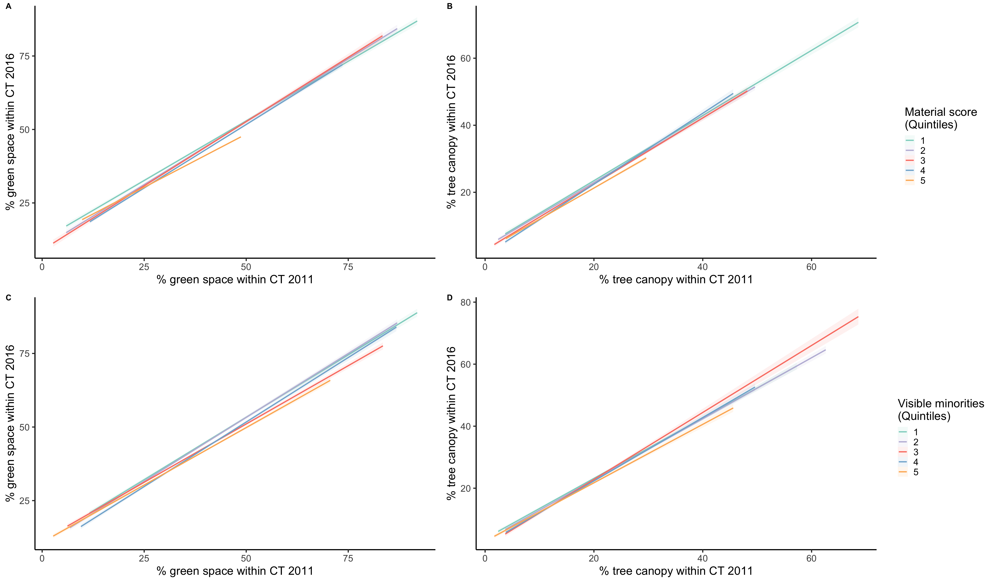

```{r setup, include=FALSE}
library(dplyr)
library(tidyr)
library(sf)
library(stars)
library(ggplot2)
library(ggmap)
library(ggsn)
library(DBI)
library(RPostgres)
library(openxlsx)
library(biscale)
library(cowplot)
library(lme4)
library(spdep)
library(spatialreg)
library(spaMM)
library(stargazer)
library(DHARMa)
library(stringr)
library(rcompanion)

# Define chunk timing function
knitr::knit_hooks$set(time_it = local({
  now <- NULL
  function(before, options) {
    if (before) {
      # record the current time before each chunk
      now <<- Sys.time()
    } else {
      # calculate the time difference after a chunk
      res <- difftime(Sys.time(), now)
      # return a character string to show the time
      paste0("Time to run: ", round(res, 1), "s")
    }
  }
}))


knitr::opts_chunk$set(echo = TRUE)
knitr::opts_chunk$set(fig.width = 12)
knitr::opts_chunk$set(fig.height = 9)

# Set Cancensus API key
source("private/cancensus_apiKey.R")
options(cancensus.cache_path = 'cancensus_cache')

# Define connection to local DB (for raster processing)
con_bei <- dbConnect(RPostgres::Postgres(), dbname = "gentrif_bei")
dbExecute(con_bei, 'SET client_min_messages TO WARNING') # Suppress all notices displayed while computing raster stats
knitr::opts_chunk$set(connection = "con_bei")
```

```{r helper funcs}
# Clean up dataframe to keep only meaningful vars and drop NA, ready for LM
tidy_df <- function(src_df, ct, f, drop_islands=TRUE) {
  clean_bei_df <- src_df %>%
    select(CT_UID, all_of(all.vars(f))) %>%
    drop_na() %>%
    units::drop_units()
  
  # Join geom from CT dataframe
  df <- ct %>%
    transmute(CT_UID = GeoUID) %>%
    inner_join(clean_bei_df, by="CT_UID")
  
  # Build neighborhood (with islands) and extract island IDs
  ct_nb <- poly2nb(df)
  
  if (drop_islands) {
    islands <- lapply(ct_nb, min) %>% lapply(function(e) e == 0) %>% unlist %>% which()

    # Cleanup subset DF to drop islands and NA
    df <- df %>%
      filter(!row_number() %in% islands) %>%
      mutate(ct_no = row_number()) # Add CT number, matching row number
  
    # Recompute neighborhood
    ct_nb <- poly2nb(df)
    
    # Clean up final dataframe (no island, no NA's, pure dataframe)
    clean_df <- df %>%
      as.data.frame() %>%
      select(CT_UID, ct_no, all_of(all.vars(f)))
  }

  nbw = nb2listw(ct_nb, zero.policy = !drop_islands)
  nbmatx = nb2mat(ct_nb, style = "B", zero.policy = !drop_islands)
  
  list(df=clean_df, nbmatx=nbmatx, nbw=nbw, island_dropped=drop_islands)
}

```

# Introduction

**Title:** Gentrification, Neighborhood Socioeconomic Factors and Urban Vegetation Inequities: A Study of Greenspace and Tree Canopy Increases in Montreal, Canada

**Authors:** Behzad Kiani (behzad.kiani@umontreal.ca) Benoit Thierry (benoit.thierry@umontreal.ca) Daniel Fuller (daniel.fuller@usask.ca) Caislin Firth (caislin@uw.edu) Meghan Winter (mwinters@sfu.ca) Yan Kestens (yan.kestens@umontreal.ca)

**Abstract:** This study investigates the relationship between increasing urban vegetation and census tract-level green inequities, as well as the role of social indicators in this relationship. We analyzed the augmentation of greenspace and tree canopy in Montreal, Canada, between 2011 and 2017, and its effect on green inequities based on material deprivation, the percentage of visible minorities, and gentrification status using Poisson spatial random effect models. Our analyses showed an increase in greenspace from 57.4% to 65.8% and tree canopy from 21.1% to 22.3% between 2011 and 2017. Census tracts (CTs) with higher levels of material deprivation or a higher percentage of visible minority population had less greenspace and tree canopy at baseline in 2011. Additionally, CTs that were not gentrified had less greenspace and tree canopy than ineligible for gentrification CTs. Furthermore, CTs with more visible minorities, higher levels of material deprivation, or those that did not gentrify had smaller increases in greenspace and tree canopy between 2011 and 2017. Among CTs with more visible minorities or higher levels of material deprivation, those with greater greenspace and tree canopy at baseline also experienced greater increases during the study time period. Conversely, among ineligible for gentrification CTs, those with less greenspace/tree canopy at baseline experienced greater increase in greenspace/tree canopy. Our analysis revealed that despite an increase in urban vegetation, inequities in urban vegetation persists. To reduce green inequities and promote social equity in this particular study area, urban planning policies should prioritize CTs with higher levels of material deprivation, more visible minorities, or those that did not gentrify, and focus on increasing urban vegetation.

# Built Environment Intervention Extraction

## Get AOI limits

```{r}
# CT boundaries for Montreal
CT16 <- get_census(dataset='CA16', regions=list(CMA='24462'), level='CT', geo_format = "sf") %>%
  filter(Type == "CT") %>%
  mutate(interact_aoi = (CD_UID %in% c(2466, 2465, 2458)) & !(CSD_UID %in% c(2458033, 2458037))) %>% # Flag Montréal island, Laval and the South shore (Longueuil, St-Lambert, Brossard) and drop Boucherville and St-Bruno
  st_transform(32188)

CT11 <- get_census(dataset='CA11', regions=list(CMA='24462'), level='CT', geo_format = "sf") %>%
  filter(Type == "CT") %>%
  st_transform(32188)

# Compute N CTs per broad area (Laval / Montreal / South shore)
CT16 %>% as.data.frame() %>%
  filter(interact_aoi) %>%
  group_by(CD_UID) %>%
  summarise(n = n())
```

## Canopy changes

Canopy changes is based on [data produced by CMM](http://observatoire.cmm.qc.ca/fileadmin/user_upload/geomatique/IndiceCanopee/2015/CMM_indiceCanopee_2015_methodologie.pdf), using multispectral aerial imagery and lidar. In order to sync the observations with the census years, we focus on 2011 and 2019 with one extra observation point in 2015.

The processing steps are similar to the ones for the bike lanes:

- Import the raster for each of the 3 years
- Compute proportion of canopy within each CT for the 3 years

```{r import-canopy-rasters, results='hide', cache=TRUE}
# Codes du raster "espace vert"
# 0. No data (hors CMM)
# 1. NDVI < 0,3 et MNH < 3,0m = Minéral bas (route, stationnement, etc.)
# 2. NDVI < 0,3 et MNH ≥ 3,0m = Minéral haut (constructions)
# 3. NDVI ≥ 0,3 et MNH < 3,0m = Végétal bas (culture, gazon, etc.)
# 4. NDVI ≥ 0,3 et MNH ≥ 3,0m = Végétal haut (canopée)
# 5. Aquatique

# Load rasters into pg database for further processing
system('psql -d gentrif_bei -c "CREATE EXTENSION IF NOT EXISTS postgis"')
system('psql -d gentrif_bei -c "CREATE EXTENSION IF NOT EXISTS postgis_raster"')

if (nrow(dbGetQuery(con_bei, "SELECT 1 test WHERE to_regclass('canopee2019') IS NOT NULL;")) == 0) {
  system("raster2pgsql -s 32188 -I -C -M data/canopy/2019/*.tif -F -t 1000x1000 canopee2019 | psql -d gentrif_bei", intern = TRUE)
} else { message("PG Raster 'canopee2019' already imported") }

if (nrow(dbGetQuery(con_bei, "SELECT 1 test WHERE to_regclass('canopee2017') IS NOT NULL;")) == 0) {
  system("raster2pgsql -s 32188 -I -C -M data/canopy/2017/*.tif -F -t 1000x1000 canopee2017 | psql -d gentrif_bei", intern = TRUE)
} else { message("PG Raster 'canopee2017' already imported") }

if (nrow(dbGetQuery(con_bei, "SELECT 1 test WHERE to_regclass('canopee2015') IS NOT NULL;")) == 0) {
  system("raster2pgsql -s 32188 -I -C -M data/canopy/2015/*.tif -F -t 1000x1000 canopee2015 | psql -d gentrif_bei", intern = TRUE)
} else { message("PG Raster 'canopee2015' already imported") }

if (nrow(dbGetQuery(con_bei, "SELECT 1 test WHERE to_regclass('canopee2011') IS NOT NULL;")) == 0) {
  system("raster2pgsql -s 32188 -I -C -M data/canopy/2011/*.tif -F -t 1000x1000 canopee2011 | psql -d gentrif_bei", intern = TRUE)
} else { message("PG Raster 'canopee2011' already imported") }

# Resample to 10m as the original rasters have a 1m resolution, which is too high to allow for a swift processing
if (nrow(dbGetQuery(con_bei, "SELECT 1 test WHERE to_regclass('canopee2019_10m') IS NOT NULL;")) == 0) {
  system("gdal_translate -of GTiff PG:\"host=localhost dbname=gentrif_bei table=canopee2019 mode=2\" -r mode -tr 10 10 data/canopy/canopee2019_10m.tif")
  system("raster2pgsql -s 32188 -I -C -M data/canopy/canopee2019_10m.tif -F -t 100x100 canopee2019_10m | psql -d gentrif_bei")
} else { message("PG Raster 'canopee2019_10m' already imported") }

if (nrow(dbGetQuery(con_bei, "SELECT 1 test WHERE to_regclass('canopee2017_10m') IS NOT NULL;")) == 0) {
  system("gdal_translate -of GTiff PG:\"host=localhost dbname=gentrif_bei table=canopee2017 mode=2\" -r mode -tr 10 10 data/canopy/canopee2017_10m.tif")
  system("raster2pgsql -s 32188 -I -C -M data/canopy/canopee2017_10m.tif -F -t 100x100 canopee2017_10m | psql -d gentrif_bei")
} else { message("PG Raster 'canopee2017_10m' already imported") }

if (nrow(dbGetQuery(con_bei, "SELECT 1 test WHERE to_regclass('canopee2015_10m') IS NOT NULL;")) == 0) {
  system("gdal_translate -of GTiff PG:\"host=localhost dbname=gentrif_bei table=canopee2015 mode=2\" -r mode -tr 10 10 data/canopy/canopee2015_10m.tif")
  system("raster2pgsql -s 32188 -I -C -M data/canopy/canopee2015_10m.tif -F -t 100x100 canopee2015_10m | psql -d gentrif_bei")
} else { message("PG Raster 'canopee2015_10m' already imported") }

if (nrow(dbGetQuery(con_bei, "SELECT 1 test WHERE to_regclass('canopee2011_10m') IS NOT NULL;")) == 0) {
  system("gdal_translate -of GTiff PG:\"host=localhost dbname=gentrif_bei table=canopee2011 mode=2\" -r mode -tr 10 10 data/canopy/canopee2011_10m.tif")
  system("raster2pgsql -s 32188 -I -C -M data/canopy/canopee2011_10m.tif -F -t 100x100 canopee2011_10m | psql -d gentrif_bei")
} else { message("PG Raster 'canopee2011_10m' already imported") }


# Push CT16 to pg
if (nrow(dbGetQuery(con_bei, "SELECT 1 test WHERE to_regclass('ct16') IS NOT NULL;")) == 0) {
  CT16 %>%
    st_transform(crs = 32188) %>%
    st_write(con_bei, "ct16",
             layer_options = c("OVERWRITE=yes", "LAUNDER=true", "SPATIAL_INDEX=gist", "GEOMETRY_NAME=geom"))
  system("psql -d gentrif_bei -c 'CREATE INDEX ON  ct16 USING gist (geometry)'")
} else { message("PG Layer CT16 already imported") }

```

```{sql get-esp-vert-ct, output.var="esp_vert_ct", message = FALSE, warning = FALSE, cache = TRUE, timeit = TRUE}
WITH cnt19 AS (
	SELECT "GeoUID", "Population"
		,(pvc).value, SUM((pvc).count) As total
	FROM (SELECT "GeoUID", "Population"
			,ST_ValueCount(ST_Clip(rast, geometry)) As pvc
		FROM canopee2019_10m
		JOIN ct16 ON ST_Intersects(geometry, rast)
	) As foo
	GROUP BY "GeoUID", "Population", (pvc).value
),
canopee19 AS (
	SELECT "GeoUID"
		,round(.1*.1 * sum(total) FILTER (WHERE value in (3, 4))) AS area_esp_vert_2019 -- area expressed in hectares
		,round(100. * sum(total) FILTER (WHERE value in (3, 4)) / sum(total), 1) AS pct_esp_vert_2019
		,round(.1*.1 * sum(total) FILTER (WHERE value = 4)) AS area_esp_vert_high_2019
		,round(100. * sum(total) FILTER (WHERE value = 4) / sum(total), 1) AS pct_esp_vert_high_2019
	FROM cnt19
	WHERE value > 0 -- discard no data, including postgis raster no data
	GROUP BY "GeoUID", "Population"
),
cnt17 AS (
	SELECT "GeoUID", "Population"
		,(pvc).value, SUM((pvc).count) As total
	FROM (SELECT "GeoUID", "Population"
			,ST_ValueCount(ST_Clip(rast, geometry)) As pvc
		FROM canopee2017_10m
		JOIN ct16 ON ST_Intersects(geometry, rast)
	) As foo
	GROUP BY "GeoUID", "Population", (pvc).value
),
canopee17 AS (
	SELECT "GeoUID"
		,round(.1*.1 * sum(total) FILTER (WHERE value in (3, 4))) AS area_esp_vert_2017
		,round(100. * sum(total) FILTER (WHERE value in (3, 4)) / sum(total), 1) AS pct_esp_vert_2017
		,round(.1*.1 * sum(total) FILTER (WHERE value = 4)) AS area_esp_vert_high_2017
		,round(100. * sum(total) FILTER (WHERE value = 4) / sum(total), 1) AS pct_esp_vert_high_2017
	FROM cnt17
	WHERE value > 0 -- discard no data, including postgis raster no data
	GROUP BY "GeoUID", "Population"
),
cnt15 AS (
	SELECT "GeoUID", "Population"
		,(pvc).value, SUM((pvc).count) As total
	FROM (SELECT "GeoUID", "Population"
			,ST_ValueCount(ST_Clip(rast, geometry)) As pvc
		FROM canopee2015_10m
		JOIN ct16 ON ST_Intersects(geometry, rast)
	) As foo
	GROUP BY "GeoUID", "Population", (pvc).value
),
canopee15 AS (
	SELECT "GeoUID"
		,round(.1*.1 * sum(total) FILTER (WHERE value in (3, 4))) AS area_esp_vert_2015
		,round(100. * sum(total) FILTER (WHERE value in (3, 4)) / sum(total), 1) AS pct_esp_vert_2015
		,round(.1*.1 * sum(total) FILTER (WHERE value = 4)) AS area_esp_vert_high_2015
		,round(100. * sum(total) FILTER (WHERE value = 4) / sum(total), 1) AS pct_esp_vert_high_2015
	FROM cnt15
	WHERE value > 0 -- discard no data, including postgis raster no data
	GROUP BY "GeoUID", "Population"
),
cnt11 AS (
	SELECT "GeoUID", "Population"
		,(pvc).value, SUM((pvc).count) As total
	FROM (SELECT "GeoUID", "Population"
			,ST_ValueCount(ST_Clip(rast, geometry)) As pvc
		FROM canopee2011_10m
		JOIN ct16 ON ST_Intersects(geometry, rast)
	) As foo
	GROUP BY "GeoUID", "Population", (pvc).value
),
canopee11 AS (
	SELECT "GeoUID"
		,round(.1*.1 * sum(total) FILTER (WHERE value in (3, 4))) AS area_esp_vert_2011
		,round(100. * sum(total) FILTER (WHERE value in (3, 4)) / sum(total), 1) AS pct_esp_vert_2011
		,round(.1*.1 * sum(total) FILTER (WHERE value = 4)) AS area_esp_vert_high_2011
		,round(100. * sum(total) FILTER (WHERE value = 4) / sum(total), 1) AS pct_esp_vert_high_2011
	FROM cnt11
	WHERE value > 0 -- discard no data, including postgis raster no data
	GROUP BY "GeoUID", "Population"
)
SELECT "GeoUID"
	,round((st_area(geometry) / 10000)::numeric, 1) ct_area_h -- CT area in hectares
	,COALESCE(area_esp_vert_2011, 0) area_esp_vert_2011
	,coalesce(area_esp_vert_high_2011, 0) area_esp_vert_high_2011
	,coalesce(pct_esp_vert_high_2011, 0) pct_esp_vert_high_2011
	,coalesce(pct_esp_vert_2011, 0) pct_esp_vert_2011
	,COALESCE(area_esp_vert_2015, 0) area_esp_vert_2015
	,coalesce(area_esp_vert_high_2015, 0) area_esp_vert_high_2015
	,coalesce(pct_esp_vert_high_2015, 0) pct_esp_vert_high_2015
	,coalesce(pct_esp_vert_2015, 0) pct_esp_vert_2015
	,COALESCE(area_esp_vert_2017, 0) area_esp_vert_2017
	,coalesce(area_esp_vert_high_2017, 0) area_esp_vert_high_2017
	,coalesce(pct_esp_vert_high_2017, 0) pct_esp_vert_high_2017
	,coalesce(pct_esp_vert_2017, 0) pct_esp_vert_2017
	,COALESCE(area_esp_vert_2019, 0) area_esp_vert_2019
	,coalesce(area_esp_vert_high_2019, 0) area_esp_vert_high_2019
	,coalesce(pct_esp_vert_high_2019, 0) pct_esp_vert_high_2019
	,coalesce(pct_esp_vert_2019, 0) pct_esp_vert_2019
FROM ct16
FULL JOIN canopee19 USING ("GeoUID")
FULL JOIN canopee17 USING ("GeoUID")
FULL JOIN canopee15 USING ("GeoUID")
FULL JOIN canopee11 USING ("GeoUID");
```

```{r get-esp-vert-ct-display, echo=FALSE}
# Compute incremental changes in canopy
esp_vert_ct <- esp_vert_ct %>%
  mutate(pct_esp_vert_diff_2011.2015 = pct_esp_vert_2015 - pct_esp_vert_2011,
         pct_esp_vert_diff_2011.2017 = pct_esp_vert_2017 - pct_esp_vert_2011,
         pct_esp_vert_diff_2015.2017 = pct_esp_vert_2017 - pct_esp_vert_2015,
         pct_esp_vert_diff_high_2011.2015 = pct_esp_vert_high_2015 - pct_esp_vert_high_2011,
         pct_esp_vert_diff_high_2011.2017 = pct_esp_vert_high_2017 - pct_esp_vert_high_2011,
         pct_esp_vert_diff_high_2015.2017 = pct_esp_vert_high_2017 - pct_esp_vert_high_2015)

ggplot() +
   geom_sf(data=inner_join(filter(CT16, interact_aoi), esp_vert_ct, by="GeoUID"), mapping = aes(fill=as.numeric(pct_esp_vert_2017)), lwd = 0) +
   geom_sf(data=filter(CT16, interact_aoi), fill=NA, color="gray", size=.2, alpha=0.2) + 
  scale_fill_distiller(name = "Green space (%)", palette = "BrBG", direction = 1)+ 
  labs(title = "Proportion of green space within 2016 CTs in 2017")


# Define common scale
chg_min = min(esp_vert_ct$pct_esp_vert_diff_2011.2015,
              esp_vert_ct$pct_esp_vert_diff_2011.2017,
              esp_vert_ct$pct_esp_vert_diff_2015.2017)
chg_max = max(esp_vert_ct$pct_esp_vert_diff_2011.2015,
              esp_vert_ct$pct_esp_vert_diff_2011.2017,
              esp_vert_ct$pct_esp_vert_diff_2015.2017)
ggplot() +
   geom_sf(data=inner_join(filter(CT16, interact_aoi), esp_vert_ct, by="GeoUID"), mapping = aes(fill=as.numeric(pct_esp_vert_diff_2011.2017)), lwd = 0) +
   geom_sf(data=filter(CT16, interact_aoi), fill=NA, color="gray", size=.2, alpha=0.2) + 
  scale_fill_gradient2(name = "Change (%)", limits = c(chg_min, chg_max))+ 
  labs(title = "Change of % green space between 2011 and 2017")

ggplot() +
   geom_sf(data=inner_join(filter(CT16, interact_aoi), esp_vert_ct, by="GeoUID"), mapping = aes(fill=as.numeric(pct_esp_vert_diff_2011.2015)), lwd = 0) +
   geom_sf(data=filter(CT16, interact_aoi), fill=NA, color="gray", size=.2, alpha=0.2) + 
  scale_fill_gradient2(name = "Change (%)", limits = c(chg_min, chg_max))+ 
  labs(title = "Change of % green space between 2011 and 2015")

ggplot() +
   geom_sf(data=inner_join(filter(CT16, interact_aoi), esp_vert_ct, by="GeoUID"), mapping = aes(fill=as.numeric(pct_esp_vert_diff_2015.2017)), lwd = 0) +
   geom_sf(data=filter(CT16, interact_aoi), fill=NA, color="gray", size=.2, alpha=0.2) + 
  scale_fill_gradient2(name = "Change (%)", limits = c(chg_min, chg_max))+ 
  labs(title = "Change of % green space between 2015 and 2017")

ggplot() +
   geom_sf(data=inner_join(filter(CT16, interact_aoi), esp_vert_ct, by="GeoUID"), mapping = aes(fill=as.numeric(pct_esp_vert_diff_high_2011.2017)), lwd = 0) +
   geom_sf(data=filter(CT16, interact_aoi), fill=NA, color="gray", size=.2, alpha=0.2) + 
  scale_fill_gradient2(name = "Tree change (%)")+ 
  labs(title = "Change of % tree coverage (high canopy) between 2011 and 2017")

head(esp_vert_ct)
```

## Pampalon index

Get it [here](https://www.inspq.qc.ca/en/deprivation/material-and-social-deprivation-index)

```{r read-pampalon}
pampalon <- read.xlsx("data/Canada2016Pampalon/A-MSDIData_Can2016_eng/1. EquivalenceTableCanada2016_ENG.xlsx", sheet = 2) %>%
  mutate(DA = as.character(DA)) %>%
  select(DA, SCOREMAT, SCORESOC)

# 2016 DA boundaries for Montreal
DA16 <- get_census(dataset='CA16', regions=list(CMA='24462'), level='DA', geo_format = "sf") %>%
  filter(Type == "DA") %>%
  st_transform(32188)

pampalon <- DA16 %>%
  inner_join(pampalon, by = c("GeoUID" = "DA")) %>%
  as.data.frame()

# Get Pampalon 2006
pampalon06 <- read.xlsx("data/Canada2006Pampalon/A-MSDIData_Can2006_eng/1. CorrespondenceTable_Can2006_eng.xlsx", sheet = 2) %>%
  mutate(DA = as.character(DA)) %>%
  select(DA, DAPOP2006, SCOREMAT, SCORESOC)

# Get LUT DA2006 <-> DA2011 from StatCan
lut_da.1 <- read.csv("data/2011_92-156_DA_AD_txt/2011_92-156_DA_AD.txt", colClasses = "character", 
                     header = FALSE, col.names = c("DAUID2011.ADIDU2011", "DAUID2006.ADIDU2006", "DBUID2011", "DA_rel_flag")) %>%
  select(!c(DBUID2011, DA_rel_flag)) %>%
  unique()

# Link Pampalon 2011 to LUT and compute weighted mean of scores of Pampalon 2011
# NB: population numbers will diverge from  reality when more than one DA is merged into one DA of next census
pampalon06.11 <- pampalon06 %>%
  inner_join(lut_da.1, by = c("DA" = "DAUID2006.ADIDU2006")) %>%
  group_by(DAUID2011.ADIDU2011) %>%
  summarise(pop2006 = sum(DAPOP2006),
            SCOREMAT.06 = weighted.mean(SCOREMAT, DAPOP2006, na.rm = TRUE),
            SCORESOC.06 = weighted.mean(SCORESOC, DAPOP2006, na.rm = TRUE))

# Get Pampalon 2011
pampalon11 <- read.xlsx("data/Canada2011Pampalon/A-MSDIData_Can2011_eng/1. CorrespondenceTable_Can2011_eng.xlsx", sheet = 2) %>%
  mutate(DA = as.character(DA)) %>%
  select(DA, DAPOP2011, SCOREMAT, SCORESOC)

# Get LUT DA2011 <-> DA2016 from StatCan
lut_da <- read.csv("data/2016_92-156_DA_AD_csv/2016_92-156_DA_AD.csv", colClasses = "character") %>%
  select(!c(DBUID2016.IDIDU2016, DA_rel_flag.AD_ind_rel)) %>%
  unique()

# Link Pampalon 2011 to LUT, then to Pampalon 06 and finally compute weighted mean of scores of Pampalon 2011
pampalon11.16 <- pampalon11 %>%
  inner_join(lut_da, by = c("DA" = "DAUID2011.ADIDU2011")) %>%
  left_join(pampalon06.11, by =c("DA" = "DAUID2011.ADIDU2011")) %>%
  group_by(DAUID2016.ADIDU2016) %>%
  summarise(pop2011 = sum(DAPOP2011),
            SCOREMAT = weighted.mean(SCOREMAT, DAPOP2011, na.rm = TRUE),
            SCORESOC = weighted.mean(SCORESOC, DAPOP2011, na.rm = TRUE),
            SCOREMAT.06 = weighted.mean(SCOREMAT.06, pop2006, na.rm = TRUE),
            SCORESOC.06 = weighted.mean(SCORESOC.06, pop2006, na.rm = TRUE),
            pop2006 = sum(pop2006))

# Then link Pampalon 2011 to 2016
pampalon <- pampalon %>%
  left_join(pampalon11.16, by = c("GeoUID" = "DAUID2016.ADIDU2016"), suffix = c(".16", ".11"))

# Aggregate at the CT level
pampalon_CT <- pampalon %>%
  group_by(CT_UID) %>%
  summarise(wSCOREMAT.2016 = weighted.mean(SCOREMAT.16, Population, na.rm = TRUE),
            wSCORESOC.2016 = weighted.mean(SCORESOC.16, Population, na.rm = TRUE),
            wSCOREMAT.2011 = weighted.mean(SCOREMAT.11, pop2011, na.rm = TRUE),
            wSCORESOC.2011 = weighted.mean(SCORESOC.11, pop2011, na.rm = TRUE),
            wSCOREMAT.2006 = weighted.mean(SCOREMAT.06, pop2006, na.rm = TRUE),
            wSCORESOC.2006 = weighted.mean(SCORESOC.06, pop2006, na.rm = TRUE))

# Clean up
rm(lut_da, lut_da.1, pampalon11.16, pampalon06.11, pampalon11, pampalon06)

# Display map
.pampalon_CT_geom <- CT16 %>%
  left_join(pampalon_CT, by = c("GeoUID" = "CT_UID")) %>%
  filter(interact_aoi)

.pampalon_data <- bi_class(.pampalon_CT_geom, x = wSCOREMAT.2016, y = wSCORESOC.2016, style = "quantile", dim = 3)
.map <- ggplot() + 
  geom_sf(data = .pampalon_data, mapping = aes(fill = bi_class), color = "white", size = 0.1, show.legend = FALSE) +
  bi_scale_fill(pal = "DkBlue", dim = 3) +
  labs(title = "Pampalon: material and social deprivation index") + 
  theme(panel.background = element_rect(fill = "white"),
        #axis.ticks = element_blank(),
        #axis.text = element_blank(),
        panel.grid = element_line(color = "darkgray", size = 0.2))
.legend <- bi_legend(pal = "DkBlue",
                    dim = 3,
                    xlab = "Material ",
                    ylab = "Social ",
                    size = 8)
ggdraw() +
  draw_plot(.map, 0, 0, 1, 1) +
  draw_plot(.legend, 0.1, .7, 0.2, 0.2)
```

## Gentrification

Using Ding metric computed on 5 year span.

```{r ding-load}
# Load gentrified CTs, 5 year span (from repo gentrification_metrics)

# UPDATE: add 2021 gentrification status, reprojected at the CT16 level
.g21 <- st_read("data/gentrified_5years_cltd.gpkg", "gentrified_ding_21", quiet=TRUE) %>%
  filter(cma_uid_21 == "24462") %>%
  st_transform(32188)
.g21 <- CT16 %>%
  st_join(.g21, largest = TRUE) %>%
  transmute(ct_uid_16 = GeoUID,
            ct_uid_21 = ct_uid_21, 
            cma_uid_21 = cma_uid_21, 
            cd_uid_21 = cd_uid_21,
            ccs_uid_21 = ccs_uid_21, 
            csd_uid_21 = csd_uid_21,
            population_21 = population_21,
            gentrified_2021_2016 = gentrified_2021_2016, 
            gentrifiable_2016 = gentrifiable_2016, 
            gentrified_2021_2016_category = gentrified_2021_2016_category)

ding <- list()
ding[["2021"]] <- .g21
ding[["2016"]] <- st_read("data/gentrified_5years.gpkg", "gentrified_ding_16", quiet=TRUE) %>%
  filter(cma_uid_16 == "24462") %>%
  st_transform(32188)
ding[["2011"]] <- st_read("data/gentrified_5years.gpkg", "gentrified_ding_11", quiet=TRUE) %>%
  filter(cma_uid_11 == "24462") %>%
  st_transform(32188)
ding[["2006"]] <- st_read("data/gentrified_5years.gpkg", "gentrified_ding_06", quiet=TRUE) %>%
  filter(cma_uid_06 == "24462") %>%
  st_transform(32188)

.ding_map <- ding[["2016"]] %>%
  mutate(gentrification_status = factor(case_when(!gentrifiable_2011 ~ "Non eligible", 
                                           gentrifiable_2011 & !gentrified_2016_2011 ~ "Not gentrified",
                                           gentrified_2016_2011 ~ "Gentrified"), levels = c("Non eligible", "Not gentrified", "Gentrified"))) %>%
  left_join(select(as.data.frame(CT16), GeoUID, interact_aoi), by = c("ct_uid_16" = "GeoUID")) %>%
  filter(interact_aoi)

ggplot(data = .ding_map) + 
  geom_sf(aes(fill = gentrification_status)) +
  scale_fill_manual(values = c("lightgray", "yellow", "red"), name = "Gentrification status in 2016") +
  #labs(title = "Census tract gentrification status in 2016") +
  theme_void(base_size = 20)
```

## Visible minority

```{r equity-metrics, cache=TRUE}
# Visible Minority
# - v_CA16_3954: Total - Visible minority for the population in private households - 25% sample data (Total)
# - v_CA16_3957: Total visible minority population (Total)

# Low income (LIM-AT)
# - v_CA16_2540: Prevalence of low income based on the Low-income measure, after tax (LIM-AT) (%) (Total)
equity_ct16 <- get_census(dataset='CA16', regions=list(CMA='24462'), level='CT', geo_format = "sf",
                          vectors = c("v_CA16_3954", "v_CA16_3957", "v_CA16_2540")) %>%
  filter(Type == "CT") %>%
  transmute(CT_UID = GeoUID,
            vis_minority_2016 = `v_CA16_3957: Total visible minority population` / `v_CA16_3954: Total - Visible minority for the population in private households - 25% sample data` * 100,
            low_income_2016 = `v_CA16_2540: Prevalence of low income based on the Low-income measure, after tax (LIM-AT) (%)`)

# Visible Minority
# - v_CA11N_457: CA 2011 NHS, Total population in private households by visible minority (Total)
# - v_CA11N_460: CA 2011 NHS, Total population in private households by visible minority, Total visible minority population (Total)

# Low income (LIM-AT)
# - v_CA11N_2606: CA 2011 NHS, Prevalence of low income in 2010 based on after-tax low-income measure % (Total)
equity_ct11 <- get_census(dataset='CA11', regions=list(CMA='24462'), level='CT', geo_format = "sf",
                          vectors = c("v_CA11N_457", "v_CA11N_460", "v_CA11N_2606")) %>%
  filter(Type == "CT") %>%
  transmute(CT_UID = GeoUID,
            vis_minority_2011 = `v_CA11N_460: Total visible minority population` / `v_CA11N_457: Total population in private households by visible minority` * 100,
            low_income_2011 = `v_CA11N_2606: Prevalence of low income in 2010 based on after-tax low-income measure %`)

# Visible Minority
# - v_CA06_1302: Total population by visible minority groups
# - v_CA06_1303: Total population by visible minority groups, Total visible minority population

# Low income (LIM-AT)
# - v_TX2006_551: After-tax low income status of tax filers and dependents (census family low income measure, CFLIM-AT) for couple and lone parent families by family composition, 2006 | All family units | Persons in Low Income | % - Total
equity_ct06 <- get_census(dataset='CA06', regions=list(CMA='24462'), level='CT', geo_format = "sf",
                          vectors = c("v_CA06_1302", "v_CA06_1303", "v_TX2006_551")) %>%
  filter(Type == "CT") %>%
  transmute(CT_UID = GeoUID,
            vis_minority_2006 = `v_CA06_1303: Total visible minority population` / `v_CA06_1302: Total population by visible minority groups - 20% sample data` * 100,
            low_income_2006 = `v_TX2006_551: % - Total`)

equity_ct <- st_join(equity_ct16, equity_ct11, left=TRUE, largest=TRUE, suffix=c("", "_2011")) %>% # join on largest overlap, to overcome mismatch in CT UID
  st_join(equity_ct06, left=TRUE, largest=TRUE, suffix=c("", "_2006")) %>%
  data.frame()

# cleanup
rm(equity_ct11, equity_ct16, equity_ct06)

# Display map
.equity_CT_geom <- CT16 %>%
  left_join(equity_ct, by = c("GeoUID" = "CT_UID")) %>%
  filter(interact_aoi)

.equity_data <- bi_class(.equity_CT_geom, x = vis_minority_2016, y = low_income_2016, style = "quantile", dim = 3)
.map <- ggplot() + 
  geom_sf(data = .equity_data, mapping = aes(fill = bi_class), color = "white", size = 0.1, show.legend = FALSE) +
  bi_scale_fill(pal = "Brown", dim = 3) +
  labs(title = "Equity metrics: % of visible minority and % of low-income household") + 
  theme(panel.background = element_rect(fill = "white"),
        #axis.ticks = element_blank(),
        #axis.text = element_blank(),
        panel.grid = element_line(color = "darkgray", size = 0.2))
.legend <- bi_legend(pal = "Brown",
                    dim = 3,
                    xlab = "Vis. Minority ",
                    ylab = "Low-Income ",
                    size = 8)
ggdraw() +
  draw_plot(.map, 0, 0, 1, 1) +
  draw_plot(.legend, 0.1, .7, 0.2, 0.2)

```

## Build complete dataset

All variables + outcome linked at the CT level + quintiles of SES variables

```{r build-full-dataset}
bei_df <- CT16 %>%
  as.data.frame() %>%
  transmute(CT_UID = GeoUID,
            CD_UID = CD_UID,
            CSD_UID = CSD_UID,
            interact_aoi = interact_aoi,
            zone = case_when(CD_UID == "2466" ~ "Montreal",
                             CD_UID == "2458" ~ "Longueuil",
                             CD_UID == "2465" ~ "Laval",
                             TRUE ~ "Other"),
            Population = Population) %>%
  left_join(pampalon_CT, by="CT_UID") %>%
  left_join(select(as.data.frame(ding$`2021`), ct_uid_16, starts_with("gentrif")), by=c("CT_UID" = "ct_uid_16")) %>%
  mutate(gentrif_status_2021 = factor(case_when(!gentrifiable_2016 ~ "Non eligible", 
                                           gentrifiable_2016 & !gentrified_2021_2016 ~ "Not gentrified",
                                           gentrified_2021_2016 ~ "Gentrified"), levels = c("Non eligible", "Not gentrified", "Gentrified"))) %>%
  left_join(select(as.data.frame(ding$`2016`), ct_uid_16, starts_with("gentrif")), by=c("CT_UID" = "ct_uid_16")) %>%
  mutate(gentrif_status_2016 = factor(case_when(!gentrifiable_2011 ~ "Non eligible", 
                                           gentrifiable_2011 & !gentrified_2016_2011 ~ "Not gentrified",
                                           gentrified_2016_2011 ~ "Gentrified"), levels = c("Non eligible", "Not gentrified", "Gentrified"))) %>%
  left_join(select(as.data.frame(ding$`2011`), ct_uid_11, starts_with("gentrif")), by=c("CT_UID" = "ct_uid_11")) %>%
  mutate(gentrif_status_2011 = factor(case_when(!gentrifiable_2006 ~ "Non eligible", 
                                           gentrifiable_2006 & !gentrified_2011_2006 ~ "Not gentrified",
                                           gentrified_2011_2006 ~ "Gentrified"), levels = c("Non eligible", "Not gentrified", "Gentrified"))) %>%
  left_join(select(as.data.frame(ding$`2006`), ct_uid_06, starts_with("gentrif")), by=c("CT_UID" = "ct_uid_06")) %>%
  mutate(gentrif_status_2006 = factor(case_when(!gentrifiable_2001 ~ "Non eligible", 
                                           gentrifiable_2001 & !gentrified_2006_2001 ~ "Not gentrified",
                                           gentrified_2006_2001 ~ "Gentrified"), levels = c("Non eligible", "Not gentrified", "Gentrified"))) %>%
  left_join(select(as.data.frame(equity_ct), !c("geometry", "CT_UID_2011", "CT_UID_2006")), by="CT_UID") %>%
  left_join(as.data.frame(rename_with(esp_vert_ct, ~ paste0(., "ct"))), by=c("CT_UID" = "GeoUIDct")) %>%
  # Compute quintile of SES variables
  mutate(wSCOREMAT.2006.Q = ntile(wSCOREMAT.2006, 5),
         wSCOREMAT.2011.Q = ntile(wSCOREMAT.2011, 5),
         wSCOREMAT.2016.Q = ntile(wSCOREMAT.2016, 5),
         vis_minority_2006.Q = ntile(vis_minority_2006, 5),
         vis_minority_2011.Q = ntile(vis_minority_2011, 5),
         vis_minority_2016.Q = ntile(vis_minority_2016, 5)) %>%
  units::drop_units()

  
head(bei_df)

# keep only interact CT 
# UPDATE 2022-07-07 ##########
# and recompute quintiles for the new AOI
bei_df_aoi <- filter(bei_df, interact_aoi) %>%
  mutate(wSCOREMAT.2006.Q = ntile(wSCOREMAT.2006, 5),
         wSCOREMAT.2011.Q = ntile(wSCOREMAT.2011, 5),
         wSCOREMAT.2016.Q = ntile(wSCOREMAT.2016, 5),
         vis_minority_2006.Q = ntile(vis_minority_2006, 5),
         vis_minority_2011.Q = ntile(vis_minority_2011, 5),
         vis_minority_2016.Q = ntile(vis_minority_2016, 5),
         # Need to reorder factor in order to get the proper dummy variables in models below
         gentrif_status_2016 = forcats::fct_relevel(gentrif_status_2016, "Not gentrified", "Gentrified", "Non eligible"),
         gentrif_status_2021 = forcats::fct_relevel(gentrif_status_2021, "Not gentrified", "Gentrified", "Non eligible"))

```

Included variables:

- Census Tracts variables
  - `CT_UID`: 2016 Census Tract ID
  - `CD_UID`: 2016 Census Division
  - `CSD_UID`: 2016 Census Subdivision
  - `interact_aoi`: Does CT belong to INTERACT study area?
  - `zone`: Montreal / Laval / Longueuil, etc. / Other
  - `Population`: 2016 Population within CT
  - `ct_area_m2ct`: Area of CT, in square meters
- Gentrification metrics
  - `gentrified_2016_2011`: Is the CT gentrified in 2016?
  - `gentrifiable_2011`: Is the CT candidate to gentrification in 2011?
  - `gentrif_status_2016`: 3-state gentrification status in 2016 (Gentrified/Not gentrified/Non eligible)
  - `gentrified_2011_2006`: Is the CT gentrified in 2011
  - `gentrifiable_2006`: Is the CT candidate to gentrification in 2006
  - `gentrif_status_2011`: 3-state gentrification status in 2011 (Gentrified/Not gentrified/Non eligible)
  - `gentrified_2006_2001`: Is the CT gentrified in 2006
  - `gentrifiable_2001`: Is the CT candidate to gentrification in 2001
  - `gentrif_status_2006`: 3-state gentrification status in 2006 (Gentrified/Not gentrified/Non eligible)
- Pampalon's metrics
  - `wSCORESOC.2016`: Social deprivation index in 2016 (population weighted)
  - `wSCOREMAT.2016`: Material deprivation index in 2016 (population weighted)
  - `wSCOREMAT.2016.Q`: Quintile of material deprivation index in 2016 (population weighted)
  - `wSCORESOC.2011`: Social deprivation index in 2011 (population weighted)
  - `wSCOREMAT.2011`: Material deprivation index in 2011 (population weighted)
  - `wSCOREMAT.2011.Q`: Quintile of aterial deprivation index in 2011 (population weighted)
  - `wSCORESOC.2006`: Social deprivation index in 2006 (population weighted)
  - `wSCOREMAT.2006`: Material deprivation index in 2006 (population weighted)
  - `wSCOREMAT.2006.Q`: Quintile of material deprivation index in 2006 (population weighted)
- Social profile
  - `vis_minority_2016`: % of visible minority in CT 2016
  - `vis_minority_2016.Q`: Quintile of % of visible minority in CT 2016
  - `vis_minority_2011`: % of visible minority in CT 2011
  - `vis_minority_2011.Q`: Quintile of % of visible minority in CT 2011
  - `vis_minority_2006`: % of visible minority in CT 2006
  - `vis_minority_2006.Q`: Quintile of % of visible minority in CT 2006
- Green spaces
  - `area_esp_vert_{2011|2015|2019}ct`: area of green space in 2011, 2015 or 2019 within CT (in hectares)
  - `area_esp_vert_high_{2011|2015|2019}ct`: same as above, except for trees (high canopy)
  - `pct_esp_vert_{2011|2015|2019}ct`: % of green space in 2011, 2015 or 2019 within CT
  - `pct_esp_vert_high_{2011|2015|2019}ct`: same as above, except for trees (high canopy)
  - `pct_esp_vert_diff{2011|2015}.{2015|2019}ct`: change in % of green space between 2011 and 2015, 2011 and 2019 as well as 2011 and 2019, within CT

# Preliminary analyses

INTERACT study area ~ Montréal, Laval, Longueuil, Brossard, St-Lambert

## SES variable distribution

```{r outcome-distribution-aoi, message=FALSE}
.bei_df_long <- bei_df_aoi %>% 
  select(CT_UID, CD_UID, starts_with("wSCORE")) %>%
  select(!ends_with('.Q')) %>%
  pivot_longer(!c(CT_UID, CD_UID))

ggplot(.bei_df_long, aes(value)) +
  geom_histogram() + 
  facet_wrap(~name) #, scales = "free")

.bei_df_long <- bei_df_aoi %>%
  select(CT_UID, CD_UID, starts_with("vis_minority")) %>%
  select(!ends_with('.Q')) %>%
  pivot_longer(!c(CT_UID, CD_UID))

ggplot(.bei_df_long, aes(value)) +
  geom_histogram() + 
  facet_wrap(~name) #, scales = "free")

.bei_df_long <- bei_df_aoi %>%
  select(CT_UID, CD_UID, starts_with("gentrif_status")) %>%
  select(!ends_with('.Q')) %>%
  pivot_longer(!c(CT_UID, CD_UID))

ggplot(.bei_df_long, aes(value)) +
  geom_bar() + 
  facet_wrap(~name) #, scales = "free", ncol = 3)
```

### Confusion matrix / correlations

Confusion matrix between tiertiles of material deprivation, % of Visible Minorities and gentrification status at baseline:

```{r}
cfx <- bei_df_aoi %>%
  data.frame() %>%
  mutate(wSCOREMAT.2011.Tier = ntile(wSCOREMAT.2011, 3),
         vis_minority_2011.Tier = ntile(vis_minority_2011, 3)) %>%
  select(CT_UID, ends_with(".Tier"), gentrified_2016_2011, wSCOREMAT.2011, vis_minority_2011)

# Correlation between contiunous SES metrcis
cor.test(cfx$wSCOREMAT.2011, cfx$vis_minority_2011,  method = "pearson", use = "complete.obs")

# Confusion Mtx Tiertiles SES
# See http://rcompanion.org/handbook/H_10.html
# 3 classes -> small (0.07 - < 0.20) | medium (0.20 - 0.35) | large (> 0.35)
cramerV(table(cfx$wSCOREMAT.2011.Tier, cfx$vis_minority_2011.Tier))

cramerV(table(cfx$wSCOREMAT.2011.Tier, cfx$gentrified_2016_2011))

cramerV(table(cfx$vis_minority_2011.Tier, cfx$gentrified_2016_2011))
```

Only the SES metrics seem moderately correlated.

```{r Yan-requested-visible-minorities-press, fig.width=10, fig.height=10, eval=FALSE, include=FALSE}
# Following the publication of these analyses in La Presse, we add a few basic stats on % visibles minorities:
#   - quintiles bounds
#   - maps

vis_minority_mtl <-  bind_rows(
  transmute(bei_df_aoi,ct_uid=CT_UID, year=2016, quintile = vis_minority_2016.Q, vis_minority = vis_minority_2016),
  transmute(bei_df_aoi,ct_uid=CT_UID, year=2011, quintile = vis_minority_2011.Q, vis_minority = vis_minority_2011),
  transmute(bei_df_aoi,ct_uid=CT_UID, year=2006, quintile = vis_minority_2006.Q, vis_minority = vis_minority_2006))

vis_minority_mtl %>%
  filter(!is.na(quintile)) %>%
  group_by(year, quintile) %>%
  summarise(lower = min(vis_minority, na.rm=T),
            upper = max(vis_minority, na.rm=T)) %>%
  ungroup() %>%
  select(!year) %>%
  knitr::kable(digits=1) %>%
  kableExtra::kable_classic(full_width=F) %>%
  kableExtra::pack_rows("2006", 1, 5) %>%
  kableExtra::pack_rows("2011", 6, 10) %>%
  kableExtra::pack_rows("2016", 11, 15)

vis_minority_mtl_geom <- CT16 %>%
  right_join(vis_minority_mtl, by=c("GeoUID" = "ct_uid"))

ggplot(vis_minority_mtl_geom) +
  geom_sf(aes(fill=factor(quintile)), lwd=.5) +
  scale_fill_brewer(palette = "YlOrRd", name="Visble minorities (%)\nquintiles") +
  facet_wrap(vars(year), dir="v") +
  theme_map() + 
  theme(legend.position = "right")
```

## BEI variable distributions

### Absolute values

```{r var-abs-distribution-ct-aoi, fig.height=6, message=FALSE}
.bei_df_long <- bei_df_aoi %>% 
  filter(interact_aoi) %>%
  select(CT_UID, CD_UID, matches("^area_esp_vert.*ct$")) %>%
  pivot_longer(!c(CT_UID, CD_UID))

ggplot(.bei_df_long, aes(value)) +
  geom_histogram() + 
  facet_wrap(~name, scales = "free", ncol = 4)
```

### Relative values

```{r var-rel-distribution-ct-aoi, fig.height=6, message=FALSE}
.bei_df_long <- bei_df_aoi %>% 
  filter(interact_aoi) %>%
  select(CT_UID, CD_UID, matches("^pct_esp_vert.*ct$")) %>%
  pivot_longer(!c(CT_UID, CD_UID))

ggplot(.bei_df_long, aes(value)) +
  geom_histogram() + 
  facet_wrap(~name, scales = "free", ncol = 3)
```

# Association between SES and Urban Conditions at baseline (2011)

Looking at objective #1: _do urban interventions tend to be located in low SES neighborhoods?_. We look at $$Urban Condition_{2011} = f(SES_{2011})$$ as well as $$Urban Condition_{2011} = f(Gentrification_{2011 \to 2016})$$

Here $UrbanCondition$ means the state of the urban environment features, such as length of bike lanes, greenness coverage, etc. at one specific moment. This needs to be distinguished from $UrbanIntervention$, which accounts for the **changes** in the $UrbanConditions$ between two years (see below). 

We fit LMM models, with spatial random effect using `spaMM` package.

## UC vs Pampalon | material {.tabset}

### Greenness

Measuring canopy (_i.e._ greenness ~ grass & trees) ratio within CT/buffer in 2011 at the Census tract level, using a Poisson distribution

```{r  warning=FALSE, message=FALSE, cache=TRUE}
f <- area_esp_vert_2011ct ~ wSCOREMAT.2011.Q + offset(log(ct_area_hct))

clean_bei <- tidy_df(bei_df_aoi, CT16, f)

res.lmm <- fitme(area_esp_vert_2011ct ~ wSCOREMAT.2011.Q + offset(log(ct_area_hct)) + adjacency(1|ct_no),
                 data = clean_bei$df, adjMatrix = clean_bei$nbmatx, 
                 family = Poisson())
smy <- summary(res.lmm, details = c(p_value="Wald"))
ci.lmm <- confint(res.lmm, 'wSCOREMAT.2011.Q')

# Testing main effect
res.lmm.0 <- update(res.lmm, . ~ . - wSCOREMAT.2011.Q)
LRT(res.lmm.0, res.lmm)

```

Transforming the model coefficients:

```{r}
smy.bt <- data.frame(smy$beta_table)
round(exp(res.lmm[["fixef"]]), 3) %>% 
  data.frame(fixef = ., p.value = round(smy.bt$p.value, 3)) %>%
  knitr::kable(caption="Model transformed coeffs")

round(exp(ci.lmm$interval), 3)%>%
  data.frame(wSCOREMAT.2011.Q = ., row.names = c('lower', 'upper')) %>% t() %>%
  knitr::kable(caption="Model confidence interval")
```

### Canopy (trees)

Measuring high canopy (_i.e._ trees only) ratio within CT/buffer in 2011 at the Census tract level, using a Poisson distribution

```{r  warning=FALSE, message=FALSE, cache=TRUE}
f <- area_esp_vert_high_2011ct ~ wSCOREMAT.2011.Q + offset(log(ct_area_hct))

clean_bei <- tidy_df(bei_df_aoi, CT16, f)

res.lmm <- fitme(area_esp_vert_high_2011ct ~ wSCOREMAT.2011.Q + offset(log(ct_area_hct)) + adjacency(1|ct_no),
                 data = clean_bei$df, adjMatrix = clean_bei$nbmatx, 
                 family = poisson())
smy <- summary(res.lmm, details = c(p_value="Wald"))
ci.lmm <- confint(res.lmm, 'wSCOREMAT.2011.Q')

# Testing main effect
res.lmm.0 <- update(res.lmm, . ~ . - wSCOREMAT.2011.Q)
LRT(res.lmm.0, res.lmm)

```

Transforming the model coefficients:

```{r}
smy.bt <- data.frame(smy$beta_table)
round(exp(res.lmm[["fixef"]]), 3) %>% 
  data.frame(fixef = ., p.value = round(smy.bt$p.value, 3)) %>%
  knitr::kable(caption="Model transformed coeffs")

round(exp(ci.lmm$interval), 3)%>%
  data.frame(wSCOREMAT.2011.Q = ., row.names = c('lower', 'upper')) %>% t() %>%
  knitr::kable(caption="Model confidence interval")
```

## UC vs Visible minority {.tabset}

### Greenness

Measuring canopy (_i.e._ greenness ~ grass & trees) ratio within CT/buffer in 2011 (in %) at the Census tract level

```{r  warning=FALSE, message=FALSE, cache=TRUE}
f <- area_esp_vert_2011ct ~ vis_minority_2011.Q + offset(log(ct_area_hct))

clean_bei <- tidy_df(bei_df_aoi, CT16, f)

res.lmm <- fitme(area_esp_vert_2011ct ~ vis_minority_2011.Q + offset(log(ct_area_hct)) + adjacency(1|ct_no),
                 data = clean_bei$df, adjMatrix = clean_bei$nbmatx, 
                 family = Poisson())
smy <- summary(res.lmm, details = c(p_value="Wald"))
ci.lmm <- confint(res.lmm, 'vis_minority_2011.Q')

# Testing main effect
res.lmm.0 <- update(res.lmm, . ~ . - vis_minority_2011.Q)
LRT(res.lmm.0, res.lmm)

```

Transforming the model coefficients:

```{r}
smy.bt <- data.frame(smy$beta_table)
round(exp(res.lmm[["fixef"]]), 3) %>% 
  data.frame(fixef = ., p.value = round(smy.bt$p.value, 3)) %>%
  knitr::kable(caption="Model transformed coeffs")

round(exp(ci.lmm$interval), 3)%>%
  data.frame(vis_minority_2011.Q = ., row.names = c('lower', 'upper')) %>% t() %>%
  knitr::kable(caption="Model confidence interval")
```

### Canopy (trees)

Measuring high canopy (_i.e._ trees only) ratio within CT/buffer in 2011 (in %) at the Census tract level

```{r warning=FALSE, message=FALSE, cache=TRUE}
f <- area_esp_vert_high_2011ct ~ vis_minority_2011.Q + offset(log(ct_area_hct))

clean_bei <- tidy_df(bei_df_aoi, CT16, f)

res.lmm <- fitme(area_esp_vert_high_2011ct ~ vis_minority_2011.Q + offset(log(ct_area_hct)) + adjacency(1|ct_no),
                 data = clean_bei$df, adjMatrix = clean_bei$nbmatx, 
                 family = Poisson())
smy <- summary(res.lmm, details = c(p_value="Wald"))
ci.lmm <- confint(res.lmm, 'vis_minority_2011.Q')

# Testing main effect
res.lmm.0 <- update(res.lmm, . ~ . - vis_minority_2011.Q)
LRT(res.lmm.0, res.lmm)

```

Transforming the model coefficients:

```{r}
smy.bt <- data.frame(smy$beta_table)
round(exp(res.lmm[["fixef"]]), 3) %>% 
  data.frame(fixef = ., p.value = round(smy.bt$p.value, 3)) %>%
  knitr::kable(caption="Model transformed coeffs")

round(exp(ci.lmm$interval), 3)%>%
  data.frame(vis_minority_2011.Q = ., row.names = c('lower', 'upper')) %>% t() %>%
  knitr::kable(caption="Model confidence interval")
```

## UC vs gentrified CT {.tabset}

Gentrified CT between 2011 and 2016. _NB_ we now use a 3-state gentrification status

### Greenness

Measuring canopy (_i.e._ greenness ~ grass & trees) ratio within CT/buffer in 2011 (in %) at the Census tract level

```{r warning=FALSE, message=FALSE, cache=TRUE}
f <- area_esp_vert_2011ct ~ gentrif_status_2016 + offset(log(ct_area_hct))

clean_bei <- tidy_df(bei_df_aoi, CT16, f)

res.lmm <- fitme(area_esp_vert_2011ct ~ gentrif_status_2016 + offset(log(ct_area_hct)) + adjacency(1|ct_no),
                 data = clean_bei$df, adjMatrix = clean_bei$nbmatx, 
                 family = Poisson())
smy <- summary(res.lmm, details = c(p_value="Wald"))
varfixef <- names(res.lmm[['fixef']])
ci.1.lmm <- confint(res.lmm, varfixef[2])
ci.2.lmm <- confint(res.lmm, varfixef[3])

# Testing main effect
res.lmm.0 <- update(res.lmm, . ~ . - gentrif_status_2016)
LRT(res.lmm.0, res.lmm)
```

Transforming the model coefficients:

```{r}
smy.bt <- data.frame(smy$beta_table)
round(exp(res.lmm[["fixef"]]), 3) %>% 
  data.frame(fixef = ., p.value = round(smy.bt$p.value, 3)) %>%
  knitr::kable(caption="Model transformed coeffs")

.ci.exp <- rbind(ci.1.lmm$interval, ci.2.lmm$interval) %>% 
  exp() %>% round(., 3) %>%
  data.frame(., row.names = varfixef[2:3]) 
names(.ci.exp) <- c("lower", "upper")
knitr::kable(.ci.exp, caption="Model confidence interval")
```

### Canopy (trees)

Measuring high canopy (_i.e._ trees only) ratio within CT/buffer in 2011 (in %) at the Census tract level

```{r warning=FALSE, message=FALSE, cache=TRUE}
f <- area_esp_vert_high_2011ct ~ gentrif_status_2016 + offset(log(ct_area_hct))

clean_bei <- tidy_df(bei_df_aoi, CT16, f)

res.lmm <- fitme(area_esp_vert_high_2011ct ~ gentrif_status_2016 + offset(log(ct_area_hct)) + adjacency(1|ct_no),
                 data = clean_bei$df, adjMatrix = clean_bei$nbmatx, 
                 family = Poisson())
smy <- summary(res.lmm, details = c(p_value="Wald"))
varfixef <- names(res.lmm[['fixef']])
ci.1.lmm <- confint(res.lmm, varfixef[2])
ci.2.lmm <- confint(res.lmm, varfixef[3])

# Testing main effect
res.lmm.0 <- update(res.lmm, . ~ . - gentrif_status_2016)
LRT(res.lmm.0, res.lmm)
```

Transforming the model coefficients:

```{r}
smy.bt <- data.frame(smy$beta_table)
round(exp(res.lmm[["fixef"]]), 3) %>% 
  data.frame(fixef = ., p.value = round(smy.bt$p.value, 3)) %>%
  knitr::kable(caption="Model transformed coeffs")

.ci.exp <- rbind(ci.1.lmm$interval, ci.2.lmm$interval) %>% 
  exp() %>% round(., 3) %>%
  data.frame(., row.names = varfixef[2:3]) 
names(.ci.exp) <- c("lower", "upper")
knitr::kable(.ci.exp, caption="Model confidence interval")
```

# Association between SES and Urban Conditions at end of period (2016)

## UC vs Pampalon | material {.tabset}

### Greenness

Measuring canopy (_i.e._ greenness ~ grass & trees) ratio within CT/buffer in 2016 at the Census tract level, using a Poisson distribution

```{r  warning=FALSE, message=FALSE, cache=TRUE}
f <- area_esp_vert_2017ct ~ wSCOREMAT.2016.Q + offset(log(ct_area_hct))

clean_bei <- tidy_df(bei_df_aoi, CT16, f)

res.lmm <- fitme(area_esp_vert_2017ct ~ wSCOREMAT.2016.Q + offset(log(ct_area_hct)) + adjacency(1|ct_no),
                 data = clean_bei$df, adjMatrix = clean_bei$nbmatx, 
                 family = Poisson())
smy <- summary(res.lmm, details = c(p_value="Wald"))
ci.lmm <- confint(res.lmm, 'wSCOREMAT.2016.Q')

# Testing main effect
res.lmm.0 <- update(res.lmm, . ~ . - wSCOREMAT.2016.Q)
LRT(res.lmm.0, res.lmm)
```

Transforming the model coefficients:

```{r}
smy.bt <- data.frame(smy$beta_table)
round(exp(res.lmm[["fixef"]]), 3) %>% 
  data.frame(fixef = ., p.value = round(smy.bt$p.value, 3)) %>%
  knitr::kable(caption="Model transformed coeffs")

round(exp(ci.lmm$interval), 3)%>%
  data.frame(wSCOREMAT.2016.Q = ., row.names = c('lower', 'upper')) %>% t() %>%
  knitr::kable(caption="Model confidence interval")
```

### Canopy (trees)

Measuring high canopy (_i.e._ trees only) ratio within CT/buffer in 2011 at the Census tract level, using a Poisson distribution

```{r  warning=FALSE, message=FALSE, cache=TRUE}
f <- area_esp_vert_high_2017ct ~ wSCOREMAT.2016.Q + offset(log(ct_area_hct))

clean_bei <- tidy_df(bei_df_aoi, CT16, f)

res.lmm <- fitme(area_esp_vert_high_2017ct ~ wSCOREMAT.2016.Q + offset(log(ct_area_hct)) + adjacency(1|ct_no),
                 data = clean_bei$df, adjMatrix = clean_bei$nbmatx, 
                 family = poisson())
smy <- summary(res.lmm, details = c(p_value="Wald"))
ci.lmm <- confint(res.lmm, 'wSCOREMAT.2016.Q')

# Testing main effect
res.lmm.0 <- update(res.lmm, . ~ . - wSCOREMAT.2016.Q)
LRT(res.lmm.0, res.lmm)
```

Transforming the model coefficients:

```{r}
smy.bt <- data.frame(smy$beta_table)
round(exp(res.lmm[["fixef"]]), 3) %>% 
  data.frame(fixef = ., p.value = round(smy.bt$p.value, 3)) %>%
  knitr::kable(caption="Model transformed coeffs")

round(exp(ci.lmm$interval), 3)%>%
  data.frame(wSCOREMAT.2016.Q = ., row.names = c('lower', 'upper')) %>% t() %>%
  knitr::kable(caption="Model confidence interval")
```

## UC vs Visible minority {.tabset}

### Greenness

Measuring canopy (_i.e._ greenness ~ grass & trees) ratio within CT/buffer in 2016 (in %) at the Census tract level

```{r  warning=FALSE, message=FALSE, cache=TRUE}
f <- area_esp_vert_2017ct ~ vis_minority_2016.Q + offset(log(ct_area_hct))

clean_bei <- tidy_df(bei_df_aoi, CT16, f)

res.lmm <- fitme(area_esp_vert_2017ct ~ vis_minority_2016.Q + offset(log(ct_area_hct)) + adjacency(1|ct_no),
                 data = clean_bei$df, adjMatrix = clean_bei$nbmatx, 
                 family = Poisson())
smy <- summary(res.lmm, details = c(p_value="Wald"))
ci.lmm <- confint(res.lmm, 'vis_minority_2016.Q')

# Testing main effect
res.lmm.0 <- update(res.lmm, . ~ . - vis_minority_2016.Q)
LRT(res.lmm.0, res.lmm)
```

Transforming the model coefficients:

```{r}
smy.bt <- data.frame(smy$beta_table)
round(exp(res.lmm[["fixef"]]), 3) %>% 
  data.frame(fixef = ., p.value = round(smy.bt$p.value, 3)) %>%
  knitr::kable(caption="Model transformed coeffs")

round(exp(ci.lmm$interval), 3)%>%
  data.frame(vis_minority_2016.Q = ., row.names = c('lower', 'upper')) %>% t() %>%
  knitr::kable(caption="Model confidence interval")
```

### Canopy (trees)

Measuring high canopy (_i.e._ trees only) ratio within CT/buffer in 2016 (in %) at the Census tract level

```{r warning=FALSE, message=FALSE, cache=TRUE}
f <- area_esp_vert_high_2017ct ~ vis_minority_2016.Q + offset(log(ct_area_hct))

clean_bei <- tidy_df(bei_df_aoi, CT16, f)

res.lmm <- fitme(area_esp_vert_high_2017ct ~ vis_minority_2016.Q + offset(log(ct_area_hct)) + adjacency(1|ct_no),
                 data = clean_bei$df, adjMatrix = clean_bei$nbmatx, 
                 family = Poisson())
smy <- summary(res.lmm, details = c(p_value="Wald"))
ci.lmm <- confint(res.lmm, 'vis_minority_2016.Q')

# Testing main effect
res.lmm.0 <- update(res.lmm, . ~ . - vis_minority_2016.Q)
LRT(res.lmm.0, res.lmm)
```

Transforming the model coefficients:

```{r}
smy.bt <- data.frame(smy$beta_table)
round(exp(res.lmm[["fixef"]]), 3) %>% 
  data.frame(fixef = ., p.value = round(smy.bt$p.value, 3)) %>%
  knitr::kable(caption="Model transformed coeffs")

round(exp(ci.lmm$interval), 3)%>%
  data.frame(vis_minority_2016.Q = ., row.names = c('lower', 'upper')) %>% t() %>%
  knitr::kable(caption="Model confidence interval")
```

## UC vs gentrified CT {.tabset}

Gentrified CT between 2016 and 2021. _NB_ we use a 3-state gentrification status

### Greenness

Measuring canopy (_i.e._ greenness ~ grass & trees) ratio within CT/buffer in 2017 (in %) at the Census tract level

```{r warning=FALSE, message=FALSE, cache=TRUE}
f <- area_esp_vert_2017ct ~ gentrif_status_2021 + offset(log(ct_area_hct))

clean_bei <- tidy_df(bei_df_aoi, CT16, f)

res.lmm <- fitme(area_esp_vert_2017ct ~ gentrif_status_2021 + offset(log(ct_area_hct)) + adjacency(1|ct_no),
                 data = clean_bei$df, adjMatrix = clean_bei$nbmatx, 
                 family = Poisson())
smy <- summary(res.lmm, details = c(p_value="Wald"))
varfixef <- names(res.lmm[['fixef']])
ci.1.lmm <- confint(res.lmm, varfixef[2])
ci.2.lmm <- confint(res.lmm, varfixef[3])

# Testing main effect
res.lmm.0 <- update(res.lmm, . ~ . - gentrif_status_2021)
LRT(res.lmm.0, res.lmm)
```

Transforming the model coefficients:

```{r}
smy.bt <- data.frame(smy$beta_table)
round(exp(res.lmm[["fixef"]]), 3) %>% 
  data.frame(fixef = ., p.value = round(smy.bt$p.value, 3)) %>%
  knitr::kable(caption="Model transformed coeffs")

.ci.exp <- rbind(ci.1.lmm$interval, ci.2.lmm$interval) %>% 
  exp() %>% round(., 3) %>%
  data.frame(., row.names = varfixef[2:3]) 
names(.ci.exp) <- c("lower", "upper")
knitr::kable(.ci.exp, caption="Model confidence interval")
```

### Canopy (trees)

Measuring high canopy (_i.e._ trees only) ratio within CT/buffer in 2017 (in %) at the Census tract level

```{r warning=FALSE, message=FALSE, cache=TRUE}
f <- area_esp_vert_high_2017ct ~ gentrif_status_2021 + offset(log(ct_area_hct))

clean_bei <- tidy_df(bei_df_aoi, CT16, f)

res.lmm <- fitme(area_esp_vert_high_2017ct ~ gentrif_status_2021 + offset(log(ct_area_hct)) + adjacency(1|ct_no),
                 data = clean_bei$df, adjMatrix = clean_bei$nbmatx, 
                 family = Poisson())
smy <- summary(res.lmm, details = c(p_value="Wald"))
varfixef <- names(res.lmm[['fixef']])
ci.1.lmm <- confint(res.lmm, varfixef[2])
ci.2.lmm <- confint(res.lmm, varfixef[3])

# Testing main effect
res.lmm.0 <- update(res.lmm, . ~ . - gentrif_status_2021)
LRT(res.lmm.0, res.lmm)
```

Transforming the model coefficients:

```{r}
smy.bt <- data.frame(smy$beta_table)
round(exp(res.lmm[["fixef"]]), 3) %>% 
  data.frame(fixef = ., p.value = round(smy.bt$p.value, 3)) %>%
  knitr::kable(caption="Model transformed coeffs")

.ci.exp <- rbind(ci.1.lmm$interval, ci.2.lmm$interval) %>% 
  exp() %>% round(., 3) %>%
  data.frame(., row.names = varfixef[2:3]) 
names(.ci.exp) <- c("lower", "upper")
knitr::kable(.ci.exp, caption="Model confidence interval")
```


# Association between SES and UC in 2011 | SES as categories

## UC vs Pampalon | material {.tabset}

### Greenness

Measuring canopy (_i.e._ greenness ~ grass & trees) ratio within CT/buffer in 2011 at the Census tract level, using a Poisson distribution

```{r  warning=FALSE, message=FALSE, cache=TRUE}
f <- area_esp_vert_2011ct ~ factor(wSCOREMAT.2011.Q) + offset(log(ct_area_hct))

clean_bei <- tidy_df(bei_df_aoi, CT16, f)

res.lmm <- fitme(area_esp_vert_2011ct ~ factor(wSCOREMAT.2011.Q) + offset(log(ct_area_hct)) + adjacency(1|ct_no),
                 data = clean_bei$df, adjMatrix = clean_bei$nbmatx, 
                 family = Poisson())
smy <- summary(res.lmm, details = c(p_value="Wald"))

ci.lmm.2 <- confint(res.lmm, 'factor(wSCOREMAT.2011.Q)2')
ci.lmm.3 <- confint(res.lmm, 'factor(wSCOREMAT.2011.Q)3')
ci.lmm.4 <- confint(res.lmm, 'factor(wSCOREMAT.2011.Q)4')
ci.lmm.5 <- confint(res.lmm, 'factor(wSCOREMAT.2011.Q)5')

# Testing main effect
res.lmm.0 <- update(res.lmm, . ~ . - factor(wSCOREMAT.2011.Q))
LRT(res.lmm.0, res.lmm)
```

Transforming the model coefficients:

```{r}
smy.bt <- data.frame(smy$beta_table)
round(exp(res.lmm[["fixef"]]), 3) %>% 
  data.frame(fixef = ., p.value = round(smy.bt$p.value, 3)) %>%
  knitr::kable(caption="Model transformed coeffs")

data.frame(wSCOREMAT.2011.Q.2 = round(exp(ci.lmm.2$interval), 3),
           wSCOREMAT.2011.Q.3 = round(exp(ci.lmm.3$interval), 3),
           wSCOREMAT.2011.Q.4 = round(exp(ci.lmm.4$interval), 3),
           wSCOREMAT.2011.Q.5 = round(exp(ci.lmm.5$interval), 3),
           row.names = c('lower', 'upper')) %>% t() %>%
  knitr::kable(caption="Model confidence interval")
```

### Canopy (trees)

Measuring high canopy (_i.e._ trees only) ratio within CT/buffer in 2011 at the Census tract level, using a Poisson distribution

```{r  warning=FALSE, message=FALSE, cache=TRUE}
f <- area_esp_vert_high_2011ct ~ factor(wSCOREMAT.2011.Q) + offset(log(ct_area_hct))

clean_bei <- tidy_df(bei_df_aoi, CT16, f)

res.lmm <- fitme(area_esp_vert_high_2011ct ~ factor(wSCOREMAT.2011.Q) + offset(log(ct_area_hct)) + adjacency(1|ct_no),
                 data = clean_bei$df, adjMatrix = clean_bei$nbmatx, 
                 family = poisson())
smy <- summary(res.lmm, details = c(p_value="Wald"))

ci.lmm.2 <- confint(res.lmm, 'factor(wSCOREMAT.2011.Q)2')
ci.lmm.3 <- confint(res.lmm, 'factor(wSCOREMAT.2011.Q)3')
ci.lmm.4 <- confint(res.lmm, 'factor(wSCOREMAT.2011.Q)4')
ci.lmm.5 <- confint(res.lmm, 'factor(wSCOREMAT.2011.Q)5')

# Testing main effect
res.lmm.0 <- update(res.lmm, . ~ . - factor(wSCOREMAT.2011.Q))
LRT(res.lmm.0, res.lmm)
```

Transforming the model coefficients:

```{r}
smy.bt <- data.frame(smy$beta_table)
round(exp(res.lmm[["fixef"]]), 3) %>% 
  data.frame(fixef = ., p.value = round(smy.bt$p.value, 3)) %>%
  knitr::kable(caption="Model transformed coeffs")

data.frame(wSCOREMAT.2011.Q.2 = round(exp(ci.lmm.2$interval), 3),
           wSCOREMAT.2011.Q.3 = round(exp(ci.lmm.3$interval), 3),
           wSCOREMAT.2011.Q.4 = round(exp(ci.lmm.4$interval), 3),
           wSCOREMAT.2011.Q.5 = round(exp(ci.lmm.5$interval), 3),
           row.names = c('lower', 'upper')) %>% t() %>%
  knitr::kable(caption="Model confidence interval")
```

## UC vs Visible minority {.tabset}

### Greenness

Measuring canopy (_i.e._ greenness ~ grass & trees) ratio within CT/buffer in 2011 (in %) at the Census tract level

```{r  warning=FALSE, message=FALSE, cache=TRUE}
f <- area_esp_vert_2011ct ~ factor(vis_minority_2011.Q) + offset(log(ct_area_hct))

clean_bei <- tidy_df(bei_df_aoi, CT16, f)

res.lmm <- fitme(area_esp_vert_2011ct ~ factor(vis_minority_2011.Q) + offset(log(ct_area_hct)) + adjacency(1|ct_no),
                 data = clean_bei$df, adjMatrix = clean_bei$nbmatx, 
                 family = Poisson())
smy <- summary(res.lmm, details = c(p_value="Wald"))

ci.lmm.2 <- confint(res.lmm, 'factor(vis_minority_2011.Q)2')
ci.lmm.3 <- confint(res.lmm, 'factor(vis_minority_2011.Q)3')
ci.lmm.4 <- confint(res.lmm, 'factor(vis_minority_2011.Q)4')
ci.lmm.5 <- confint(res.lmm, 'factor(vis_minority_2011.Q)5')

# Testing main effect
res.lmm.0 <- update(res.lmm, . ~ . - factor(vis_minority_2011.Q))
LRT(res.lmm.0, res.lmm)
```

Transforming the model coefficients:

```{r}
smy.bt <- data.frame(smy$beta_table)
round(exp(res.lmm[["fixef"]]), 3) %>% 
  data.frame(fixef = ., p.value = round(smy.bt$p.value, 3)) %>%
  knitr::kable(caption="Model transformed coeffs")

data.frame(vis_minority_2011.Q.2 = round(exp(ci.lmm.2$interval), 3),
           vis_minority_2011.Q.3 = round(exp(ci.lmm.3$interval), 3),
           vis_minority_2011.Q.4 = round(exp(ci.lmm.4$interval), 3),
           vis_minority_2011.Q.5 = round(exp(ci.lmm.5$interval), 3),
           row.names = c('lower', 'upper')) %>% t() %>%
  knitr::kable(caption="Model confidence interval")
```

### Canopy (trees)

Measuring high canopy (_i.e._ trees only) ratio within CT/buffer in 2011 (in %) at the Census tract level

```{r warning=FALSE, message=FALSE, cache=TRUE}
f <- area_esp_vert_high_2011ct ~ factor(vis_minority_2011.Q) + offset(log(ct_area_hct))

clean_bei <- tidy_df(bei_df_aoi, CT16, f)

res.lmm <- fitme(area_esp_vert_high_2011ct ~ factor(vis_minority_2011.Q) + offset(log(ct_area_hct)) + adjacency(1|ct_no),
                 data = clean_bei$df, adjMatrix = clean_bei$nbmatx, 
                 family = Poisson())
smy <- summary(res.lmm, details = c(p_value="Wald"))

ci.lmm.2 <- confint(res.lmm, 'factor(vis_minority_2011.Q)2')
ci.lmm.3 <- confint(res.lmm, 'factor(vis_minority_2011.Q)3')
ci.lmm.4 <- confint(res.lmm, 'factor(vis_minority_2011.Q)4')
ci.lmm.5 <- confint(res.lmm, 'factor(vis_minority_2011.Q)5')

# Testing main effect
res.lmm.0 <- update(res.lmm, . ~ . - factor(vis_minority_2011.Q))
LRT(res.lmm.0, res.lmm)
```

Transforming the model coefficients:

```{r}
smy.bt <- data.frame(smy$beta_table)
round(exp(res.lmm[["fixef"]]), 3) %>% 
  data.frame(fixef = ., p.value = round(smy.bt$p.value, 3)) %>%
  knitr::kable(caption="Model transformed coeffs")

data.frame(vis_minority_2011.Q.2 = round(exp(ci.lmm.2$interval), 3),
           vis_minority_2011.Q.3 = round(exp(ci.lmm.3$interval), 3),
           vis_minority_2011.Q.4 = round(exp(ci.lmm.4$interval), 3),
           vis_minority_2011.Q.5 = round(exp(ci.lmm.5$interval), 3),
           row.names = c('lower', 'upper')) %>% t() %>%
  knitr::kable(caption="Model confidence interval")
```

## UC vs gentrified CT {.tabset}

No new models here, as `gentrified` variable is already used as a pure categorical variable.


# Association between SES and UC in 2016 | SES as categories

## UC vs Pampalon | material {.tabset}

### Greenness

Measuring canopy (_i.e._ greenness ~ grass & trees) ratio within CT/buffer in 2017 at the Census tract level, using a Poisson distribution

```{r  warning=FALSE, message=FALSE, cache=TRUE}
f <- area_esp_vert_2017ct ~ factor(wSCOREMAT.2016.Q) + offset(log(ct_area_hct))

clean_bei <- tidy_df(bei_df_aoi, CT16, f)

res.lmm <- fitme(area_esp_vert_2017ct ~ factor(wSCOREMAT.2016.Q) + offset(log(ct_area_hct)) + adjacency(1|ct_no),
                 data = clean_bei$df, adjMatrix = clean_bei$nbmatx, 
                 family = Poisson())
smy <- summary(res.lmm, details = c(p_value="Wald"))

ci.lmm.2 <- confint(res.lmm, 'factor(wSCOREMAT.2016.Q)2')
ci.lmm.3 <- confint(res.lmm, 'factor(wSCOREMAT.2016.Q)3')
ci.lmm.4 <- confint(res.lmm, 'factor(wSCOREMAT.2016.Q)4')
ci.lmm.5 <- confint(res.lmm, 'factor(wSCOREMAT.2016.Q)5')

# Testing main effect
res.lmm.0 <- update(res.lmm, . ~ . - factor(wSCOREMAT.2016.Q))
LRT(res.lmm.0, res.lmm)
```

Transforming the model coefficients:

```{r}
smy.bt <- data.frame(smy$beta_table)
round(exp(res.lmm[["fixef"]]), 3) %>% 
  data.frame(fixef = ., p.value = round(smy.bt$p.value, 3)) %>%
  knitr::kable(caption="Model transformed coeffs")

data.frame(wSCOREMAT.2016.Q.2 = round(exp(ci.lmm.2$interval), 3),
           wSCOREMAT.2016.Q.3 = round(exp(ci.lmm.3$interval), 3),
           wSCOREMAT.2016.Q.4 = round(exp(ci.lmm.4$interval), 3),
           wSCOREMAT.2016.Q.5 = round(exp(ci.lmm.5$interval), 3),
           row.names = c('lower', 'upper')) %>% t() %>%
  knitr::kable(caption="Model confidence interval")
```

### Canopy (trees)

Measuring high canopy (_i.e._ trees only) ratio within CT/buffer in 2017 at the Census tract level, using a Poisson distribution

```{r  warning=FALSE, message=FALSE, cache=TRUE}
f <- area_esp_vert_high_2017ct ~ factor(wSCOREMAT.2016.Q) + offset(log(ct_area_hct))

clean_bei <- tidy_df(bei_df_aoi, CT16, f)

res.lmm <- fitme(area_esp_vert_high_2017ct ~ factor(wSCOREMAT.2016.Q) + offset(log(ct_area_hct)) + adjacency(1|ct_no),
                 data = clean_bei$df, adjMatrix = clean_bei$nbmatx, 
                 family = poisson())
smy <- summary(res.lmm, details = c(p_value="Wald"))

ci.lmm.2 <- confint(res.lmm, 'factor(wSCOREMAT.2016.Q)2')
ci.lmm.3 <- confint(res.lmm, 'factor(wSCOREMAT.2016.Q)3')
ci.lmm.4 <- confint(res.lmm, 'factor(wSCOREMAT.2016.Q)4')
ci.lmm.5 <- confint(res.lmm, 'factor(wSCOREMAT.2016.Q)5')

# Testing main effect
res.lmm.0 <- update(res.lmm, . ~ . - factor(wSCOREMAT.2016.Q))
LRT(res.lmm.0, res.lmm)
```

Transforming the model coefficients:

```{r}
smy.bt <- data.frame(smy$beta_table)
round(exp(res.lmm[["fixef"]]), 3) %>% 
  data.frame(fixef = ., p.value = round(smy.bt$p.value, 3)) %>%
  knitr::kable(caption="Model transformed coeffs")

data.frame(wSCOREMAT.2016.Q.2 = round(exp(ci.lmm.2$interval), 3),
           wSCOREMAT.2016.Q.3 = round(exp(ci.lmm.3$interval), 3),
           wSCOREMAT.2016.Q.4 = round(exp(ci.lmm.4$interval), 3),
           wSCOREMAT.2016.Q.5 = round(exp(ci.lmm.5$interval), 3),
           row.names = c('lower', 'upper')) %>% t() %>%
  knitr::kable(caption="Model confidence interval")
```

## UC vs Visible minority {.tabset}

### Greenness

Measuring canopy (_i.e._ greenness ~ grass & trees) ratio within CT/buffer in 2017 (in %) at the Census tract level

```{r  warning=FALSE, message=FALSE, cache=TRUE}
f <- area_esp_vert_2017ct ~ factor(vis_minority_2016.Q) + offset(log(ct_area_hct))

clean_bei <- tidy_df(bei_df_aoi, CT16, f)

res.lmm <- fitme(area_esp_vert_2017ct ~ factor(vis_minority_2016.Q) + offset(log(ct_area_hct)) + adjacency(1|ct_no),
                 data = clean_bei$df, adjMatrix = clean_bei$nbmatx, 
                 family = Poisson())
smy <- summary(res.lmm, details = c(p_value="Wald"))

ci.lmm.2 <- confint(res.lmm, 'factor(vis_minority_2016.Q)2')
ci.lmm.3 <- confint(res.lmm, 'factor(vis_minority_2016.Q)3')
ci.lmm.4 <- confint(res.lmm, 'factor(vis_minority_2016.Q)4')
ci.lmm.5 <- confint(res.lmm, 'factor(vis_minority_2016.Q)5')
```

Transforming the model coefficients:

```{r}
smy.bt <- data.frame(smy$beta_table)
round(exp(res.lmm[["fixef"]]), 3) %>% 
  data.frame(fixef = ., p.value = round(smy.bt$p.value, 3)) %>%
  knitr::kable(caption="Model transformed coeffs")

data.frame(vis_minority_2016.Q.2 = round(exp(ci.lmm.2$interval), 3),
           vis_minority_2016.Q.3 = round(exp(ci.lmm.3$interval), 3),
           vis_minority_2016.Q.4 = round(exp(ci.lmm.4$interval), 3),
           vis_minority_2016.Q.5 = round(exp(ci.lmm.5$interval), 3),
           row.names = c('lower', 'upper')) %>% t() %>%
  knitr::kable(caption="Model confidence interval")
```

### Canopy (trees)

Measuring high canopy (_i.e._ trees only) ratio within CT/buffer in 2011 (in %) at the Census tract level

```{r warning=FALSE, message=FALSE, cache=TRUE}
f <- area_esp_vert_high_2017ct ~ factor(vis_minority_2016.Q) + offset(log(ct_area_hct))

clean_bei <- tidy_df(bei_df_aoi, CT16, f)

res.lmm <- fitme(area_esp_vert_high_2017ct ~ factor(vis_minority_2016.Q) + offset(log(ct_area_hct)) + adjacency(1|ct_no),
                 data = clean_bei$df, adjMatrix = clean_bei$nbmatx, 
                 family = Poisson())
smy <- summary(res.lmm, details = c(p_value="Wald"))

ci.lmm.2 <- confint(res.lmm, 'factor(vis_minority_2016.Q)2')
ci.lmm.3 <- confint(res.lmm, 'factor(vis_minority_2016.Q)3')
ci.lmm.4 <- confint(res.lmm, 'factor(vis_minority_2016.Q)4')
ci.lmm.5 <- confint(res.lmm, 'factor(vis_minority_2016.Q)5')
```

Transforming the model coefficients:

```{r}
smy.bt <- data.frame(smy$beta_table)
round(exp(res.lmm[["fixef"]]), 3) %>% 
  data.frame(fixef = ., p.value = round(smy.bt$p.value, 3)) %>%
  knitr::kable(caption="Model transformed coeffs")

data.frame(vis_minority_2016.Q.2 = round(exp(ci.lmm.2$interval), 3),
           vis_minority_2016.Q.3 = round(exp(ci.lmm.3$interval), 3),
           vis_minority_2016.Q.4 = round(exp(ci.lmm.4$interval), 3),
           vis_minority_2016.Q.5 = round(exp(ci.lmm.5$interval), 3),
           row.names = c('lower', 'upper')) %>% t() %>%
  knitr::kable(caption="Model confidence interval")
```

## UC vs gentrified CT {.tabset}

No new models here, as `gentrified` variable is already used as a pure categorical variable.

# Association between SES and Urban Interventions (2011 to 2016)

Looking at objective #1 | _do urban interventions tend to be located in low SES neighborhoods?_. We look at $$Urban Intervention_{2011 \to 2016} = f(SES_{2011})$$ as well as $$Urban Intervention_{2011 \to 2016} = f(Gentrification_{2011 \to 2016})$$

Here $Urban Intervention$ means the changes in the urban environment features, such as variation of greenness coverage, etc.

## UI vs Pampalon | material {.tabset}

### Greenness change 

Measuring canopy (_i.e._ greenness ~ grass & trees) ratio within CT/buffer in 2011 (in %) at the Census tract level

```{r  warning=FALSE, message=FALSE, cache=TRUE}
f <- area_esp_vert_2017ct ~ wSCOREMAT.2011.Q * pct_esp_vert_2011ct + offset(log(ct_area_hct))

clean_bei <- tidy_df(bei_df_aoi, CT16, f)

res.lmm <- fitme(area_esp_vert_2017ct ~ wSCOREMAT.2011.Q * pct_esp_vert_2011ct + offset(log(ct_area_hct)) + adjacency(1|ct_no),
                 data = clean_bei$df, adjMatrix = clean_bei$nbmatx,
                 family = poisson())
smy <- summary(res.lmm, details = c(p_value="Wald"))

ci.lmm <- confint(res.lmm, "wSCOREMAT.2011.Q")
ci.lmm.i <- confint(res.lmm, "wSCOREMAT.2011.Q:pct_esp_vert_2011ct")

# Testing main effect
res.lmm.0 <- update(res.lmm, . ~ . - wSCOREMAT.2011.Q)
LRT(res.lmm.0, res.lmm)

# Plotting interaction
.t <- clean_bei$df
.t["predict"] <- as.vector(predict(res.lmm))

qtl <- c("#8dd3c7", "#bebada", "#fb8072", "#80b1d3", "#fdb462") # Define colors for quintiles

g_mat_gr <- ggplot(.t, aes(y=100*predict/ct_area_hct, x=pct_esp_vert_2011ct, colour=factor(wSCOREMAT.2011.Q), fill=factor(wSCOREMAT.2011.Q))) + 
  geom_smooth(method = "lm", alpha=.1) +
  scale_color_manual(values = qtl) +
  scale_fill_manual(values = qtl) +
  labs(colour='wSCOREMAT.2011.Q', fill='wSCOREMAT.2011.Q')
g_mat_gr
```

Coefficient interpretation (marginal + interaction) as relative risk.

```{r message=FALSE, warning=FALSE}
# Compute combined effects (marginal + interaction) for each quintile of SES:
i_e <- data.frame(wSCOREMAT.2011.Q=c(1,3,5))
i_e["UC2011.effect"] <- res.lmm[["fixef"]]['pct_esp_vert_2011ct'] + i_e["wSCOREMAT.2011.Q"] * res.lmm[["fixef"]]['wSCOREMAT.2011.Q:pct_esp_vert_2011ct']
i_e["UC2011.relative.risk"] <- exp(i_e["UC2011.effect"])
i_e

# Compute combined effects (marginal + interaction) for each quintile of SES:
i_e <- data.frame(pct_esp_vert_2011ct = quantile(clean_bei$df$pct_esp_vert_2011ct)[2:4])
i_e["SES.effect"] <- res.lmm[["fixef"]]['wSCOREMAT.2011.Q'] + i_e["pct_esp_vert_2011ct"] * res.lmm[["fixef"]]['wSCOREMAT.2011.Q:pct_esp_vert_2011ct']
i_e["SES.relative.risk"] <- exp(i_e["SES.effect"])
i_e
```

Transforming the model coefficients:

```{r}
smy.bt <- data.frame(smy$beta_table)
round(exp(res.lmm[["fixef"]]), 3) %>% 
  data.frame(fixef = ., p.value = round(smy.bt$p.value, 3)) %>%
  knitr::kable(caption="Model transformed coeffs")

data.frame(wSCOREMAT.2011.Q = round(exp(ci.lmm$interval), 3),
           `wSCOREMAT.2011.Q:pct_esp_vert_2011ct` = round(exp(ci.lmm.i$interval), 3),
           row.names = c('lower', 'upper')) %>% t() %>%
  knitr::kable(caption="Count model confidence interval")
```

### Canopy (trees) change

Measuring high canopy (_i.e._ trees only) ratio within CT/buffer in 2011 (in %) at the Census tract level

```{r  warning=FALSE, message=FALSE, cache=TRUE}
f <- area_esp_vert_high_2017ct ~ wSCOREMAT.2011.Q * pct_esp_vert_high_2011ct + offset(log(ct_area_hct))

clean_bei <- tidy_df(bei_df_aoi, CT16, f)

res.lmm <- fitme(area_esp_vert_high_2017ct ~ wSCOREMAT.2011.Q * pct_esp_vert_high_2011ct + offset(log(ct_area_hct)) + adjacency(1|ct_no),
                 data = clean_bei$df, adjMatrix = clean_bei$nbmatx,
                 family = poisson())
smy <- summary(res.lmm, details = c(p_value="Wald"))

ci.lmm <- confint(res.lmm, "wSCOREMAT.2011.Q")
ci.lmm.i <- confint(res.lmm, "wSCOREMAT.2011.Q:pct_esp_vert_high_2011ct")

# Testing main effect
res.lmm.0 <- update(res.lmm, . ~ . - wSCOREMAT.2011.Q)
LRT(res.lmm.0, res.lmm)

# Plotting interaction
.t <- clean_bei$df
.t["predict"] <- as.vector(predict(res.lmm))

g_mat_tc <- ggplot(.t, aes(y=100*predict/ct_area_hct, x=pct_esp_vert_high_2011ct, colour=factor(wSCOREMAT.2011.Q), fill=factor(wSCOREMAT.2011.Q))) + 
  geom_smooth(method = "lm", alpha=.1) +
  scale_color_manual(values = qtl) +
  scale_fill_manual(values = qtl) +
  labs(colour='wSCOREMAT.2011.Q', fill='wSCOREMAT.2011.Q')
g_mat_tc
```

Coefficient interpretation (marginal + interaction) as relative risk.

```{r warning=FALSE, message=FALSE}
# Compute combined effects (marginal + interaction) for each quintile of SES:
i_e <- data.frame(wSCOREMAT.2011.Q=c(1,3,5))
i_e["UC2011.effect"] <- res.lmm[["fixef"]]['pct_esp_vert_high_2011ct'] + i_e["wSCOREMAT.2011.Q"] * res.lmm[["fixef"]]['wSCOREMAT.2011.Q:pct_esp_vert_high_2011ct']
i_e["UC2011.relative.risk"] <- exp(i_e["UC2011.effect"])
i_e

# Compute combined effects (marginal + interaction) for each quintile of SES:
i_e <- data.frame(pct_esp_vert_high_2011ct = quantile(clean_bei$df$pct_esp_vert_high_2011ct)[2:4])
i_e["SES.effect"] <- res.lmm[["fixef"]]['wSCOREMAT.2011.Q'] + i_e["pct_esp_vert_high_2011ct"] * res.lmm[["fixef"]]['wSCOREMAT.2011.Q:pct_esp_vert_high_2011ct']
i_e["SES.relative.risk"] <- exp(i_e["SES.effect"])
i_e
```

Transforming the model coefficients:

```{r}
smy.bt <- data.frame(smy$beta_table)
round(exp(res.lmm[["fixef"]]), 3) %>% 
  data.frame(fixef = ., p.value = round(smy.bt$p.value, 3)) %>%
  knitr::kable(caption="Model transformed coeffs")

data.frame(wSCOREMAT.2011.Q = round(exp(ci.lmm$interval), 3),
           `wSCOREMAT.2011.Q:pct_esp_vert_high_2011ct` = round(exp(ci.lmm.i$interval), 3),
           row.names = c('lower', 'upper')) %>% t() %>%
  knitr::kable(caption="Count model confidence interval")
```

## UI vs Visible minority {.tabset}

### Greenness change

Measuring canopy (_i.e._ greenness ~ grass & trees) ratio within CT/buffer in 2011 (in %) at the Census tract level

```{r  warning=FALSE, message=FALSE, cache=TRUE}
f <- area_esp_vert_2017ct ~ vis_minority_2011.Q * pct_esp_vert_2011ct + offset(log(ct_area_hct))

clean_bei <- tidy_df(bei_df_aoi, CT16, f)

res.lmm <- fitme(area_esp_vert_2017ct ~ vis_minority_2011.Q * pct_esp_vert_2011ct + offset(log(ct_area_hct)) + adjacency(1|ct_no),
                 data = clean_bei$df, adjMatrix = clean_bei$nbmatx,
                 family = poisson())
smy <- summary(res.lmm, details = c(p_value="Wald"))

ci.lmm <- confint(res.lmm, "vis_minority_2011.Q")
ci.lmm.i <- confint(res.lmm, "vis_minority_2011.Q:pct_esp_vert_2011ct")

# Testing main effect
res.lmm.0 <- update(res.lmm, . ~ . - vis_minority_2011.Q)
LRT(res.lmm.0, res.lmm)

# Plotting interaction
.t <- clean_bei$df
.t["predict"] <- as.vector(predict(res.lmm))

g_vis_gr <- ggplot(.t, aes(y=100*predict/ct_area_hct, x=pct_esp_vert_2011ct, colour=factor(vis_minority_2011.Q), fill=factor(vis_minority_2011.Q))) + 
  geom_smooth(method = "lm", alpha=.1) +
  scale_color_manual(values = qtl) +
  scale_fill_manual(values = qtl) +
  labs(colour='vis_minority_2011.Q', fill='vis_minority_2011.Q')
g_vis_gr
```

Coefficient interpretation (marginal + interaction) as relative risk.

```{r warning=FALSE, message=FALSE}
# Compute combined effects (marginal + interaction) for each quintile of SES:
i_e <- data.frame(vis_minority_2011.Q=c(1,3,5))
i_e["UC2011.effect"] <- res.lmm[["fixef"]]['pct_esp_vert_2011ct'] + i_e["vis_minority_2011.Q"] * res.lmm[["fixef"]]['vis_minority_2011.Q:pct_esp_vert_2011ct']
i_e["UC2011.relative.risk"] <- exp(i_e["UC2011.effect"])
i_e

# Compute combined effects (marginal + interaction) for each quintile of SES:
i_e <- data.frame(pct_esp_vert_2011ct = quantile(clean_bei$df$pct_esp_vert_2011ct)[2:4])
i_e["SES.effect"] <- res.lmm[["fixef"]]['vis_minority_2011.Q'] + i_e["pct_esp_vert_2011ct"] * res.lmm[["fixef"]]['vis_minority_2011.Q:pct_esp_vert_2011ct']
i_e["SES.relative.risk"] <- exp(i_e["SES.effect"])
i_e
```

Transforming the model coefficients:

```{r}
smy.bt <- data.frame(smy$beta_table)
round(exp(res.lmm[["fixef"]]), 3) %>% 
  data.frame(fixef = ., p.value = round(smy.bt$p.value, 3)) %>%
  knitr::kable(caption="Model transformed coeffs")

data.frame(vis_minority_2011.Q = round(exp(ci.lmm$interval), 3),
           `vis_minority_2011.Q:pct_esp_vert_2011ct` = round(exp(ci.lmm.i$interval), 3),
           row.names = c('lower', 'upper')) %>% t() %>%
  knitr::kable(caption="Model confidence interval")
```

### Canopy (trees) change

Measuring high canopy (_i.e._ trees only) ratio within CT/buffer in 2011 (in %) at the Census tract level

```{r  warning=FALSE, message=FALSE, cache=TRUE}
f <- area_esp_vert_high_2017ct ~ vis_minority_2011.Q * pct_esp_vert_high_2011ct + offset(log(ct_area_hct))

clean_bei <- tidy_df(bei_df_aoi, CT16, f)

res.lmm <- fitme(area_esp_vert_high_2017ct ~ vis_minority_2011.Q * pct_esp_vert_high_2011ct + offset(log(ct_area_hct)) + adjacency(1|ct_no),
                 data = clean_bei$df, adjMatrix = clean_bei$nbmatx,
                 family = poisson())
smy <- summary(res.lmm, details = c(p_value="Wald"))

ci.lmm <- confint(res.lmm, "vis_minority_2011.Q")
ci.lmm.i <- confint(res.lmm, "vis_minority_2011.Q:pct_esp_vert_high_2011ct")

# Testing main effect
res.lmm.0 <- update(res.lmm, . ~ . - vis_minority_2011.Q)
LRT(res.lmm.0, res.lmm)

# Plotting interaction
.t <- clean_bei$df
.t["predict"] <- as.vector(predict(res.lmm))

g_vis_tc <- ggplot(.t, aes(y=100*predict/ct_area_hct, x=pct_esp_vert_high_2011ct, colour=factor(vis_minority_2011.Q), fill=factor(vis_minority_2011.Q))) + 
  geom_smooth(method = "lm", alpha=.1) +
  scale_color_manual(values = qtl) +
  scale_fill_manual(values = qtl) +
  labs(colour='vis_minority_2011.Q', fill='vis_minority_2011.Q')
g_vis_tc
```

Coefficient interpretation (marginal + interaction) as relative risk.

```{r warning=FALSE, message=FALSE}
# Compute combined effects (marginal + interaction) for each quintile of SES:
i_e <- data.frame(vis_minority_2011.Q=c(1,3,5))
i_e["UC2011.effect"] <- res.lmm[["fixef"]]['pct_esp_vert_high_2011ct'] + i_e["vis_minority_2011.Q"] * res.lmm[["fixef"]]['vis_minority_2011.Q:pct_esp_vert_high_2011ct']
i_e["UC2011.relative.risk"] <- exp(i_e["UC2011.effect"])
i_e

# Compute combined effects (marginal + interaction) for each quintile of SES:
i_e <- data.frame(pct_esp_vert_high_2011ct = quantile(clean_bei$df$pct_esp_vert_high_2011ct)[2:4])
i_e["SES.effect"] <- res.lmm[["fixef"]]['vis_minority_2011.Q'] + i_e["pct_esp_vert_high_2011ct"] * res.lmm[["fixef"]]['vis_minority_2011.Q:pct_esp_vert_high_2011ct']
i_e["SES.relative.risk"] <- exp(i_e["SES.effect"])
i_e
```

Transforming the model coefficients:

```{r}
smy.bt <- data.frame(smy$beta_table)
round(exp(res.lmm[["fixef"]]), 3) %>% 
  data.frame(fixef = ., p.value = round(smy.bt$p.value, 3)) %>%
  knitr::kable(caption="Model transformed coeffs")

data.frame(vis_minority_2011.Q = round(exp(ci.lmm$interval), 3),
           `vis_minority_2011.Q:pct_esp_vert_high_2011ct` = round(exp(ci.lmm.i$interval), 3),
           row.names = c('lower', 'upper')) %>% t() %>%
  knitr::kable(caption="Model confidence interval")
```

## UI vs gentrified CT {.tabset}

Gentrified CT between 2011 and 2016

### Greenness change

Measuring canopy (_i.e._ greenness ~ grass & trees) ratio within CT/buffer in 2011 (in %) at the Census tract level

```{r  warning=FALSE, message=FALSE, cache=TRUE}
f <- area_esp_vert_2017ct ~ gentrif_status_2016 * pct_esp_vert_2011ct + offset(log(ct_area_hct))

clean_bei <- tidy_df(bei_df_aoi, CT16, f)

res.lmm <- fitme(area_esp_vert_2017ct ~ gentrif_status_2016 * pct_esp_vert_2011ct + offset(log(ct_area_hct)) + adjacency(1|ct_no),
                 data = clean_bei$df, adjMatrix = clean_bei$nbmatx,
                 family = poisson())
smy <- summary(res.lmm, details = c(p_value="Wald"))

varfixef <- names(res.lmm[['fixef']])
ci.1.lmm <- confint(res.lmm, varfixef[2])
ci.2.lmm <- confint(res.lmm, varfixef[3])
ci.3.lmm <- confint(res.lmm, varfixef[5]) # Interaction
ci.4.lmm <- confint(res.lmm, varfixef[6]) # Interaction

# Testing main effect
res.lmm.0 <- update(res.lmm, . ~ . - gentrif_status_2016)
LRT(res.lmm.0, res.lmm)

# Plotting interaction
.t <- clean_bei$df
.t["predict"] <- as.vector(predict(res.lmm))

g_gen_gr <- ggplot(.t, aes(y=100*predict/ct_area_hct, x=pct_esp_vert_2011ct, colour=factor(gentrif_status_2016), fill=factor(gentrif_status_2016))) + 
  geom_smooth(method = "lm", alpha=.1) +
  labs(colour='gentrif_status_2016', fill='gentrif_status_2016')
g_gen_gr
```

Transforming the model coefficients:

```{r}
smy.bt <- data.frame(smy$beta_table)
round(exp(res.lmm[["fixef"]]), 3) %>% 
  data.frame(fixef = ., p.value = round(smy.bt$p.value, 3)) %>%
  knitr::kable(caption="Model transformed coeffs")

.ci.exp <- rbind(ci.1.lmm$interval, ci.2.lmm$interval, ci.3.lmm$interval, ci.4.lmm$interval) %>% 
  exp() %>% round(., 3) %>%
  data.frame(., row.names = c(varfixef[2:3], varfixef[5:6]))
names(.ci.exp) <- c("lower", "upper")
knitr::kable(.ci.exp, caption="Model confidence interval")
```

### Canopy (trees) change

Measuring high canopy (_i.e._ trees only) ratio within CT/buffer in 2011 (in %) at the Census tract level

```{r  warning=FALSE, message=FALSE, cache=TRUE}
f <- area_esp_vert_high_2017ct ~ gentrif_status_2016 * pct_esp_vert_high_2011ct + offset(log(ct_area_hct))

clean_bei <- tidy_df(bei_df_aoi, CT16, f)

res.lmm <- fitme(area_esp_vert_high_2017ct ~ gentrif_status_2016 * pct_esp_vert_high_2011ct + offset(log(ct_area_hct)) + adjacency(1|ct_no),
                 data = clean_bei$df, adjMatrix = clean_bei$nbmatx,
                 family = poisson())
smy <- summary(res.lmm, details = c(p_value="Wald"))

varfixef <- names(res.lmm[['fixef']])
ci.1.lmm <- confint(res.lmm, varfixef[2])
ci.2.lmm <- confint(res.lmm, varfixef[3])
ci.3.lmm <- confint(res.lmm, varfixef[5]) # Interaction
ci.4.lmm <- confint(res.lmm, varfixef[6]) # Interaction

# Testing main effect
res.lmm.0 <- update(res.lmm, . ~ . - gentrif_status_2016)
LRT(res.lmm.0, res.lmm)

# Plotting interaction
.t <- clean_bei$df
.t["predict"] <- as.vector(predict(res.lmm))

g_gen_tc <- ggplot(.t, aes(y=100*predict/ct_area_hct, x=pct_esp_vert_high_2011ct, colour=factor(gentrif_status_2016), fill=factor(gentrif_status_2016))) + 
  geom_smooth(method = "lm", alpha=.1) +
  labs(colour='gentrif_status_2016', fill='gentrif_status_2016')
g_gen_tc
```

Transforming the model coefficients:

```{r}
smy.bt <- data.frame(smy$beta_table)
round(exp(res.lmm[["fixef"]]), 3) %>% 
  data.frame(fixef = ., p.value = round(smy.bt$p.value, 3)) %>%
  knitr::kable(caption="Model transformed coeffs")

.ci.exp <- rbind(ci.1.lmm$interval, ci.2.lmm$interval, ci.3.lmm$interval, ci.4.lmm$interval) %>% 
  exp() %>% round(., 3) %>%
  data.frame(., row.names = c(varfixef[2:3], varfixef[5:6]))
names(.ci.exp) <- c("lower", "upper")
knitr::kable(.ci.exp, caption="Model confidence interval")
```

# Association between SES and UI | SES as categories

## UI vs Pampalon | material {.tabset}

### Greenness change 

Measuring canopy (_i.e._ greenness ~ grass & trees) ratio within CT/buffer in 2011 (in %) at the Census tract level

```{r  warning=FALSE, message=FALSE, cache=TRUE}
f <- area_esp_vert_2017ct ~ wSCOREMAT.2011.Q * pct_esp_vert_2011ct + offset(log(ct_area_hct))

clean_bei <- tidy_df(bei_df_aoi, CT16, f)

res.lmm <- fitme(area_esp_vert_2017ct ~ factor(wSCOREMAT.2011.Q)* pct_esp_vert_2011ct + offset(log(ct_area_hct)) + adjacency(1|ct_no),
                 data = clean_bei$df, adjMatrix = clean_bei$nbmatx,
                 family = poisson())
smy <- summary(res.lmm, details = c(p_value="Wald"))

ci.lmm.2 <- confint(res.lmm, 'factor(wSCOREMAT.2011.Q)2')
ci.lmm.3 <- confint(res.lmm, 'factor(wSCOREMAT.2011.Q)3')
ci.lmm.4 <- confint(res.lmm, 'factor(wSCOREMAT.2011.Q)4')
ci.lmm.5 <- confint(res.lmm, 'factor(wSCOREMAT.2011.Q)5')
ci.lmm.2.i <- confint(res.lmm, 'factor(wSCOREMAT.2011.Q)2:pct_esp_vert_2011ct')
ci.lmm.3.i <- confint(res.lmm, 'factor(wSCOREMAT.2011.Q)3:pct_esp_vert_2011ct')
ci.lmm.4.i <- confint(res.lmm, 'factor(wSCOREMAT.2011.Q)4:pct_esp_vert_2011ct')
ci.lmm.5.i <- confint(res.lmm, 'factor(wSCOREMAT.2011.Q)5:pct_esp_vert_2011ct')

# Testing main effect
res.lmm.0 <- update(res.lmm, . ~ . - factor(wSCOREMAT.2011.Q))
LRT(res.lmm.0, res.lmm)

# Plotting interaction
.t <- clean_bei$df
.t["predict"] <- as.vector(predict(res.lmm))
.t <- filter(.t, wSCOREMAT.2011.Q %in% c(1, 4, 5)) # Keeping only significant interaction terms

g_mat_gr.categ <- ggplot(.t, aes(y=100*predict/ct_area_hct, x=pct_esp_vert_2011ct, colour=factor(wSCOREMAT.2011.Q), fill=factor(wSCOREMAT.2011.Q))) + 
  geom_smooth(method = "lm", alpha=.1) +
  scale_color_manual(values = qtl[c(1, 4, 5)]) +
  scale_fill_manual(values = qtl[c(1, 4, 5)]) +
  labs(colour='wSCOREMAT.2011.Q', fill='wSCOREMAT.2011.Q')
g_mat_gr.categ
```

Transforming the model coefficients:

```{r}
smy.bt <- data.frame(smy$beta_table)
round(exp(res.lmm[["fixef"]]), 3) %>% 
  data.frame(fixef = ., p.value = round(smy.bt$p.value, 3)) %>%
  knitr::kable(caption="Model transformed coeffs")

# LRT of main effect
res.lmm.0 <- update(res.lmm, . ~ . - factor(wSCOREMAT.2011.Q))
LRT(res.lmm.0, res.lmm)

# CI
data.frame(wSCOREMAT.2011.Q.2 = round(exp(ci.lmm.2$interval), 3),
           wSCOREMAT.2011.Q.3 = round(exp(ci.lmm.3$interval), 3),
           wSCOREMAT.2011.Q.4 = round(exp(ci.lmm.4$interval), 3),
           wSCOREMAT.2011.Q.5 = round(exp(ci.lmm.5$interval), 3),
           `wSCOREMAT.2011.Q.2:pct_esp_vert_2011ct` = round(exp(ci.lmm.2.i$interval), 3),
           `wSCOREMAT.2011.Q.3:pct_esp_vert_2011ct` = round(exp(ci.lmm.3.i$interval), 3),
           `wSCOREMAT.2011.Q.4:pct_esp_vert_2011ct` = round(exp(ci.lmm.4.i$interval), 3),
           `wSCOREMAT.2011.Q.5:pct_esp_vert_2011ct` = round(exp(ci.lmm.5.i$interval), 3),
           row.names = c('lower', 'upper')) %>% t() %>%
  knitr::kable(caption="Model confidence interval")
```

### Canopy (trees) change

Measuring high canopy (_i.e._ trees only) ratio within CT/buffer in 2011 (in %) at the Census tract level

```{r  warning=FALSE, message=FALSE, cache=TRUE}
f <- area_esp_vert_high_2017ct ~ wSCOREMAT.2011.Q * pct_esp_vert_high_2011ct + offset(log(ct_area_hct))

clean_bei <- tidy_df(bei_df_aoi, CT16, f)

res.lmm <- fitme(area_esp_vert_high_2017ct ~ factor(wSCOREMAT.2011.Q) * pct_esp_vert_high_2011ct + offset(log(ct_area_hct)) + adjacency(1|ct_no),
                 data = clean_bei$df, adjMatrix = clean_bei$nbmatx,
                 family = poisson())
smy <- summary(res.lmm, details = c(p_value="Wald"))

ci.lmm.2 <- confint(res.lmm, 'factor(wSCOREMAT.2011.Q)2')
ci.lmm.3 <- confint(res.lmm, 'factor(wSCOREMAT.2011.Q)3')
ci.lmm.4 <- confint(res.lmm, 'factor(wSCOREMAT.2011.Q)4')
ci.lmm.5 <- confint(res.lmm, 'factor(wSCOREMAT.2011.Q)5')
ci.lmm.2.i <- confint(res.lmm, 'factor(wSCOREMAT.2011.Q)2:pct_esp_vert_high_2011ct')
ci.lmm.3.i <- confint(res.lmm, 'factor(wSCOREMAT.2011.Q)3:pct_esp_vert_high_2011ct')
ci.lmm.4.i <- confint(res.lmm, 'factor(wSCOREMAT.2011.Q)4:pct_esp_vert_high_2011ct')
ci.lmm.5.i <- confint(res.lmm, 'factor(wSCOREMAT.2011.Q)5:pct_esp_vert_high_2011ct')

# Testing main effect
res.lmm.0 <- update(res.lmm, . ~ . - factor(wSCOREMAT.2011.Q))
LRT(res.lmm.0, res.lmm)

# Plotting interaction
.t <- clean_bei$df
.t["predict"] <- as.vector(predict(res.lmm))

g_mat_tc.categ <- ggplot(.t, aes(y=100*predict/ct_area_hct, x=pct_esp_vert_high_2011ct, colour=factor(wSCOREMAT.2011.Q), fill=factor(wSCOREMAT.2011.Q))) + 
  geom_smooth(method = "lm", alpha=.1) +
  scale_color_manual(values = qtl) +
  scale_fill_manual(values = qtl) +
  labs(colour='wSCOREMAT.2011.Q', fill='wSCOREMAT.2011.Q')
g_mat_tc.categ
```

Transforming the model coefficients:

```{r}
smy.bt <- data.frame(smy$beta_table)
round(exp(res.lmm[["fixef"]]), 3) %>% 
  data.frame(fixef = ., p.value = round(smy.bt$p.value, 3)) %>%
  knitr::kable(caption="Model transformed coeffs")

# LRT of main effect
res.lmm.0 <- update(res.lmm, . ~ . - factor(wSCOREMAT.2011.Q))
LRT(res.lmm.0, res.lmm)

# CI
data.frame(wSCOREMAT.2011.Q.2 = round(exp(ci.lmm.2$interval), 3),
           wSCOREMAT.2011.Q.3 = round(exp(ci.lmm.3$interval), 3),
           wSCOREMAT.2011.Q.4 = round(exp(ci.lmm.4$interval), 3),
           wSCOREMAT.2011.Q.5 = round(exp(ci.lmm.5$interval), 3),
           `wSCOREMAT.2011.Q.2:pct_esp_vert_high_2011ct` = round(exp(ci.lmm.2.i$interval), 3),
           `wSCOREMAT.2011.Q.3:pct_esp_vert_high_2011ct` = round(exp(ci.lmm.3.i$interval), 3),
           `wSCOREMAT.2011.Q.4:pct_esp_vert_high_2011ct` = round(exp(ci.lmm.4.i$interval), 3),
           `wSCOREMAT.2011.Q.5:pct_esp_vert_high_2011ct` = round(exp(ci.lmm.5.i$interval), 3),
           row.names = c('lower', 'upper')) %>% t() %>%
  knitr::kable(caption="Model confidence interval")
```

## UI vs Visible minority {.tabset}

### Greenness change

Measuring canopy (_i.e._ greenness ~ grass & trees) ratio within CT/buffer in 2011 (in %) at the Census tract level

```{r  warning=FALSE, message=FALSE, cache=TRUE}
f <- area_esp_vert_2017ct ~ vis_minority_2011.Q * pct_esp_vert_2011ct + offset(log(ct_area_hct))

clean_bei <- tidy_df(bei_df_aoi, CT16, f)

res.lmm <- fitme(area_esp_vert_2017ct ~ factor(vis_minority_2011.Q) * pct_esp_vert_2011ct + offset(log(ct_area_hct)) + adjacency(1|ct_no),
                 data = clean_bei$df, adjMatrix = clean_bei$nbmatx,
                 family = poisson())
smy <- summary(res.lmm, details = c(p_value="Wald"))

ci.lmm.2 <- confint(res.lmm, 'factor(vis_minority_2011.Q)2')
ci.lmm.3 <- confint(res.lmm, 'factor(vis_minority_2011.Q)3')
ci.lmm.4 <- confint(res.lmm, 'factor(vis_minority_2011.Q)4')
ci.lmm.5 <- confint(res.lmm, 'factor(vis_minority_2011.Q)5')
ci.lmm.2.i <- confint(res.lmm, 'factor(vis_minority_2011.Q)2:pct_esp_vert_2011ct')
ci.lmm.3.i <- confint(res.lmm, 'factor(vis_minority_2011.Q)3:pct_esp_vert_2011ct')
ci.lmm.4.i <- confint(res.lmm, 'factor(vis_minority_2011.Q)4:pct_esp_vert_2011ct')
ci.lmm.5.i <- confint(res.lmm, 'factor(vis_minority_2011.Q)5:pct_esp_vert_2011ct')

# Testing main effect
res.lmm.0 <- update(res.lmm, . ~ . - factor(vis_minority_2011.Q))
LRT(res.lmm.0, res.lmm)

# Plotting interaction
.t <- clean_bei$df
.t["predict"] <- as.vector(predict(res.lmm))
.t <- filter(.t, vis_minority_2011.Q %in% c(1, 2, 3, 4, 5)) # Keeping only significant interaction terms (all significant)

g_vis_gr.categ <- ggplot(.t, aes(y=100*predict/ct_area_hct, x=pct_esp_vert_2011ct, colour=factor(vis_minority_2011.Q), fill=factor(vis_minority_2011.Q))) + 
  geom_smooth(method = "lm", alpha=.1) +
  scale_color_manual(values = qtl[c(1, 2, 3, 4, 5)]) +
  scale_fill_manual(values = qtl[c(1, 2, 3, 4, 5)]) +
  labs(colour='vis_minority_2011.Q', fill='vis_minority_2011.Q')
g_vis_gr.categ
```

Transforming the model coefficients:

```{r}
smy.bt <- data.frame(smy$beta_table)
round(exp(res.lmm[["fixef"]]), 3) %>% 
  data.frame(fixef = ., p.value = round(smy.bt$p.value, 3)) %>%
  knitr::kable(caption="Model transformed coeffs")

# LRT of main effect
res.lmm.0 <- update(res.lmm, . ~ . - factor(vis_minority_2011.Q))
LRT(res.lmm.0, res.lmm)

# CI
data.frame(vis_minority_2011.Q.2 = round(exp(ci.lmm.2$interval), 3),
           vis_minority_2011.Q.3 = round(exp(ci.lmm.3$interval), 3),
           vis_minority_2011.Q.4 = round(exp(ci.lmm.4$interval), 3),
           vis_minority_2011.Q.5 = round(exp(ci.lmm.5$interval), 3),
           `vis_minority_2011.Q.2:pct_esp_vert_2011ct` = round(exp(ci.lmm.2.i$interval), 3),
           `vis_minority_2011.Q.3:pct_esp_vert_2011ct` = round(exp(ci.lmm.3.i$interval), 3),
           `vis_minority_2011.Q.4:pct_esp_vert_2011ct` = round(exp(ci.lmm.4.i$interval), 3),
           `vis_minority_2011.Q.5:pct_esp_vert_2011ct` = round(exp(ci.lmm.5.i$interval), 3),
           row.names = c('lower', 'upper')) %>% t() %>%
  knitr::kable(caption="Model confidence interval")
```

### Canopy (trees) change

Measuring high canopy (_i.e._ trees only) ratio within CT/buffer in 2011 (in %) at the Census tract level

```{r  warning=FALSE, message=FALSE, cache=TRUE}
f <- area_esp_vert_high_2017ct ~ vis_minority_2011.Q * pct_esp_vert_high_2011ct + offset(log(ct_area_hct))

clean_bei <- tidy_df(bei_df_aoi, CT16, f)

res.lmm <- fitme(area_esp_vert_high_2017ct ~ factor(vis_minority_2011.Q) * pct_esp_vert_high_2011ct + offset(log(ct_area_hct)) + adjacency(1|ct_no),
                 data = clean_bei$df, adjMatrix = clean_bei$nbmatx,
                 family = poisson())
smy <- summary(res.lmm, details = c(p_value="Wald"))

ci.lmm.2 <- confint(res.lmm, 'factor(vis_minority_2011.Q)2')
ci.lmm.3 <- confint(res.lmm, 'factor(vis_minority_2011.Q)3')
ci.lmm.4 <- confint(res.lmm, 'factor(vis_minority_2011.Q)4')
ci.lmm.5 <- confint(res.lmm, 'factor(vis_minority_2011.Q)5')
ci.lmm.2.i <- confint(res.lmm, 'factor(vis_minority_2011.Q)2:pct_esp_vert_high_2011ct')
ci.lmm.3.i <- confint(res.lmm, 'factor(vis_minority_2011.Q)3:pct_esp_vert_high_2011ct')
ci.lmm.4.i <- confint(res.lmm, 'factor(vis_minority_2011.Q)4:pct_esp_vert_high_2011ct')
ci.lmm.5.i <- confint(res.lmm, 'factor(vis_minority_2011.Q)5:pct_esp_vert_high_2011ct')

# Testing main effect
res.lmm.0 <- update(res.lmm, . ~ . - factor(vis_minority_2011.Q))
LRT(res.lmm.0, res.lmm)

# Plotting interaction
.t <- clean_bei$df
.t["predict"] <- as.vector(predict(res.lmm))
.t <- filter(.t, vis_minority_2011.Q %in% c(1, 2, 5)) # Keeping only significant interaction terms

g_vis_tc.categ <- ggplot(.t, aes(y=100*predict/ct_area_hct, x=pct_esp_vert_high_2011ct, colour=factor(vis_minority_2011.Q), fill=factor(vis_minority_2011.Q))) + 
  geom_smooth(method = "lm", alpha=.1) +
  scale_color_manual(values = qtl[c(1, 4, 5)]) +
  scale_fill_manual(values = qtl[c(1, 4, 5)]) +
  labs(colour='vis_minority_2011.Q', fill='vis_minority_2011.Q')
g_vis_tc.categ
```

Transforming the model coefficients:

```{r}
smy.bt <- data.frame(smy$beta_table)
round(exp(res.lmm[["fixef"]]), 3) %>% 
  data.frame(fixef = ., p.value = round(smy.bt$p.value, 3)) %>%
  knitr::kable(caption="Model transformed coeffs")

# LRT of main effect
res.lmm.0 <- update(res.lmm, . ~ . - factor(vis_minority_2011.Q))
LRT(res.lmm.0, res.lmm)

# CI
data.frame(vis_minority_2011.Q.2 = round(exp(ci.lmm.2$interval), 3),
           vis_minority_2011.Q.3 = round(exp(ci.lmm.3$interval), 3),
           vis_minority_2011.Q.4 = round(exp(ci.lmm.4$interval), 3),
           vis_minority_2011.Q.5 = round(exp(ci.lmm.5$interval), 3),
           `vis_minority_2011.Q.2:pct_esp_vert_high_2011ct` = round(exp(ci.lmm.2.i$interval), 3),
           `vis_minority_2011.Q.3:pct_esp_vert_high_2011ct` = round(exp(ci.lmm.3.i$interval), 3),
           `vis_minority_2011.Q.4:pct_esp_vert_high_2011ct` = round(exp(ci.lmm.4.i$interval), 3),
           `vis_minority_2011.Q.5:pct_esp_vert_high_2011ct` = round(exp(ci.lmm.5.i$interval), 3),
           row.names = c('lower', 'upper')) %>% t() %>%
  knitr::kable(caption="Model confidence interval")
```

## UI vs gentrified CT 

No new models here, as `gentrified` variable is already used as a pure categorical variable.

# Tables and figures

## SES map and inset map

```{r ses-map, fig.align = 'center', out.width="1000px", eval = FALSE}
# inset map
csd_data <- get_census(dataset='CA16', regions=list(PR='24'), level='CSD', geo_format = "sf") %>%
  mutate(interact_aoi = (CD_UID %in% c(2466, 2465, 2458)) & !(GeoUID %in% c(2458033, 2458037)),
         interact_name = case_when(CD_UID == 2466 ~ 'Montréal',
                                   TRUE ~ str_remove(name, " \\([[:upper:]-]+\\)")))
pr_data <- get_census(dataset = 'CA16', regions=list(C='1'), level = 'PR', geo_format = "sf")

inset_lim <- st_bbox(st_transform(filter(CT16, interact_aoi), st_crs(4326)))
# inset_map <- ggplot() +
#   geom_sf(data = csd_data, aes(fill=factor(interact_aoi)), color = NA, show.legend = F) +
#   scale_fill_manual(values = c("TRUE" = "light blue", "FALSE" = "gray"), labels=NULL) +
#   coord_sf(xlim = c(-77, -69), ylim = c(45, 49), crs = st_crs(4326), default_crs = st_crs(4326), expand = FALSE) +
#   theme(axis.text=element_text(size=15), axis.title.x=element_blank(), axis.title.y=element_blank()) +
#   scale_x_continuous(breaks = seq(-76, -70, by = 2)) +
#   scale_y_continuous(breaks = seq(45.5, 49, by = 1)) 
# inset_map <- inset_map + 
#   annotate("rect", xmin = inset_lim['xmin'], ymin = inset_lim['ymin'], xmax = inset_lim['xmax'], ymax = inset_lim['ymax'], fill = NA, color = "black", size = 1) +
#   annotate("text", label = "Quebec, Canada", x = (-77 - 69) / 2, y = (45 + 49)/2, size = 8)

exp_fact = 1.05
inset_map <- ggplot() +
  geom_sf(data = pr_data, color = "black", show.legend = F) +
  coord_sf(xlim = c(-55, -140), ylim = c(40, 75), crs = st_crs(4326), default_crs = st_crs(4326), expand = FALSE) +
  theme(axis.text=element_text(size=15), axis.title.x=element_blank(), axis.title.y=element_blank()) +
  scale_x_continuous(breaks = seq(-130, -60, by = 20)) +
  scale_y_continuous(breaks = seq(45, 70, by = 10)) 
inset_map <- inset_map + 
  annotate("rect", 
           xmin = inset_lim['xmin'] - exp_fact * (inset_lim['xmax'] - inset_lim['xmin']), 
           ymin = inset_lim['ymin'] - exp_fact * (inset_lim['ymax'] - inset_lim['ymin']), 
           xmax = inset_lim['xmax'] + exp_fact * (inset_lim['xmax'] - inset_lim['xmin']), 
           ymax = inset_lim['ymax'] + exp_fact * (inset_lim['ymax'] - inset_lim['ymin']), 
           fill = NA, color = "red", size = 2)

  
# SES map
.ses_data_sf <- CT16 %>%
  inner_join(bei_df_aoi, by = c("GeoUID" = "CT_UID"))

.ses_data <- bi_class(.ses_data_sf, x = vis_minority_2011, y = wSCOREMAT.2011, style = "quantile", dim = 3)
ses_map <- ggplot() + 
  geom_sf(data = .ses_data, mapping = aes(fill = bi_class), color = "white", size = 0.1, show.legend = FALSE) +
  bi_scale_fill(pal = "Brown", dim = 3) +
  geom_sf_label(data = filter(csd_data, (GeoUID == "2466023") | ((CD_UID %in% c("2465", "2458")) & !(GeoUID %in% c(2458033, 2458037)))),
                aes(label=interact_name), check_overlap = T, size = 8) + 
  scalebar(data = .ses_data, dist = 5, dist_unit = "km", transform = F) +
  theme(panel.background = element_rect(fill = "white"),
        axis.ticks = element_blank(),
        axis.text = element_blank(),
        axis.title = element_blank(),
        panel.grid = element_blank())
ses_legend <- bi_legend(pal = "Brown",
                    dim = 3,
                    xlab = "Visible Minority ",
                    ylab = "Material deprivation ",
                    size = 14)
ggdraw() +
  draw_plot(ses_map, 0, 0, 1, 1) +
  draw_plot(ses_legend, 0.8, .75, 0.2, 0.2) +
  draw_plot(inset_map, 0.02, .7, 0.25, 0.25)


```

**FIXME** 

## Maps of BEC and BEI

### Greenness

```{r bec-bei-maps, fig.align = 'center', out.width="1000px", eval = FALSE}
# Green space
g_bec_bike <- ggplot() +
   geom_sf(data=filter(bike_lane_changes, interact_aoi), mapping = aes(fill=as.numeric(Bike_lane.by.street.2011ct)), lwd = 0) +
  scale_fill_distiller(name = "Bike lane to\nstreet length (%)", palette = "YlGn", direction = 1) + 
   geom_sf(data=filter(CT16, interact_aoi), fill=NA, color="gray", size=.2, alpha=0.2) + 
  ggnewscale::new_scale_fill() +
  geom_sf(data=filter(bike_lane_changes, interact_aoi), mapping = aes(fill=factor(units::drop_units(Bike_lane.by.street.2011ct) == 0)), lwd = 0.1) +
  scale_fill_manual(name="No bike lane in CT", values = c("TRUE" = "white"), labels=NULL, na.translate = FALSE) +
  labs(title = "Normalized bike lane length in 2011")


g_bei_bike <- ggplot() +
  geom_sf(data=filter(bike_lane_changes, interact_aoi), mapping = aes(fill=as.numeric(Bike_lane_diff.by.street.2011.2016ct)), lwd=0) +
   geom_sf(data=filter(CT16, interact_aoi), fill=NA, color="gray", size=.2, alpha=0.2) + 
  scale_fill_gradient2(name = "Change in normalized\nbike lane (%)")+ 
  labs(title = "Bike lane change between 2011 and 2016")

# Green space
g_bec_green <- ggplot() +
   geom_sf(data=inner_join(filter(CT16, interact_aoi), esp_vert_ct, by="GeoUID"), mapping = aes(fill=as.numeric(pct_esp_vert_2011)), lwd = 0) +
   geom_sf(data=filter(CT16, interact_aoi), fill=NA, color="gray", size=.2, alpha=0.2) + 
  scale_fill_distiller(name = "Greenspace (%)", palette = "YlGn", direction = 1)+ 
  labs(title = "A) Proportion of greenspace in 2011")

g_bei_green <- ggplot() +
   geom_sf(data=inner_join(filter(CT16, interact_aoi), esp_vert_ct, by="GeoUID"), mapping = aes(fill=as.numeric(pct_esp_vert_diff_2011.2017)), lwd = 0) +
   geom_sf(data=filter(CT16, interact_aoi), fill=NA, color="gray", size=.2, alpha=0.2) + 
  scale_fill_gradient2(name = "Greenspace\nchange (%)")+ 
  #scale_fill_steps2(name = "Greenspace\nchange (%)", nice.breaks=T) + 
  labs(title = "C) Greenspace change between 2011 and 2017")

# Green space
g_bec_tree <- ggplot() +
   geom_sf(data=inner_join(filter(CT16, interact_aoi), esp_vert_ct, by="GeoUID"), mapping = aes(fill=as.numeric(pct_esp_vert_high_2011)), lwd = 0) +
   geom_sf(data=filter(CT16, interact_aoi), fill=NA, color="gray", size=.2, alpha=0.2) + 
  scale_fill_distiller(name = "Tree canopy (%)", palette = "YlGn", direction = 1)+ 
  labs(title = "B) Proportion of tree canopy in 2011")

g_bei_tree <- ggplot() +
   geom_sf(data=inner_join(filter(CT16, interact_aoi), esp_vert_ct, by="GeoUID"), mapping = aes(fill=as.numeric(pct_esp_vert_diff_high_2011.2017)), lwd = 0) +
   geom_sf(data=filter(CT16, interact_aoi), fill=NA, color="gray", size=.2, alpha=0.2) + 
  scale_fill_gradient2(name = "Tree canopy\nchange (%)")+ 
  labs(title = "D) Tree canopy change between 2011 and 2017")

# Create grid of maps
pcol1 <- plot_grid(
  #g_bec_bike + theme_void(), 
  g_bec_green + theme_void(), 
  g_bec_tree + theme_void(),
  align = "vh",
  #labels = c("A", "B"),
  #hjust = -1,
  ncol = 1
)

pcol2 <- plot_grid(
 #g_bei_bike + theme_void(), 
  g_bei_green + theme_void(), 
  g_bei_tree + theme_void(),
  align = "vh",
  #labels = c("C", "D"),
  #hjust = -1,
  ncol = 1
)

# output all graphs
plot_grid(pcol1, pcol2, nrow=1)
```


## SES and BEI outcomes

```{r}
# Extract SES and BEI in 2011
.tab1_2011 <- bei_df_aoi %>%
  transmute(year = "2011",
            zone = zone,
            CT_UID = CT_UID,
            Population = Population,
            `Material score` = wSCOREMAT.2011,
            `% visible minorities` = vis_minority_2011,
            `gentrified` = gentrified_2016_2011,
            `Green space area (ha)` = area_esp_vert_2011ct,
            `% green space within CT` = pct_esp_vert_2011ct,
            `Tree canopy area (ha)` = area_esp_vert_high_2011ct,
            `% tree canopy within CT` = pct_esp_vert_high_2011ct)

# Extract SES and BEI in 2016
.tab1_2016 <- bei_df_aoi %>%
  transmute(year = "2016",
            zone = zone,
            CT_UID = CT_UID,
            `Green space area (ha)` = area_esp_vert_2017ct,
            `% green space within CT` = pct_esp_vert_2017ct,
            `Tree canopy area (ha)` = area_esp_vert_high_2017ct,
            `% tree canopy within CT` = pct_esp_vert_high_2017ct)

.tab1_med <- bind_rows(.tab1_2011, .tab1_2016) %>%
  group_by(year) %>%
  summarize(across(where(is.numeric), median, na.rm=TRUE), 
            `% gentrified` = 100 * sum(`gentrified`, na.rm = TRUE) / n())
.tab1_p25 <- bind_rows(.tab1_2011, .tab1_2016) %>%
  group_by(year) %>%
  summarize(across(where(is.numeric), quantile, probs=.25, na.rm=TRUE))
.tab1_p75 <- bind_rows(.tab1_2011, .tab1_2016) %>%
  group_by(year) %>%
  summarize(across(where(is.numeric), quantile, probs=.75, na.rm=TRUE))
tab1 <- inner_join(.tab1_med, .tab1_p25, by="year", suffix = c("", " p25")) %>%
  inner_join(.tab1_p75, by="year", suffix = c("", " p75")) %>%
  transmute(year = year,
            Population = case_when(year == "2016" ~ "", 
                                   TRUE ~ paste0(round(`Population`,1), " (", round(`Population p25`,1), " - ", round(`Population p75`,1), ")")),
            `Material score` = case_when(year == "2016" ~ "", 
                                         TRUE ~ paste0(round(`Material score`,3), " (", round(`Material score p25`,3), " - ", round(`Material score p75`,3), ")")),
            `% visible minorities` = case_when(is.na(`% visible minorities`) ~ "", 
                                               TRUE ~ paste0(round(`% visible minorities`,1), " (", round(`% visible minorities p25`,1), " - ", round(`% visible minorities p75`,1), ")")),
            `% gentrified CTs` = case_when(year == "2016" ~ "", 
                                           TRUE ~ as.character(round(`% gentrified`, 1))),
            `Green space area (ha)` = paste0(round(`Green space area (ha)`,1), " (", round(`Green space area (ha) p25`,1), " - ", round(`Green space area (ha) p75`,1), ")"),
            `% green space within CT` = paste0(round(`% green space within CT`,1), " (", round(`% green space within CT p25`,1), " - ", round(`% green space within CT p75`,1), ")"),
            `Tree canopy area (ha)` = paste0(round(`Tree canopy area (ha)`,1), " (", round(`Tree canopy area (ha) p25`,1), " - ", round(`Tree canopy area (ha) p75`,1), ")"),
            `% tree canopy within CT` = paste0(round(`% tree canopy within CT`,1), " (", round(`% tree canopy within CT p25`,1), " - ", round(`% tree canopy within CT p75`,1), ")")) %>%
  tibble::column_to_rownames("year") %>%
  t() %>% 
  as.data.frame()

tab1 %>% knitr::kable() %>%
  kableExtra::kable_styling(bootstrap_options = c("striped", "hover", "condensed", "responsive"))
```

```{sql, output.var="esp_vert_ct_m", message = FALSE, warning = FALSE, cache = TRUE, timeit = TRUE}
WITH cnt17 AS (
	SELECT "GeoUID"
		,(pvc).value, SUM((pvc).count) As total
	FROM (SELECT "GeoUID"
			,ST_ValueCount(ST_Clip(rast, geometry)) As pvc
		FROM canopee2017
		JOIN ct16 ON ST_Intersects(geometry, rast)
	) As foo
	GROUP BY "GeoUID", (pvc).value
),
canopee17 AS (
	SELECT 2017 AS year, "GeoUID"
		,sum(total) FILTER (WHERE value in (3, 4)) AS area_esp_vert
		,sum(total) FILTER (WHERE value = 4) AS area_esp_vert_high
	FROM cnt17
	WHERE value > 0 -- discard no data, including postgis raster no data
	GROUP BY "GeoUID"
),
cnt11 AS (
	SELECT "GeoUID"
		,(pvc).value, SUM((pvc).count) As total
	FROM (SELECT "GeoUID"
			,ST_ValueCount(ST_Clip(rast, geometry)) As pvc
		FROM canopee2011
		JOIN ct16 ON ST_Intersects(geometry, rast)
	) As foo
	GROUP BY "GeoUID", (pvc).value
),
canopee11 AS (
	SELECT 2011 AS year, "GeoUID"
		,sum(total) FILTER (WHERE value in (3, 4)) AS area_esp_vert
		,sum(total) FILTER (WHERE value = 4) AS area_esp_vert_high
	FROM cnt11
	WHERE value > 0 -- discard no data, including postgis raster no data
	GROUP BY "GeoUID"
)
SELECT "year", "GeoUID"
	,st_area(geometry) ct_area -- CT area in hectares
	,COALESCE(area_esp_vert, 0) area_esp_vert
	,coalesce(area_esp_vert_high, 0) area_esp_vert_high
FROM ct16 JOIN canopee17 USING ("GeoUID")
UNION
SELECT "year", "GeoUID"
	,st_area(geometry) ct_area -- CT area in hectares
	,COALESCE(area_esp_vert, 0) area_esp_vert
	,coalesce(area_esp_vert_high, 0) area_esp_vert_high
FROM ct16 JOIN canopee11 USING ("GeoUID")

```

```{r}
# Computing the global proportion of greenspace/tree canopy for the area
esp_vert_ct_m %>%
  group_by(year) %>%
  summarize(`area_esp_vert (km2)` = sum(area_esp_vert) / 1000000,
            `area_esp_vert_high (km2)` = sum(area_esp_vert_high) / 1000000,
            `esp_vert (%)` = 100 * sum(area_esp_vert) / sum(ct_area),
            `esp_vert_high (%)` = 100 * sum(area_esp_vert_high) / sum(ct_area)) %>%
  knitr::kable(digits = 1) %>%
  kableExtra::kable_styling(bootstrap_options = c("striped", "hover", "condensed", "responsive"))
```

### By Q1 / Q5 

We look at Urban conditions in 2011 and 2016 within Q1 and Q5 of 2011 equity metrics

```{r}
# Extract SES and BEI in 2011
.tab1_2011 <- bei_df_aoi %>%
  filter(wSCOREMAT.2011.Q %in% c(1, 5) ) %>%
  transmute(year = "2011",
            quintile = case_when(wSCOREMAT.2011.Q == 1 ~ "Q1 Deprivation",
                                 wSCOREMAT.2011.Q == 5 ~ "Q5 Deprivation"),
            zone = zone,
            CT_UID = CT_UID,
            Population = Population,
            `Material score` = wSCOREMAT.2011,
            `% visible minorities` = vis_minority_2011,
            `gentrified` = gentrified_2016_2011,
            `Green space area (ha)` = area_esp_vert_2011ct,
            `% green space within CT` = pct_esp_vert_2011ct,
            `Tree canopy area (ha)` = area_esp_vert_high_2011ct,
            `% tree canopy within CT` = pct_esp_vert_high_2011ct)

# Extract SES and BEI in 2016
.tab1_2016 <- bei_df_aoi %>%
  filter(wSCOREMAT.2011.Q %in% c(1, 5) ) %>%
  transmute(year = "2016",
            quintile = case_when(wSCOREMAT.2011.Q == 1 ~ "Q1 Deprivation",
                                 wSCOREMAT.2011.Q == 5 ~ "Q5 Deprivation"),
            zone = zone,
            CT_UID = CT_UID,
            `Green space area (ha)` = area_esp_vert_2017ct,
            `% green space within CT` = pct_esp_vert_2017ct,
            `Tree canopy area (ha)` = area_esp_vert_high_2017ct,
            `% tree canopy within CT` = pct_esp_vert_high_2017ct)

.tab1_med <- bind_rows(.tab1_2011, .tab1_2016) %>%
  group_by(year, quintile) %>%
  summarize(across(where(is.numeric), median, na.rm=TRUE), 
            `% gentrified` = 100 * sum(`gentrified`, na.rm = TRUE) / n())
.tab1_p25 <- bind_rows(.tab1_2011, .tab1_2016) %>%
  group_by(year, quintile) %>%
  summarize(across(where(is.numeric), quantile, probs=.25, na.rm=TRUE))
.tab1_p75 <- bind_rows(.tab1_2011, .tab1_2016) %>%
  group_by(year, quintile) %>%
  summarize(across(where(is.numeric), quantile, probs=.75, na.rm=TRUE))
tab1 <- inner_join(.tab1_med, .tab1_p25, by=c("year", "quintile"), suffix = c("", " p25")) %>%
  inner_join(.tab1_p75, by=c("year", "quintile"), suffix = c("", " p75")) %>%
  transmute(year.quintile = paste(year, quintile),
            Population = case_when(year == "2016" ~ "", 
                                   TRUE ~ paste0(round(`Population`,1), " (", round(`Population p25`,1), " - ", round(`Population p75`,1), ")")),
            `Material score` = case_when(year == "2016" ~ "", 
                                         TRUE ~ paste0(round(`Material score`,3), " (", round(`Material score p25`,3), " - ", round(`Material score p75`,3), ")")),
            `% visible minorities` = case_when(is.na(`% visible minorities`) ~ "", 
                                               TRUE ~ paste0(round(`% visible minorities`,1), " (", round(`% visible minorities p25`,1), " - ", round(`% visible minorities p75`,1), ")")),
            `% gentrified CTs` = case_when(year == "2016" ~ "", 
                                           TRUE ~ as.character(round(`% gentrified`, 1))),
            `Green space area (ha)` = paste0(round(`Green space area (ha)`,1), " (", round(`Green space area (ha) p25`,1), " - ", round(`Green space area (ha) p75`,1), ")"),
            `% green space within CT` = paste0(round(`% green space within CT`,1), " (", round(`% green space within CT p25`,1), " - ", round(`% green space within CT p75`,1), ")"),
            `Tree canopy area (ha)` = paste0(round(`Tree canopy area (ha)`,1), " (", round(`Tree canopy area (ha) p25`,1), " - ", round(`Tree canopy area (ha) p75`,1), ")"),
            `% tree canopy within CT` = paste0(round(`% tree canopy within CT`,1), " (", round(`% tree canopy within CT p25`,1), " - ", round(`% tree canopy within CT p75`,1), ")")) %>%
  tibble::column_to_rownames("year.quintile") %>%
  t() %>% 
  as.data.frame()

tab1 %>% knitr::kable() %>%
  kableExtra::kable_styling(bootstrap_options = c("striped", "hover", "condensed", "responsive"))
```

```{r}
# Extract SES and BEI in 2011
.tab1_2011 <- bei_df_aoi %>%
  filter(vis_minority_2011.Q %in% c(1, 5) ) %>%
  transmute(year = "2011",
            quintile = case_when(vis_minority_2011.Q == 1 ~ "Q1 Vis. Minorities",
                                 vis_minority_2011.Q == 5 ~ "Q5 Vis. Minorities"),
            zone = zone,
            CT_UID = CT_UID,
            Population = Population,
            `Material score` = wSCOREMAT.2011,
            `% visible minorities` = vis_minority_2011,
            `gentrified` = gentrified_2016_2011,
            `Green space area (ha)` = area_esp_vert_2011ct,
            `% green space within CT` = pct_esp_vert_2011ct,
            `Tree canopy area (ha)` = area_esp_vert_high_2011ct,
            `% tree canopy within CT` = pct_esp_vert_high_2011ct)

# Extract SES and BEI in 2016
.tab1_2016 <- bei_df_aoi %>%
  filter(vis_minority_2011.Q %in% c(1, 5) ) %>%
  transmute(year = "2016",
            quintile = case_when(vis_minority_2011.Q == 1 ~ "Q1 Vis. Minorities",
                                 vis_minority_2011.Q == 5 ~ "Q5 Vis. Minorities"),
            zone = zone,
            CT_UID = CT_UID,
            `Green space area (ha)` = area_esp_vert_2017ct,
            `% green space within CT` = pct_esp_vert_2017ct,
            `Tree canopy area (ha)` = area_esp_vert_high_2017ct,
            `% tree canopy within CT` = pct_esp_vert_high_2017ct)

.tab1_med <- bind_rows(.tab1_2011, .tab1_2016) %>%
  group_by(year, quintile) %>%
  summarize(across(where(is.numeric), median, na.rm=TRUE), 
            `% gentrified` = 100 * sum(`gentrified`, na.rm = TRUE) / n())
.tab1_p25 <- bind_rows(.tab1_2011, .tab1_2016) %>%
  group_by(year, quintile) %>%
  summarize(across(where(is.numeric), quantile, probs=.25, na.rm=TRUE))
.tab1_p75 <- bind_rows(.tab1_2011, .tab1_2016) %>%
  group_by(year, quintile) %>%
  summarize(across(where(is.numeric), quantile, probs=.75, na.rm=TRUE))
tab1 <- inner_join(.tab1_med, .tab1_p25, by=c("year", "quintile"), suffix = c("", " p25")) %>%
  inner_join(.tab1_p75, by=c("year", "quintile"), suffix = c("", " p75")) %>%
  transmute(year.quintile = paste(year, quintile),
            Population = case_when(year == "2016" ~ "", 
                                   TRUE ~ paste0(round(`Population`,1), " (", round(`Population p25`,1), " - ", round(`Population p75`,1), ")")),
            `Material score` = case_when(year == "2016" ~ "", 
                                         TRUE ~ paste0(round(`Material score`,3), " (", round(`Material score p25`,3), " - ", round(`Material score p75`,3), ")")),
            `% visible minorities` = case_when(is.na(`% visible minorities`) ~ "", 
                                               TRUE ~ paste0(round(`% visible minorities`,1), " (", round(`% visible minorities p25`,1), " - ", round(`% visible minorities p75`,1), ")")),
            `% gentrified CTs` = case_when(year == "2016" ~ "", 
                                           TRUE ~ as.character(round(`% gentrified`, 1))),
            `Green space area (ha)` = paste0(round(`Green space area (ha)`,1), " (", round(`Green space area (ha) p25`,1), " - ", round(`Green space area (ha) p75`,1), ")"),
            `% green space within CT` = paste0(round(`% green space within CT`,1), " (", round(`% green space within CT p25`,1), " - ", round(`% green space within CT p75`,1), ")"),
            `Tree canopy area (ha)` = paste0(round(`Tree canopy area (ha)`,1), " (", round(`Tree canopy area (ha) p25`,1), " - ", round(`Tree canopy area (ha) p75`,1), ")"),
            `% tree canopy within CT` = paste0(round(`% tree canopy within CT`,1), " (", round(`% tree canopy within CT p25`,1), " - ", round(`% tree canopy within CT p75`,1), ")")) %>%
  tibble::column_to_rownames("year.quintile") %>%
  t() %>% 
  as.data.frame()

tab1 %>% knitr::kable() %>%
  kableExtra::kable_styling(bootstrap_options = c("striped", "hover", "condensed", "responsive"))
```

### By gentrification status

```{r}
# Extract SES and BEI in 2011
.tab1_2011 <- bei_df_aoi %>%
  filter(!is.na(gentrif_status_2016)) %>%
  transmute(year = "2011",
            quintile = gentrif_status_2016,
            zone = zone,
            CT_UID = CT_UID,
            Population = Population,
            `Material score` = wSCOREMAT.2011,
            `% visible minorities` = vis_minority_2011,
            `gentrified` = gentrified_2016_2011,
            `Green space area (ha)` = area_esp_vert_2011ct,
            `% green space within CT` = pct_esp_vert_2011ct,
            `Tree canopy area (ha)` = area_esp_vert_high_2011ct,
            `% tree canopy within CT` = pct_esp_vert_high_2011ct)

# Extract SES and BEI in 2016
.tab1_2016 <- bei_df_aoi %>%
  filter(!is.na(gentrif_status_2016)) %>%
  transmute(year = "2016",
            quintile = gentrif_status_2016,
            zone = zone,
            CT_UID = CT_UID,
            `Green space area (ha)` = area_esp_vert_2017ct,
            `% green space within CT` = pct_esp_vert_2017ct,
            `Tree canopy area (ha)` = area_esp_vert_high_2017ct,
            `% tree canopy within CT` = pct_esp_vert_high_2017ct)

.tab1_med <- bind_rows(.tab1_2011, .tab1_2016) %>%
  group_by(year, quintile) %>%
  summarize(across(where(is.numeric), median, na.rm=TRUE), 
            `% gentrified` = 100 * sum(`gentrified`, na.rm = TRUE) / n())
.tab1_p25 <- bind_rows(.tab1_2011, .tab1_2016) %>%
  group_by(year, quintile) %>%
  summarize(across(where(is.numeric), quantile, probs=.25, na.rm=TRUE))
.tab1_p75 <- bind_rows(.tab1_2011, .tab1_2016) %>%
  group_by(year, quintile) %>%
  summarize(across(where(is.numeric), quantile, probs=.75, na.rm=TRUE))
tab1 <- inner_join(.tab1_med, .tab1_p25, by=c("year", "quintile"), suffix = c("", " p25")) %>%
  inner_join(.tab1_p75, by=c("year", "quintile"), suffix = c("", " p75")) %>%
  transmute(year.quintile = paste(year, quintile),
            Population = case_when(year == "2016" ~ "", 
                                   TRUE ~ paste0(round(`Population`,1), " (", round(`Population p25`,1), " - ", round(`Population p75`,1), ")")),
            `Material score` = case_when(year == "2016" ~ "", 
                                         TRUE ~ paste0(round(`Material score`,3), " (", round(`Material score p25`,3), " - ", round(`Material score p75`,3), ")")),
            `% visible minorities` = case_when(is.na(`% visible minorities`) ~ "", 
                                               TRUE ~ paste0(round(`% visible minorities`,1), " (", round(`% visible minorities p25`,1), " - ", round(`% visible minorities p75`,1), ")")),
            `% gentrified CTs` = case_when(year == "2016" ~ "", 
                                           TRUE ~ as.character(round(`% gentrified`, 1))),
            `Green space area (ha)` = paste0(round(`Green space area (ha)`,1), " (", round(`Green space area (ha) p25`,1), " - ", round(`Green space area (ha) p75`,1), ")"),
            `% green space within CT` = paste0(round(`% green space within CT`,1), " (", round(`% green space within CT p25`,1), " - ", round(`% green space within CT p75`,1), ")"),
            `Tree canopy area (ha)` = paste0(round(`Tree canopy area (ha)`,1), " (", round(`Tree canopy area (ha) p25`,1), " - ", round(`Tree canopy area (ha) p75`,1), ")"),
            `% tree canopy within CT` = paste0(round(`% tree canopy within CT`,1), " (", round(`% tree canopy within CT p25`,1), " - ", round(`% tree canopy within CT p75`,1), ")")) %>%
  tibble::column_to_rownames("year.quintile") %>%
  t() %>% 
  as.data.frame()

tab1 %>% knitr::kable() %>%
  kableExtra::kable_styling(bootstrap_options = c("striped", "hover", "condensed", "responsive"))
```

## Interactions in UI associations

### Continuous SES variables

```{r ui-interaction-graphs, message=FALSE, fig.height = 7, eval=FALSE}
base_size_all = 20
# extract the legend from one of the plots
legend.row1 <- get_legend(
  # create some space to the left of the legend
  g_mat_gr + labs(colour='Material score\n(Quintiles)', fill='Material score\n(Quintiles)') + theme(legend.box.margin = margin(0, 0, 0, 12)) + theme_classic(base_size = base_size_all)
)

prow1.1 <- plot_grid(
  g_mat_gr + xlab("% green space within CT 2011") + ylab("% green space within CT 2016") + theme_classic(base_size = base_size_all) + theme(legend.position = "none"),
  g_mat_tc + xlab("% tree canopy within CT 2011") + ylab("% tree canopy within CT 2016") + theme_classic(base_size = base_size_all) + theme(legend.position = "none"),
  align = "vh",
  labels = c("A", "B"),
  hjust = -1,
  nrow = 1
)

prow1 <- plot_grid(prow1.1, legend.row1, rel_widths = c(3, .4))

# extract the legend from one of the plots
legend.row2 <- get_legend(
  # create some space to the left of the legend
  g_vis_gr + labs(colour='Visible minorities\n(Quintiles)', fill='Visible minorities\n(Quintiles)') + theme(legend.box.margin = margin(0, 0, 0, 12)) + theme_classic(base_size = base_size_all)
)

prow2.1 <- plot_grid(
  g_vis_gr + xlab("% green space within CT 2011") + ylab("% green space within CT 2016") + theme_classic(base_size = base_size_all) + theme(legend.position = "none"),
  g_vis_tc + xlab("% tree canopy within CT 2011") + ylab("% tree canopy within CT 2016") + theme_classic(base_size = base_size_all) + theme(legend.position = "none"),
  align = "vh",
  labels = c("C", "D"),
  hjust = -1,
  nrow = 1
)

prow2 <- plot_grid(prow2.1, legend.row2, rel_widths = c(3, .4))

# output all graphs
plot_grid(prow1, prow2, ncol=1)
```



```{r ui-interaction-gentrif-graphs, message=FALSE, fig.height = 3.5, eval=FALSE}
base_size_all = 20

# extract the legend from one of the plots
legend.row3 <- get_legend(
  # create some space to the left of the legend
  g_gen_gr + labs(colour='Gentrified', fill='Gentrified') + theme(legend.box.margin = margin(0, 0, 0, 12)) + theme_classic(base_size = base_size_all)
)

prow3.1 <- plot_grid(
  g_gen_gr + xlab("% green space within CT 2011") + ylab("% green space within CT 2016") + theme_classic(base_size = base_size_all) + theme(legend.position = "none"),
  g_gen_tc + xlab("% tree canopy within CT 2011") + ylab("% tree canopy within CT 2016") + theme_classic(base_size = base_size_all) + theme(legend.position = "none"),
  align = "vh",
  labels = c("A", "B"),
  hjust = -1,
  nrow = 1
)

plot_grid(prow3.1, legend.row3, rel_widths = c(3, .4))

```


### Categorical SES variables

```{r ui-interaction-graphs-categ, message=FALSE, fig.height=7, fig.width=12, eval=FALSE}
base_size_all = 20
# extract the legend from one of the plots
legend.row1 <- get_legend(
  # create some space to the left of the legend
  g_mat_tc.categ + labs(colour='Material score\n(Quintiles) as\ncategorical variables', fill='Material score\n(Quintiles) as\ncategorical variables') + theme(legend.box.margin = margin(0, 0, 0, 12))+ theme_classic(base_size = base_size_all)
)

prow1.1 <- plot_grid(
  g_mat_gr.categ + xlab("% green space within CT 2011") + ylab("% green space within CT 2016")  + theme_classic(base_size = base_size_all) + theme(legend.position = "none"),
  g_mat_tc.categ + xlab("% tree canopy within CT 2011") + ylab("% tree canopy within CT 2016") + theme_classic(base_size = base_size_all) + theme(legend.position = "none"),
  align = "vh",
  labels = c("A", "B"),
  hjust = -1,
  nrow = 1
)

prow1 <- plot_grid(prow1.1, legend.row1, rel_widths = c(3, .4))

# extract the legend from one of the plots
legend.row2 <- get_legend(
  # create some space to the left of the legend
  g_vis_gr.categ + labs(colour='Visible minorities\n(Quintiles) as\ncategorical variables', fill='Visible minorities\n(Quintiles) as\ncategorical variables') + theme(legend.box.margin = margin(0, 0, 0, 12))+ theme_classic(base_size = base_size_all)
)

prow2.1 <- plot_grid(
  g_vis_gr.categ + xlab("% green space within CT 2011") + ylab("% green space within CT 2016") + theme_classic(base_size = base_size_all) + theme(legend.position = "none"),
  g_vis_tc.categ + xlab("% tree canopy within CT 2011") + ylab("% tree canopy within CT 2016") + theme_classic(base_size = base_size_all) + theme(legend.position = "none"),
  align = "vh",
  labels = c("C", "D"),
  hjust = -1,
  nrow = 1
)

prow2 <- plot_grid(prow2.1, legend.row2, rel_widths = c(3, .4))

# output all graphs
plot_grid(prow1, prow2, ncol=1)
```


# Annexes

```{r echo=FALSE}
sessionInfo()
```

