```r
# Clean up dataframe to keep only meaningful vars and drop NA, ready for LM
tidy_df <- function(src_df, ct, f, drop_islands=TRUE) {
  clean_bei_df <- src_df %>%
    select(CT_UID, all_of(all.vars(f))) %>%
    drop_na() %>%
    units::drop_units()
  
  # Join geom from CT dataframe
  df <- ct %>%
    transmute(CT_UID = GeoUID) %>%
    inner_join(clean_bei_df, by="CT_UID")
  
  # Build neighborhood (with islands) and extract island IDs
  ct_nb <- poly2nb(df)
  
  if (drop_islands) {
    islands <- lapply(ct_nb, min) %>% lapply(function(e) e == 0) %>% unlist %>% which()

    # Cleanup subset DF to drop islands and NA
    df <- df %>%
      filter(!row_number() %in% islands) %>%
      mutate(ct_no = row_number()) # Add CT number, matching row number
  
    # Recompute neighborhood
    ct_nb <- poly2nb(df)
    
    # Clean up final dataframe (no island, no NA's, pure dataframe)
    clean_df <- df %>%
      as.data.frame() %>%
      select(CT_UID, ct_no, all_of(all.vars(f)))
  }

  nbw = nb2listw(ct_nb, zero.policy = !drop_islands)
  nbmatx = nb2mat(ct_nb, style = "B", zero.policy = !drop_islands)
  
  list(df=clean_df, nbmatx=nbmatx, nbw=nbw, island_dropped=drop_islands)
}
```

# Introduction

**Title:** Gentrification, Neighborhood Socioeconomic Factors and Urban Vegetation Inequities: A Study of Greenspace and Tree Canopy Increases in Montreal, Canada

**Authors:** Behzad Kiani (behzad.kiani@umontreal.ca) Benoit Thierry (benoit.thierry@umontreal.ca) Daniel Fuller (daniel.fuller@usask.ca) Caislin Firth (caislin@uw.edu) Meghan Winter (mwinters@sfu.ca) Yan Kestens (yan.kestens@umontreal.ca)

**Abstract:** This study investigates the relationship between increasing urban vegetation and census tract-level green inequities, as well as the role of social indicators in this relationship. We analyzed the augmentation of greenspace and tree canopy in Montreal, Canada, between 2011 and 2017, and its effect on green inequities based on material deprivation, the percentage of visible minorities, and gentrification status using Poisson spatial random effect models. Our analyses showed an increase in greenspace from 57.4% to 65.8% and tree canopy from 21.1% to 22.3% between 2011 and 2017. Census tracts (CTs) with higher levels of material deprivation or a higher percentage of visible minority population had less greenspace and tree canopy at baseline in 2011. Additionally, CTs that were not gentrified had less greenspace and tree canopy than ineligible for gentrification CTs. Furthermore, CTs with more visible minorities, higher levels of material deprivation, or those that did not gentrify had smaller increases in greenspace and tree canopy between 2011 and 2017. Among CTs with more visible minorities or higher levels of material deprivation, those with greater greenspace and tree canopy at baseline also experienced greater increases during the study time period. Conversely, among ineligible for gentrification CTs, those with less greenspace/tree canopy at baseline experienced greater increase in greenspace/tree canopy. Our analysis revealed that despite an increase in urban vegetation, inequities in urban vegetation persists. To reduce green inequities and promote social equity in this particular study area, urban planning policies should prioritize CTs with higher levels of material deprivation, more visible minorities, or those that did not gentrify, and focus on increasing urban vegetation.

# Built Environment Intervention Extraction

## Get AOI limits


```r
# CT boundaries for Montreal
CT16 <- get_census(dataset='CA16', regions=list(CMA='24462'), level='CT', geo_format = "sf") %>%
  filter(Type == "CT") %>%
  mutate(interact_aoi = (CD_UID %in% c(2466, 2465, 2458)) & !(CSD_UID %in% c(2458033, 2458037))) %>% # Flag Montréal island, Laval and the South shore (Longueuil, St-Lambert, Brossard) and drop Boucherville and St-Bruno
  st_transform(32188)
```

```
## Reading geo data from local cache.
```

```r
CT11 <- get_census(dataset='CA11', regions=list(CMA='24462'), level='CT', geo_format = "sf") %>%
  filter(Type == "CT") %>%
  st_transform(32188)
```

```
## Reading geo data from local cache.
```

```r
# Compute N CTs per broad area (Laval / Montreal / South shore)
CT16 %>% as.data.frame() %>%
  filter(interact_aoi) %>%
  group_by(CD_UID) %>%
  summarise(n = n())
```

<div data-pagedtable="false">
  <script data-pagedtable-source type="application/json">
{"columns":[{"label":["CD_UID"],"name":[1],"type":["chr"],"align":["left"]},{"label":["n"],"name":[2],"type":["int"],"align":["right"]}],"data":[{"1":"2458","2":"75"},{"1":"2465","2":"81"},{"1":"2466","2":"533"}],"options":{"columns":{"min":{},"max":[10]},"rows":{"min":[10],"max":[10]},"pages":{}}}
  </script>
</div>

## Canopy changes

Canopy changes is based on [data produced by CMM](http://observatoire.cmm.qc.ca/fileadmin/user_upload/geomatique/IndiceCanopee/2015/CMM_indiceCanopee_2015_methodologie.pdf), using multispectral aerial imagery and lidar. In order to sync the observations with the census years, we focus on 2011 and 2019 with one extra observation point in 2015.

The processing steps are similar to the ones for the bike lanes:

- Import the raster for each of the 3 years
- Compute proportion of canopy within each CT for the 3 years


```r
# Codes du raster "espace vert"
# 0. No data (hors CMM)
# 1. NDVI < 0,3 et MNH < 3,0m = Minéral bas (route, stationnement, etc.)
# 2. NDVI < 0,3 et MNH ≥ 3,0m = Minéral haut (constructions)
# 3. NDVI ≥ 0,3 et MNH < 3,0m = Végétal bas (culture, gazon, etc.)
# 4. NDVI ≥ 0,3 et MNH ≥ 3,0m = Végétal haut (canopée)
# 5. Aquatique

# Load rasters into pg database for further processing
system('psql -d gentrif_bei -c "CREATE EXTENSION IF NOT EXISTS postgis"')
system('psql -d gentrif_bei -c "CREATE EXTENSION IF NOT EXISTS postgis_raster"')

if (nrow(dbGetQuery(con_bei, "SELECT 1 test WHERE to_regclass('canopee2019') IS NOT NULL;")) == 0) {
  system("raster2pgsql -s 32188 -I -C -M data/canopy/2019/*.tif -F -t 1000x1000 canopee2019 | psql -d gentrif_bei", intern = TRUE)
} else { message("PG Raster 'canopee2019' already imported") }
```

```
## PG Raster 'canopee2019' already imported
```

```r
if (nrow(dbGetQuery(con_bei, "SELECT 1 test WHERE to_regclass('canopee2017') IS NOT NULL;")) == 0) {
  system("raster2pgsql -s 32188 -I -C -M data/canopy/2017/*.tif -F -t 1000x1000 canopee2017 | psql -d gentrif_bei", intern = TRUE)
} else { message("PG Raster 'canopee2017' already imported") }
```

```
## PG Raster 'canopee2017' already imported
```

```r
if (nrow(dbGetQuery(con_bei, "SELECT 1 test WHERE to_regclass('canopee2015') IS NOT NULL;")) == 0) {
  system("raster2pgsql -s 32188 -I -C -M data/canopy/2015/*.tif -F -t 1000x1000 canopee2015 | psql -d gentrif_bei", intern = TRUE)
} else { message("PG Raster 'canopee2015' already imported") }
```

```
## PG Raster 'canopee2015' already imported
```

```r
if (nrow(dbGetQuery(con_bei, "SELECT 1 test WHERE to_regclass('canopee2011') IS NOT NULL;")) == 0) {
  system("raster2pgsql -s 32188 -I -C -M data/canopy/2011/*.tif -F -t 1000x1000 canopee2011 | psql -d gentrif_bei", intern = TRUE)
} else { message("PG Raster 'canopee2011' already imported") }
```

```
## PG Raster 'canopee2011' already imported
```

```r
# Resample to 10m as the original rasters have a 1m resolution, which is too high to allow for a swift processing
if (nrow(dbGetQuery(con_bei, "SELECT 1 test WHERE to_regclass('canopee2019_10m') IS NOT NULL;")) == 0) {
  system("gdal_translate -of GTiff PG:\"host=localhost dbname=gentrif_bei table=canopee2019 mode=2\" -r mode -tr 10 10 data/canopy/canopee2019_10m.tif")
  system("raster2pgsql -s 32188 -I -C -M data/canopy/canopee2019_10m.tif -F -t 100x100 canopee2019_10m | psql -d gentrif_bei")
} else { message("PG Raster 'canopee2019_10m' already imported") }
```

```
## PG Raster 'canopee2019_10m' already imported
```

```r
if (nrow(dbGetQuery(con_bei, "SELECT 1 test WHERE to_regclass('canopee2017_10m') IS NOT NULL;")) == 0) {
  system("gdal_translate -of GTiff PG:\"host=localhost dbname=gentrif_bei table=canopee2017 mode=2\" -r mode -tr 10 10 data/canopy/canopee2017_10m.tif")
  system("raster2pgsql -s 32188 -I -C -M data/canopy/canopee2017_10m.tif -F -t 100x100 canopee2017_10m | psql -d gentrif_bei")
} else { message("PG Raster 'canopee2017_10m' already imported") }
```

```
## PG Raster 'canopee2017_10m' already imported
```

```r
if (nrow(dbGetQuery(con_bei, "SELECT 1 test WHERE to_regclass('canopee2015_10m') IS NOT NULL;")) == 0) {
  system("gdal_translate -of GTiff PG:\"host=localhost dbname=gentrif_bei table=canopee2015 mode=2\" -r mode -tr 10 10 data/canopy/canopee2015_10m.tif")
  system("raster2pgsql -s 32188 -I -C -M data/canopy/canopee2015_10m.tif -F -t 100x100 canopee2015_10m | psql -d gentrif_bei")
} else { message("PG Raster 'canopee2015_10m' already imported") }
```

```
## PG Raster 'canopee2015_10m' already imported
```

```r
if (nrow(dbGetQuery(con_bei, "SELECT 1 test WHERE to_regclass('canopee2011_10m') IS NOT NULL;")) == 0) {
  system("gdal_translate -of GTiff PG:\"host=localhost dbname=gentrif_bei table=canopee2011 mode=2\" -r mode -tr 10 10 data/canopy/canopee2011_10m.tif")
  system("raster2pgsql -s 32188 -I -C -M data/canopy/canopee2011_10m.tif -F -t 100x100 canopee2011_10m | psql -d gentrif_bei")
} else { message("PG Raster 'canopee2011_10m' already imported") }
```

```
## PG Raster 'canopee2011_10m' already imported
```

```r
# Push CT16 to pg
if (nrow(dbGetQuery(con_bei, "SELECT 1 test WHERE to_regclass('ct16') IS NOT NULL;")) == 0) {
  CT16 %>%
    st_transform(crs = 32188) %>%
    st_write(con_bei, "ct16",
             layer_options = c("OVERWRITE=yes", "LAUNDER=true", "SPATIAL_INDEX=gist", "GEOMETRY_NAME=geom"))
  system("psql -d gentrif_bei -c 'CREATE INDEX ON  ct16 USING gist (geometry)'")
} else { message("PG Layer CT16 already imported") }
```

```
## PG Layer CT16 already imported
```


```sql
WITH cnt19 AS (
	SELECT "GeoUID", "Population"
		,(pvc).value, SUM((pvc).count) As total
	FROM (SELECT "GeoUID", "Population"
			,ST_ValueCount(ST_Clip(rast, geometry)) As pvc
		FROM canopee2019_10m
		JOIN ct16 ON ST_Intersects(geometry, rast)
	) As foo
	GROUP BY "GeoUID", "Population", (pvc).value
),
canopee19 AS (
	SELECT "GeoUID"
		,round(.1*.1 * sum(total) FILTER (WHERE value in (3, 4))) AS area_esp_vert_2019 -- area expressed in hectares
		,round(100. * sum(total) FILTER (WHERE value in (3, 4)) / sum(total), 1) AS pct_esp_vert_2019
		,round(.1*.1 * sum(total) FILTER (WHERE value = 4)) AS area_esp_vert_high_2019
		,round(100. * sum(total) FILTER (WHERE value = 4) / sum(total), 1) AS pct_esp_vert_high_2019
	FROM cnt19
	WHERE value > 0 -- discard no data, including postgis raster no data
	GROUP BY "GeoUID", "Population"
),
cnt17 AS (
	SELECT "GeoUID", "Population"
		,(pvc).value, SUM((pvc).count) As total
	FROM (SELECT "GeoUID", "Population"
			,ST_ValueCount(ST_Clip(rast, geometry)) As pvc
		FROM canopee2017_10m
		JOIN ct16 ON ST_Intersects(geometry, rast)
	) As foo
	GROUP BY "GeoUID", "Population", (pvc).value
),
canopee17 AS (
	SELECT "GeoUID"
		,round(.1*.1 * sum(total) FILTER (WHERE value in (3, 4))) AS area_esp_vert_2017
		,round(100. * sum(total) FILTER (WHERE value in (3, 4)) / sum(total), 1) AS pct_esp_vert_2017
		,round(.1*.1 * sum(total) FILTER (WHERE value = 4)) AS area_esp_vert_high_2017
		,round(100. * sum(total) FILTER (WHERE value = 4) / sum(total), 1) AS pct_esp_vert_high_2017
	FROM cnt17
	WHERE value > 0 -- discard no data, including postgis raster no data
	GROUP BY "GeoUID", "Population"
),
cnt15 AS (
	SELECT "GeoUID", "Population"
		,(pvc).value, SUM((pvc).count) As total
	FROM (SELECT "GeoUID", "Population"
			,ST_ValueCount(ST_Clip(rast, geometry)) As pvc
		FROM canopee2015_10m
		JOIN ct16 ON ST_Intersects(geometry, rast)
	) As foo
	GROUP BY "GeoUID", "Population", (pvc).value
),
canopee15 AS (
	SELECT "GeoUID"
		,round(.1*.1 * sum(total) FILTER (WHERE value in (3, 4))) AS area_esp_vert_2015
		,round(100. * sum(total) FILTER (WHERE value in (3, 4)) / sum(total), 1) AS pct_esp_vert_2015
		,round(.1*.1 * sum(total) FILTER (WHERE value = 4)) AS area_esp_vert_high_2015
		,round(100. * sum(total) FILTER (WHERE value = 4) / sum(total), 1) AS pct_esp_vert_high_2015
	FROM cnt15
	WHERE value > 0 -- discard no data, including postgis raster no data
	GROUP BY "GeoUID", "Population"
),
cnt11 AS (
	SELECT "GeoUID", "Population"
		,(pvc).value, SUM((pvc).count) As total
	FROM (SELECT "GeoUID", "Population"
			,ST_ValueCount(ST_Clip(rast, geometry)) As pvc
		FROM canopee2011_10m
		JOIN ct16 ON ST_Intersects(geometry, rast)
	) As foo
	GROUP BY "GeoUID", "Population", (pvc).value
),
canopee11 AS (
	SELECT "GeoUID"
		,round(.1*.1 * sum(total) FILTER (WHERE value in (3, 4))) AS area_esp_vert_2011
		,round(100. * sum(total) FILTER (WHERE value in (3, 4)) / sum(total), 1) AS pct_esp_vert_2011
		,round(.1*.1 * sum(total) FILTER (WHERE value = 4)) AS area_esp_vert_high_2011
		,round(100. * sum(total) FILTER (WHERE value = 4) / sum(total), 1) AS pct_esp_vert_high_2011
	FROM cnt11
	WHERE value > 0 -- discard no data, including postgis raster no data
	GROUP BY "GeoUID", "Population"
)
SELECT "GeoUID"
	,round((st_area(geometry) / 10000)::numeric, 1) ct_area_h -- CT area in hectares
	,COALESCE(area_esp_vert_2011, 0) area_esp_vert_2011
	,coalesce(area_esp_vert_high_2011, 0) area_esp_vert_high_2011
	,coalesce(pct_esp_vert_high_2011, 0) pct_esp_vert_high_2011
	,coalesce(pct_esp_vert_2011, 0) pct_esp_vert_2011
	,COALESCE(area_esp_vert_2015, 0) area_esp_vert_2015
	,coalesce(area_esp_vert_high_2015, 0) area_esp_vert_high_2015
	,coalesce(pct_esp_vert_high_2015, 0) pct_esp_vert_high_2015
	,coalesce(pct_esp_vert_2015, 0) pct_esp_vert_2015
	,COALESCE(area_esp_vert_2017, 0) area_esp_vert_2017
	,coalesce(area_esp_vert_high_2017, 0) area_esp_vert_high_2017
	,coalesce(pct_esp_vert_high_2017, 0) pct_esp_vert_high_2017
	,coalesce(pct_esp_vert_2017, 0) pct_esp_vert_2017
	,COALESCE(area_esp_vert_2019, 0) area_esp_vert_2019
	,coalesce(area_esp_vert_high_2019, 0) area_esp_vert_high_2019
	,coalesce(pct_esp_vert_high_2019, 0) pct_esp_vert_high_2019
	,coalesce(pct_esp_vert_2019, 0) pct_esp_vert_2019
FROM ct16
FULL JOIN canopee19 USING ("GeoUID")
FULL JOIN canopee17 USING ("GeoUID")
FULL JOIN canopee15 USING ("GeoUID")
FULL JOIN canopee11 USING ("GeoUID");
```

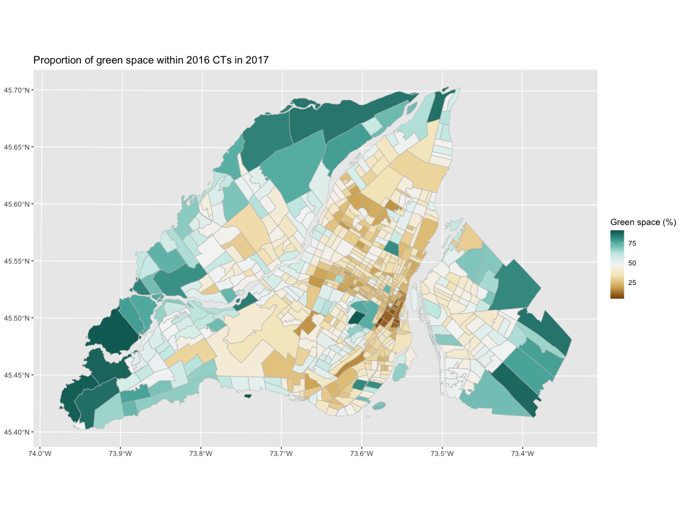<!-- -->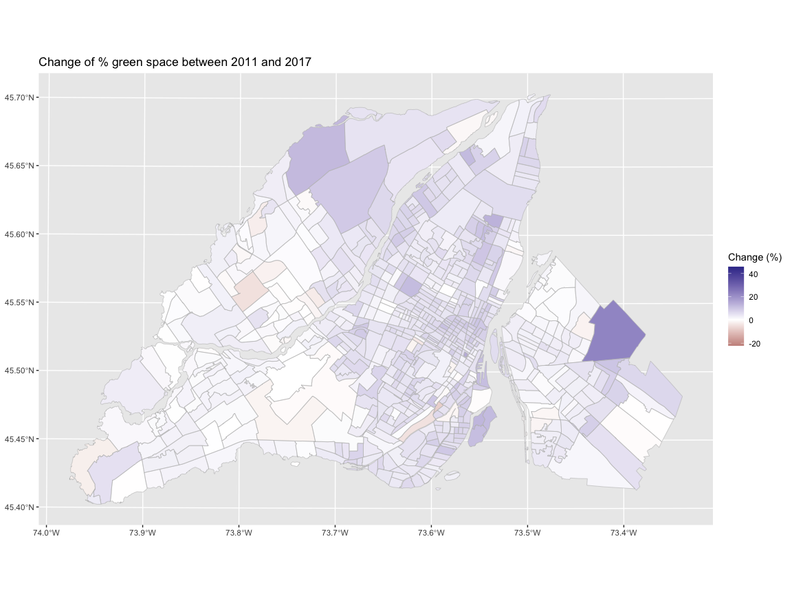<!-- -->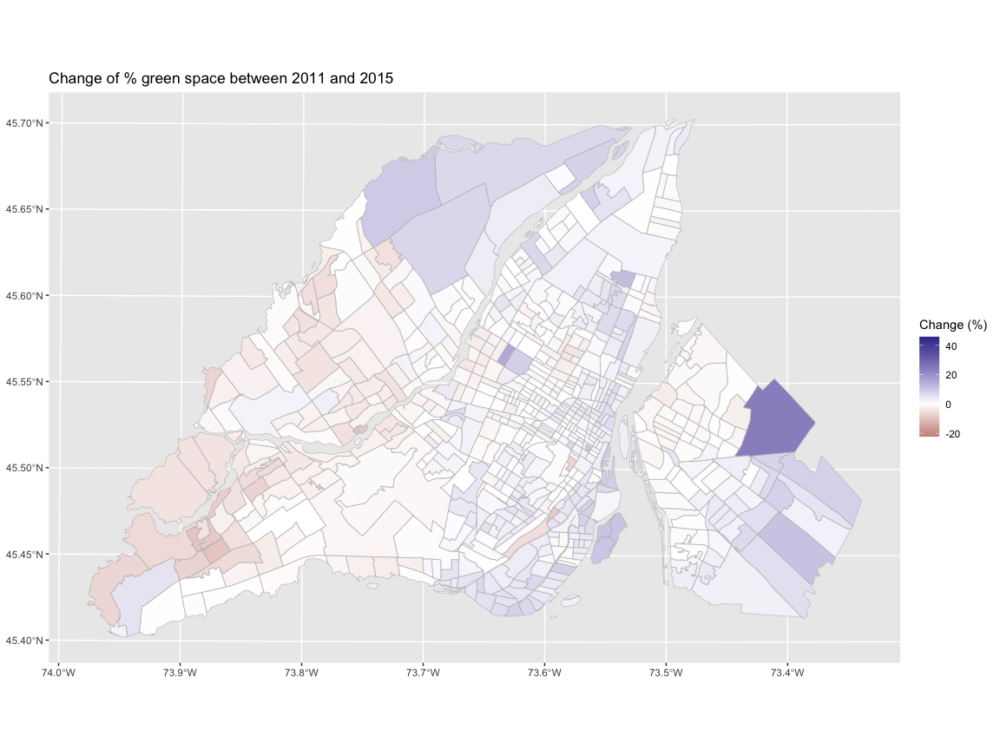<!-- -->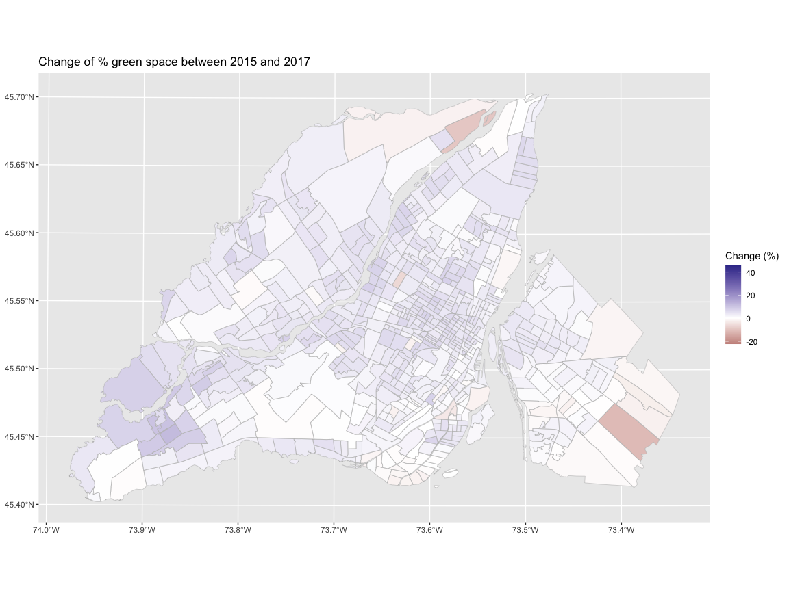<!-- -->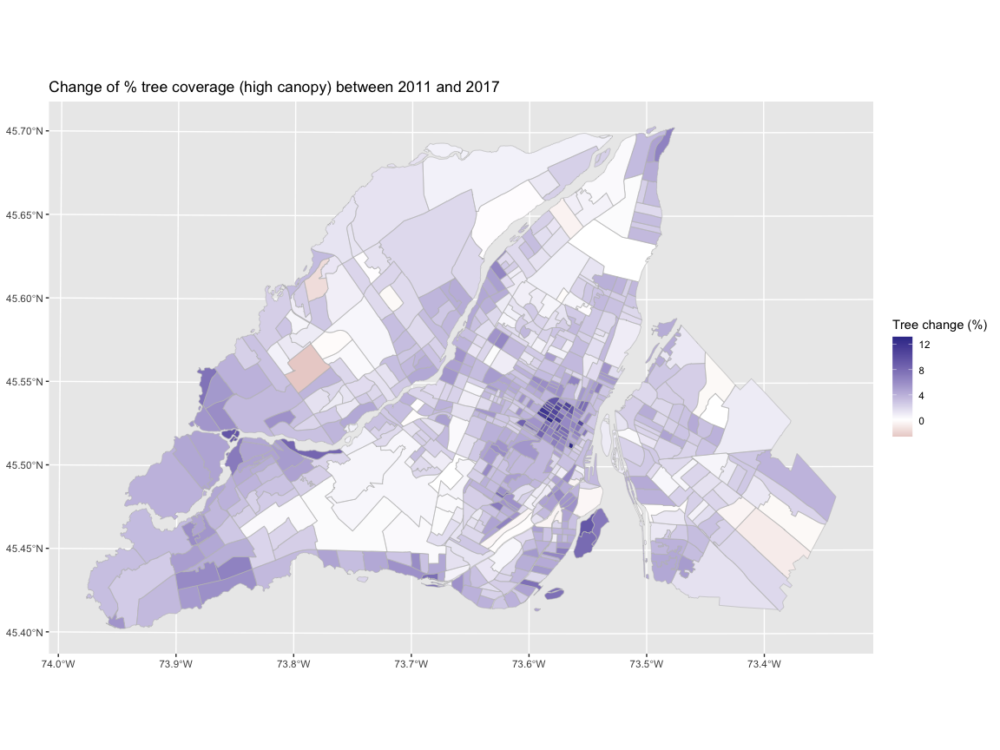<!-- --><div data-pagedtable="false">
  <script data-pagedtable-source type="application/json">
{"columns":[{"label":[""],"name":["_rn_"],"type":[""],"align":["left"]},{"label":["GeoUID"],"name":[1],"type":["chr"],"align":["left"]},{"label":["ct_area_h"],"name":[2],"type":["dbl"],"align":["right"]},{"label":["area_esp_vert_2011"],"name":[3],"type":["dbl"],"align":["right"]},{"label":["area_esp_vert_high_2011"],"name":[4],"type":["dbl"],"align":["right"]},{"label":["pct_esp_vert_high_2011"],"name":[5],"type":["dbl"],"align":["right"]},{"label":["pct_esp_vert_2011"],"name":[6],"type":["dbl"],"align":["right"]},{"label":["area_esp_vert_2015"],"name":[7],"type":["dbl"],"align":["right"]},{"label":["area_esp_vert_high_2015"],"name":[8],"type":["dbl"],"align":["right"]},{"label":["pct_esp_vert_high_2015"],"name":[9],"type":["dbl"],"align":["right"]},{"label":["pct_esp_vert_2015"],"name":[10],"type":["dbl"],"align":["right"]},{"label":["area_esp_vert_2017"],"name":[11],"type":["dbl"],"align":["right"]},{"label":["area_esp_vert_high_2017"],"name":[12],"type":["dbl"],"align":["right"]},{"label":["pct_esp_vert_high_2017"],"name":[13],"type":["dbl"],"align":["right"]},{"label":["pct_esp_vert_2017"],"name":[14],"type":["dbl"],"align":["right"]},{"label":["area_esp_vert_2019"],"name":[15],"type":["dbl"],"align":["right"]},{"label":["area_esp_vert_high_2019"],"name":[16],"type":["dbl"],"align":["right"]},{"label":["pct_esp_vert_high_2019"],"name":[17],"type":["dbl"],"align":["right"]},{"label":["pct_esp_vert_2019"],"name":[18],"type":["dbl"],"align":["right"]},{"label":["pct_esp_vert_diff_2011.2015"],"name":[19],"type":["dbl"],"align":["right"]},{"label":["pct_esp_vert_diff_2011.2017"],"name":[20],"type":["dbl"],"align":["right"]},{"label":["pct_esp_vert_diff_2015.2017"],"name":[21],"type":["dbl"],"align":["right"]},{"label":["pct_esp_vert_diff_high_2011.2015"],"name":[22],"type":["dbl"],"align":["right"]},{"label":["pct_esp_vert_diff_high_2011.2017"],"name":[23],"type":["dbl"],"align":["right"]},{"label":["pct_esp_vert_diff_high_2015.2017"],"name":[24],"type":["dbl"],"align":["right"]}],"data":[{"1":"4620001.00","2":"46.2","3":"21","4":"7","5":"14.6","6":"46.0","7":"22","8":"8","9":"17.4","10":"47.6","11":"22","12":"8","13":"18.2","14":"48.4","15":"23","16":"9","17":"19.7","18":"49.9","19":"1.6","20":"2.4","21":"0.8","22":"2.8","23":"3.6","24":"0.8","_rn_":"1"},{"1":"4620002.00","2":"38.9","3":"13","4":"7","5":"18.7","6":"34.7","7":"14","8":"8","9":"21.0","10":"35.3","11":"15","12":"8","13":"21.0","14":"37.6","15":"15","16":"8","17":"21.6","18":"38.5","19":"0.6","20":"2.9","21":"2.3","22":"2.3","23":"2.3","24":"0.0","_rn_":"2"},{"1":"4620003.00","2":"74.0","3":"27","4":"13","5":"17.9","6":"37.0","7":"28","8":"15","9":"20.8","10":"37.5","11":"30","12":"16","13":"21.7","14":"41.0","15":"30","16":"16","17":"21.1","18":"41.2","19":"0.5","20":"4.0","21":"3.5","22":"2.9","23":"3.8","24":"0.9","_rn_":"3"},{"1":"4620004.00","2":"44.8","3":"14","4":"9","5":"19.5","6":"31.7","7":"14","8":"9","9":"19.7","10":"31.5","11":"16","12":"10","13":"21.9","14":"35.9","15":"16","16":"10","17":"21.4","18":"36.0","19":"-0.2","20":"4.2","21":"4.4","22":"0.2","23":"2.4","24":"2.2","_rn_":"4"},{"1":"4620005.00","2":"56.4","3":"28","4":"12","5":"20.7","6":"49.0","7":"27","8":"11","9":"20.1","10":"47.3","11":"29","12":"13","13":"23.5","14":"51.2","15":"29","16":"14","17":"24.0","18":"52.0","19":"-1.7","20":"2.2","21":"3.9","22":"-0.6","23":"2.8","24":"3.4","_rn_":"5"},{"1":"4620006.00","2":"64.8","3":"26","4":"12","5":"19.1","6":"40.5","7":"25","8":"11","9":"17.7","10":"38.8","11":"27","12":"14","13":"21.0","14":"41.0","15":"27","16":"14","17":"21.1","18":"41.2","19":"-1.7","20":"0.5","21":"2.2","22":"-1.4","23":"1.9","24":"3.3","_rn_":"6"}],"options":{"columns":{"min":{},"max":[10]},"rows":{"min":[10],"max":[10]},"pages":{}}}
  </script>
</div>

## Pampalon index

Get it [here](https://www.inspq.qc.ca/en/deprivation/material-and-social-deprivation-index)


```r
pampalon <- read.xlsx("data/Canada2016Pampalon/A-MSDIData_Can2016_eng/1. EquivalenceTableCanada2016_ENG.xlsx", sheet = 2) %>%
  mutate(DA = as.character(DA)) %>%
  select(DA, SCOREMAT, SCORESOC)

# 2016 DA boundaries for Montreal
DA16 <- get_census(dataset='CA16', regions=list(CMA='24462'), level='DA', geo_format = "sf") %>%
  filter(Type == "DA") %>%
  st_transform(32188)
```

```
## Reading geo data from local cache.
```

```r
pampalon <- DA16 %>%
  inner_join(pampalon, by = c("GeoUID" = "DA")) %>%
  as.data.frame()

# Get Pampalon 2006
pampalon06 <- read.xlsx("data/Canada2006Pampalon/A-MSDIData_Can2006_eng/1. CorrespondenceTable_Can2006_eng.xlsx", sheet = 2) %>%
  mutate(DA = as.character(DA)) %>%
  select(DA, DAPOP2006, SCOREMAT, SCORESOC)

# Get LUT DA2006 <-> DA2011 from StatCan
lut_da.1 <- read.csv("data/2011_92-156_DA_AD_txt/2011_92-156_DA_AD.txt", colClasses = "character", 
                     header = FALSE, col.names = c("DAUID2011.ADIDU2011", "DAUID2006.ADIDU2006", "DBUID2011", "DA_rel_flag")) %>%
  select(!c(DBUID2011, DA_rel_flag)) %>%
  unique()

# Link Pampalon 2011 to LUT and compute weighted mean of scores of Pampalon 2011
# NB: population numbers will diverge from  reality when more than one DA is merged into one DA of next census
pampalon06.11 <- pampalon06 %>%
  inner_join(lut_da.1, by = c("DA" = "DAUID2006.ADIDU2006")) %>%
  group_by(DAUID2011.ADIDU2011) %>%
  summarise(pop2006 = sum(DAPOP2006),
            SCOREMAT.06 = weighted.mean(SCOREMAT, DAPOP2006, na.rm = TRUE),
            SCORESOC.06 = weighted.mean(SCORESOC, DAPOP2006, na.rm = TRUE))

# Get Pampalon 2011
pampalon11 <- read.xlsx("data/Canada2011Pampalon/A-MSDIData_Can2011_eng/1. CorrespondenceTable_Can2011_eng.xlsx", sheet = 2) %>%
  mutate(DA = as.character(DA)) %>%
  select(DA, DAPOP2011, SCOREMAT, SCORESOC)

# Get LUT DA2011 <-> DA2016 from StatCan
lut_da <- read.csv("data/2016_92-156_DA_AD_csv/2016_92-156_DA_AD.csv", colClasses = "character") %>%
  select(!c(DBUID2016.IDIDU2016, DA_rel_flag.AD_ind_rel)) %>%
  unique()

# Link Pampalon 2011 to LUT, then to Pampalon 06 and finally compute weighted mean of scores of Pampalon 2011
pampalon11.16 <- pampalon11 %>%
  inner_join(lut_da, by = c("DA" = "DAUID2011.ADIDU2011")) %>%
  left_join(pampalon06.11, by =c("DA" = "DAUID2011.ADIDU2011")) %>%
  group_by(DAUID2016.ADIDU2016) %>%
  summarise(pop2011 = sum(DAPOP2011),
            SCOREMAT = weighted.mean(SCOREMAT, DAPOP2011, na.rm = TRUE),
            SCORESOC = weighted.mean(SCORESOC, DAPOP2011, na.rm = TRUE),
            SCOREMAT.06 = weighted.mean(SCOREMAT.06, pop2006, na.rm = TRUE),
            SCORESOC.06 = weighted.mean(SCORESOC.06, pop2006, na.rm = TRUE),
            pop2006 = sum(pop2006))

# Then link Pampalon 2011 to 2016
pampalon <- pampalon %>%
  left_join(pampalon11.16, by = c("GeoUID" = "DAUID2016.ADIDU2016"), suffix = c(".16", ".11"))

# Aggregate at the CT level
pampalon_CT <- pampalon %>%
  group_by(CT_UID) %>%
  summarise(wSCOREMAT.2016 = weighted.mean(SCOREMAT.16, Population, na.rm = TRUE),
            wSCORESOC.2016 = weighted.mean(SCORESOC.16, Population, na.rm = TRUE),
            wSCOREMAT.2011 = weighted.mean(SCOREMAT.11, pop2011, na.rm = TRUE),
            wSCORESOC.2011 = weighted.mean(SCORESOC.11, pop2011, na.rm = TRUE),
            wSCOREMAT.2006 = weighted.mean(SCOREMAT.06, pop2006, na.rm = TRUE),
            wSCORESOC.2006 = weighted.mean(SCORESOC.06, pop2006, na.rm = TRUE))

# Clean up
rm(lut_da, lut_da.1, pampalon11.16, pampalon06.11, pampalon11, pampalon06)

# Display map
.pampalon_CT_geom <- CT16 %>%
  left_join(pampalon_CT, by = c("GeoUID" = "CT_UID")) %>%
  filter(interact_aoi)

.pampalon_data <- bi_class(.pampalon_CT_geom, x = wSCOREMAT.2016, y = wSCORESOC.2016, style = "quantile", dim = 3)
```

```
## Warning in classInt::classIntervals(.data[[var]], n = dim, style = style): var
## has missing values, omitted in finding classes

## Warning in classInt::classIntervals(.data[[var]], n = dim, style = style): var
## has missing values, omitted in finding classes
```

```r
.map <- ggplot() + 
  geom_sf(data = .pampalon_data, mapping = aes(fill = bi_class), color = "white", size = 0.1, show.legend = FALSE) +
  bi_scale_fill(pal = "DkBlue", dim = 3) +
  labs(title = "Pampalon: material and social deprivation index") + 
  theme(panel.background = element_rect(fill = "white"),
        #axis.ticks = element_blank(),
        #axis.text = element_blank(),
        panel.grid = element_line(color = "darkgray", size = 0.2))
```

```
## Warning: The `size` argument of `element_line()` is deprecated as of ggplot2 3.4.0.
## ℹ Please use the `linewidth` argument instead.
## This warning is displayed once every 8 hours.
## Call `lifecycle::last_lifecycle_warnings()` to see where this warning was
## generated.
```

```r
.legend <- bi_legend(pal = "DkBlue",
                    dim = 3,
                    xlab = "Material ",
                    ylab = "Social ",
                    size = 8)
ggdraw() +
  draw_plot(.map, 0, 0, 1, 1) +
  draw_plot(.legend, 0.1, .7, 0.2, 0.2)
```

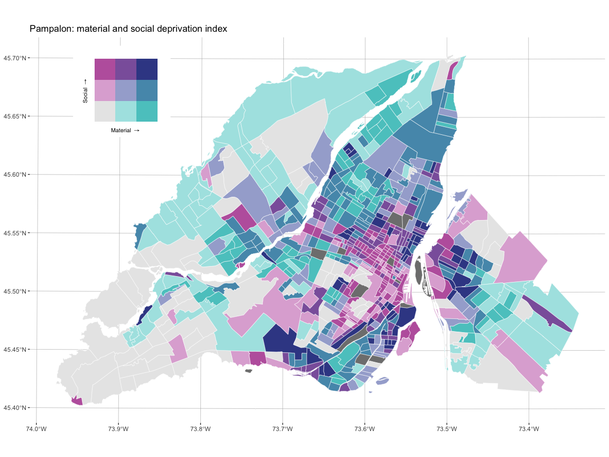<!-- -->

## Gentrification

Using Ding metric computed on 5 year span.


```r
# Load gentrified CTs, 5 year span (from repo gentrification_metrics)

# UPDATE: add 2021 gentrification status, reprojected at the CT16 level
.g21 <- st_read("data/gentrified_5years_cltd.gpkg", "gentrified_ding_21", quiet=TRUE) %>%
  filter(cma_uid_21 == "24462") %>%
  st_transform(32188)
.g21 <- CT16 %>%
  st_join(.g21, largest = TRUE) %>%
  transmute(ct_uid_16 = GeoUID,
            ct_uid_21 = ct_uid_21, 
            cma_uid_21 = cma_uid_21, 
            cd_uid_21 = cd_uid_21,
            ccs_uid_21 = ccs_uid_21, 
            csd_uid_21 = csd_uid_21,
            population_21 = population_21,
            gentrified_2021_2016 = gentrified_2021_2016, 
            gentrifiable_2016 = gentrifiable_2016, 
            gentrified_2021_2016_category = gentrified_2021_2016_category)
```

```
## Warning: attribute variables are assumed to be spatially constant throughout
## all geometries
```

```r
ding <- list()
ding[["2021"]] <- .g21
ding[["2016"]] <- st_read("data/gentrified_5years.gpkg", "gentrified_ding_16", quiet=TRUE) %>%
  filter(cma_uid_16 == "24462") %>%
  st_transform(32188)
ding[["2011"]] <- st_read("data/gentrified_5years.gpkg", "gentrified_ding_11", quiet=TRUE) %>%
  filter(cma_uid_11 == "24462") %>%
  st_transform(32188)
ding[["2006"]] <- st_read("data/gentrified_5years.gpkg", "gentrified_ding_06", quiet=TRUE) %>%
  filter(cma_uid_06 == "24462") %>%
  st_transform(32188)

.ding_map <- ding[["2016"]] %>%
  mutate(gentrification_status = factor(case_when(!gentrifiable_2011 ~ "Non eligible", 
                                           gentrifiable_2011 & !gentrified_2016_2011 ~ "Not gentrified",
                                           gentrified_2016_2011 ~ "Gentrified"), levels = c("Non eligible", "Not gentrified", "Gentrified"))) %>%
  left_join(select(as.data.frame(CT16), GeoUID, interact_aoi), by = c("ct_uid_16" = "GeoUID")) %>%
  filter(interact_aoi)

ggplot(data = .ding_map) + 
  geom_sf(aes(fill = gentrification_status)) +
  scale_fill_manual(values = c("lightgray", "yellow", "red"), name = "Gentrification status in 2016") +
  #labs(title = "Census tract gentrification status in 2016") +
  theme_void(base_size = 20)
```

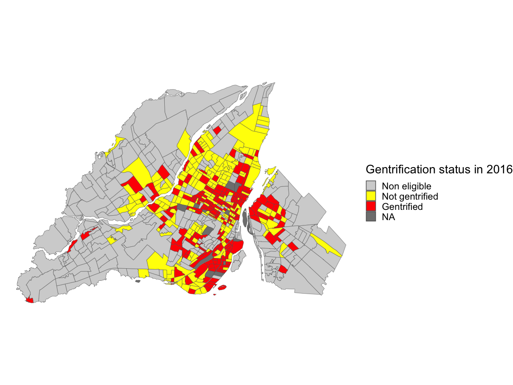<!-- -->

## Visible minority


```r
# Visible Minority
# - v_CA16_3954: Total - Visible minority for the population in private households - 25% sample data (Total)
# - v_CA16_3957: Total visible minority population (Total)

# Low income (LIM-AT)
# - v_CA16_2540: Prevalence of low income based on the Low-income measure, after tax (LIM-AT) (%) (Total)
equity_ct16 <- get_census(dataset='CA16', regions=list(CMA='24462'), level='CT', geo_format = "sf",
                          vectors = c("v_CA16_3954", "v_CA16_3957", "v_CA16_2540")) %>%
  filter(Type == "CT") %>%
  transmute(CT_UID = GeoUID,
            vis_minority_2016 = `v_CA16_3957: Total visible minority population` / `v_CA16_3954: Total - Visible minority for the population in private households - 25% sample data` * 100,
            low_income_2016 = `v_CA16_2540: Prevalence of low income based on the Low-income measure, after tax (LIM-AT) (%)`)
```

```
## Reading vectors data from local cache.
```

```
## Reading geo data from local cache.
```

```r
# Visible Minority
# - v_CA11N_457: CA 2011 NHS, Total population in private households by visible minority (Total)
# - v_CA11N_460: CA 2011 NHS, Total population in private households by visible minority, Total visible minority population (Total)

# Low income (LIM-AT)
# - v_CA11N_2606: CA 2011 NHS, Prevalence of low income in 2010 based on after-tax low-income measure % (Total)
equity_ct11 <- get_census(dataset='CA11', regions=list(CMA='24462'), level='CT', geo_format = "sf",
                          vectors = c("v_CA11N_457", "v_CA11N_460", "v_CA11N_2606")) %>%
  filter(Type == "CT") %>%
  transmute(CT_UID = GeoUID,
            vis_minority_2011 = `v_CA11N_460: Total visible minority population` / `v_CA11N_457: Total population in private households by visible minority` * 100,
            low_income_2011 = `v_CA11N_2606: Prevalence of low income in 2010 based on after-tax low-income measure %`)
```

```
## Reading vectors data from local cache.
## Reading geo data from local cache.
```

```r
# Visible Minority
# - v_CA06_1302: Total population by visible minority groups
# - v_CA06_1303: Total population by visible minority groups, Total visible minority population

# Low income (LIM-AT)
# - v_TX2006_551: After-tax low income status of tax filers and dependents (census family low income measure, CFLIM-AT) for couple and lone parent families by family composition, 2006 | All family units | Persons in Low Income | % - Total
equity_ct06 <- get_census(dataset='CA06', regions=list(CMA='24462'), level='CT', geo_format = "sf",
                          vectors = c("v_CA06_1302", "v_CA06_1303", "v_TX2006_551")) %>%
  filter(Type == "CT") %>%
  transmute(CT_UID = GeoUID,
            vis_minority_2006 = `v_CA06_1303: Total visible minority population` / `v_CA06_1302: Total population by visible minority groups - 20% sample data` * 100,
            low_income_2006 = `v_TX2006_551: % - Total`)
```

```
## Reading vectors data from local cache.
## Reading geo data from local cache.
```

```r
equity_ct <- st_join(equity_ct16, equity_ct11, left=TRUE, largest=TRUE, suffix=c("", "_2011")) %>% # join on largest overlap, to overcome mismatch in CT UID
  st_join(equity_ct06, left=TRUE, largest=TRUE, suffix=c("", "_2006")) %>%
  data.frame()
```

```
## Warning: attribute variables are assumed to be spatially constant throughout
## all geometries

## Warning: attribute variables are assumed to be spatially constant throughout
## all geometries
```

```r
# cleanup
rm(equity_ct11, equity_ct16, equity_ct06)

# Display map
.equity_CT_geom <- CT16 %>%
  left_join(equity_ct, by = c("GeoUID" = "CT_UID")) %>%
  filter(interact_aoi)

.equity_data <- bi_class(.equity_CT_geom, x = vis_minority_2016, y = low_income_2016, style = "quantile", dim = 3)
```

```
## Warning in classInt::classIntervals(.data[[var]], n = dim, style = style): var
## has missing values, omitted in finding classes
```

```
## Warning in classInt::classIntervals(.data[[var]], n = dim, style = style): var
## has missing values, omitted in finding classes
```

```r
.map <- ggplot() + 
  geom_sf(data = .equity_data, mapping = aes(fill = bi_class), color = "white", size = 0.1, show.legend = FALSE) +
  bi_scale_fill(pal = "Brown", dim = 3) +
  labs(title = "Equity metrics: % of visible minority and % of low-income household") + 
  theme(panel.background = element_rect(fill = "white"),
        #axis.ticks = element_blank(),
        #axis.text = element_blank(),
        panel.grid = element_line(color = "darkgray", size = 0.2))
.legend <- bi_legend(pal = "Brown",
                    dim = 3,
                    xlab = "Vis. Minority ",
                    ylab = "Low-Income ",
                    size = 8)
ggdraw() +
  draw_plot(.map, 0, 0, 1, 1) +
  draw_plot(.legend, 0.1, .7, 0.2, 0.2)
```

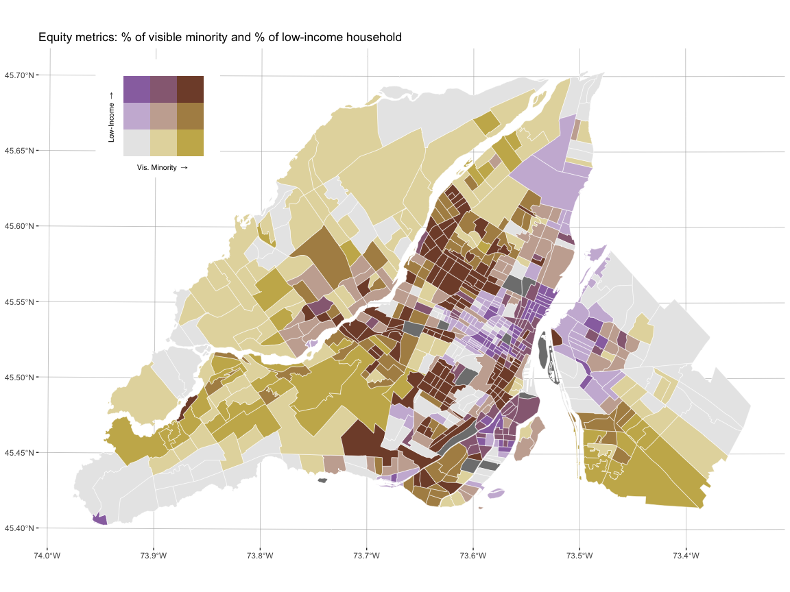<!-- -->

## Build complete dataset

All variables + outcome linked at the CT level + quintiles of SES variables


```r
bei_df <- CT16 %>%
  as.data.frame() %>%
  transmute(CT_UID = GeoUID,
            CD_UID = CD_UID,
            CSD_UID = CSD_UID,
            interact_aoi = interact_aoi,
            zone = case_when(CD_UID == "2466" ~ "Montreal",
                             CD_UID == "2458" ~ "Longueuil",
                             CD_UID == "2465" ~ "Laval",
                             TRUE ~ "Other"),
            Population = Population) %>%
  left_join(pampalon_CT, by="CT_UID") %>%
  left_join(select(as.data.frame(ding$`2021`), ct_uid_16, starts_with("gentrif")), by=c("CT_UID" = "ct_uid_16")) %>%
  mutate(gentrif_status_2021 = factor(case_when(!gentrifiable_2016 ~ "Non eligible", 
                                           gentrifiable_2016 & !gentrified_2021_2016 ~ "Not gentrified",
                                           gentrified_2021_2016 ~ "Gentrified"), levels = c("Non eligible", "Not gentrified", "Gentrified"))) %>%
  left_join(select(as.data.frame(ding$`2016`), ct_uid_16, starts_with("gentrif")), by=c("CT_UID" = "ct_uid_16")) %>%
  mutate(gentrif_status_2016 = factor(case_when(!gentrifiable_2011 ~ "Non eligible", 
                                           gentrifiable_2011 & !gentrified_2016_2011 ~ "Not gentrified",
                                           gentrified_2016_2011 ~ "Gentrified"), levels = c("Non eligible", "Not gentrified", "Gentrified"))) %>%
  left_join(select(as.data.frame(ding$`2011`), ct_uid_11, starts_with("gentrif")), by=c("CT_UID" = "ct_uid_11")) %>%
  mutate(gentrif_status_2011 = factor(case_when(!gentrifiable_2006 ~ "Non eligible", 
                                           gentrifiable_2006 & !gentrified_2011_2006 ~ "Not gentrified",
                                           gentrified_2011_2006 ~ "Gentrified"), levels = c("Non eligible", "Not gentrified", "Gentrified"))) %>%
  left_join(select(as.data.frame(ding$`2006`), ct_uid_06, starts_with("gentrif")), by=c("CT_UID" = "ct_uid_06")) %>%
  mutate(gentrif_status_2006 = factor(case_when(!gentrifiable_2001 ~ "Non eligible", 
                                           gentrifiable_2001 & !gentrified_2006_2001 ~ "Not gentrified",
                                           gentrified_2006_2001 ~ "Gentrified"), levels = c("Non eligible", "Not gentrified", "Gentrified"))) %>%
  left_join(select(as.data.frame(equity_ct), !c("geometry", "CT_UID_2011", "CT_UID_2006")), by="CT_UID") %>%
  left_join(as.data.frame(rename_with(esp_vert_ct, ~ paste0(., "ct"))), by=c("CT_UID" = "GeoUIDct")) %>%
  # Compute quintile of SES variables
  mutate(wSCOREMAT.2006.Q = ntile(wSCOREMAT.2006, 5),
         wSCOREMAT.2011.Q = ntile(wSCOREMAT.2011, 5),
         wSCOREMAT.2016.Q = ntile(wSCOREMAT.2016, 5),
         vis_minority_2006.Q = ntile(vis_minority_2006, 5),
         vis_minority_2011.Q = ntile(vis_minority_2011, 5),
         vis_minority_2016.Q = ntile(vis_minority_2016, 5)) %>%
  units::drop_units()

  
head(bei_df)
```

<div data-pagedtable="false">
  <script data-pagedtable-source type="application/json">
{"columns":[{"label":[""],"name":["_rn_"],"type":[""],"align":["left"]},{"label":["CT_UID"],"name":[1],"type":["chr"],"align":["left"]},{"label":["CD_UID"],"name":[2],"type":["chr"],"align":["left"]},{"label":["CSD_UID"],"name":[3],"type":["chr"],"align":["left"]},{"label":["interact_aoi"],"name":[4],"type":["lgl"],"align":["right"]},{"label":["zone"],"name":[5],"type":["chr"],"align":["left"]},{"label":["Population"],"name":[6],"type":["int"],"align":["right"]},{"label":["wSCOREMAT.2016"],"name":[7],"type":["dbl"],"align":["right"]},{"label":["wSCORESOC.2016"],"name":[8],"type":["dbl"],"align":["right"]},{"label":["wSCOREMAT.2011"],"name":[9],"type":["dbl"],"align":["right"]},{"label":["wSCORESOC.2011"],"name":[10],"type":["dbl"],"align":["right"]},{"label":["wSCOREMAT.2006"],"name":[11],"type":["dbl"],"align":["right"]},{"label":["wSCORESOC.2006"],"name":[12],"type":["dbl"],"align":["right"]},{"label":["gentrified_2021_2016"],"name":[13],"type":["lgl"],"align":["right"]},{"label":["gentrifiable_2016"],"name":[14],"type":["lgl"],"align":["right"]},{"label":["gentrified_2021_2016_category"],"name":[15],"type":["chr"],"align":["left"]},{"label":["gentrif_status_2021"],"name":[16],"type":["fct"],"align":["left"]},{"label":["gentrified_2016_2011"],"name":[17],"type":["lgl"],"align":["right"]},{"label":["gentrifiable_2011"],"name":[18],"type":["lgl"],"align":["right"]},{"label":["gentrified_2016_2011_category"],"name":[19],"type":["chr"],"align":["left"]},{"label":["gentrif_status_2016"],"name":[20],"type":["fct"],"align":["left"]},{"label":["gentrified_2011_2006"],"name":[21],"type":["lgl"],"align":["right"]},{"label":["gentrifiable_2006"],"name":[22],"type":["lgl"],"align":["right"]},{"label":["gentrified_2011_2006_category"],"name":[23],"type":["chr"],"align":["left"]},{"label":["gentrif_status_2011"],"name":[24],"type":["fct"],"align":["left"]},{"label":["gentrified_2006_2001"],"name":[25],"type":["lgl"],"align":["right"]},{"label":["gentrifiable_2001"],"name":[26],"type":["lgl"],"align":["right"]},{"label":["gentrified_2006_2001_category"],"name":[27],"type":["chr"],"align":["left"]},{"label":["gentrif_status_2006"],"name":[28],"type":["fct"],"align":["left"]},{"label":["vis_minority_2016"],"name":[29],"type":["dbl"],"align":["right"]},{"label":["low_income_2016"],"name":[30],"type":["dbl"],"align":["right"]},{"label":["vis_minority_2011"],"name":[31],"type":["dbl"],"align":["right"]},{"label":["low_income_2011"],"name":[32],"type":["dbl"],"align":["right"]},{"label":["vis_minority_2006"],"name":[33],"type":["dbl"],"align":["right"]},{"label":["low_income_2006"],"name":[34],"type":["dbl"],"align":["right"]},{"label":["ct_area_hct"],"name":[35],"type":["dbl"],"align":["right"]},{"label":["area_esp_vert_2011ct"],"name":[36],"type":["dbl"],"align":["right"]},{"label":["area_esp_vert_high_2011ct"],"name":[37],"type":["dbl"],"align":["right"]},{"label":["pct_esp_vert_high_2011ct"],"name":[38],"type":["dbl"],"align":["right"]},{"label":["pct_esp_vert_2011ct"],"name":[39],"type":["dbl"],"align":["right"]},{"label":["area_esp_vert_2015ct"],"name":[40],"type":["dbl"],"align":["right"]},{"label":["area_esp_vert_high_2015ct"],"name":[41],"type":["dbl"],"align":["right"]},{"label":["pct_esp_vert_high_2015ct"],"name":[42],"type":["dbl"],"align":["right"]},{"label":["pct_esp_vert_2015ct"],"name":[43],"type":["dbl"],"align":["right"]},{"label":["area_esp_vert_2017ct"],"name":[44],"type":["dbl"],"align":["right"]},{"label":["area_esp_vert_high_2017ct"],"name":[45],"type":["dbl"],"align":["right"]},{"label":["pct_esp_vert_high_2017ct"],"name":[46],"type":["dbl"],"align":["right"]},{"label":["pct_esp_vert_2017ct"],"name":[47],"type":["dbl"],"align":["right"]},{"label":["area_esp_vert_2019ct"],"name":[48],"type":["dbl"],"align":["right"]},{"label":["area_esp_vert_high_2019ct"],"name":[49],"type":["dbl"],"align":["right"]},{"label":["pct_esp_vert_high_2019ct"],"name":[50],"type":["dbl"],"align":["right"]},{"label":["pct_esp_vert_2019ct"],"name":[51],"type":["dbl"],"align":["right"]},{"label":["pct_esp_vert_diff_2011.2015ct"],"name":[52],"type":["dbl"],"align":["right"]},{"label":["pct_esp_vert_diff_2011.2017ct"],"name":[53],"type":["dbl"],"align":["right"]},{"label":["pct_esp_vert_diff_2015.2017ct"],"name":[54],"type":["dbl"],"align":["right"]},{"label":["pct_esp_vert_diff_high_2011.2015ct"],"name":[55],"type":["dbl"],"align":["right"]},{"label":["pct_esp_vert_diff_high_2011.2017ct"],"name":[56],"type":["dbl"],"align":["right"]},{"label":["pct_esp_vert_diff_high_2015.2017ct"],"name":[57],"type":["dbl"],"align":["right"]},{"label":["wSCOREMAT.2006.Q"],"name":[58],"type":["int"],"align":["right"]},{"label":["wSCOREMAT.2011.Q"],"name":[59],"type":["int"],"align":["right"]},{"label":["wSCOREMAT.2016.Q"],"name":[60],"type":["int"],"align":["right"]},{"label":["vis_minority_2006.Q"],"name":[61],"type":["int"],"align":["right"]},{"label":["vis_minority_2011.Q"],"name":[62],"type":["int"],"align":["right"]},{"label":["vis_minority_2016.Q"],"name":[63],"type":["int"],"align":["right"]}],"data":[{"1":"4620149.00","2":"2466","3":"2466023","4":"TRUE","5":"Montreal","6":"3161","7":"-0.049248759","8":"0.057190321","9":"-0.02978953","10":"0.0594421910","11":"-0.02369179","12":"0.037338622","13":"TRUE","14":"TRUE","15":"moderate","16":"Gentrified","17":"FALSE","18":"TRUE","19":"NA","20":"Not gentrified","21":"TRUE","22":"TRUE","23":"intense","24":"Gentrified","25":"TRUE","26":"TRUE","27":"moderate","28":"Gentrified","29":"15.35948","30":"22.0","31":"15.54828","32":"30.8","33":"12.59843","34":"23.91","35":"13.8","36":"3","37":"3","38":"21.8","39":"24.8","40":"4","41":"4","42":"26.4","43":"28.7","44":"4","45":"4","46":"29.2","47":"31.4","48":"4","49":"4","50":"28.7","51":"32.1","52":"3.9","53":"6.6","54":"2.7","55":"4.6","56":"7.4","57":"2.8","58":"2","59":"1","60":"1","61":"3","62":"3","63":"3","_rn_":"1"},{"1":"4620185.00","2":"2466","3":"2466023","4":"TRUE","5":"Montreal","6":"5217","7":"0.002586202","8":"0.052690760","9":"0.01135986","10":"0.0457714081","11":"0.02030788","12":"0.046134103","13":"TRUE","14":"TRUE","15":"moderate","16":"Gentrified","17":"TRUE","18":"TRUE","19":"intense","20":"Gentrified","21":"TRUE","22":"TRUE","23":"intense","24":"Gentrified","25":"FALSE","26":"TRUE","27":"NA","28":"Not gentrified","29":"16.13217","30":"20.1","31":"17.59082","32":"27.6","33":"12.25490","34":"23.29","35":"39.3","36":"12","37":"8","38":"20.6","39":"29.4","40":"11","41":"8","42":"20.0","43":"29.0","44":"13","45":"10","46":"24.3","47":"33.7","48":"14","49":"9","50":"22.1","51":"34.7","52":"-0.4","53":"4.3","54":"4.7","55":"-0.6","56":"3.7","57":"4.3","58":"4","59":"3","60":"3","61":"3","62":"3","63":"3","_rn_":"2"},{"1":"4620222.00","2":"2466","3":"2466023","4":"TRUE","5":"Montreal","6":"3587","7":"0.082313210","8":"0.014476934","9":"0.09282443","10":"0.0052905841","11":"0.09663123","12":"-0.004537943","13":"TRUE","14":"TRUE","15":"moderate","16":"Gentrified","17":"FALSE","18":"TRUE","19":"NA","20":"Not gentrified","21":"TRUE","22":"TRUE","23":"intense","24":"Gentrified","25":"FALSE","26":"TRUE","27":"NA","28":"Not gentrified","29":"57.91610","30":"35.1","31":"57.56359","32":"39.5","33":"50.00000","34":"41.79","35":"19.9","36":"5","37":"2","38":"11.7","39":"24.9","40":"5","41":"2","42":"11.4","43":"24.0","44":"6","45":"3","46":"14.2","47":"29.6","48":"5","49":"3","50":"13.6","51":"26.9","52":"-0.9","53":"4.7","54":"5.6","55":"-0.3","56":"2.5","57":"2.8","58":"5","59":"5","60":"5","61":"5","62":"5","63":"5","_rn_":"3"},{"1":"4620117.00","2":"2466","3":"2466023","4":"TRUE","5":"Montreal","6":"4359","7":"0.034245133","8":"0.006085192","9":"0.06315153","10":"0.0009442053","11":"0.03645207","12":"0.010056370","13":"TRUE","14":"TRUE","15":"moderate","16":"Gentrified","17":"TRUE","18":"TRUE","19":"moderate","20":"Gentrified","21":"FALSE","22":"TRUE","23":"NA","24":"Not gentrified","25":"TRUE","26":"TRUE","27":"intense","28":"Gentrified","29":"84.76071","30":"27.5","31":"80.62201","32":"40.6","33":"73.28520","34":"41.64","35":"27.1","36":"6","37":"4","38":"14.7","39":"20.9","40":"6","41":"4","42":"15.2","43":"22.7","44":"8","45":"5","46":"17.8","47":"27.8","48":"7","49":"4","50":"16.1","51":"26.8","52":"1.8","53":"6.9","54":"5.1","55":"0.5","56":"3.1","57":"2.6","58":"5","59":"5","60":"5","61":"5","62":"5","63":"5","_rn_":"4"},{"1":"4620124.00","2":"2466","3":"2466023","4":"TRUE","5":"Montreal","6":"5729","7":"0.020820044","8":"0.047056282","9":"0.02972110","10":"0.0401421555","11":"0.02970024","12":"0.039865255","13":"TRUE","14":"TRUE","15":"intense","16":"Gentrified","17":"FALSE","18":"TRUE","19":"NA","20":"Not gentrified","21":"TRUE","22":"TRUE","23":"moderate","24":"Gentrified","25":"TRUE","26":"TRUE","27":"moderate","28":"Gentrified","29":"55.86690","30":"36.6","31":"51.55172","32":"47.0","33":"41.18151","34":"47.58","35":"37.7","36":"12","37":"9","38":"23.4","39":"32.3","40":"13","41":"10","42":"25.9","43":"34.2","44":"15","45":"11","46":"29.4","47":"38.8","48":"14","49":"11","50":"28.3","51":"37.6","52":"1.9","53":"6.5","54":"4.6","55":"2.5","56":"6.0","57":"3.5","58":"5","59":"4","60":"4","61":"5","62":"5","63":"5","_rn_":"5"},{"1":"4620306.00","2":"2466","3":"2466023","4":"TRUE","5":"Montreal","6":"2847","7":"0.030925210","8":"0.054219900","9":"0.03587117","10":"0.0427824009","11":"0.04348091","12":"0.040864073","13":"TRUE","14":"TRUE","15":"intense","16":"Gentrified","17":"TRUE","18":"TRUE","19":"moderate","20":"Gentrified","21":"TRUE","22":"TRUE","23":"intense","24":"Gentrified","25":"TRUE","26":"TRUE","27":"moderate","28":"Gentrified","29":"16.21129","30":"24.4","31":"19.69981","32":"29.3","33":"14.71049","34":"32.79","35":"22.3","36":"7","37":"2","38":"9.6","39":"33.0","40":"8","41":"3","42":"11.7","43":"36.3","44":"9","45":"3","46":"13.7","47":"39.6","48":"7","49":"3","50":"14.0","51":"30.1","52":"3.3","53":"6.6","54":"3.3","55":"2.1","56":"4.1","57":"2.0","58":"5","59":"5","60":"5","61":"3","62":"3","63":"3","_rn_":"6"}],"options":{"columns":{"min":{},"max":[10]},"rows":{"min":[10],"max":[10]},"pages":{}}}
  </script>
</div>

```r
# keep only interact CT 
# UPDATE 2022-07-07 ##########
# and recompute quintiles for the new AOI
bei_df_aoi <- filter(bei_df, interact_aoi) %>%
  mutate(wSCOREMAT.2006.Q = ntile(wSCOREMAT.2006, 5),
         wSCOREMAT.2011.Q = ntile(wSCOREMAT.2011, 5),
         wSCOREMAT.2016.Q = ntile(wSCOREMAT.2016, 5),
         vis_minority_2006.Q = ntile(vis_minority_2006, 5),
         vis_minority_2011.Q = ntile(vis_minority_2011, 5),
         vis_minority_2016.Q = ntile(vis_minority_2016, 5),
         # Need to reorder factor in order to get the proper dummy variables in models below
         gentrif_status_2016 = forcats::fct_relevel(gentrif_status_2016, "Not gentrified", "Gentrified", "Non eligible"),
         gentrif_status_2021 = forcats::fct_relevel(gentrif_status_2021, "Not gentrified", "Gentrified", "Non eligible"))
```

Included variables:

- Census Tracts variables
  - `CT_UID`: 2016 Census Tract ID
  - `CD_UID`: 2016 Census Division
  - `CSD_UID`: 2016 Census Subdivision
  - `interact_aoi`: Does CT belong to INTERACT study area?
  - `zone`: Montreal / Laval / Longueuil, etc. / Other
  - `Population`: 2016 Population within CT
  - `ct_area_m2ct`: Area of CT, in square meters
- Gentrification metrics
  - `gentrified_2016_2011`: Is the CT gentrified in 2016?
  - `gentrifiable_2011`: Is the CT candidate to gentrification in 2011?
  - `gentrif_status_2016`: 3-state gentrification status in 2016 (Gentrified/Not gentrified/Non eligible)
  - `gentrified_2011_2006`: Is the CT gentrified in 2011
  - `gentrifiable_2006`: Is the CT candidate to gentrification in 2006
  - `gentrif_status_2011`: 3-state gentrification status in 2011 (Gentrified/Not gentrified/Non eligible)
  - `gentrified_2006_2001`: Is the CT gentrified in 2006
  - `gentrifiable_2001`: Is the CT candidate to gentrification in 2001
  - `gentrif_status_2006`: 3-state gentrification status in 2006 (Gentrified/Not gentrified/Non eligible)
- Pampalon's metrics
  - `wSCORESOC.2016`: Social deprivation index in 2016 (population weighted)
  - `wSCOREMAT.2016`: Material deprivation index in 2016 (population weighted)
  - `wSCOREMAT.2016.Q`: Quintile of material deprivation index in 2016 (population weighted)
  - `wSCORESOC.2011`: Social deprivation index in 2011 (population weighted)
  - `wSCOREMAT.2011`: Material deprivation index in 2011 (population weighted)
  - `wSCOREMAT.2011.Q`: Quintile of aterial deprivation index in 2011 (population weighted)
  - `wSCORESOC.2006`: Social deprivation index in 2006 (population weighted)
  - `wSCOREMAT.2006`: Material deprivation index in 2006 (population weighted)
  - `wSCOREMAT.2006.Q`: Quintile of material deprivation index in 2006 (population weighted)
- Social profile
  - `vis_minority_2016`: % of visible minority in CT 2016
  - `vis_minority_2016.Q`: Quintile of % of visible minority in CT 2016
  - `vis_minority_2011`: % of visible minority in CT 2011
  - `vis_minority_2011.Q`: Quintile of % of visible minority in CT 2011
  - `vis_minority_2006`: % of visible minority in CT 2006
  - `vis_minority_2006.Q`: Quintile of % of visible minority in CT 2006
- Green spaces
  - `area_esp_vert_{2011|2015|2019}ct`: area of green space in 2011, 2015 or 2019 within CT (in hectares)
  - `area_esp_vert_high_{2011|2015|2019}ct`: same as above, except for trees (high canopy)
  - `pct_esp_vert_{2011|2015|2019}ct`: % of green space in 2011, 2015 or 2019 within CT
  - `pct_esp_vert_high_{2011|2015|2019}ct`: same as above, except for trees (high canopy)
  - `pct_esp_vert_diff{2011|2015}.{2015|2019}ct`: change in % of green space between 2011 and 2015, 2011 and 2019 as well as 2011 and 2019, within CT

# Preliminary analyses

INTERACT study area ~ Montréal, Laval, Longueuil, Brossard, St-Lambert

## SES variable distribution


```r
.bei_df_long <- bei_df_aoi %>% 
  select(CT_UID, CD_UID, starts_with("wSCORE")) %>%
  select(!ends_with('.Q')) %>%
  pivot_longer(!c(CT_UID, CD_UID))

ggplot(.bei_df_long, aes(value)) +
  geom_histogram() + 
  facet_wrap(~name) #, scales = "free")
```

```
## Warning: Removed 80 rows containing non-finite values (`stat_bin()`).
```

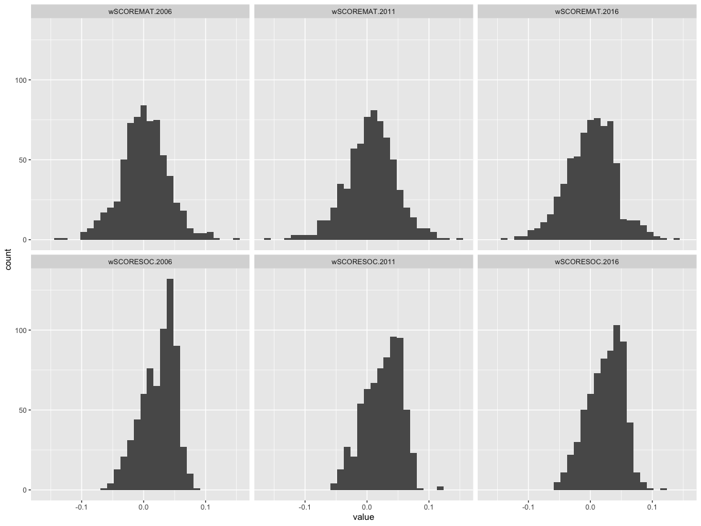<!-- -->

```r
.bei_df_long <- bei_df_aoi %>%
  select(CT_UID, CD_UID, starts_with("vis_minority")) %>%
  select(!ends_with('.Q')) %>%
  pivot_longer(!c(CT_UID, CD_UID))

ggplot(.bei_df_long, aes(value)) +
  geom_histogram() + 
  facet_wrap(~name) #, scales = "free")
```

```
## Warning: Removed 42 rows containing non-finite values (`stat_bin()`).
```

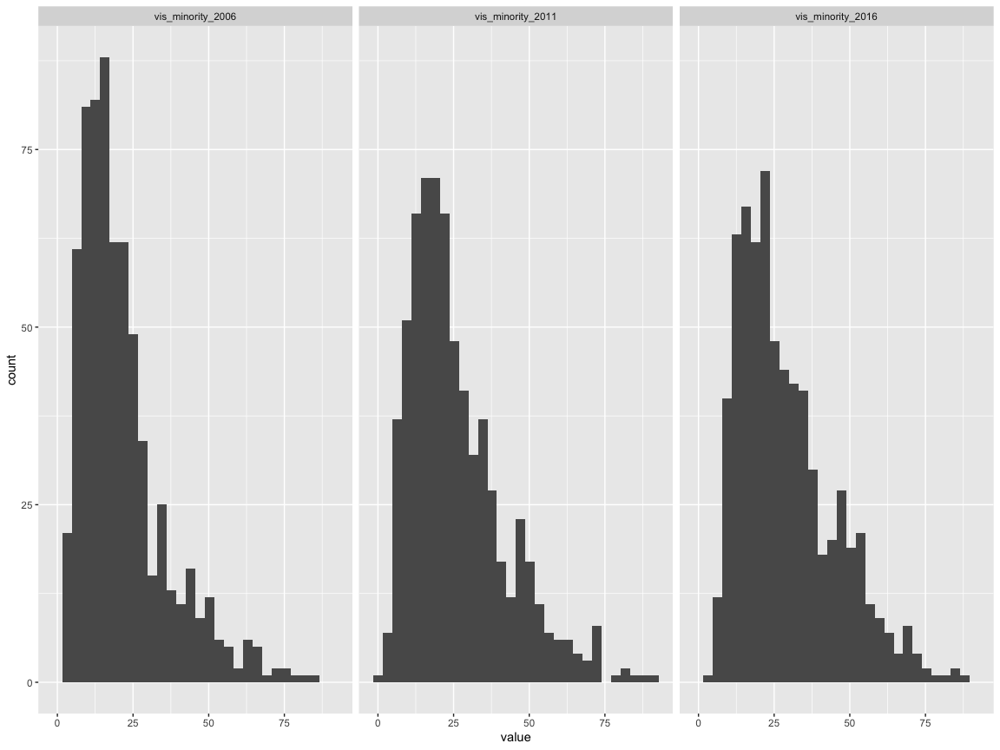<!-- -->

```r
.bei_df_long <- bei_df_aoi %>%
  select(CT_UID, CD_UID, starts_with("gentrif_status")) %>%
  select(!ends_with('.Q')) %>%
  pivot_longer(!c(CT_UID, CD_UID))

ggplot(.bei_df_long, aes(value)) +
  geom_bar() + 
  facet_wrap(~name) #, scales = "free", ncol = 3)
```

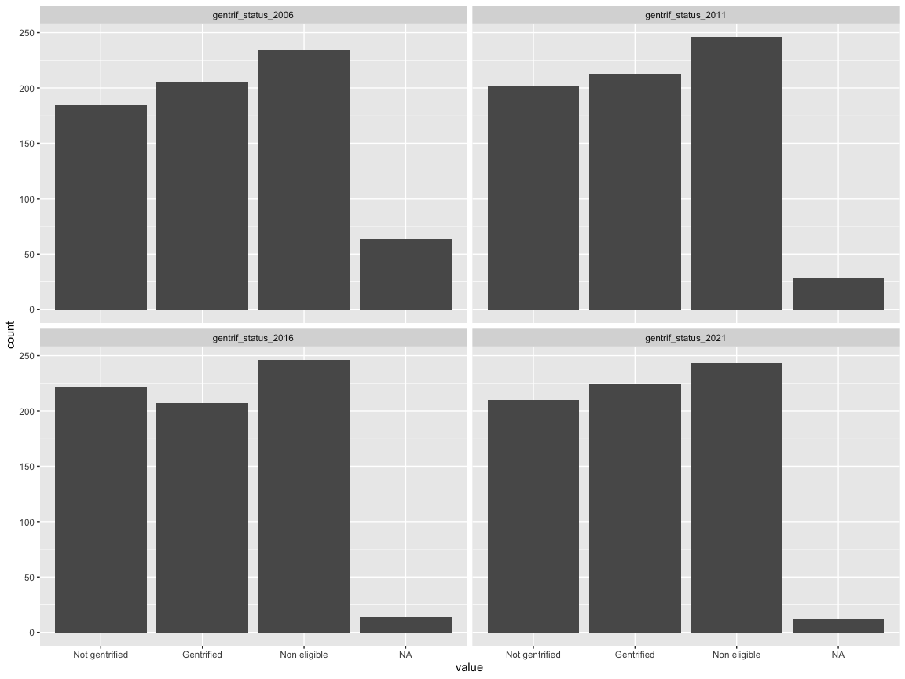<!-- -->

### Confusion matrix / correlations

Confusion matrix between tiertiles of material deprivation, % of Visible Minorities and gentrification status at baseline:


```r
cfx <- bei_df_aoi %>%
  data.frame() %>%
  mutate(wSCOREMAT.2011.Tier = ntile(wSCOREMAT.2011, 3),
         vis_minority_2011.Tier = ntile(vis_minority_2011, 3)) %>%
  select(CT_UID, ends_with(".Tier"), gentrified_2016_2011, wSCOREMAT.2011, vis_minority_2011)

# Correlation between contiunous SES metrcis
cor.test(cfx$wSCOREMAT.2011, cfx$vis_minority_2011,  method = "pearson", use = "complete.obs")
```

```
## 
## 	Pearson's product-moment correlation
## 
## data:  cfx$wSCOREMAT.2011 and cfx$vis_minority_2011
## t = 14.638, df = 670, p-value < 2.2e-16
## alternative hypothesis: true correlation is not equal to 0
## 95 percent confidence interval:
##  0.4327316 0.5475013
## sample estimates:
##       cor 
## 0.4922529
```

```r
# Confusion Mtx Tiertiles SES
# See http://rcompanion.org/handbook/H_10.html
# 3 classes -> small (0.07 - < 0.20) | medium (0.20 - 0.35) | large (> 0.35)
cramerV(table(cfx$wSCOREMAT.2011.Tier, cfx$vis_minority_2011.Tier))
```

```
## Cramer V 
##   0.2557
```

```r
cramerV(table(cfx$wSCOREMAT.2011.Tier, cfx$gentrified_2016_2011))
```

```
## Cramer V 
##   0.1814
```

```r
cramerV(table(cfx$vis_minority_2011.Tier, cfx$gentrified_2016_2011))
```

```
## Cramer V 
##  0.06296
```

Only the SES metrics seem moderately correlated.


## BEI variable distributions

### Absolute values


```r
.bei_df_long <- bei_df_aoi %>% 
  filter(interact_aoi) %>%
  select(CT_UID, CD_UID, matches("^area_esp_vert.*ct$")) %>%
  pivot_longer(!c(CT_UID, CD_UID))

ggplot(.bei_df_long, aes(value)) +
  geom_histogram() + 
  facet_wrap(~name, scales = "free", ncol = 4)
```

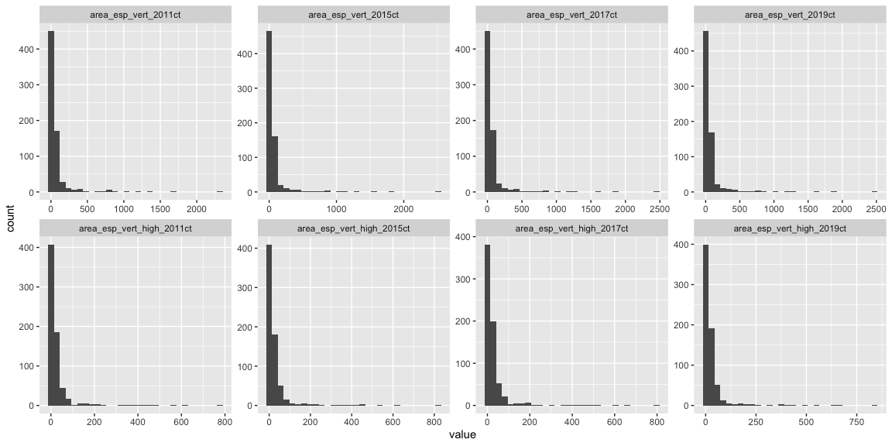<!-- -->

### Relative values


```r
.bei_df_long <- bei_df_aoi %>% 
  filter(interact_aoi) %>%
  select(CT_UID, CD_UID, matches("^pct_esp_vert.*ct$")) %>%
  pivot_longer(!c(CT_UID, CD_UID))

ggplot(.bei_df_long, aes(value)) +
  geom_histogram() + 
  facet_wrap(~name, scales = "free", ncol = 3)
```

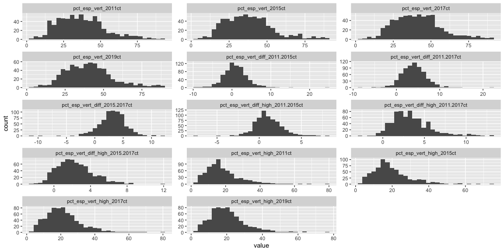<!-- -->

# Association between SES and Urban Conditions at baseline (2011)

Looking at objective #1: _do urban interventions tend to be located in low SES neighborhoods?_. We look at $$Urban Condition_{2011} = f(SES_{2011})$$ as well as $$Urban Condition_{2011} = f(Gentrification_{2011 \to 2016})$$

Here $UrbanCondition$ means the state of the urban environment features, such as length of bike lanes, greenness coverage, etc. at one specific moment. This needs to be distinguished from $UrbanIntervention$, which accounts for the **changes** in the $UrbanConditions$ between two years (see below). 

We fit LMM models, with spatial random effect using `spaMM` package.

## UC vs Pampalon | material {.tabset}

### Greenness

Measuring canopy (_i.e._ greenness ~ grass & trees) ratio within CT/buffer in 2011 at the Census tract level, using a Poisson distribution


```r
f <- area_esp_vert_2011ct ~ wSCOREMAT.2011.Q + offset(log(ct_area_hct))

clean_bei <- tidy_df(bei_df_aoi, CT16, f)

res.lmm <- fitme(area_esp_vert_2011ct ~ wSCOREMAT.2011.Q + offset(log(ct_area_hct)) + adjacency(1|ct_no),
                 data = clean_bei$df, adjMatrix = clean_bei$nbmatx, 
                 family = Poisson())
smy <- summary(res.lmm, details = c(p_value="Wald"))
```

```
## formula: area_esp_vert_2011ct ~ wSCOREMAT.2011.Q + offset(log(ct_area_hct)) + 
##     adjacency(1 | ct_no)
## Estimation of corrPars and lambda by ML (p_v approximation of logL).
## Estimation of fixed effects by ML (p_v approximation of logL).
## Estimation of lambda by 'outer' ML, maximizing logL.
## family: poisson( link = log ) 
##  ------------ Fixed effects (beta) ------------
##                  Estimate Cond. SE t-value  p-value
## (Intercept)      -0.61272  0.04130 -14.834 0.00e+00
## wSCOREMAT.2011.Q -0.09123  0.01113  -8.199 2.22e-16
##  --------------- Random effects ---------------
## Family: gaussian( link = identity ) 
##                    --- Correlation parameters:
##     1.rho 
## 0.1383747 
##            --- Variance parameters ('lambda'):
## lambda = var(u) for u ~ Gaussian; 
##    ct_no  :  0.05602  
## # of obs: 673; # of groups: ct_no, 673 
##  ------------- Likelihood values  -------------
##                         logLik
## logL       (p_v(h)): -2329.779
```

```r
ci.lmm <- confint(res.lmm, 'wSCOREMAT.2011.Q')
```

```
## lower wSCOREMAT.2011.Q upper wSCOREMAT.2011.Q 
##            -0.11306613            -0.06933533
```

```r
# Testing main effect
res.lmm.0 <- update(res.lmm, . ~ . - wSCOREMAT.2011.Q)
LRT(res.lmm.0, res.lmm)
```

```
##      chi2_LR df      p_value
## p_v 62.97397  1 2.109424e-15
```

Transforming the model coefficients:


```r
smy.bt <- data.frame(smy$beta_table)
round(exp(res.lmm[["fixef"]]), 3) %>% 
  data.frame(fixef = ., p.value = round(smy.bt$p.value, 3)) %>%
  knitr::kable(caption="Model transformed coeffs")
```


Table: Model transformed coeffs

|                 | fixef| p.value|
|:----------------|-----:|-------:|
|(Intercept)      | 0.542|       0|
|wSCOREMAT.2011.Q | 0.913|       0|

```r
round(exp(ci.lmm$interval), 3)%>%
  data.frame(wSCOREMAT.2011.Q = ., row.names = c('lower', 'upper')) %>% t() %>%
  knitr::kable(caption="Model confidence interval")
```


Table: Model confidence interval

|                 | lower| upper|
|:----------------|-----:|-----:|
|wSCOREMAT.2011.Q | 0.893| 0.933|

### Canopy (trees)

Measuring high canopy (_i.e._ trees only) ratio within CT/buffer in 2011 at the Census tract level, using a Poisson distribution


```r
f <- area_esp_vert_high_2011ct ~ wSCOREMAT.2011.Q + offset(log(ct_area_hct))

clean_bei <- tidy_df(bei_df_aoi, CT16, f)

res.lmm <- fitme(area_esp_vert_high_2011ct ~ wSCOREMAT.2011.Q + offset(log(ct_area_hct)) + adjacency(1|ct_no),
                 data = clean_bei$df, adjMatrix = clean_bei$nbmatx, 
                 family = poisson())
smy <- summary(res.lmm, details = c(p_value="Wald"))
```

```
## formula: area_esp_vert_high_2011ct ~ wSCOREMAT.2011.Q + offset(log(ct_area_hct)) + 
##     adjacency(1 | ct_no)
## Estimation of corrPars and lambda by ML (p_v approximation of logL).
## Estimation of fixed effects by ML (p_v approximation of logL).
## Estimation of lambda by 'outer' ML, maximizing logL.
## family: poisson( link = log ) 
##  ------------ Fixed effects (beta) ------------
##                  Estimate Cond. SE t-value  p-value
## (Intercept)       -1.2602  0.06071 -20.759 0.00e+00
## wSCOREMAT.2011.Q  -0.1354  0.01647  -8.221 2.22e-16
##  --------------- Random effects ---------------
## Family: gaussian( link = identity ) 
##                    --- Correlation parameters:
##     1.rho 
## 0.1377928 
##            --- Variance parameters ('lambda'):
## lambda = var(u) for u ~ Gaussian; 
##    ct_no  :  0.1247  
## # of obs: 673; # of groups: ct_no, 673 
##  ------------- Likelihood values  -------------
##                         logLik
## logL       (p_v(h)): -2072.628
```

```r
ci.lmm <- confint(res.lmm, 'wSCOREMAT.2011.Q')
```

```
## lower wSCOREMAT.2011.Q upper wSCOREMAT.2011.Q 
##             -0.1677385             -0.1029865
```

```r
# Testing main effect
res.lmm.0 <- update(res.lmm, . ~ . - wSCOREMAT.2011.Q)
LRT(res.lmm.0, res.lmm)
```

```
##      chi2_LR df     p_value
## p_v 63.63486  1 1.44329e-15
```

Transforming the model coefficients:


```r
smy.bt <- data.frame(smy$beta_table)
round(exp(res.lmm[["fixef"]]), 3) %>% 
  data.frame(fixef = ., p.value = round(smy.bt$p.value, 3)) %>%
  knitr::kable(caption="Model transformed coeffs")
```


Table: Model transformed coeffs

|                 | fixef| p.value|
|:----------------|-----:|-------:|
|(Intercept)      | 0.284|       0|
|wSCOREMAT.2011.Q | 0.873|       0|

```r
round(exp(ci.lmm$interval), 3)%>%
  data.frame(wSCOREMAT.2011.Q = ., row.names = c('lower', 'upper')) %>% t() %>%
  knitr::kable(caption="Model confidence interval")
```


Table: Model confidence interval

|                 | lower| upper|
|:----------------|-----:|-----:|
|wSCOREMAT.2011.Q | 0.846| 0.902|

## UC vs Visible minority {.tabset}

### Greenness

Measuring canopy (_i.e._ greenness ~ grass & trees) ratio within CT/buffer in 2011 (in %) at the Census tract level


```r
f <- area_esp_vert_2011ct ~ vis_minority_2011.Q + offset(log(ct_area_hct))

clean_bei <- tidy_df(bei_df_aoi, CT16, f)

res.lmm <- fitme(area_esp_vert_2011ct ~ vis_minority_2011.Q + offset(log(ct_area_hct)) + adjacency(1|ct_no),
                 data = clean_bei$df, adjMatrix = clean_bei$nbmatx, 
                 family = Poisson())
smy <- summary(res.lmm, details = c(p_value="Wald"))
```

```
## formula: area_esp_vert_2011ct ~ vis_minority_2011.Q + offset(log(ct_area_hct)) + 
##     adjacency(1 | ct_no)
## Estimation of corrPars and lambda by ML (p_v approximation of logL).
## Estimation of fixed effects by ML (p_v approximation of logL).
## Estimation of lambda by 'outer' ML, maximizing logL.
## family: poisson( link = log ) 
##  ------------ Fixed effects (beta) ------------
##                     Estimate Cond. SE t-value   p-value
## (Intercept)         -0.69854  0.04195 -16.651 0.000e+00
## vis_minority_2011.Q -0.06588  0.01171  -5.625 1.852e-08
##  --------------- Random effects ---------------
## Family: gaussian( link = identity ) 
##                    --- Correlation parameters:
##     1.rho 
## 0.1385778 
##            --- Variance parameters ('lambda'):
## lambda = var(u) for u ~ Gaussian; 
##    ct_no  :  0.0603  
## # of obs: 673; # of groups: ct_no, 673 
##  ------------- Likelihood values  -------------
##                         logLik
## logL       (p_v(h)): -2340.555
```

```r
ci.lmm <- confint(res.lmm, 'vis_minority_2011.Q')
```

```
## lower vis_minority_2011.Q upper vis_minority_2011.Q 
##               -0.08884590               -0.04281246
```

```r
# Testing main effect
res.lmm.0 <- update(res.lmm, . ~ . - vis_minority_2011.Q)
LRT(res.lmm.0, res.lmm)
```

```
##      chi2_LR df      p_value
## p_v 30.42281  1 3.474195e-08
```

Transforming the model coefficients:


```r
smy.bt <- data.frame(smy$beta_table)
round(exp(res.lmm[["fixef"]]), 3) %>% 
  data.frame(fixef = ., p.value = round(smy.bt$p.value, 3)) %>%
  knitr::kable(caption="Model transformed coeffs")
```


Table: Model transformed coeffs

|                    | fixef| p.value|
|:-------------------|-----:|-------:|
|(Intercept)         | 0.497|       0|
|vis_minority_2011.Q | 0.936|       0|

```r
round(exp(ci.lmm$interval), 3)%>%
  data.frame(vis_minority_2011.Q = ., row.names = c('lower', 'upper')) %>% t() %>%
  knitr::kable(caption="Model confidence interval")
```


Table: Model confidence interval

|                    | lower| upper|
|:-------------------|-----:|-----:|
|vis_minority_2011.Q | 0.915| 0.958|

### Canopy (trees)

Measuring high canopy (_i.e._ trees only) ratio within CT/buffer in 2011 (in %) at the Census tract level


```r
f <- area_esp_vert_high_2011ct ~ vis_minority_2011.Q + offset(log(ct_area_hct))

clean_bei <- tidy_df(bei_df_aoi, CT16, f)

res.lmm <- fitme(area_esp_vert_high_2011ct ~ vis_minority_2011.Q + offset(log(ct_area_hct)) + adjacency(1|ct_no),
                 data = clean_bei$df, adjMatrix = clean_bei$nbmatx, 
                 family = Poisson())
smy <- summary(res.lmm, details = c(p_value="Wald"))
```

```
## formula: area_esp_vert_high_2011ct ~ vis_minority_2011.Q + offset(log(ct_area_hct)) + 
##     adjacency(1 | ct_no)
## Estimation of corrPars and lambda by ML (p_v approximation of logL).
## Estimation of fixed effects by ML (p_v approximation of logL).
## Estimation of lambda by 'outer' ML, maximizing logL.
## family: poisson( link = log ) 
##  ------------ Fixed effects (beta) ------------
##                     Estimate Cond. SE t-value p-value
## (Intercept)          -1.3415  0.06110 -21.956 0.0e+00
## vis_minority_2011.Q  -0.1149  0.01716  -6.692 2.2e-11
##  --------------- Random effects ---------------
## Family: gaussian( link = identity ) 
##                    --- Correlation parameters:
##     1.rho 
## 0.1380946 
##            --- Variance parameters ('lambda'):
## lambda = var(u) for u ~ Gaussian; 
##    ct_no  :  0.1314  
## # of obs: 673; # of groups: ct_no, 673 
##  ------------- Likelihood values  -------------
##                         logLik
## logL       (p_v(h)): -2079.034
```

```r
ci.lmm <- confint(res.lmm, 'vis_minority_2011.Q')
```

```
## lower vis_minority_2011.Q upper vis_minority_2011.Q 
##               -0.14857780               -0.08112137
```

```r
# Testing main effect
res.lmm.0 <- update(res.lmm, . ~ . - vis_minority_2011.Q)
LRT(res.lmm.0, res.lmm)
```

```
##      chi2_LR df      p_value
## p_v 43.08352  1 5.245226e-11
```

Transforming the model coefficients:


```r
smy.bt <- data.frame(smy$beta_table)
round(exp(res.lmm[["fixef"]]), 3) %>% 
  data.frame(fixef = ., p.value = round(smy.bt$p.value, 3)) %>%
  knitr::kable(caption="Model transformed coeffs")
```


Table: Model transformed coeffs

|                    | fixef| p.value|
|:-------------------|-----:|-------:|
|(Intercept)         | 0.261|       0|
|vis_minority_2011.Q | 0.891|       0|

```r
round(exp(ci.lmm$interval), 3)%>%
  data.frame(vis_minority_2011.Q = ., row.names = c('lower', 'upper')) %>% t() %>%
  knitr::kable(caption="Model confidence interval")
```


Table: Model confidence interval

|                    | lower| upper|
|:-------------------|-----:|-----:|
|vis_minority_2011.Q | 0.862| 0.922|

## UC vs gentrified CT {.tabset}

Gentrified CT between 2011 and 2016. _NB_ we now use a 3-state gentrification status

### Greenness

Measuring canopy (_i.e._ greenness ~ grass & trees) ratio within CT/buffer in 2011 (in %) at the Census tract level


```r
f <- area_esp_vert_2011ct ~ gentrif_status_2016 + offset(log(ct_area_hct))

clean_bei <- tidy_df(bei_df_aoi, CT16, f)

res.lmm <- fitme(area_esp_vert_2011ct ~ gentrif_status_2016 + offset(log(ct_area_hct)) + adjacency(1|ct_no),
                 data = clean_bei$df, adjMatrix = clean_bei$nbmatx, 
                 family = Poisson())
smy <- summary(res.lmm, details = c(p_value="Wald"))
```

```
## formula: area_esp_vert_2011ct ~ gentrif_status_2016 + offset(log(ct_area_hct)) + 
##     adjacency(1 | ct_no)
## Estimation of corrPars and lambda by ML (p_v approximation of logL).
## Estimation of fixed effects by ML (p_v approximation of logL).
## Estimation of lambda by 'outer' ML, maximizing logL.
## family: poisson( link = log ) 
##  ------------ Fixed effects (beta) ------------
##                                 Estimate Cond. SE t-value p-value
## (Intercept)                     -1.01664  0.03199 -31.779  0.0000
## gentrif_status_2016Gentrified   -0.05599  0.03596  -1.557  0.1194
## gentrif_status_2016Non eligible  0.29838  0.03307   9.023  0.0000
##  --------------- Random effects ---------------
## Family: gaussian( link = identity ) 
##                    --- Correlation parameters:
##     1.rho 
## 0.1385187 
##            --- Variance parameters ('lambda'):
## lambda = var(u) for u ~ Gaussian; 
##    ct_no  :  0.05025  
## # of obs: 673; # of groups: ct_no, 673 
##  ------------- Likelihood values  -------------
##                        logLik
## logL       (p_v(h)): -2301.48
```

```r
varfixef <- names(res.lmm[['fixef']])
ci.1.lmm <- confint(res.lmm, varfixef[2])
```

```
## lower gentrif_status_2016Gentrified upper gentrif_status_2016Gentrified 
##                          -0.1265914                           0.0145680
```

```r
ci.2.lmm <- confint(res.lmm, varfixef[3])
```

```
## lower gentrif_status_2016Non eligible upper gentrif_status_2016Non eligible 
##                             0.2333298                             0.3633082
```

```r
# Testing main effect
res.lmm.0 <- update(res.lmm, . ~ . - gentrif_status_2016)
LRT(res.lmm.0, res.lmm)
```

```
##      chi2_LR df p_value
## p_v 108.5734  2       0
```

Transforming the model coefficients:


```r
smy.bt <- data.frame(smy$beta_table)
round(exp(res.lmm[["fixef"]]), 3) %>% 
  data.frame(fixef = ., p.value = round(smy.bt$p.value, 3)) %>%
  knitr::kable(caption="Model transformed coeffs")
```


Table: Model transformed coeffs

|                                | fixef| p.value|
|:-------------------------------|-----:|-------:|
|(Intercept)                     | 0.362|   0.000|
|gentrif_status_2016Gentrified   | 0.946|   0.119|
|gentrif_status_2016Non eligible | 1.348|   0.000|

```r
.ci.exp <- rbind(ci.1.lmm$interval, ci.2.lmm$interval) %>% 
  exp() %>% round(., 3) %>%
  data.frame(., row.names = varfixef[2:3]) 
names(.ci.exp) <- c("lower", "upper")
knitr::kable(.ci.exp, caption="Model confidence interval")
```


Table: Model confidence interval

|                                | lower| upper|
|:-------------------------------|-----:|-----:|
|gentrif_status_2016Gentrified   | 0.881| 1.015|
|gentrif_status_2016Non eligible | 1.263| 1.438|

### Canopy (trees)

Measuring high canopy (_i.e._ trees only) ratio within CT/buffer in 2011 (in %) at the Census tract level


```r
f <- area_esp_vert_high_2011ct ~ gentrif_status_2016 + offset(log(ct_area_hct))

clean_bei <- tidy_df(bei_df_aoi, CT16, f)

res.lmm <- fitme(area_esp_vert_high_2011ct ~ gentrif_status_2016 + offset(log(ct_area_hct)) + adjacency(1|ct_no),
                 data = clean_bei$df, adjMatrix = clean_bei$nbmatx, 
                 family = Poisson())
smy <- summary(res.lmm, details = c(p_value="Wald"))
```

```
## formula: area_esp_vert_high_2011ct ~ gentrif_status_2016 + offset(log(ct_area_hct)) + 
##     adjacency(1 | ct_no)
## Estimation of corrPars and lambda by ML (p_v approximation of logL).
## Estimation of fixed effects by ML (p_v approximation of logL).
## Estimation of lambda by 'outer' ML, maximizing logL.
## family: poisson( link = log ) 
##  ------------ Fixed effects (beta) ------------
##                                 Estimate Cond. SE  t-value   p-value
## (Intercept)                     -1.79434  0.05002 -35.8742 0.000e+00
## gentrif_status_2016Gentrified   -0.03222  0.05478  -0.5882 5.564e-01
## gentrif_status_2016Non eligible  0.26910  0.05205   5.1705 2.335e-07
##  --------------- Random effects ---------------
## Family: gaussian( link = identity ) 
##                    --- Correlation parameters:
##     1.rho 
## 0.1379023 
##            --- Variance parameters ('lambda'):
## lambda = var(u) for u ~ Gaussian; 
##    ct_no  :  0.1333  
## # of obs: 673; # of groups: ct_no, 673 
##  ------------- Likelihood values  -------------
##                         logLik
## logL       (p_v(h)): -2082.717
```

```r
varfixef <- names(res.lmm[['fixef']])
ci.1.lmm <- confint(res.lmm, varfixef[2])
```

```
## lower gentrif_status_2016Gentrified upper gentrif_status_2016Gentrified 
##                         -0.13999699                          0.07537828
```

```r
ci.2.lmm <- confint(res.lmm, varfixef[3])
```

```
## lower gentrif_status_2016Non eligible upper gentrif_status_2016Non eligible 
##                             0.1666311                             0.3713818
```

```r
# Testing main effect
res.lmm.0 <- update(res.lmm, . ~ . - gentrif_status_2016)
LRT(res.lmm.0, res.lmm)
```

```
##      chi2_LR df      p_value
## p_v 35.71865  2 1.753051e-08
```

Transforming the model coefficients:


```r
smy.bt <- data.frame(smy$beta_table)
round(exp(res.lmm[["fixef"]]), 3) %>% 
  data.frame(fixef = ., p.value = round(smy.bt$p.value, 3)) %>%
  knitr::kable(caption="Model transformed coeffs")
```


Table: Model transformed coeffs

|                                | fixef| p.value|
|:-------------------------------|-----:|-------:|
|(Intercept)                     | 0.166|   0.000|
|gentrif_status_2016Gentrified   | 0.968|   0.556|
|gentrif_status_2016Non eligible | 1.309|   0.000|

```r
.ci.exp <- rbind(ci.1.lmm$interval, ci.2.lmm$interval) %>% 
  exp() %>% round(., 3) %>%
  data.frame(., row.names = varfixef[2:3]) 
names(.ci.exp) <- c("lower", "upper")
knitr::kable(.ci.exp, caption="Model confidence interval")
```


Table: Model confidence interval

|                                | lower| upper|
|:-------------------------------|-----:|-----:|
|gentrif_status_2016Gentrified   | 0.869| 1.078|
|gentrif_status_2016Non eligible | 1.181| 1.450|

# Association between SES and Urban Conditions at end of period (2016)

## UC vs Pampalon | material {.tabset}

### Greenness

Measuring canopy (_i.e._ greenness ~ grass & trees) ratio within CT/buffer in 2016 at the Census tract level, using a Poisson distribution


```r
f <- area_esp_vert_2017ct ~ wSCOREMAT.2016.Q + offset(log(ct_area_hct))

clean_bei <- tidy_df(bei_df_aoi, CT16, f)

res.lmm <- fitme(area_esp_vert_2017ct ~ wSCOREMAT.2016.Q + offset(log(ct_area_hct)) + adjacency(1|ct_no),
                 data = clean_bei$df, adjMatrix = clean_bei$nbmatx, 
                 family = Poisson())
smy <- summary(res.lmm, details = c(p_value="Wald"))
```

```
## formula: area_esp_vert_2017ct ~ wSCOREMAT.2016.Q + offset(log(ct_area_hct)) + 
##     adjacency(1 | ct_no)
## Estimation of corrPars and lambda by ML (p_v approximation of logL).
## Estimation of fixed effects by ML (p_v approximation of logL).
## Estimation of lambda by 'outer' ML, maximizing logL.
## family: poisson( link = log ) 
##  ------------ Fixed effects (beta) ------------
##                  Estimate Cond. SE t-value   p-value
## (Intercept)       -0.5341  0.03781 -14.124 0.000e+00
## wSCOREMAT.2016.Q  -0.0836  0.01023  -8.169 3.331e-16
##  --------------- Random effects ---------------
## Family: gaussian( link = identity ) 
##                    --- Correlation parameters:
##     1.rho 
## 0.1383147 
##            --- Variance parameters ('lambda'):
## lambda = var(u) for u ~ Gaussian; 
##    ct_no  :  0.04466  
## # of obs: 674; # of groups: ct_no, 674 
##  ------------- Likelihood values  -------------
##                         logLik
## logL       (p_v(h)): -2346.008
```

```r
ci.lmm <- confint(res.lmm, 'wSCOREMAT.2016.Q')
```

```
## lower wSCOREMAT.2016.Q upper wSCOREMAT.2016.Q 
##            -0.10367379            -0.06342876
```

```r
# Testing main effect
res.lmm.0 <- update(res.lmm, . ~ . - wSCOREMAT.2016.Q)
LRT(res.lmm.0, res.lmm)
```

```
##      chi2_LR df      p_value
## p_v 61.90812  1 3.552714e-15
```

Transforming the model coefficients:


```r
smy.bt <- data.frame(smy$beta_table)
round(exp(res.lmm[["fixef"]]), 3) %>% 
  data.frame(fixef = ., p.value = round(smy.bt$p.value, 3)) %>%
  knitr::kable(caption="Model transformed coeffs")
```


Table: Model transformed coeffs

|                 | fixef| p.value|
|:----------------|-----:|-------:|
|(Intercept)      | 0.586|       0|
|wSCOREMAT.2016.Q | 0.920|       0|

```r
round(exp(ci.lmm$interval), 3)%>%
  data.frame(wSCOREMAT.2016.Q = ., row.names = c('lower', 'upper')) %>% t() %>%
  knitr::kable(caption="Model confidence interval")
```


Table: Model confidence interval

|                 | lower| upper|
|:----------------|-----:|-----:|
|wSCOREMAT.2016.Q | 0.902| 0.939|

### Canopy (trees)

Measuring high canopy (_i.e._ trees only) ratio within CT/buffer in 2011 at the Census tract level, using a Poisson distribution


```r
f <- area_esp_vert_high_2017ct ~ wSCOREMAT.2016.Q + offset(log(ct_area_hct))

clean_bei <- tidy_df(bei_df_aoi, CT16, f)

res.lmm <- fitme(area_esp_vert_high_2017ct ~ wSCOREMAT.2016.Q + offset(log(ct_area_hct)) + adjacency(1|ct_no),
                 data = clean_bei$df, adjMatrix = clean_bei$nbmatx, 
                 family = poisson())
smy <- summary(res.lmm, details = c(p_value="Wald"))
```

```
## formula: area_esp_vert_high_2017ct ~ wSCOREMAT.2016.Q + offset(log(ct_area_hct)) + 
##     adjacency(1 | ct_no)
## Estimation of corrPars and lambda by ML (p_v approximation of logL).
## Estimation of fixed effects by ML (p_v approximation of logL).
## Estimation of lambda by 'outer' ML, maximizing logL.
## family: poisson( link = log ) 
##  ------------ Fixed effects (beta) ------------
##                  Estimate Cond. SE t-value p-value
## (Intercept)        -1.090  0.05676 -19.211       0
## wSCOREMAT.2016.Q   -0.138  0.01544  -8.936       0
##  --------------- Random effects ---------------
## Family: gaussian( link = identity ) 
##                    --- Correlation parameters:
##   1.rho 
## 0.13774 
##            --- Variance parameters ('lambda'):
## lambda = var(u) for u ~ Gaussian; 
##    ct_no  :  0.1074  
## # of obs: 674; # of groups: ct_no, 674 
##  ------------- Likelihood values  -------------
##                         logLik
## logL       (p_v(h)): -2134.507
```

```r
ci.lmm <- confint(res.lmm, 'wSCOREMAT.2016.Q')
```

```
## lower wSCOREMAT.2016.Q upper wSCOREMAT.2016.Q 
##             -0.1682889             -0.1075699
```

```r
# Testing main effect
res.lmm.0 <- update(res.lmm, . ~ . - wSCOREMAT.2016.Q)
LRT(res.lmm.0, res.lmm)
```

```
##      chi2_LR df p_value
## p_v 74.13586  1       0
```

Transforming the model coefficients:


```r
smy.bt <- data.frame(smy$beta_table)
round(exp(res.lmm[["fixef"]]), 3) %>% 
  data.frame(fixef = ., p.value = round(smy.bt$p.value, 3)) %>%
  knitr::kable(caption="Model transformed coeffs")
```


Table: Model transformed coeffs

|                 | fixef| p.value|
|:----------------|-----:|-------:|
|(Intercept)      | 0.336|       0|
|wSCOREMAT.2016.Q | 0.871|       0|

```r
round(exp(ci.lmm$interval), 3)%>%
  data.frame(wSCOREMAT.2016.Q = ., row.names = c('lower', 'upper')) %>% t() %>%
  knitr::kable(caption="Model confidence interval")
```


Table: Model confidence interval

|                 | lower| upper|
|:----------------|-----:|-----:|
|wSCOREMAT.2016.Q | 0.845| 0.898|

## UC vs Visible minority {.tabset}

### Greenness

Measuring canopy (_i.e._ greenness ~ grass & trees) ratio within CT/buffer in 2016 (in %) at the Census tract level


```r
f <- area_esp_vert_2017ct ~ vis_minority_2016.Q + offset(log(ct_area_hct))

clean_bei <- tidy_df(bei_df_aoi, CT16, f)

res.lmm <- fitme(area_esp_vert_2017ct ~ vis_minority_2016.Q + offset(log(ct_area_hct)) + adjacency(1|ct_no),
                 data = clean_bei$df, adjMatrix = clean_bei$nbmatx, 
                 family = Poisson())
smy <- summary(res.lmm, details = c(p_value="Wald"))
```

```
## formula: area_esp_vert_2017ct ~ vis_minority_2016.Q + offset(log(ct_area_hct)) + 
##     adjacency(1 | ct_no)
## Estimation of corrPars and lambda by ML (p_v approximation of logL).
## Estimation of fixed effects by ML (p_v approximation of logL).
## Estimation of lambda by 'outer' ML, maximizing logL.
## family: poisson( link = log ) 
##  ------------ Fixed effects (beta) ------------
##                     Estimate Cond. SE t-value   p-value
## (Intercept)         -0.61554  0.03839 -16.035 0.000e+00
## vis_minority_2016.Q -0.05968  0.01082  -5.515 3.496e-08
##  --------------- Random effects ---------------
## Family: gaussian( link = identity ) 
##                    --- Correlation parameters:
##     1.rho 
## 0.1382565 
##            --- Variance parameters ('lambda'):
## lambda = var(u) for u ~ Gaussian; 
##    ct_no  :  0.04851  
## # of obs: 675; # of groups: ct_no, 675 
##  ------------- Likelihood values  -------------
##                         logLik
## logL       (p_v(h)): -2361.003
```

```r
ci.lmm <- confint(res.lmm, 'vis_minority_2016.Q')
```

```
## lower vis_minority_2016.Q upper vis_minority_2016.Q 
##               -0.08090358               -0.03837079
```

```r
# Testing main effect
res.lmm.0 <- update(res.lmm, . ~ . - vis_minority_2016.Q)
LRT(res.lmm.0, res.lmm)
```

```
##      chi2_LR df      p_value
## p_v 29.30047  1 6.198066e-08
```

Transforming the model coefficients:


```r
smy.bt <- data.frame(smy$beta_table)
round(exp(res.lmm[["fixef"]]), 3) %>% 
  data.frame(fixef = ., p.value = round(smy.bt$p.value, 3)) %>%
  knitr::kable(caption="Model transformed coeffs")
```


Table: Model transformed coeffs

|                    | fixef| p.value|
|:-------------------|-----:|-------:|
|(Intercept)         | 0.540|       0|
|vis_minority_2016.Q | 0.942|       0|

```r
round(exp(ci.lmm$interval), 3)%>%
  data.frame(vis_minority_2016.Q = ., row.names = c('lower', 'upper')) %>% t() %>%
  knitr::kable(caption="Model confidence interval")
```


Table: Model confidence interval

|                    | lower| upper|
|:-------------------|-----:|-----:|
|vis_minority_2016.Q | 0.922| 0.962|

### Canopy (trees)

Measuring high canopy (_i.e._ trees only) ratio within CT/buffer in 2016 (in %) at the Census tract level


```r
f <- area_esp_vert_high_2017ct ~ vis_minority_2016.Q + offset(log(ct_area_hct))

clean_bei <- tidy_df(bei_df_aoi, CT16, f)

res.lmm <- fitme(area_esp_vert_high_2017ct ~ vis_minority_2016.Q + offset(log(ct_area_hct)) + adjacency(1|ct_no),
                 data = clean_bei$df, adjMatrix = clean_bei$nbmatx, 
                 family = Poisson())
smy <- summary(res.lmm, details = c(p_value="Wald"))
```

```
## formula: area_esp_vert_high_2017ct ~ vis_minority_2016.Q + offset(log(ct_area_hct)) + 
##     adjacency(1 | ct_no)
## Estimation of corrPars and lambda by ML (p_v approximation of logL).
## Estimation of fixed effects by ML (p_v approximation of logL).
## Estimation of lambda by 'outer' ML, maximizing logL.
## family: poisson( link = log ) 
##  ------------ Fixed effects (beta) ------------
##                     Estimate Cond. SE t-value  p-value
## (Intercept)          -1.1963  0.05762 -20.762 0.00e+00
## vis_minority_2016.Q  -0.1084  0.01631  -6.645 3.03e-11
##  --------------- Random effects ---------------
## Family: gaussian( link = identity ) 
##                    --- Correlation parameters:
##     1.rho 
## 0.1377588 
##            --- Variance parameters ('lambda'):
## lambda = var(u) for u ~ Gaussian; 
##    ct_no  :  0.1165  
## # of obs: 675; # of groups: ct_no, 675 
##  ------------- Likelihood values  -------------
##                        logLik
## logL       (p_v(h)): -2151.28
```

```r
ci.lmm <- confint(res.lmm, 'vis_minority_2016.Q')
```

```
## lower vis_minority_2016.Q upper vis_minority_2016.Q 
##               -0.14037329               -0.07629247
```

```r
# Testing main effect
res.lmm.0 <- update(res.lmm, . ~ . - vis_minority_2016.Q)
LRT(res.lmm.0, res.lmm)
```

```
##      chi2_LR df      p_value
## p_v 42.43582  1 7.304002e-11
```

Transforming the model coefficients:


```r
smy.bt <- data.frame(smy$beta_table)
round(exp(res.lmm[["fixef"]]), 3) %>% 
  data.frame(fixef = ., p.value = round(smy.bt$p.value, 3)) %>%
  knitr::kable(caption="Model transformed coeffs")
```


Table: Model transformed coeffs

|                    | fixef| p.value|
|:-------------------|-----:|-------:|
|(Intercept)         | 0.302|       0|
|vis_minority_2016.Q | 0.897|       0|

```r
round(exp(ci.lmm$interval), 3)%>%
  data.frame(vis_minority_2016.Q = ., row.names = c('lower', 'upper')) %>% t() %>%
  knitr::kable(caption="Model confidence interval")
```


Table: Model confidence interval

|                    | lower| upper|
|:-------------------|-----:|-----:|
|vis_minority_2016.Q | 0.869| 0.927|

## UC vs gentrified CT {.tabset}

Gentrified CT between 2016 and 2021. _NB_ we use a 3-state gentrification status

### Greenness

Measuring canopy (_i.e._ greenness ~ grass & trees) ratio within CT/buffer in 2017 (in %) at the Census tract level


```r
f <- area_esp_vert_2017ct ~ gentrif_status_2021 + offset(log(ct_area_hct))

clean_bei <- tidy_df(bei_df_aoi, CT16, f)

res.lmm <- fitme(area_esp_vert_2017ct ~ gentrif_status_2021 + offset(log(ct_area_hct)) + adjacency(1|ct_no),
                 data = clean_bei$df, adjMatrix = clean_bei$nbmatx, 
                 family = Poisson())
smy <- summary(res.lmm, details = c(p_value="Wald"))
```

```
## formula: area_esp_vert_2017ct ~ gentrif_status_2021 + offset(log(ct_area_hct)) + 
##     adjacency(1 | ct_no)
## Estimation of corrPars and lambda by ML (p_v approximation of logL).
## Estimation of fixed effects by ML (p_v approximation of logL).
## Estimation of lambda by 'outer' ML, maximizing logL.
## family: poisson( link = log ) 
##  ------------ Fixed effects (beta) ------------
##                                 Estimate Cond. SE  t-value p-value
## (Intercept)                     -0.91613  0.02999 -30.5471  0.0000
## gentrif_status_2021Gentrified   -0.01085  0.03305  -0.3283  0.7427
## gentrif_status_2021Non eligible  0.28058  0.03121   8.9903  0.0000
##  --------------- Random effects ---------------
## Family: gaussian( link = identity ) 
##                    --- Correlation parameters:
##     1.rho 
## 0.1381706 
##            --- Variance parameters ('lambda'):
## lambda = var(u) for u ~ Gaussian; 
##    ct_no  :  0.04045  
## # of obs: 675; # of groups: ct_no, 675 
##  ------------- Likelihood values  -------------
##                        logLik
## logL       (p_v(h)): -2325.15
```

```r
varfixef <- names(res.lmm[['fixef']])
ci.1.lmm <- confint(res.lmm, varfixef[2])
```

```
## lower gentrif_status_2021Gentrified upper gentrif_status_2021Gentrified 
##                         -0.07569281                          0.05404515
```

```r
ci.2.lmm <- confint(res.lmm, varfixef[3])
```

```
## lower gentrif_status_2021Non eligible upper gentrif_status_2021Non eligible 
##                             0.2191477                             0.3418377
```

```r
# Testing main effect
res.lmm.0 <- update(res.lmm, . ~ . - gentrif_status_2021)
LRT(res.lmm.0, res.lmm)
```

```
##      chi2_LR df p_value
## p_v 101.0071  2       0
```

Transforming the model coefficients:


```r
smy.bt <- data.frame(smy$beta_table)
round(exp(res.lmm[["fixef"]]), 3) %>% 
  data.frame(fixef = ., p.value = round(smy.bt$p.value, 3)) %>%
  knitr::kable(caption="Model transformed coeffs")
```


Table: Model transformed coeffs

|                                | fixef| p.value|
|:-------------------------------|-----:|-------:|
|(Intercept)                     | 0.400|   0.000|
|gentrif_status_2021Gentrified   | 0.989|   0.743|
|gentrif_status_2021Non eligible | 1.324|   0.000|

```r
.ci.exp <- rbind(ci.1.lmm$interval, ci.2.lmm$interval) %>% 
  exp() %>% round(., 3) %>%
  data.frame(., row.names = varfixef[2:3]) 
names(.ci.exp) <- c("lower", "upper")
knitr::kable(.ci.exp, caption="Model confidence interval")
```


Table: Model confidence interval

|                                | lower| upper|
|:-------------------------------|-----:|-----:|
|gentrif_status_2021Gentrified   | 0.927| 1.056|
|gentrif_status_2021Non eligible | 1.245| 1.408|

### Canopy (trees)

Measuring high canopy (_i.e._ trees only) ratio within CT/buffer in 2017 (in %) at the Census tract level


```r
f <- area_esp_vert_high_2017ct ~ gentrif_status_2021 + offset(log(ct_area_hct))

clean_bei <- tidy_df(bei_df_aoi, CT16, f)

res.lmm <- fitme(area_esp_vert_high_2017ct ~ gentrif_status_2021 + offset(log(ct_area_hct)) + adjacency(1|ct_no),
                 data = clean_bei$df, adjMatrix = clean_bei$nbmatx, 
                 family = Poisson())
smy <- summary(res.lmm, details = c(p_value="Wald"))
```

```
## formula: area_esp_vert_high_2017ct ~ gentrif_status_2021 + offset(log(ct_area_hct)) + 
##     adjacency(1 | ct_no)
## Estimation of corrPars and lambda by ML (p_v approximation of logL).
## Estimation of fixed effects by ML (p_v approximation of logL).
## Estimation of lambda by 'outer' ML, maximizing logL.
## family: poisson( link = log ) 
##  ------------ Fixed effects (beta) ------------
##                                 Estimate Cond. SE  t-value   p-value
## (Intercept)                     -1.66290  0.04812 -34.5557 0.000e+00
## gentrif_status_2021Gentrified    0.05082  0.05139   0.9889 3.227e-01
## gentrif_status_2021Non eligible  0.30110  0.05006   6.0153 1.796e-09
##  --------------- Random effects ---------------
## Family: gaussian( link = identity ) 
##                    --- Correlation parameters:
##     1.rho 
## 0.1377059 
##            --- Variance parameters ('lambda'):
## lambda = var(u) for u ~ Gaussian; 
##    ct_no  :  0.1171  
## # of obs: 675; # of groups: ct_no, 675 
##  ------------- Likelihood values  -------------
##                         logLik
## logL       (p_v(h)): -2152.525
```

```r
varfixef <- names(res.lmm[['fixef']])
ci.1.lmm <- confint(res.lmm, varfixef[2])
```

```
## lower gentrif_status_2021Gentrified upper gentrif_status_2021Gentrified 
##                          -0.0501185                           0.1518662
```

```r
ci.2.lmm <- confint(res.lmm, varfixef[3])
```

```
## lower gentrif_status_2021Non eligible upper gentrif_status_2021Non eligible 
##                             0.2026970                             0.3994606
```

```r
# Testing main effect
res.lmm.0 <- update(res.lmm, . ~ . - gentrif_status_2021)
LRT(res.lmm.0, res.lmm)
```

```
##      chi2_LR df      p_value
## p_v 39.94413  2 2.119541e-09
```

Transforming the model coefficients:


```r
smy.bt <- data.frame(smy$beta_table)
round(exp(res.lmm[["fixef"]]), 3) %>% 
  data.frame(fixef = ., p.value = round(smy.bt$p.value, 3)) %>%
  knitr::kable(caption="Model transformed coeffs")
```


Table: Model transformed coeffs

|                                | fixef| p.value|
|:-------------------------------|-----:|-------:|
|(Intercept)                     | 0.190|   0.000|
|gentrif_status_2021Gentrified   | 1.052|   0.323|
|gentrif_status_2021Non eligible | 1.351|   0.000|

```r
.ci.exp <- rbind(ci.1.lmm$interval, ci.2.lmm$interval) %>% 
  exp() %>% round(., 3) %>%
  data.frame(., row.names = varfixef[2:3]) 
names(.ci.exp) <- c("lower", "upper")
knitr::kable(.ci.exp, caption="Model confidence interval")
```


Table: Model confidence interval

|                                | lower| upper|
|:-------------------------------|-----:|-----:|
|gentrif_status_2021Gentrified   | 0.951| 1.164|
|gentrif_status_2021Non eligible | 1.225| 1.491|


# Association between SES and UC in 2011 | SES as categories

## UC vs Pampalon | material {.tabset}

### Greenness

Measuring canopy (_i.e._ greenness ~ grass & trees) ratio within CT/buffer in 2011 at the Census tract level, using a Poisson distribution


```r
f <- area_esp_vert_2011ct ~ factor(wSCOREMAT.2011.Q) + offset(log(ct_area_hct))

clean_bei <- tidy_df(bei_df_aoi, CT16, f)

res.lmm <- fitme(area_esp_vert_2011ct ~ factor(wSCOREMAT.2011.Q) + offset(log(ct_area_hct)) + adjacency(1|ct_no),
                 data = clean_bei$df, adjMatrix = clean_bei$nbmatx, 
                 family = Poisson())
smy <- summary(res.lmm, details = c(p_value="Wald"))
```

```
## formula: area_esp_vert_2011ct ~ factor(wSCOREMAT.2011.Q) + offset(log(ct_area_hct)) + 
##     adjacency(1 | ct_no)
## Estimation of corrPars and lambda by ML (p_v approximation of logL).
## Estimation of fixed effects by ML (p_v approximation of logL).
## Estimation of lambda by 'outer' ML, maximizing logL.
## family: poisson( link = log ) 
##  ------------ Fixed effects (beta) ------------
##                           Estimate Cond. SE t-value   p-value
## (Intercept)                -0.7271  0.03808 -19.094 0.000e+00
## factor(wSCOREMAT.2011.Q)2  -0.0818  0.04099  -1.996 4.597e-02
## factor(wSCOREMAT.2011.Q)3  -0.1164  0.04348  -2.677 7.429e-03
## factor(wSCOREMAT.2011.Q)4  -0.2162  0.04439  -4.870 1.115e-06
## factor(wSCOREMAT.2011.Q)5  -0.4003  0.04904  -8.163 3.331e-16
##  --------------- Random effects ---------------
## Family: gaussian( link = identity ) 
##                    --- Correlation parameters:
##     1.rho 
## 0.1383734 
##            --- Variance parameters ('lambda'):
## lambda = var(u) for u ~ Gaussian; 
##    ct_no  :  0.05495  
## # of obs: 673; # of groups: ct_no, 673 
##  ------------- Likelihood values  -------------
##                         logLik
## logL       (p_v(h)): -2326.028
```

```r
ci.lmm.2 <- confint(res.lmm, 'factor(wSCOREMAT.2011.Q)2')
```

```
## lower factor(wSCOREMAT.2011.Q)2 upper factor(wSCOREMAT.2011.Q)2 
##                    -0.162362879                    -0.001325418
```

```r
ci.lmm.3 <- confint(res.lmm, 'factor(wSCOREMAT.2011.Q)3')
```

```
## lower factor(wSCOREMAT.2011.Q)3 upper factor(wSCOREMAT.2011.Q)3 
##                     -0.20181408                     -0.03099336
```

```r
ci.lmm.4 <- confint(res.lmm, 'factor(wSCOREMAT.2011.Q)4')
```

```
## lower factor(wSCOREMAT.2011.Q)4 upper factor(wSCOREMAT.2011.Q)4 
##                      -0.3033058                      -0.1288687
```

```r
ci.lmm.5 <- confint(res.lmm, 'factor(wSCOREMAT.2011.Q)5')
```

```
## lower factor(wSCOREMAT.2011.Q)5 upper factor(wSCOREMAT.2011.Q)5 
##                      -0.4965327                      -0.3038120
```

```r
# Testing main effect
res.lmm.0 <- update(res.lmm, . ~ . - factor(wSCOREMAT.2011.Q))
LRT(res.lmm.0, res.lmm)
```

```
##      chi2_LR df      p_value
## p_v 70.47529  4 1.798561e-14
```

Transforming the model coefficients:


```r
smy.bt <- data.frame(smy$beta_table)
round(exp(res.lmm[["fixef"]]), 3) %>% 
  data.frame(fixef = ., p.value = round(smy.bt$p.value, 3)) %>%
  knitr::kable(caption="Model transformed coeffs")
```


Table: Model transformed coeffs

|                          | fixef| p.value|
|:-------------------------|-----:|-------:|
|(Intercept)               | 0.483|   0.000|
|factor(wSCOREMAT.2011.Q)2 | 0.921|   0.046|
|factor(wSCOREMAT.2011.Q)3 | 0.890|   0.007|
|factor(wSCOREMAT.2011.Q)4 | 0.806|   0.000|
|factor(wSCOREMAT.2011.Q)5 | 0.670|   0.000|

```r
data.frame(wSCOREMAT.2011.Q.2 = round(exp(ci.lmm.2$interval), 3),
           wSCOREMAT.2011.Q.3 = round(exp(ci.lmm.3$interval), 3),
           wSCOREMAT.2011.Q.4 = round(exp(ci.lmm.4$interval), 3),
           wSCOREMAT.2011.Q.5 = round(exp(ci.lmm.5$interval), 3),
           row.names = c('lower', 'upper')) %>% t() %>%
  knitr::kable(caption="Model confidence interval")
```


Table: Model confidence interval

|                   | lower| upper|
|:------------------|-----:|-----:|
|wSCOREMAT.2011.Q.2 | 0.850| 0.999|
|wSCOREMAT.2011.Q.3 | 0.817| 0.969|
|wSCOREMAT.2011.Q.4 | 0.738| 0.879|
|wSCOREMAT.2011.Q.5 | 0.609| 0.738|

### Canopy (trees)

Measuring high canopy (_i.e._ trees only) ratio within CT/buffer in 2011 at the Census tract level, using a Poisson distribution


```r
f <- area_esp_vert_high_2011ct ~ factor(wSCOREMAT.2011.Q) + offset(log(ct_area_hct))

clean_bei <- tidy_df(bei_df_aoi, CT16, f)

res.lmm <- fitme(area_esp_vert_high_2011ct ~ factor(wSCOREMAT.2011.Q) + offset(log(ct_area_hct)) + adjacency(1|ct_no),
                 data = clean_bei$df, adjMatrix = clean_bei$nbmatx, 
                 family = poisson())
smy <- summary(res.lmm, details = c(p_value="Wald"))
```

```
## formula: area_esp_vert_high_2011ct ~ factor(wSCOREMAT.2011.Q) + offset(log(ct_area_hct)) + 
##     adjacency(1 | ct_no)
## Estimation of corrPars and lambda by ML (p_v approximation of logL).
## Estimation of fixed effects by ML (p_v approximation of logL).
## Estimation of lambda by 'outer' ML, maximizing logL.
## family: poisson( link = log ) 
##  ------------ Fixed effects (beta) ------------
##                           Estimate Cond. SE t-value   p-value
## (Intercept)                -1.4069  0.05576 -25.232 0.000e+00
## factor(wSCOREMAT.2011.Q)2  -0.1587  0.06030  -2.632 8.483e-03
## factor(wSCOREMAT.2011.Q)3  -0.2026  0.06399  -3.166 1.546e-03
## factor(wSCOREMAT.2011.Q)4  -0.3655  0.06578  -5.557 2.749e-08
## factor(wSCOREMAT.2011.Q)5  -0.5875  0.07296  -8.052 7.772e-16
##  --------------- Random effects ---------------
## Family: gaussian( link = identity ) 
##                    --- Correlation parameters:
##     1.rho 
## 0.1377966 
##            --- Variance parameters ('lambda'):
## lambda = var(u) for u ~ Gaussian; 
##    ct_no  :  0.1237  
## # of obs: 673; # of groups: ct_no, 673 
##  ------------- Likelihood values  -------------
##                        logLik
## logL       (p_v(h)): -2070.45
```

```r
ci.lmm.2 <- confint(res.lmm, 'factor(wSCOREMAT.2011.Q)2')
```

```
## lower factor(wSCOREMAT.2011.Q)2 upper factor(wSCOREMAT.2011.Q)2 
##                     -0.27723591                     -0.04018457
```

```r
ci.lmm.3 <- confint(res.lmm, 'factor(wSCOREMAT.2011.Q)3')
```

```
## lower factor(wSCOREMAT.2011.Q)3 upper factor(wSCOREMAT.2011.Q)3 
##                     -0.32826040                     -0.07662331
```

```r
ci.lmm.4 <- confint(res.lmm, 'factor(wSCOREMAT.2011.Q)4')
```

```
## lower factor(wSCOREMAT.2011.Q)4 upper factor(wSCOREMAT.2011.Q)4 
##                      -0.4947162                      -0.2361205
```

```r
ci.lmm.5 <- confint(res.lmm, 'factor(wSCOREMAT.2011.Q)5')
```

```
## lower factor(wSCOREMAT.2011.Q)5 upper factor(wSCOREMAT.2011.Q)5 
##                      -0.7308436                      -0.4439361
```

```r
# Testing main effect
res.lmm.0 <- update(res.lmm, . ~ . - factor(wSCOREMAT.2011.Q))
LRT(res.lmm.0, res.lmm)
```

```
##     chi2_LR df      p_value
## p_v 67.9895  4 6.028511e-14
```

Transforming the model coefficients:


```r
smy.bt <- data.frame(smy$beta_table)
round(exp(res.lmm[["fixef"]]), 3) %>% 
  data.frame(fixef = ., p.value = round(smy.bt$p.value, 3)) %>%
  knitr::kable(caption="Model transformed coeffs")
```


Table: Model transformed coeffs

|                          | fixef| p.value|
|:-------------------------|-----:|-------:|
|(Intercept)               | 0.245|   0.000|
|factor(wSCOREMAT.2011.Q)2 | 0.853|   0.008|
|factor(wSCOREMAT.2011.Q)3 | 0.817|   0.002|
|factor(wSCOREMAT.2011.Q)4 | 0.694|   0.000|
|factor(wSCOREMAT.2011.Q)5 | 0.556|   0.000|

```r
data.frame(wSCOREMAT.2011.Q.2 = round(exp(ci.lmm.2$interval), 3),
           wSCOREMAT.2011.Q.3 = round(exp(ci.lmm.3$interval), 3),
           wSCOREMAT.2011.Q.4 = round(exp(ci.lmm.4$interval), 3),
           wSCOREMAT.2011.Q.5 = round(exp(ci.lmm.5$interval), 3),
           row.names = c('lower', 'upper')) %>% t() %>%
  knitr::kable(caption="Model confidence interval")
```


Table: Model confidence interval

|                   | lower| upper|
|:------------------|-----:|-----:|
|wSCOREMAT.2011.Q.2 | 0.758| 0.961|
|wSCOREMAT.2011.Q.3 | 0.720| 0.926|
|wSCOREMAT.2011.Q.4 | 0.610| 0.790|
|wSCOREMAT.2011.Q.5 | 0.482| 0.642|

## UC vs Visible minority {.tabset}

### Greenness

Measuring canopy (_i.e._ greenness ~ grass & trees) ratio within CT/buffer in 2011 (in %) at the Census tract level


```r
f <- area_esp_vert_2011ct ~ factor(vis_minority_2011.Q) + offset(log(ct_area_hct))

clean_bei <- tidy_df(bei_df_aoi, CT16, f)

res.lmm <- fitme(area_esp_vert_2011ct ~ factor(vis_minority_2011.Q) + offset(log(ct_area_hct)) + adjacency(1|ct_no),
                 data = clean_bei$df, adjMatrix = clean_bei$nbmatx, 
                 family = Poisson())
smy <- summary(res.lmm, details = c(p_value="Wald"))
```

```
## formula: area_esp_vert_2011ct ~ factor(vis_minority_2011.Q) + offset(log(ct_area_hct)) + 
##     adjacency(1 | ct_no)
## Estimation of corrPars and lambda by ML (p_v approximation of logL).
## Estimation of fixed effects by ML (p_v approximation of logL).
## Estimation of lambda by 'outer' ML, maximizing logL.
## family: poisson( link = log ) 
##  ------------ Fixed effects (beta) ------------
##                              Estimate Cond. SE  t-value   p-value
## (Intercept)                  -0.78564  0.03743 -20.9874 0.000e+00
## factor(vis_minority_2011.Q)2 -0.03719  0.04171  -0.8918 3.725e-01
## factor(vis_minority_2011.Q)3 -0.09027  0.04358  -2.0715 3.831e-02
## factor(vis_minority_2011.Q)4 -0.13494  0.04551  -2.9655 3.022e-03
## factor(vis_minority_2011.Q)5 -0.28976  0.05020  -5.7723 7.818e-09
##  --------------- Random effects ---------------
## Family: gaussian( link = identity ) 
##                    --- Correlation parameters:
##     1.rho 
## 0.1385796 
##            --- Variance parameters ('lambda'):
## lambda = var(u) for u ~ Gaussian; 
##    ct_no  :  0.05981  
## # of obs: 673; # of groups: ct_no, 673 
##  ------------- Likelihood values  -------------
##                         logLik
## logL       (p_v(h)): -2337.961
```

```r
ci.lmm.2 <- confint(res.lmm, 'factor(vis_minority_2011.Q)2')
```

```
## lower factor(vis_minority_2011.Q)2 upper factor(vis_minority_2011.Q)2 
##                        -0.11903739                         0.04480626
```

```r
ci.lmm.3 <- confint(res.lmm, 'factor(vis_minority_2011.Q)3')
```

```
## lower factor(vis_minority_2011.Q)3 upper factor(vis_minority_2011.Q)3 
##                       -0.175736261                       -0.004356101
```

```r
ci.lmm.4 <- confint(res.lmm, 'factor(vis_minority_2011.Q)4')
```

```
## lower factor(vis_minority_2011.Q)4 upper factor(vis_minority_2011.Q)4 
##                        -0.22418634                        -0.04529683
```

```r
ci.lmm.5 <- confint(res.lmm, 'factor(vis_minority_2011.Q)5')
```

```
## lower factor(vis_minority_2011.Q)5 upper factor(vis_minority_2011.Q)5 
##                         -0.3882358                         -0.1909309
```

```r
# Testing main effect
res.lmm.0 <- update(res.lmm, . ~ . - factor(vis_minority_2011.Q))
LRT(res.lmm.0, res.lmm)
```

```
##      chi2_LR df      p_value
## p_v 35.61216  4 3.477087e-07
```

Transforming the model coefficients:


```r
smy.bt <- data.frame(smy$beta_table)
round(exp(res.lmm[["fixef"]]), 3) %>% 
  data.frame(fixef = ., p.value = round(smy.bt$p.value, 3)) %>%
  knitr::kable(caption="Model transformed coeffs")
```


Table: Model transformed coeffs

|                             | fixef| p.value|
|:----------------------------|-----:|-------:|
|(Intercept)                  | 0.456|   0.000|
|factor(vis_minority_2011.Q)2 | 0.963|   0.372|
|factor(vis_minority_2011.Q)3 | 0.914|   0.038|
|factor(vis_minority_2011.Q)4 | 0.874|   0.003|
|factor(vis_minority_2011.Q)5 | 0.748|   0.000|

```r
data.frame(vis_minority_2011.Q.2 = round(exp(ci.lmm.2$interval), 3),
           vis_minority_2011.Q.3 = round(exp(ci.lmm.3$interval), 3),
           vis_minority_2011.Q.4 = round(exp(ci.lmm.4$interval), 3),
           vis_minority_2011.Q.5 = round(exp(ci.lmm.5$interval), 3),
           row.names = c('lower', 'upper')) %>% t() %>%
  knitr::kable(caption="Model confidence interval")
```


Table: Model confidence interval

|                      | lower| upper|
|:---------------------|-----:|-----:|
|vis_minority_2011.Q.2 | 0.888| 1.046|
|vis_minority_2011.Q.3 | 0.839| 0.996|
|vis_minority_2011.Q.4 | 0.799| 0.956|
|vis_minority_2011.Q.5 | 0.678| 0.826|

### Canopy (trees)

Measuring high canopy (_i.e._ trees only) ratio within CT/buffer in 2011 (in %) at the Census tract level


```r
f <- area_esp_vert_high_2011ct ~ factor(vis_minority_2011.Q) + offset(log(ct_area_hct))

clean_bei <- tidy_df(bei_df_aoi, CT16, f)

res.lmm <- fitme(area_esp_vert_high_2011ct ~ factor(vis_minority_2011.Q) + offset(log(ct_area_hct)) + adjacency(1|ct_no),
                 data = clean_bei$df, adjMatrix = clean_bei$nbmatx, 
                 family = Poisson())
smy <- summary(res.lmm, details = c(p_value="Wald"))
```

```
## formula: area_esp_vert_high_2011ct ~ factor(vis_minority_2011.Q) + offset(log(ct_area_hct)) + 
##     adjacency(1 | ct_no)
## Estimation of corrPars and lambda by ML (p_v approximation of logL).
## Estimation of fixed effects by ML (p_v approximation of logL).
## Estimation of lambda by 'outer' ML, maximizing logL.
## family: poisson( link = log ) 
##  ------------ Fixed effects (beta) ------------
##                              Estimate Cond. SE t-value   p-value
## (Intercept)                  -1.47245  0.05458 -26.978 0.000e+00
## factor(vis_minority_2011.Q)2 -0.09472  0.06100  -1.553 1.205e-01
## factor(vis_minority_2011.Q)3 -0.18374  0.06367  -2.886 3.905e-03
## factor(vis_minority_2011.Q)4 -0.31786  0.06699  -4.745 2.090e-06
## factor(vis_minority_2011.Q)5 -0.46969  0.07388  -6.358 2.046e-10
##  --------------- Random effects ---------------
## Family: gaussian( link = identity ) 
##                    --- Correlation parameters:
##     1.rho 
## 0.1381152 
##            --- Variance parameters ('lambda'):
## lambda = var(u) for u ~ Gaussian; 
##    ct_no  :  0.1315  
## # of obs: 673; # of groups: ct_no, 673 
##  ------------- Likelihood values  -------------
##                        logLik
## logL       (p_v(h)): -2078.57
```

```r
ci.lmm.2 <- confint(res.lmm, 'factor(vis_minority_2011.Q)2')
```

```
## lower factor(vis_minority_2011.Q)2 upper factor(vis_minority_2011.Q)2 
##                        -0.21453089                         0.02528571
```

```r
ci.lmm.3 <- confint(res.lmm, 'factor(vis_minority_2011.Q)3')
```

```
## lower factor(vis_minority_2011.Q)3 upper factor(vis_minority_2011.Q)3 
##                        -0.30875587                        -0.05832109
```

```r
ci.lmm.4 <- confint(res.lmm, 'factor(vis_minority_2011.Q)4')
```

```
## lower factor(vis_minority_2011.Q)4 upper factor(vis_minority_2011.Q)4 
##                         -0.4493834                         -0.1859589
```

```r
ci.lmm.5 <- confint(res.lmm, 'factor(vis_minority_2011.Q)5')
```

```
## lower factor(vis_minority_2011.Q)5 upper factor(vis_minority_2011.Q)5 
##                         -0.6148673                         -0.3245555
```

```r
# Testing main effect
res.lmm.0 <- update(res.lmm, . ~ . - factor(vis_minority_2011.Q))
LRT(res.lmm.0, res.lmm)
```

```
##      chi2_LR df      p_value
## p_v 44.01138  4 6.380946e-09
```

Transforming the model coefficients:


```r
smy.bt <- data.frame(smy$beta_table)
round(exp(res.lmm[["fixef"]]), 3) %>% 
  data.frame(fixef = ., p.value = round(smy.bt$p.value, 3)) %>%
  knitr::kable(caption="Model transformed coeffs")
```


Table: Model transformed coeffs

|                             | fixef| p.value|
|:----------------------------|-----:|-------:|
|(Intercept)                  | 0.229|   0.000|
|factor(vis_minority_2011.Q)2 | 0.910|   0.120|
|factor(vis_minority_2011.Q)3 | 0.832|   0.004|
|factor(vis_minority_2011.Q)4 | 0.728|   0.000|
|factor(vis_minority_2011.Q)5 | 0.625|   0.000|

```r
data.frame(vis_minority_2011.Q.2 = round(exp(ci.lmm.2$interval), 3),
           vis_minority_2011.Q.3 = round(exp(ci.lmm.3$interval), 3),
           vis_minority_2011.Q.4 = round(exp(ci.lmm.4$interval), 3),
           vis_minority_2011.Q.5 = round(exp(ci.lmm.5$interval), 3),
           row.names = c('lower', 'upper')) %>% t() %>%
  knitr::kable(caption="Model confidence interval")
```


Table: Model confidence interval

|                      | lower| upper|
|:---------------------|-----:|-----:|
|vis_minority_2011.Q.2 | 0.807| 1.026|
|vis_minority_2011.Q.3 | 0.734| 0.943|
|vis_minority_2011.Q.4 | 0.638| 0.830|
|vis_minority_2011.Q.5 | 0.541| 0.723|

## UC vs gentrified CT {.tabset}

No new models here, as `gentrified` variable is already used as a pure categorical variable.


# Association between SES and UC in 2016 | SES as categories

## UC vs Pampalon | material {.tabset}

### Greenness

Measuring canopy (_i.e._ greenness ~ grass & trees) ratio within CT/buffer in 2017 at the Census tract level, using a Poisson distribution


```r
f <- area_esp_vert_2017ct ~ factor(wSCOREMAT.2016.Q) + offset(log(ct_area_hct))

clean_bei <- tidy_df(bei_df_aoi, CT16, f)

res.lmm <- fitme(area_esp_vert_2017ct ~ factor(wSCOREMAT.2016.Q) + offset(log(ct_area_hct)) + adjacency(1|ct_no),
                 data = clean_bei$df, adjMatrix = clean_bei$nbmatx, 
                 family = Poisson())
smy <- summary(res.lmm, details = c(p_value="Wald"))
```

```
## formula: area_esp_vert_2017ct ~ factor(wSCOREMAT.2016.Q) + offset(log(ct_area_hct)) + 
##     adjacency(1 | ct_no)
## Estimation of corrPars and lambda by ML (p_v approximation of logL).
## Estimation of fixed effects by ML (p_v approximation of logL).
## Estimation of lambda by 'outer' ML, maximizing logL.
## family: poisson( link = log ) 
##  ------------ Fixed effects (beta) ------------
##                           Estimate Cond. SE t-value   p-value
## (Intercept)               -0.64324  0.03553 -18.106 0.000e+00
## factor(wSCOREMAT.2016.Q)2 -0.05898  0.03885  -1.518 1.290e-01
## factor(wSCOREMAT.2016.Q)3 -0.13289  0.03993  -3.328 8.749e-04
## factor(wSCOREMAT.2016.Q)4 -0.18067  0.04117  -4.388 1.142e-05
## factor(wSCOREMAT.2016.Q)5 -0.36555  0.04517  -8.093 5.551e-16
##  --------------- Random effects ---------------
## Family: gaussian( link = identity ) 
##                    --- Correlation parameters:
##     1.rho 
## 0.1383094 
##            --- Variance parameters ('lambda'):
## lambda = var(u) for u ~ Gaussian; 
##    ct_no  :  0.0439  
## # of obs: 674; # of groups: ct_no, 674 
##  ------------- Likelihood values  -------------
##                         logLik
## logL       (p_v(h)): -2342.181
```

```r
ci.lmm.2 <- confint(res.lmm, 'factor(wSCOREMAT.2016.Q)2')
```

```
## lower factor(wSCOREMAT.2016.Q)2 upper factor(wSCOREMAT.2016.Q)2 
##                     -0.13536058                      0.01724046
```

```r
ci.lmm.3 <- confint(res.lmm, 'factor(wSCOREMAT.2016.Q)3')
```

```
## lower factor(wSCOREMAT.2016.Q)3 upper factor(wSCOREMAT.2016.Q)3 
##                     -0.21125975                     -0.05438351
```

```r
ci.lmm.4 <- confint(res.lmm, 'factor(wSCOREMAT.2016.Q)4')
```

```
## lower factor(wSCOREMAT.2016.Q)4 upper factor(wSCOREMAT.2016.Q)4 
##                     -0.26142437                     -0.09957875
```

```r
ci.lmm.5 <- confint(res.lmm, 'factor(wSCOREMAT.2016.Q)5')
```

```
## lower factor(wSCOREMAT.2016.Q)5 upper factor(wSCOREMAT.2016.Q)5 
##                      -0.4541506                      -0.2766329
```

```r
# Testing main effect
res.lmm.0 <- update(res.lmm, . ~ . - factor(wSCOREMAT.2016.Q))
LRT(res.lmm.0, res.lmm)
```

```
##      chi2_LR df      p_value
## p_v 69.56323  4 2.808864e-14
```

Transforming the model coefficients:


```r
smy.bt <- data.frame(smy$beta_table)
round(exp(res.lmm[["fixef"]]), 3) %>% 
  data.frame(fixef = ., p.value = round(smy.bt$p.value, 3)) %>%
  knitr::kable(caption="Model transformed coeffs")
```


Table: Model transformed coeffs

|                          | fixef| p.value|
|:-------------------------|-----:|-------:|
|(Intercept)               | 0.526|   0.000|
|factor(wSCOREMAT.2016.Q)2 | 0.943|   0.129|
|factor(wSCOREMAT.2016.Q)3 | 0.876|   0.001|
|factor(wSCOREMAT.2016.Q)4 | 0.835|   0.000|
|factor(wSCOREMAT.2016.Q)5 | 0.694|   0.000|

```r
data.frame(wSCOREMAT.2016.Q.2 = round(exp(ci.lmm.2$interval), 3),
           wSCOREMAT.2016.Q.3 = round(exp(ci.lmm.3$interval), 3),
           wSCOREMAT.2016.Q.4 = round(exp(ci.lmm.4$interval), 3),
           wSCOREMAT.2016.Q.5 = round(exp(ci.lmm.5$interval), 3),
           row.names = c('lower', 'upper')) %>% t() %>%
  knitr::kable(caption="Model confidence interval")
```


Table: Model confidence interval

|                   | lower| upper|
|:------------------|-----:|-----:|
|wSCOREMAT.2016.Q.2 | 0.873| 1.017|
|wSCOREMAT.2016.Q.3 | 0.810| 0.947|
|wSCOREMAT.2016.Q.4 | 0.770| 0.905|
|wSCOREMAT.2016.Q.5 | 0.635| 0.758|

### Canopy (trees)

Measuring high canopy (_i.e._ trees only) ratio within CT/buffer in 2017 at the Census tract level, using a Poisson distribution


```r
f <- area_esp_vert_high_2017ct ~ factor(wSCOREMAT.2016.Q) + offset(log(ct_area_hct))

clean_bei <- tidy_df(bei_df_aoi, CT16, f)

res.lmm <- fitme(area_esp_vert_high_2017ct ~ factor(wSCOREMAT.2016.Q) + offset(log(ct_area_hct)) + adjacency(1|ct_no),
                 data = clean_bei$df, adjMatrix = clean_bei$nbmatx, 
                 family = poisson())
smy <- summary(res.lmm, details = c(p_value="Wald"))
```

```
## formula: area_esp_vert_high_2017ct ~ factor(wSCOREMAT.2016.Q) + offset(log(ct_area_hct)) + 
##     adjacency(1 | ct_no)
## Estimation of corrPars and lambda by ML (p_v approximation of logL).
## Estimation of fixed effects by ML (p_v approximation of logL).
## Estimation of lambda by 'outer' ML, maximizing logL.
## family: poisson( link = log ) 
##  ------------ Fixed effects (beta) ------------
##                           Estimate Cond. SE t-value   p-value
## (Intercept)                -1.2221  0.05276 -23.164 0.000e+00
## factor(wSCOREMAT.2016.Q)2  -0.1857  0.05745  -3.232 1.231e-03
## factor(wSCOREMAT.2016.Q)3  -0.2687  0.05941  -4.522 6.131e-06
## factor(wSCOREMAT.2016.Q)4  -0.3731  0.06180  -6.036 1.579e-09
## factor(wSCOREMAT.2016.Q)5  -0.6089  0.06814  -8.937 0.000e+00
##  --------------- Random effects ---------------
## Family: gaussian( link = identity ) 
##                    --- Correlation parameters:
##     1.rho 
## 0.1377179 
##            --- Variance parameters ('lambda'):
## lambda = var(u) for u ~ Gaussian; 
##    ct_no  :  0.1065  
## # of obs: 674; # of groups: ct_no, 674 
##  ------------- Likelihood values  -------------
##                         logLik
## logL       (p_v(h)): -2132.441
```

```r
ci.lmm.2 <- confint(res.lmm, 'factor(wSCOREMAT.2016.Q)2')
```

```
## lower factor(wSCOREMAT.2016.Q)2 upper factor(wSCOREMAT.2016.Q)2 
##                     -0.29850669                     -0.07271386
```

```r
ci.lmm.3 <- confint(res.lmm, 'factor(wSCOREMAT.2016.Q)3')
```

```
## lower factor(wSCOREMAT.2016.Q)3 upper factor(wSCOREMAT.2016.Q)3 
##                      -0.3853105                      -0.1517505
```

```r
ci.lmm.4 <- confint(res.lmm, 'factor(wSCOREMAT.2016.Q)4')
```

```
## lower factor(wSCOREMAT.2016.Q)4 upper factor(wSCOREMAT.2016.Q)4 
##                      -0.4943666                      -0.2513389
```

```r
ci.lmm.5 <- confint(res.lmm, 'factor(wSCOREMAT.2016.Q)5')
```

```
## lower factor(wSCOREMAT.2016.Q)5 upper factor(wSCOREMAT.2016.Q)5 
##                      -0.7427128                      -0.4747855
```

```r
# Testing main effect
res.lmm.0 <- update(res.lmm, . ~ . - factor(wSCOREMAT.2016.Q))
LRT(res.lmm.0, res.lmm)
```

```
##      chi2_LR df      p_value
## p_v 78.26746  4 4.440892e-16
```

Transforming the model coefficients:


```r
smy.bt <- data.frame(smy$beta_table)
round(exp(res.lmm[["fixef"]]), 3) %>% 
  data.frame(fixef = ., p.value = round(smy.bt$p.value, 3)) %>%
  knitr::kable(caption="Model transformed coeffs")
```


Table: Model transformed coeffs

|                          | fixef| p.value|
|:-------------------------|-----:|-------:|
|(Intercept)               | 0.295|   0.000|
|factor(wSCOREMAT.2016.Q)2 | 0.831|   0.001|
|factor(wSCOREMAT.2016.Q)3 | 0.764|   0.000|
|factor(wSCOREMAT.2016.Q)4 | 0.689|   0.000|
|factor(wSCOREMAT.2016.Q)5 | 0.544|   0.000|

```r
data.frame(wSCOREMAT.2016.Q.2 = round(exp(ci.lmm.2$interval), 3),
           wSCOREMAT.2016.Q.3 = round(exp(ci.lmm.3$interval), 3),
           wSCOREMAT.2016.Q.4 = round(exp(ci.lmm.4$interval), 3),
           wSCOREMAT.2016.Q.5 = round(exp(ci.lmm.5$interval), 3),
           row.names = c('lower', 'upper')) %>% t() %>%
  knitr::kable(caption="Model confidence interval")
```


Table: Model confidence interval

|                   | lower| upper|
|:------------------|-----:|-----:|
|wSCOREMAT.2016.Q.2 | 0.742| 0.930|
|wSCOREMAT.2016.Q.3 | 0.680| 0.859|
|wSCOREMAT.2016.Q.4 | 0.610| 0.778|
|wSCOREMAT.2016.Q.5 | 0.476| 0.622|

## UC vs Visible minority {.tabset}

### Greenness

Measuring canopy (_i.e._ greenness ~ grass & trees) ratio within CT/buffer in 2017 (in %) at the Census tract level


```r
f <- area_esp_vert_2017ct ~ factor(vis_minority_2016.Q) + offset(log(ct_area_hct))

clean_bei <- tidy_df(bei_df_aoi, CT16, f)

res.lmm <- fitme(area_esp_vert_2017ct ~ factor(vis_minority_2016.Q) + offset(log(ct_area_hct)) + adjacency(1|ct_no),
                 data = clean_bei$df, adjMatrix = clean_bei$nbmatx, 
                 family = Poisson())
smy <- summary(res.lmm, details = c(p_value="Wald"))
```

```
## formula: area_esp_vert_2017ct ~ factor(vis_minority_2016.Q) + offset(log(ct_area_hct)) + 
##     adjacency(1 | ct_no)
## Estimation of corrPars and lambda by ML (p_v approximation of logL).
## Estimation of fixed effects by ML (p_v approximation of logL).
## Estimation of lambda by 'outer' ML, maximizing logL.
## family: poisson( link = log ) 
##  ------------ Fixed effects (beta) ------------
##                              Estimate Cond. SE t-value   p-value
## (Intercept)                  -0.68748  0.03429 -20.048 0.000e+00
## factor(vis_minority_2016.Q)2 -0.06255  0.03878  -1.613 1.068e-01
## factor(vis_minority_2016.Q)3 -0.07031  0.03989  -1.763 7.793e-02
## factor(vis_minority_2016.Q)4 -0.12792  0.04171  -3.067 2.163e-03
## factor(vis_minority_2016.Q)5 -0.27533  0.04671  -5.894 3.772e-09
##  --------------- Random effects ---------------
## Family: gaussian( link = identity ) 
##                    --- Correlation parameters:
##     1.rho 
## 0.1382568 
##            --- Variance parameters ('lambda'):
## lambda = var(u) for u ~ Gaussian; 
##    ct_no  :  0.04808  
## # of obs: 675; # of groups: ct_no, 675 
##  ------------- Likelihood values  -------------
##                         logLik
## logL       (p_v(h)): -2357.493
```

```r
ci.lmm.2 <- confint(res.lmm, 'factor(vis_minority_2016.Q)2')
```

```
## lower factor(vis_minority_2016.Q)2 upper factor(vis_minority_2016.Q)2 
##                        -0.13861263                         0.01374789
```

```r
ci.lmm.3 <- confint(res.lmm, 'factor(vis_minority_2016.Q)3')
```

```
## lower factor(vis_minority_2016.Q)3 upper factor(vis_minority_2016.Q)3 
##                       -0.148530792                        0.008231252
```

```r
ci.lmm.4 <- confint(res.lmm, 'factor(vis_minority_2016.Q)4')
```

```
## lower factor(vis_minority_2016.Q)4 upper factor(vis_minority_2016.Q)4 
##                        -0.20969916                        -0.04563736
```

```r
ci.lmm.5 <- confint(res.lmm, 'factor(vis_minority_2016.Q)5')
```

```
## lower factor(vis_minority_2016.Q)5 upper factor(vis_minority_2016.Q)5 
##                         -0.3669616                         -0.1834218
```

Transforming the model coefficients:


```r
smy.bt <- data.frame(smy$beta_table)
round(exp(res.lmm[["fixef"]]), 3) %>% 
  data.frame(fixef = ., p.value = round(smy.bt$p.value, 3)) %>%
  knitr::kable(caption="Model transformed coeffs")
```


Table: Model transformed coeffs

|                             | fixef| p.value|
|:----------------------------|-----:|-------:|
|(Intercept)                  | 0.503|   0.000|
|factor(vis_minority_2016.Q)2 | 0.939|   0.107|
|factor(vis_minority_2016.Q)3 | 0.932|   0.078|
|factor(vis_minority_2016.Q)4 | 0.880|   0.002|
|factor(vis_minority_2016.Q)5 | 0.759|   0.000|

```r
data.frame(vis_minority_2016.Q.2 = round(exp(ci.lmm.2$interval), 3),
           vis_minority_2016.Q.3 = round(exp(ci.lmm.3$interval), 3),
           vis_minority_2016.Q.4 = round(exp(ci.lmm.4$interval), 3),
           vis_minority_2016.Q.5 = round(exp(ci.lmm.5$interval), 3),
           row.names = c('lower', 'upper')) %>% t() %>%
  knitr::kable(caption="Model confidence interval")
```


Table: Model confidence interval

|                      | lower| upper|
|:---------------------|-----:|-----:|
|vis_minority_2016.Q.2 | 0.871| 1.014|
|vis_minority_2016.Q.3 | 0.862| 1.008|
|vis_minority_2016.Q.4 | 0.811| 0.955|
|vis_minority_2016.Q.5 | 0.693| 0.832|

### Canopy (trees)

Measuring high canopy (_i.e._ trees only) ratio within CT/buffer in 2011 (in %) at the Census tract level


```r
f <- area_esp_vert_high_2017ct ~ factor(vis_minority_2016.Q) + offset(log(ct_area_hct))

clean_bei <- tidy_df(bei_df_aoi, CT16, f)

res.lmm <- fitme(area_esp_vert_high_2017ct ~ factor(vis_minority_2016.Q) + offset(log(ct_area_hct)) + adjacency(1|ct_no),
                 data = clean_bei$df, adjMatrix = clean_bei$nbmatx, 
                 family = Poisson())
smy <- summary(res.lmm, details = c(p_value="Wald"))
```

```
## formula: area_esp_vert_high_2017ct ~ factor(vis_minority_2016.Q) + offset(log(ct_area_hct)) + 
##     adjacency(1 | ct_no)
## Estimation of corrPars and lambda by ML (p_v approximation of logL).
## Estimation of fixed effects by ML (p_v approximation of logL).
## Estimation of lambda by 'outer' ML, maximizing logL.
## family: poisson( link = log ) 
##  ------------ Fixed effects (beta) ------------
##                              Estimate Cond. SE t-value   p-value
## (Intercept)                   -1.3045  0.05128 -25.439 0.000e+00
## factor(vis_minority_2016.Q)2  -0.1370  0.05761  -2.377 1.743e-02
## factor(vis_minority_2016.Q)3  -0.1819  0.05979  -3.042 2.354e-03
## factor(vis_minority_2016.Q)4  -0.2964  0.06297  -4.706 2.522e-06
## factor(vis_minority_2016.Q)5  -0.4678  0.07048  -6.638 3.188e-11
##  --------------- Random effects ---------------
## Family: gaussian( link = identity ) 
##                    --- Correlation parameters:
##     1.rho 
## 0.1377784 
##            --- Variance parameters ('lambda'):
## lambda = var(u) for u ~ Gaussian; 
##    ct_no  :  0.1163  
## # of obs: 675; # of groups: ct_no, 675 
##  ------------- Likelihood values  -------------
##                         logLik
## logL       (p_v(h)): -2150.128
```

```r
ci.lmm.2 <- confint(res.lmm, 'factor(vis_minority_2016.Q)2')
```

```
## lower factor(vis_minority_2016.Q)2 upper factor(vis_minority_2016.Q)2 
##                        -0.25008783                        -0.02367488
```

```r
ci.lmm.3 <- confint(res.lmm, 'factor(vis_minority_2016.Q)3')
```

```
## lower factor(vis_minority_2016.Q)3 upper factor(vis_minority_2016.Q)3 
##                         -0.2992617                         -0.0641431
```

```r
ci.lmm.4 <- confint(res.lmm, 'factor(vis_minority_2016.Q)4')
```

```
## lower factor(vis_minority_2016.Q)4 upper factor(vis_minority_2016.Q)4 
##                         -0.4199470                         -0.1723185
```

```r
ci.lmm.5 <- confint(res.lmm, 'factor(vis_minority_2016.Q)5')
```

```
## lower factor(vis_minority_2016.Q)5 upper factor(vis_minority_2016.Q)5 
##                         -0.6062511                         -0.3293443
```

Transforming the model coefficients:


```r
smy.bt <- data.frame(smy$beta_table)
round(exp(res.lmm[["fixef"]]), 3) %>% 
  data.frame(fixef = ., p.value = round(smy.bt$p.value, 3)) %>%
  knitr::kable(caption="Model transformed coeffs")
```


Table: Model transformed coeffs

|                             | fixef| p.value|
|:----------------------------|-----:|-------:|
|(Intercept)                  | 0.271|   0.000|
|factor(vis_minority_2016.Q)2 | 0.872|   0.017|
|factor(vis_minority_2016.Q)3 | 0.834|   0.002|
|factor(vis_minority_2016.Q)4 | 0.744|   0.000|
|factor(vis_minority_2016.Q)5 | 0.626|   0.000|

```r
data.frame(vis_minority_2016.Q.2 = round(exp(ci.lmm.2$interval), 3),
           vis_minority_2016.Q.3 = round(exp(ci.lmm.3$interval), 3),
           vis_minority_2016.Q.4 = round(exp(ci.lmm.4$interval), 3),
           vis_minority_2016.Q.5 = round(exp(ci.lmm.5$interval), 3),
           row.names = c('lower', 'upper')) %>% t() %>%
  knitr::kable(caption="Model confidence interval")
```


Table: Model confidence interval

|                      | lower| upper|
|:---------------------|-----:|-----:|
|vis_minority_2016.Q.2 | 0.779| 0.977|
|vis_minority_2016.Q.3 | 0.741| 0.938|
|vis_minority_2016.Q.4 | 0.657| 0.842|
|vis_minority_2016.Q.5 | 0.545| 0.719|

## UC vs gentrified CT {.tabset}

No new models here, as `gentrified` variable is already used as a pure categorical variable.

# Association between SES and Urban Interventions (2011 to 2016)

Looking at objective #1 | _do urban interventions tend to be located in low SES neighborhoods?_. We look at $$Urban Intervention_{2011 \to 2016} = f(SES_{2011})$$ as well as $$Urban Intervention_{2011 \to 2016} = f(Gentrification_{2011 \to 2016})$$

Here $Urban Intervention$ means the changes in the urban environment features, such as variation of greenness coverage, etc.

## UI vs Pampalon | material {.tabset}

### Greenness change 

Measuring canopy (_i.e._ greenness ~ grass & trees) ratio within CT/buffer in 2011 (in %) at the Census tract level


```r
f <- area_esp_vert_2017ct ~ wSCOREMAT.2011.Q * pct_esp_vert_2011ct + offset(log(ct_area_hct))

clean_bei <- tidy_df(bei_df_aoi, CT16, f)

res.lmm <- fitme(area_esp_vert_2017ct ~ wSCOREMAT.2011.Q * pct_esp_vert_2011ct + offset(log(ct_area_hct)) + adjacency(1|ct_no),
                 data = clean_bei$df, adjMatrix = clean_bei$nbmatx,
                 family = poisson())
smy <- summary(res.lmm, details = c(p_value="Wald"))
```

```
## formula: area_esp_vert_2017ct ~ wSCOREMAT.2011.Q * pct_esp_vert_2011ct + 
##     offset(log(ct_area_hct)) + adjacency(1 | ct_no)
## Estimation of corrPars and lambda by ML (p_v approximation of logL).
## Estimation of fixed effects by ML (p_v approximation of logL).
## Estimation of lambda by 'outer' ML, maximizing logL.
## family: poisson( link = log ) 
##  ------------ Fixed effects (beta) ------------
##                                       Estimate  Cond. SE t-value   p-value
## (Intercept)                          -1.498050 0.0442870 -33.826 0.0000000
## wSCOREMAT.2011.Q                     -0.049155 0.0134091  -3.666 0.0002466
## pct_esp_vert_2011ct                   0.016238 0.0007741  20.976 0.0000000
## wSCOREMAT.2011.Q:pct_esp_vert_2011ct  0.001032 0.0002748   3.756 0.0001725
##  --------------- Random effects ---------------
## Family: gaussian( link = identity ) 
##                    --- Correlation parameters:
##     1.rho 
## 0.1349627 
##            --- Variance parameters ('lambda'):
## lambda = var(u) for u ~ Gaussian; 
##    ct_no  :  0.002036  
## # of obs: 673; # of groups: ct_no, 673 
##  ------------- Likelihood values  -------------
##                         logLik
## logL       (p_v(h)): -1892.331
```

```r
ci.lmm <- confint(res.lmm, "wSCOREMAT.2011.Q")
```

```
## lower wSCOREMAT.2011.Q upper wSCOREMAT.2011.Q 
##            -0.07558043            -0.02278883
```

```r
ci.lmm.i <- confint(res.lmm, "wSCOREMAT.2011.Q:pct_esp_vert_2011ct")
```

```
## lower wSCOREMAT.2011.Q:pct_esp_vert_2011ct 
##                               0.0004936528 
## upper wSCOREMAT.2011.Q:pct_esp_vert_2011ct 
##                               0.0015736807
```

```r
# Testing main effect
res.lmm.0 <- update(res.lmm, . ~ . - wSCOREMAT.2011.Q)
LRT(res.lmm.0, res.lmm)
```

```
##      chi2_LR df    p_value
## p_v 13.29694  1 0.00026584
```

```r
# Plotting interaction
.t <- clean_bei$df
.t["predict"] <- as.vector(predict(res.lmm))

qtl <- c("#8dd3c7", "#bebada", "#fb8072", "#80b1d3", "#fdb462") # Define colors for quintiles

g_mat_gr <- ggplot(.t, aes(y=100*predict/ct_area_hct, x=pct_esp_vert_2011ct, colour=factor(wSCOREMAT.2011.Q), fill=factor(wSCOREMAT.2011.Q))) + 
  geom_smooth(method = "lm", alpha=.1) +
  scale_color_manual(values = qtl) +
  scale_fill_manual(values = qtl) +
  labs(colour='wSCOREMAT.2011.Q', fill='wSCOREMAT.2011.Q')
g_mat_gr
```

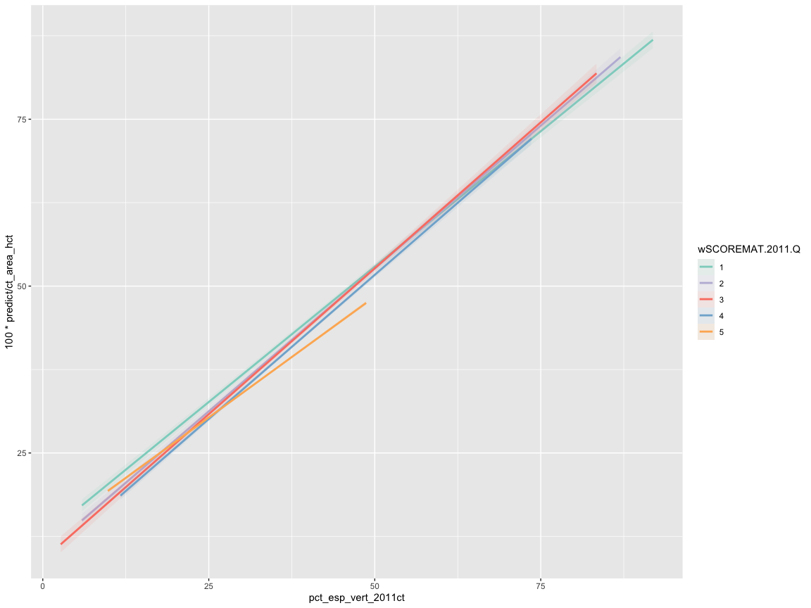<!-- -->

Coefficient interpretation (marginal + interaction) as relative risk.


```r
# Compute combined effects (marginal + interaction) for each quintile of SES:
i_e <- data.frame(wSCOREMAT.2011.Q=c(1,3,5))
i_e["UC2011.effect"] <- res.lmm[["fixef"]]['pct_esp_vert_2011ct'] + i_e["wSCOREMAT.2011.Q"] * res.lmm[["fixef"]]['wSCOREMAT.2011.Q:pct_esp_vert_2011ct']
i_e["UC2011.relative.risk"] <- exp(i_e["UC2011.effect"])
i_e
```

<div data-pagedtable="false">
  <script data-pagedtable-source type="application/json">
{"columns":[{"label":["wSCOREMAT.2011.Q"],"name":[1],"type":["dbl"],"align":["right"]},{"label":["UC2011.effect"],"name":[2],"type":["dbl"],"align":["right"]},{"label":["UC2011.relative.risk"],"name":[3],"type":["dbl"],"align":["right"]}],"data":[{"1":"1","2":"0.01727039","3":"1.017420"},{"1":"3","2":"0.01933485","3":"1.019523"},{"1":"5","2":"0.02139931","3":"1.021630"}],"options":{"columns":{"min":{},"max":[10]},"rows":{"min":[10],"max":[10]},"pages":{}}}
  </script>
</div>

```r
# Compute combined effects (marginal + interaction) for each quintile of SES:
i_e <- data.frame(pct_esp_vert_2011ct = quantile(clean_bei$df$pct_esp_vert_2011ct)[2:4])
i_e["SES.effect"] <- res.lmm[["fixef"]]['wSCOREMAT.2011.Q'] + i_e["pct_esp_vert_2011ct"] * res.lmm[["fixef"]]['wSCOREMAT.2011.Q:pct_esp_vert_2011ct']
i_e["SES.relative.risk"] <- exp(i_e["SES.effect"])
i_e
```

<div data-pagedtable="false">
  <script data-pagedtable-source type="application/json">
{"columns":[{"label":[""],"name":["_rn_"],"type":[""],"align":["left"]},{"label":["pct_esp_vert_2011ct"],"name":[1],"type":["dbl"],"align":["right"]},{"label":["SES.effect"],"name":[2],"type":["dbl"],"align":["right"]},{"label":["SES.relative.risk"],"name":[3],"type":["dbl"],"align":["right"]}],"data":[{"1":"24.6","2":"-0.023762394","3":"0.9765177","_rn_":"25%"},{"1":"35.5","2":"-0.012511079","3":"0.9875669","_rn_":"50%"},{"1":"46.5","2":"-0.001156542","3":"0.9988441","_rn_":"75%"}],"options":{"columns":{"min":{},"max":[10]},"rows":{"min":[10],"max":[10]},"pages":{}}}
  </script>
</div>

Transforming the model coefficients:


```r
smy.bt <- data.frame(smy$beta_table)
round(exp(res.lmm[["fixef"]]), 3) %>% 
  data.frame(fixef = ., p.value = round(smy.bt$p.value, 3)) %>%
  knitr::kable(caption="Model transformed coeffs")
```


Table: Model transformed coeffs

|                                     | fixef| p.value|
|:------------------------------------|-----:|-------:|
|(Intercept)                          | 0.224|       0|
|wSCOREMAT.2011.Q                     | 0.952|       0|
|pct_esp_vert_2011ct                  | 1.016|       0|
|wSCOREMAT.2011.Q:pct_esp_vert_2011ct | 1.001|       0|

```r
data.frame(wSCOREMAT.2011.Q = round(exp(ci.lmm$interval), 3),
           `wSCOREMAT.2011.Q:pct_esp_vert_2011ct` = round(exp(ci.lmm.i$interval), 3),
           row.names = c('lower', 'upper')) %>% t() %>%
  knitr::kable(caption="Count model confidence interval")
```


Table: Count model confidence interval

|                                     | lower| upper|
|:------------------------------------|-----:|-----:|
|wSCOREMAT.2011.Q                     | 0.927| 0.977|
|wSCOREMAT.2011.Q.pct_esp_vert_2011ct | 1.000| 1.002|

### Canopy (trees) change

Measuring high canopy (_i.e._ trees only) ratio within CT/buffer in 2011 (in %) at the Census tract level


```r
f <- area_esp_vert_high_2017ct ~ wSCOREMAT.2011.Q * pct_esp_vert_high_2011ct + offset(log(ct_area_hct))

clean_bei <- tidy_df(bei_df_aoi, CT16, f)

res.lmm <- fitme(area_esp_vert_high_2017ct ~ wSCOREMAT.2011.Q * pct_esp_vert_high_2011ct + offset(log(ct_area_hct)) + adjacency(1|ct_no),
                 data = clean_bei$df, adjMatrix = clean_bei$nbmatx,
                 family = poisson())
smy <- summary(res.lmm, details = c(p_value="Wald"))
```

```
## formula: area_esp_vert_high_2017ct ~ wSCOREMAT.2011.Q * pct_esp_vert_high_2011ct + 
##     offset(log(ct_area_hct)) + adjacency(1 | ct_no)
## Estimation of corrPars and lambda by ML (p_v approximation of logL).
## Estimation of fixed effects by ML (p_v approximation of logL).
## Estimation of lambda by 'outer' ML, maximizing logL.
## family: poisson( link = log ) 
##  ------------ Fixed effects (beta) ------------
##                                            Estimate  Cond. SE t-value   p-value
## (Intercept)                               -2.072388 0.0536182 -38.651 0.000e+00
## wSCOREMAT.2011.Q                          -0.122252 0.0167460  -7.300 2.870e-13
## pct_esp_vert_high_2011ct                   0.028081 0.0017552  15.999 0.000e+00
## wSCOREMAT.2011.Q:pct_esp_vert_high_2011ct  0.005601 0.0007134   7.851 4.108e-15
##  --------------- Random effects ---------------
## Family: gaussian( link = identity ) 
##                    --- Correlation parameters:
##    1.rho 
## 0.137914 
##            --- Variance parameters ('lambda'):
## lambda = var(u) for u ~ Gaussian; 
##    ct_no  :  0.01036  
## # of obs: 673; # of groups: ct_no, 673 
##  ------------- Likelihood values  -------------
##                         logLik
## logL       (p_v(h)): -1729.505
```

```r
ci.lmm <- confint(res.lmm, "wSCOREMAT.2011.Q")
```

```
## lower wSCOREMAT.2011.Q upper wSCOREMAT.2011.Q 
##            -0.15514775            -0.08944108
```

```r
ci.lmm.i <- confint(res.lmm, "wSCOREMAT.2011.Q:pct_esp_vert_high_2011ct")
```

```
## lower wSCOREMAT.2011.Q:pct_esp_vert_high_2011ct 
##                                     0.004203652 
## upper wSCOREMAT.2011.Q:pct_esp_vert_high_2011ct 
##                                     0.007013851
```

```r
# Testing main effect
res.lmm.0 <- update(res.lmm, . ~ . - wSCOREMAT.2011.Q)
LRT(res.lmm.0, res.lmm)
```

```
##      chi2_LR df      p_value
## p_v 51.89085  1 5.867529e-13
```

```r
# Plotting interaction
.t <- clean_bei$df
.t["predict"] <- as.vector(predict(res.lmm))

g_mat_tc <- ggplot(.t, aes(y=100*predict/ct_area_hct, x=pct_esp_vert_high_2011ct, colour=factor(wSCOREMAT.2011.Q), fill=factor(wSCOREMAT.2011.Q))) + 
  geom_smooth(method = "lm", alpha=.1) +
  scale_color_manual(values = qtl) +
  scale_fill_manual(values = qtl) +
  labs(colour='wSCOREMAT.2011.Q', fill='wSCOREMAT.2011.Q')
g_mat_tc
```

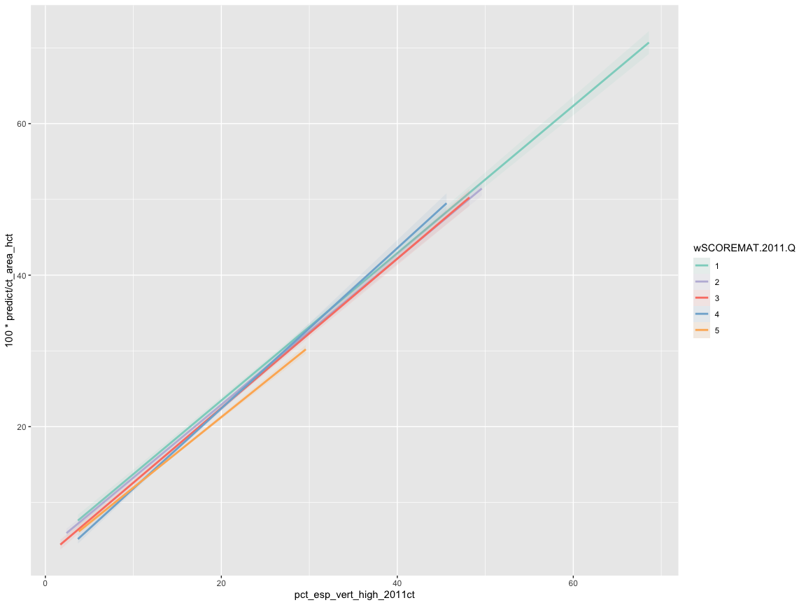<!-- -->

Coefficient interpretation (marginal + interaction) as relative risk.


```r
# Compute combined effects (marginal + interaction) for each quintile of SES:
i_e <- data.frame(wSCOREMAT.2011.Q=c(1,3,5))
i_e["UC2011.effect"] <- res.lmm[["fixef"]]['pct_esp_vert_high_2011ct'] + i_e["wSCOREMAT.2011.Q"] * res.lmm[["fixef"]]['wSCOREMAT.2011.Q:pct_esp_vert_high_2011ct']
i_e["UC2011.relative.risk"] <- exp(i_e["UC2011.effect"])
i_e
```

<div data-pagedtable="false">
  <script data-pagedtable-source type="application/json">
{"columns":[{"label":["wSCOREMAT.2011.Q"],"name":[1],"type":["dbl"],"align":["right"]},{"label":["UC2011.effect"],"name":[2],"type":["dbl"],"align":["right"]},{"label":["UC2011.relative.risk"],"name":[3],"type":["dbl"],"align":["right"]}],"data":[{"1":"1","2":"0.03368179","3":"1.034255"},{"1":"3","2":"0.04488426","3":"1.045907"},{"1":"5","2":"0.05608673","3":"1.057689"}],"options":{"columns":{"min":{},"max":[10]},"rows":{"min":[10],"max":[10]},"pages":{}}}
  </script>
</div>

```r
# Compute combined effects (marginal + interaction) for each quintile of SES:
i_e <- data.frame(pct_esp_vert_high_2011ct = quantile(clean_bei$df$pct_esp_vert_high_2011ct)[2:4])
i_e["SES.effect"] <- res.lmm[["fixef"]]['wSCOREMAT.2011.Q'] + i_e["pct_esp_vert_high_2011ct"] * res.lmm[["fixef"]]['wSCOREMAT.2011.Q:pct_esp_vert_high_2011ct']
i_e["SES.relative.risk"] <- exp(i_e["SES.effect"])
i_e
```

<div data-pagedtable="false">
  <script data-pagedtable-source type="application/json">
{"columns":[{"label":[""],"name":["_rn_"],"type":[""],"align":["left"]},{"label":["pct_esp_vert_high_2011ct"],"name":[1],"type":["dbl"],"align":["right"]},{"label":["SES.effect"],"name":[2],"type":["dbl"],"align":["right"]},{"label":["SES.relative.risk"],"name":[3],"type":["dbl"],"align":["right"]}],"data":[{"1":"11.8","2":"-0.056157692","3":"0.9453900","_rn_":"25%"},{"1":"16.4","2":"-0.030392014","3":"0.9700652","_rn_":"50%"},{"1":"22.5","2":"0.003775515","3":"1.0037827","_rn_":"75%"}],"options":{"columns":{"min":{},"max":[10]},"rows":{"min":[10],"max":[10]},"pages":{}}}
  </script>
</div>

Transforming the model coefficients:


```r
smy.bt <- data.frame(smy$beta_table)
round(exp(res.lmm[["fixef"]]), 3) %>% 
  data.frame(fixef = ., p.value = round(smy.bt$p.value, 3)) %>%
  knitr::kable(caption="Model transformed coeffs")
```


Table: Model transformed coeffs

|                                          | fixef| p.value|
|:-----------------------------------------|-----:|-------:|
|(Intercept)                               | 0.126|       0|
|wSCOREMAT.2011.Q                          | 0.885|       0|
|pct_esp_vert_high_2011ct                  | 1.028|       0|
|wSCOREMAT.2011.Q:pct_esp_vert_high_2011ct | 1.006|       0|

```r
data.frame(wSCOREMAT.2011.Q = round(exp(ci.lmm$interval), 3),
           `wSCOREMAT.2011.Q:pct_esp_vert_high_2011ct` = round(exp(ci.lmm.i$interval), 3),
           row.names = c('lower', 'upper')) %>% t() %>%
  knitr::kable(caption="Count model confidence interval")
```


Table: Count model confidence interval

|                                          | lower| upper|
|:-----------------------------------------|-----:|-----:|
|wSCOREMAT.2011.Q                          | 0.856| 0.914|
|wSCOREMAT.2011.Q.pct_esp_vert_high_2011ct | 1.004| 1.007|

## UI vs Visible minority {.tabset}

### Greenness change

Measuring canopy (_i.e._ greenness ~ grass & trees) ratio within CT/buffer in 2011 (in %) at the Census tract level


```r
f <- area_esp_vert_2017ct ~ vis_minority_2011.Q * pct_esp_vert_2011ct + offset(log(ct_area_hct))

clean_bei <- tidy_df(bei_df_aoi, CT16, f)

res.lmm <- fitme(area_esp_vert_2017ct ~ vis_minority_2011.Q * pct_esp_vert_2011ct + offset(log(ct_area_hct)) + adjacency(1|ct_no),
                 data = clean_bei$df, adjMatrix = clean_bei$nbmatx,
                 family = poisson())
smy <- summary(res.lmm, details = c(p_value="Wald"))
```

```
## formula: area_esp_vert_2017ct ~ vis_minority_2011.Q * pct_esp_vert_2011ct + 
##     offset(log(ct_area_hct)) + adjacency(1 | ct_no)
## Estimation of corrPars and lambda by ML (p_v approximation of logL).
## Estimation of fixed effects by ML (p_v approximation of logL).
## Estimation of lambda by 'outer' ML, maximizing logL.
## family: poisson( link = log ) 
##  ------------ Fixed effects (beta) ------------
##                                           Estimate  Cond. SE t-value   p-value
## (Intercept)                             -1.5111792 0.0436670 -34.607 0.0000000
## vis_minority_2011.Q                     -0.0445802 0.0131690  -3.385 0.0007112
## pct_esp_vert_2011ct                      0.0166256 0.0007384  22.516 0.0000000
## vis_minority_2011.Q:pct_esp_vert_2011ct  0.0008595 0.0002457   3.498 0.0004681
##  --------------- Random effects ---------------
## Family: gaussian( link = identity ) 
##                    --- Correlation parameters:
##     1.rho 
## 0.1344121 
##            --- Variance parameters ('lambda'):
## lambda = var(u) for u ~ Gaussian; 
##    ct_no  :  0.002115  
## # of obs: 673; # of groups: ct_no, 673 
##  ------------- Likelihood values  -------------
##                        logLik
## logL       (p_v(h)): -1892.88
```

```r
ci.lmm <- confint(res.lmm, "vis_minority_2011.Q")
```

```
## lower vis_minority_2011.Q upper vis_minority_2011.Q 
##               -0.07042887               -0.01869090
```

```r
ci.lmm.i <- confint(res.lmm, "vis_minority_2011.Q:pct_esp_vert_2011ct")
```

```
## lower vis_minority_2011.Q:pct_esp_vert_2011ct 
##                                  0.0003778652 
## upper vis_minority_2011.Q:pct_esp_vert_2011ct 
##                                  0.0013461091
```

```r
# Testing main effect
res.lmm.0 <- update(res.lmm, . ~ . - vis_minority_2011.Q)
LRT(res.lmm.0, res.lmm)
```

```
##      chi2_LR df     p_value
## p_v 11.32218  1 0.000765866
```

```r
# Plotting interaction
.t <- clean_bei$df
.t["predict"] <- as.vector(predict(res.lmm))

g_vis_gr <- ggplot(.t, aes(y=100*predict/ct_area_hct, x=pct_esp_vert_2011ct, colour=factor(vis_minority_2011.Q), fill=factor(vis_minority_2011.Q))) + 
  geom_smooth(method = "lm", alpha=.1) +
  scale_color_manual(values = qtl) +
  scale_fill_manual(values = qtl) +
  labs(colour='vis_minority_2011.Q', fill='vis_minority_2011.Q')
g_vis_gr
```

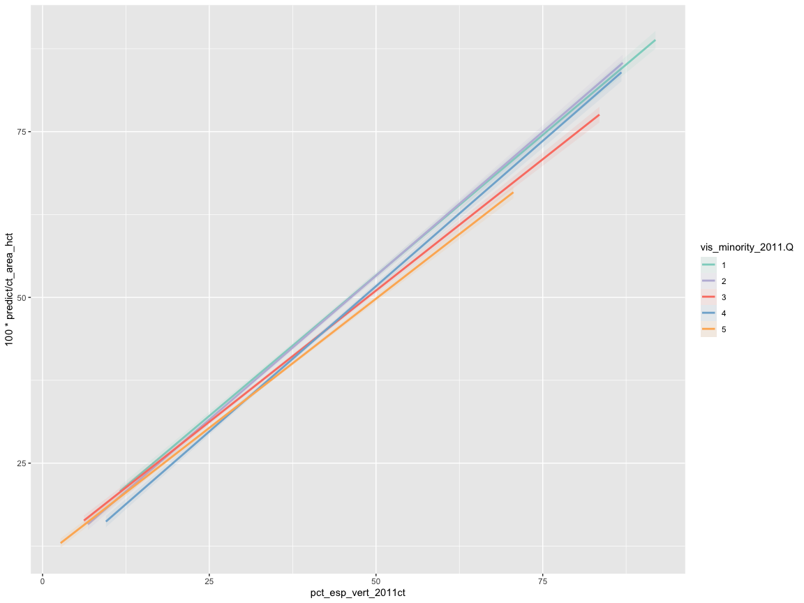<!-- -->

Coefficient interpretation (marginal + interaction) as relative risk.


```r
# Compute combined effects (marginal + interaction) for each quintile of SES:
i_e <- data.frame(vis_minority_2011.Q=c(1,3,5))
i_e["UC2011.effect"] <- res.lmm[["fixef"]]['pct_esp_vert_2011ct'] + i_e["vis_minority_2011.Q"] * res.lmm[["fixef"]]['vis_minority_2011.Q:pct_esp_vert_2011ct']
i_e["UC2011.relative.risk"] <- exp(i_e["UC2011.effect"])
i_e
```

<div data-pagedtable="false">
  <script data-pagedtable-source type="application/json">
{"columns":[{"label":["vis_minority_2011.Q"],"name":[1],"type":["dbl"],"align":["right"]},{"label":["UC2011.effect"],"name":[2],"type":["dbl"],"align":["right"]},{"label":["UC2011.relative.risk"],"name":[3],"type":["dbl"],"align":["right"]}],"data":[{"1":"1","2":"0.01748505","3":"1.017639"},{"1":"3","2":"0.01920398","3":"1.019390"},{"1":"5","2":"0.02092292","3":"1.021143"}],"options":{"columns":{"min":{},"max":[10]},"rows":{"min":[10],"max":[10]},"pages":{}}}
  </script>
</div>

```r
# Compute combined effects (marginal + interaction) for each quintile of SES:
i_e <- data.frame(pct_esp_vert_2011ct = quantile(clean_bei$df$pct_esp_vert_2011ct)[2:4])
i_e["SES.effect"] <- res.lmm[["fixef"]]['vis_minority_2011.Q'] + i_e["pct_esp_vert_2011ct"] * res.lmm[["fixef"]]['vis_minority_2011.Q:pct_esp_vert_2011ct']
i_e["SES.relative.risk"] <- exp(i_e["SES.effect"])
i_e
```

<div data-pagedtable="false">
  <script data-pagedtable-source type="application/json">
{"columns":[{"label":[""],"name":["_rn_"],"type":[""],"align":["left"]},{"label":["pct_esp_vert_2011ct"],"name":[1],"type":["dbl"],"align":["right"]},{"label":["SES.effect"],"name":[2],"type":["dbl"],"align":["right"]},{"label":["SES.relative.risk"],"name":[3],"type":["dbl"],"align":["right"]}],"data":[{"1":"24.6","2":"-0.023437323","3":"0.9768352","_rn_":"25%"},{"1":"35.4","2":"-0.014155070","3":"0.9859446","_rn_":"50%"},{"1":"46.5","2":"-0.004614976","3":"0.9953957","_rn_":"75%"}],"options":{"columns":{"min":{},"max":[10]},"rows":{"min":[10],"max":[10]},"pages":{}}}
  </script>
</div>

Transforming the model coefficients:


```r
smy.bt <- data.frame(smy$beta_table)
round(exp(res.lmm[["fixef"]]), 3) %>% 
  data.frame(fixef = ., p.value = round(smy.bt$p.value, 3)) %>%
  knitr::kable(caption="Model transformed coeffs")
```


Table: Model transformed coeffs

|                                        | fixef| p.value|
|:---------------------------------------|-----:|-------:|
|(Intercept)                             | 0.221|   0.000|
|vis_minority_2011.Q                     | 0.956|   0.001|
|pct_esp_vert_2011ct                     | 1.017|   0.000|
|vis_minority_2011.Q:pct_esp_vert_2011ct | 1.001|   0.000|

```r
data.frame(vis_minority_2011.Q = round(exp(ci.lmm$interval), 3),
           `vis_minority_2011.Q:pct_esp_vert_2011ct` = round(exp(ci.lmm.i$interval), 3),
           row.names = c('lower', 'upper')) %>% t() %>%
  knitr::kable(caption="Model confidence interval")
```


Table: Model confidence interval

|                                        | lower| upper|
|:---------------------------------------|-----:|-----:|
|vis_minority_2011.Q                     | 0.932| 0.981|
|vis_minority_2011.Q.pct_esp_vert_2011ct | 1.000| 1.001|

### Canopy (trees) change

Measuring high canopy (_i.e._ trees only) ratio within CT/buffer in 2011 (in %) at the Census tract level


```r
f <- area_esp_vert_high_2017ct ~ vis_minority_2011.Q * pct_esp_vert_high_2011ct + offset(log(ct_area_hct))

clean_bei <- tidy_df(bei_df_aoi, CT16, f)

res.lmm <- fitme(area_esp_vert_high_2017ct ~ vis_minority_2011.Q * pct_esp_vert_high_2011ct + offset(log(ct_area_hct)) + adjacency(1|ct_no),
                 data = clean_bei$df, adjMatrix = clean_bei$nbmatx,
                 family = poisson())
smy <- summary(res.lmm, details = c(p_value="Wald"))
```

```
## formula: area_esp_vert_high_2017ct ~ vis_minority_2011.Q * pct_esp_vert_high_2011ct + 
##     offset(log(ct_area_hct)) + adjacency(1 | ct_no)
## Estimation of corrPars and lambda by ML (p_v approximation of logL).
## Estimation of fixed effects by ML (p_v approximation of logL).
## Estimation of lambda by 'outer' ML, maximizing logL.
## family: poisson( link = log ) 
##  ------------ Fixed effects (beta) ------------
##                                               Estimate Cond. SE t-value
## (Intercept)                                  -2.166921 0.058041 -37.334
## vis_minority_2011.Q                          -0.076255 0.017516  -4.353
## pct_esp_vert_high_2011ct                      0.032033 0.001940  16.514
## vis_minority_2011.Q:pct_esp_vert_high_2011ct  0.003299 0.000672   4.909
##                                                p-value
## (Intercept)                                  0.000e+00
## vis_minority_2011.Q                          1.340e-05
## pct_esp_vert_high_2011ct                     0.000e+00
## vis_minority_2011.Q:pct_esp_vert_high_2011ct 9.151e-07
##  --------------- Random effects ---------------
## Family: gaussian( link = identity ) 
##                    --- Correlation parameters:
##     1.rho 
## 0.1379703 
##            --- Variance parameters ('lambda'):
## lambda = var(u) for u ~ Gaussian; 
##    ct_no  :  0.01181  
## # of obs: 673; # of groups: ct_no, 673 
##  ------------- Likelihood values  -------------
##                         logLik
## logL       (p_v(h)): -1746.127
```

```r
ci.lmm <- confint(res.lmm, "vis_minority_2011.Q")
```

```
## lower vis_minority_2011.Q upper vis_minority_2011.Q 
##               -0.11068404               -0.04187537
```

```r
ci.lmm.i <- confint(res.lmm, "vis_minority_2011.Q:pct_esp_vert_high_2011ct")
```

```
## lower vis_minority_2011.Q:pct_esp_vert_high_2011ct 
##                                        0.001981273 
## upper vis_minority_2011.Q:pct_esp_vert_high_2011ct 
##                                        0.004626773
```

```r
# Testing main effect
res.lmm.0 <- update(res.lmm, . ~ . - vis_minority_2011.Q)
LRT(res.lmm.0, res.lmm)
```

```
##      chi2_LR df      p_value
## p_v 18.71619  1 1.516891e-05
```

```r
# Plotting interaction
.t <- clean_bei$df
.t["predict"] <- as.vector(predict(res.lmm))

g_vis_tc <- ggplot(.t, aes(y=100*predict/ct_area_hct, x=pct_esp_vert_high_2011ct, colour=factor(vis_minority_2011.Q), fill=factor(vis_minority_2011.Q))) + 
  geom_smooth(method = "lm", alpha=.1) +
  scale_color_manual(values = qtl) +
  scale_fill_manual(values = qtl) +
  labs(colour='vis_minority_2011.Q', fill='vis_minority_2011.Q')
g_vis_tc
```

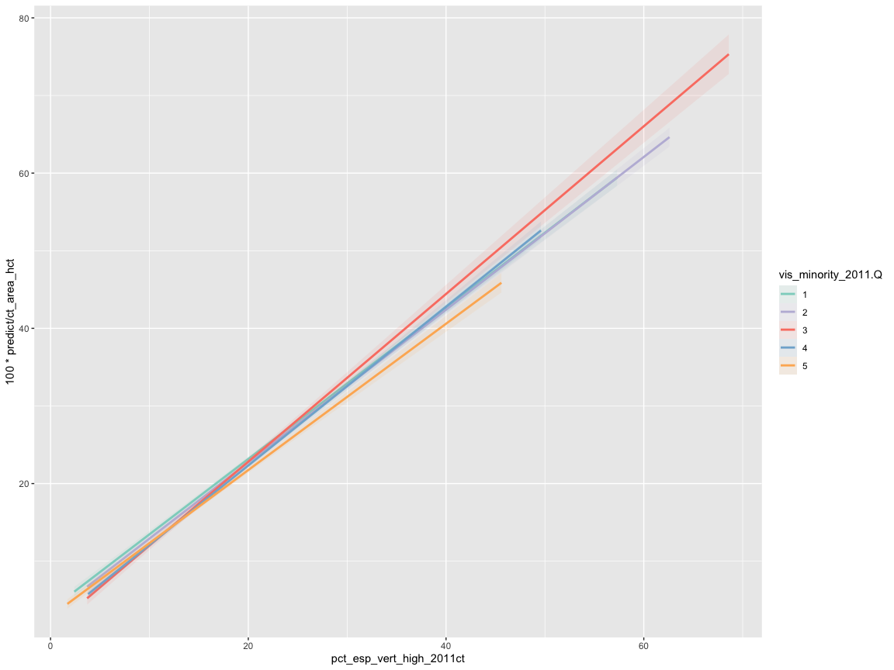<!-- -->

Coefficient interpretation (marginal + interaction) as relative risk.


```r
# Compute combined effects (marginal + interaction) for each quintile of SES:
i_e <- data.frame(vis_minority_2011.Q=c(1,3,5))
i_e["UC2011.effect"] <- res.lmm[["fixef"]]['pct_esp_vert_high_2011ct'] + i_e["vis_minority_2011.Q"] * res.lmm[["fixef"]]['vis_minority_2011.Q:pct_esp_vert_high_2011ct']
i_e["UC2011.relative.risk"] <- exp(i_e["UC2011.effect"])
i_e
```

<div data-pagedtable="false">
  <script data-pagedtable-source type="application/json">
{"columns":[{"label":["vis_minority_2011.Q"],"name":[1],"type":["dbl"],"align":["right"]},{"label":["UC2011.effect"],"name":[2],"type":["dbl"],"align":["right"]},{"label":["UC2011.relative.risk"],"name":[3],"type":["dbl"],"align":["right"]}],"data":[{"1":"1","2":"0.03533207","3":"1.035964"},{"1":"3","2":"0.04192939","3":"1.042821"},{"1":"5","2":"0.04852670","3":"1.049723"}],"options":{"columns":{"min":{},"max":[10]},"rows":{"min":[10],"max":[10]},"pages":{}}}
  </script>
</div>

```r
# Compute combined effects (marginal + interaction) for each quintile of SES:
i_e <- data.frame(pct_esp_vert_high_2011ct = quantile(clean_bei$df$pct_esp_vert_high_2011ct)[2:4])
i_e["SES.effect"] <- res.lmm[["fixef"]]['vis_minority_2011.Q'] + i_e["pct_esp_vert_high_2011ct"] * res.lmm[["fixef"]]['vis_minority_2011.Q:pct_esp_vert_high_2011ct']
i_e["SES.relative.risk"] <- exp(i_e["SES.effect"])
i_e
```

<div data-pagedtable="false">
  <script data-pagedtable-source type="application/json">
{"columns":[{"label":[""],"name":["_rn_"],"type":[""],"align":["left"]},{"label":["pct_esp_vert_high_2011ct"],"name":[1],"type":["dbl"],"align":["right"]},{"label":["SES.effect"],"name":[2],"type":["dbl"],"align":["right"]},{"label":["SES.relative.risk"],"name":[3],"type":["dbl"],"align":["right"]}],"data":[{"1":"11.8","2":"-0.037330951","3":"0.9633573","_rn_":"25%"},{"1":"16.3","2":"-0.022486983","3":"0.9777640","_rn_":"50%"},{"1":"22.5","2":"-0.002035294","3":"0.9979668","_rn_":"75%"}],"options":{"columns":{"min":{},"max":[10]},"rows":{"min":[10],"max":[10]},"pages":{}}}
  </script>
</div>

Transforming the model coefficients:


```r
smy.bt <- data.frame(smy$beta_table)
round(exp(res.lmm[["fixef"]]), 3) %>% 
  data.frame(fixef = ., p.value = round(smy.bt$p.value, 3)) %>%
  knitr::kable(caption="Model transformed coeffs")
```


Table: Model transformed coeffs

|                                             | fixef| p.value|
|:--------------------------------------------|-----:|-------:|
|(Intercept)                                  | 0.115|       0|
|vis_minority_2011.Q                          | 0.927|       0|
|pct_esp_vert_high_2011ct                     | 1.033|       0|
|vis_minority_2011.Q:pct_esp_vert_high_2011ct | 1.003|       0|

```r
data.frame(vis_minority_2011.Q = round(exp(ci.lmm$interval), 3),
           `vis_minority_2011.Q:pct_esp_vert_high_2011ct` = round(exp(ci.lmm.i$interval), 3),
           row.names = c('lower', 'upper')) %>% t() %>%
  knitr::kable(caption="Model confidence interval")
```


Table: Model confidence interval

|                                             | lower| upper|
|:--------------------------------------------|-----:|-----:|
|vis_minority_2011.Q                          | 0.895| 0.959|
|vis_minority_2011.Q.pct_esp_vert_high_2011ct | 1.002| 1.005|

## UI vs gentrified CT {.tabset}

Gentrified CT between 2011 and 2016

### Greenness change

Measuring canopy (_i.e._ greenness ~ grass & trees) ratio within CT/buffer in 2011 (in %) at the Census tract level


```r
f <- area_esp_vert_2017ct ~ gentrif_status_2016 * pct_esp_vert_2011ct + offset(log(ct_area_hct))

clean_bei <- tidy_df(bei_df_aoi, CT16, f)

res.lmm <- fitme(area_esp_vert_2017ct ~ gentrif_status_2016 * pct_esp_vert_2011ct + offset(log(ct_area_hct)) + adjacency(1|ct_no),
                 data = clean_bei$df, adjMatrix = clean_bei$nbmatx,
                 family = poisson())
smy <- summary(res.lmm, details = c(p_value="Wald"))
```

```
## formula: area_esp_vert_2017ct ~ gentrif_status_2016 * pct_esp_vert_2011ct + 
##     offset(log(ct_area_hct)) + adjacency(1 | ct_no)
## Estimation of corrPars and lambda by ML (p_v approximation of logL).
## Estimation of fixed effects by ML (p_v approximation of logL).
## Estimation of lambda by 'outer' ML, maximizing logL.
## family: poisson( link = log ) 
##  ------------ Fixed effects (beta) ------------
##                                                       Estimate Cond. SE
## (Intercept)                                         -1.8685995 0.044404
## gentrif_status_2016Gentrified                        0.0254690 0.071685
## gentrif_status_2016Non eligible                      0.3345833 0.051061
## pct_esp_vert_2011ct                                  0.0250277 0.001115
## gentrif_status_2016Gentrified:pct_esp_vert_2011ct   -0.0002392 0.001907
## gentrif_status_2016Non eligible:pct_esp_vert_2011ct -0.0078103 0.001187
##                                                      t-value   p-value
## (Intercept)                                         -42.0815 0.000e+00
## gentrif_status_2016Gentrified                         0.3553 7.224e-01
## gentrif_status_2016Non eligible                       6.5526 5.653e-11
## pct_esp_vert_2011ct                                  22.4459 0.000e+00
## gentrif_status_2016Gentrified:pct_esp_vert_2011ct    -0.1254 9.002e-01
## gentrif_status_2016Non eligible:pct_esp_vert_2011ct  -6.5780 4.769e-11
##  --------------- Random effects ---------------
## Family: gaussian( link = identity ) 
##                    --- Correlation parameters:
##     1.rho 
## 0.1354874 
##            --- Variance parameters ('lambda'):
## lambda = var(u) for u ~ Gaussian; 
##    ct_no  :  0.001737  
## # of obs: 673; # of groups: ct_no, 673 
##  ------------- Likelihood values  -------------
##                         logLik
## logL       (p_v(h)): -1870.149
```

```r
varfixef <- names(res.lmm[['fixef']])
ci.1.lmm <- confint(res.lmm, varfixef[2])
```

```
## lower gentrif_status_2016Gentrified upper gentrif_status_2016Gentrified 
##                          -0.1151682                           0.1659180
```

```r
ci.2.lmm <- confint(res.lmm, varfixef[3])
```

```
## lower gentrif_status_2016Non eligible upper gentrif_status_2016Non eligible 
##                             0.2344347                             0.4349738
```

```r
ci.3.lmm <- confint(res.lmm, varfixef[5]) # Interaction
```

```
## lower gentrif_status_2016Gentrified:pct_esp_vert_2011ct 
##                                            -0.003981102 
## upper gentrif_status_2016Gentrified:pct_esp_vert_2011ct 
##                                             0.003496054
```

```r
ci.4.lmm <- confint(res.lmm, varfixef[6]) # Interaction
```

```
## lower gentrif_status_2016Non eligible:pct_esp_vert_2011ct 
##                                              -0.010141120 
## upper gentrif_status_2016Non eligible:pct_esp_vert_2011ct 
##                                              -0.005482627
```

```r
# Testing main effect
res.lmm.0 <- update(res.lmm, . ~ . - gentrif_status_2016)
LRT(res.lmm.0, res.lmm)
```

```
##      chi2_LR df     p_value
## p_v 52.99543  2 3.10596e-12
```

```r
# Plotting interaction
.t <- clean_bei$df
.t["predict"] <- as.vector(predict(res.lmm))

g_gen_gr <- ggplot(.t, aes(y=100*predict/ct_area_hct, x=pct_esp_vert_2011ct, colour=factor(gentrif_status_2016), fill=factor(gentrif_status_2016))) + 
  geom_smooth(method = "lm", alpha=.1) +
  labs(colour='gentrif_status_2016', fill='gentrif_status_2016')
g_gen_gr
```

<!-- -->

Transforming the model coefficients:


```r
smy.bt <- data.frame(smy$beta_table)
round(exp(res.lmm[["fixef"]]), 3) %>% 
  data.frame(fixef = ., p.value = round(smy.bt$p.value, 3)) %>%
  knitr::kable(caption="Model transformed coeffs")
```


Table: Model transformed coeffs

|                                                    | fixef| p.value|
|:---------------------------------------------------|-----:|-------:|
|(Intercept)                                         | 0.154|   0.000|
|gentrif_status_2016Gentrified                       | 1.026|   0.722|
|gentrif_status_2016Non eligible                     | 1.397|   0.000|
|pct_esp_vert_2011ct                                 | 1.025|   0.000|
|gentrif_status_2016Gentrified:pct_esp_vert_2011ct   | 1.000|   0.900|
|gentrif_status_2016Non eligible:pct_esp_vert_2011ct | 0.992|   0.000|

```r
.ci.exp <- rbind(ci.1.lmm$interval, ci.2.lmm$interval, ci.3.lmm$interval, ci.4.lmm$interval) %>% 
  exp() %>% round(., 3) %>%
  data.frame(., row.names = c(varfixef[2:3], varfixef[5:6]))
names(.ci.exp) <- c("lower", "upper")
knitr::kable(.ci.exp, caption="Model confidence interval")
```


Table: Model confidence interval

|                                                    | lower| upper|
|:---------------------------------------------------|-----:|-----:|
|gentrif_status_2016Gentrified                       | 0.891| 1.180|
|gentrif_status_2016Non eligible                     | 1.264| 1.545|
|gentrif_status_2016Gentrified:pct_esp_vert_2011ct   | 0.996| 1.004|
|gentrif_status_2016Non eligible:pct_esp_vert_2011ct | 0.990| 0.995|

### Canopy (trees) change

Measuring high canopy (_i.e._ trees only) ratio within CT/buffer in 2011 (in %) at the Census tract level


```r
f <- area_esp_vert_high_2017ct ~ gentrif_status_2016 * pct_esp_vert_high_2011ct + offset(log(ct_area_hct))

clean_bei <- tidy_df(bei_df_aoi, CT16, f)

res.lmm <- fitme(area_esp_vert_high_2017ct ~ gentrif_status_2016 * pct_esp_vert_high_2011ct + offset(log(ct_area_hct)) + adjacency(1|ct_no),
                 data = clean_bei$df, adjMatrix = clean_bei$nbmatx,
                 family = poisson())
smy <- summary(res.lmm, details = c(p_value="Wald"))
```

```
## formula: area_esp_vert_high_2017ct ~ gentrif_status_2016 * pct_esp_vert_high_2011ct + 
##     offset(log(ct_area_hct)) + adjacency(1 | ct_no)
## Estimation of corrPars and lambda by ML (p_v approximation of logL).
## Estimation of fixed effects by ML (p_v approximation of logL).
## Estimation of lambda by 'outer' ML, maximizing logL.
## family: poisson( link = log ) 
##  ------------ Fixed effects (beta) ------------
##                                                           Estimate Cond. SE
## (Intercept)                                              -2.676737 0.055544
## gentrif_status_2016Gentrified                             0.098183 0.083628
## gentrif_status_2016Non eligible                           0.359658 0.060765
## pct_esp_vert_high_2011ct                                  0.057789 0.002788
## gentrif_status_2016Gentrified:pct_esp_vert_high_2011ct   -0.004519 0.004292
## gentrif_status_2016Non eligible:pct_esp_vert_high_2011ct -0.020183 0.002914
##                                                          t-value   p-value
## (Intercept)                                              -48.192 0.000e+00
## gentrif_status_2016Gentrified                              1.174 2.404e-01
## gentrif_status_2016Non eligible                            5.919 3.242e-09
## pct_esp_vert_high_2011ct                                  20.727 0.000e+00
## gentrif_status_2016Gentrified:pct_esp_vert_high_2011ct    -1.053 2.923e-01
## gentrif_status_2016Non eligible:pct_esp_vert_high_2011ct  -6.925 4.357e-12
##  --------------- Random effects ---------------
## Family: gaussian( link = identity ) 
##                    --- Correlation parameters:
##     1.rho 
## 0.1381568 
##            --- Variance parameters ('lambda'):
## lambda = var(u) for u ~ Gaussian; 
##    ct_no  :  0.009658  
## # of obs: 673; # of groups: ct_no, 673 
##  ------------- Likelihood values  -------------
##                         logLik
## logL       (p_v(h)): -1728.153
```

```r
varfixef <- names(res.lmm[['fixef']])
ci.1.lmm <- confint(res.lmm, varfixef[2])
```

```
## lower gentrif_status_2016Gentrified upper gentrif_status_2016Gentrified 
##                         -0.06627735                          0.26181849
```

```r
ci.2.lmm <- confint(res.lmm, varfixef[3])
```

```
## lower gentrif_status_2016Non eligible upper gentrif_status_2016Non eligible 
##                             0.2399986                             0.4790137
```

```r
ci.3.lmm <- confint(res.lmm, varfixef[5]) # Interaction
```

```
## lower gentrif_status_2016Gentrified:pct_esp_vert_high_2011ct 
##                                                 -0.012930470 
## upper gentrif_status_2016Gentrified:pct_esp_vert_high_2011ct 
##                                                  0.003900121
```

```r
ci.4.lmm <- confint(res.lmm, varfixef[6]) # Interaction
```

```
## lower gentrif_status_2016Non eligible:pct_esp_vert_high_2011ct 
##                                                    -0.02589034 
## upper gentrif_status_2016Non eligible:pct_esp_vert_high_2011ct 
##                                                    -0.01443352
```

```r
# Testing main effect
res.lmm.0 <- update(res.lmm, . ~ . - gentrif_status_2016)
LRT(res.lmm.0, res.lmm)
```

```
##      chi2_LR df      p_value
## p_v 38.79234  2 3.770078e-09
```

```r
# Plotting interaction
.t <- clean_bei$df
.t["predict"] <- as.vector(predict(res.lmm))

g_gen_tc <- ggplot(.t, aes(y=100*predict/ct_area_hct, x=pct_esp_vert_high_2011ct, colour=factor(gentrif_status_2016), fill=factor(gentrif_status_2016))) + 
  geom_smooth(method = "lm", alpha=.1) +
  labs(colour='gentrif_status_2016', fill='gentrif_status_2016')
g_gen_tc
```

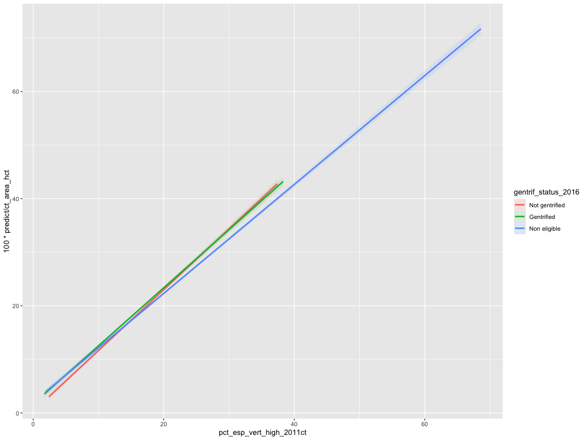<!-- -->

Transforming the model coefficients:


```r
smy.bt <- data.frame(smy$beta_table)
round(exp(res.lmm[["fixef"]]), 3) %>% 
  data.frame(fixef = ., p.value = round(smy.bt$p.value, 3)) %>%
  knitr::kable(caption="Model transformed coeffs")
```


Table: Model transformed coeffs

|                                                         | fixef| p.value|
|:--------------------------------------------------------|-----:|-------:|
|(Intercept)                                              | 0.069|   0.000|
|gentrif_status_2016Gentrified                            | 1.103|   0.240|
|gentrif_status_2016Non eligible                          | 1.433|   0.000|
|pct_esp_vert_high_2011ct                                 | 1.059|   0.000|
|gentrif_status_2016Gentrified:pct_esp_vert_high_2011ct   | 0.995|   0.292|
|gentrif_status_2016Non eligible:pct_esp_vert_high_2011ct | 0.980|   0.000|

```r
.ci.exp <- rbind(ci.1.lmm$interval, ci.2.lmm$interval, ci.3.lmm$interval, ci.4.lmm$interval) %>% 
  exp() %>% round(., 3) %>%
  data.frame(., row.names = c(varfixef[2:3], varfixef[5:6]))
names(.ci.exp) <- c("lower", "upper")
knitr::kable(.ci.exp, caption="Model confidence interval")
```


Table: Model confidence interval

|                                                         | lower| upper|
|:--------------------------------------------------------|-----:|-----:|
|gentrif_status_2016Gentrified                            | 0.936| 1.299|
|gentrif_status_2016Non eligible                          | 1.271| 1.614|
|gentrif_status_2016Gentrified:pct_esp_vert_high_2011ct   | 0.987| 1.004|
|gentrif_status_2016Non eligible:pct_esp_vert_high_2011ct | 0.974| 0.986|

# Association between SES and UI | SES as categories

## UI vs Pampalon | material {.tabset}

### Greenness change 

Measuring canopy (_i.e._ greenness ~ grass & trees) ratio within CT/buffer in 2011 (in %) at the Census tract level


```r
f <- area_esp_vert_2017ct ~ wSCOREMAT.2011.Q * pct_esp_vert_2011ct + offset(log(ct_area_hct))

clean_bei <- tidy_df(bei_df_aoi, CT16, f)

res.lmm <- fitme(area_esp_vert_2017ct ~ factor(wSCOREMAT.2011.Q)* pct_esp_vert_2011ct + offset(log(ct_area_hct)) + adjacency(1|ct_no),
                 data = clean_bei$df, adjMatrix = clean_bei$nbmatx,
                 family = poisson())
smy <- summary(res.lmm, details = c(p_value="Wald"))
```

```
## formula: area_esp_vert_2017ct ~ factor(wSCOREMAT.2011.Q) * pct_esp_vert_2011ct + 
##     offset(log(ct_area_hct)) + adjacency(1 | ct_no)
## Estimation of corrPars and lambda by ML (p_v approximation of logL).
## Estimation of fixed effects by ML (p_v approximation of logL).
## Estimation of lambda by 'outer' ML, maximizing logL.
## family: poisson( link = log ) 
##  ------------ Fixed effects (beta) ------------
##                                                 Estimate  Cond. SE  t-value
## (Intercept)                                   -1.5735882 0.0426297 -36.9130
## factor(wSCOREMAT.2011.Q)2                     -0.0322855 0.0560597  -0.5759
## factor(wSCOREMAT.2011.Q)3                     -0.0088857 0.0576215  -0.1542
## factor(wSCOREMAT.2011.Q)4                     -0.0836336 0.0635746  -1.3155
## factor(wSCOREMAT.2011.Q)5                     -0.4068994 0.0790521  -5.1472
## pct_esp_vert_2011ct                            0.0177927 0.0006874  25.8849
## factor(wSCOREMAT.2011.Q)2:pct_esp_vert_2011ct  0.0006060 0.0009295   0.6520
## factor(wSCOREMAT.2011.Q)3:pct_esp_vert_2011ct  0.0002387 0.0009717   0.2457
## factor(wSCOREMAT.2011.Q)4:pct_esp_vert_2011ct  0.0019576 0.0012456   1.5716
## factor(wSCOREMAT.2011.Q)5:pct_esp_vert_2011ct  0.0111026 0.0021491   5.1662
##                                                 p-value
## (Intercept)                                   0.000e+00
## factor(wSCOREMAT.2011.Q)2                     5.647e-01
## factor(wSCOREMAT.2011.Q)3                     8.774e-01
## factor(wSCOREMAT.2011.Q)4                     1.883e-01
## factor(wSCOREMAT.2011.Q)5                     2.644e-07
## pct_esp_vert_2011ct                           0.000e+00
## factor(wSCOREMAT.2011.Q)2:pct_esp_vert_2011ct 5.144e-01
## factor(wSCOREMAT.2011.Q)3:pct_esp_vert_2011ct 8.059e-01
## factor(wSCOREMAT.2011.Q)4:pct_esp_vert_2011ct 1.160e-01
## factor(wSCOREMAT.2011.Q)5:pct_esp_vert_2011ct 2.389e-07
##  --------------- Random effects ---------------
## Family: gaussian( link = identity ) 
##                    --- Correlation parameters:
##     1.rho 
## 0.1357452 
##            --- Variance parameters ('lambda'):
## lambda = var(u) for u ~ Gaussian; 
##    ct_no  :  0.001909  
## # of obs: 673; # of groups: ct_no, 673 
##  ------------- Likelihood values  -------------
##                         logLik
## logL       (p_v(h)): -1882.725
```

```r
ci.lmm.2 <- confint(res.lmm, 'factor(wSCOREMAT.2011.Q)2')
```

```
## lower factor(wSCOREMAT.2011.Q)2 upper factor(wSCOREMAT.2011.Q)2 
##                     -0.14232696                      0.07780193
```

```r
ci.lmm.3 <- confint(res.lmm, 'factor(wSCOREMAT.2011.Q)3')
```

```
## lower factor(wSCOREMAT.2011.Q)3 upper factor(wSCOREMAT.2011.Q)3 
##                      -0.1221221                       0.1043164
```

```r
ci.lmm.4 <- confint(res.lmm, 'factor(wSCOREMAT.2011.Q)4')
```

```
## lower factor(wSCOREMAT.2011.Q)4 upper factor(wSCOREMAT.2011.Q)4 
##                     -0.20886312                      0.04177754
```

```r
ci.lmm.5 <- confint(res.lmm, 'factor(wSCOREMAT.2011.Q)5')
```

```
## lower factor(wSCOREMAT.2011.Q)5 upper factor(wSCOREMAT.2011.Q)5 
##                      -0.5626444                      -0.2516544
```

```r
ci.lmm.2.i <- confint(res.lmm, 'factor(wSCOREMAT.2011.Q)2:pct_esp_vert_2011ct')
```

```
## lower factor(wSCOREMAT.2011.Q)2:pct_esp_vert_2011ct 
##                                        -0.001222176 
## upper factor(wSCOREMAT.2011.Q)2:pct_esp_vert_2011ct 
##                                         0.002430290
```

```r
ci.lmm.3.i <- confint(res.lmm, 'factor(wSCOREMAT.2011.Q)3:pct_esp_vert_2011ct')
```

```
## lower factor(wSCOREMAT.2011.Q)3:pct_esp_vert_2011ct 
##                                        -0.001672635 
## upper factor(wSCOREMAT.2011.Q)3:pct_esp_vert_2011ct 
##                                         0.002145888
```

```r
ci.lmm.4.i <- confint(res.lmm, 'factor(wSCOREMAT.2011.Q)4:pct_esp_vert_2011ct')
```

```
## lower factor(wSCOREMAT.2011.Q)4:pct_esp_vert_2011ct 
##                                        -0.000493686 
## upper factor(wSCOREMAT.2011.Q)4:pct_esp_vert_2011ct 
##                                         0.004403640
```

```r
ci.lmm.5.i <- confint(res.lmm, 'factor(wSCOREMAT.2011.Q)5:pct_esp_vert_2011ct')
```

```
## lower factor(wSCOREMAT.2011.Q)5:pct_esp_vert_2011ct 
##                                         0.006886857 
## upper factor(wSCOREMAT.2011.Q)5:pct_esp_vert_2011ct 
##                                         0.015320786
```

```r
# Testing main effect
res.lmm.0 <- update(res.lmm, . ~ . - factor(wSCOREMAT.2011.Q))
LRT(res.lmm.0, res.lmm)
```

```
##     chi2_LR df      p_value
## p_v 31.4152  4 2.518781e-06
```

```r
# Plotting interaction
.t <- clean_bei$df
.t["predict"] <- as.vector(predict(res.lmm))
.t <- filter(.t, wSCOREMAT.2011.Q %in% c(1, 4, 5)) # Keeping only significant interaction terms

g_mat_gr.categ <- ggplot(.t, aes(y=100*predict/ct_area_hct, x=pct_esp_vert_2011ct, colour=factor(wSCOREMAT.2011.Q), fill=factor(wSCOREMAT.2011.Q))) + 
  geom_smooth(method = "lm", alpha=.1) +
  scale_color_manual(values = qtl[c(1, 4, 5)]) +
  scale_fill_manual(values = qtl[c(1, 4, 5)]) +
  labs(colour='wSCOREMAT.2011.Q', fill='wSCOREMAT.2011.Q')
g_mat_gr.categ
```

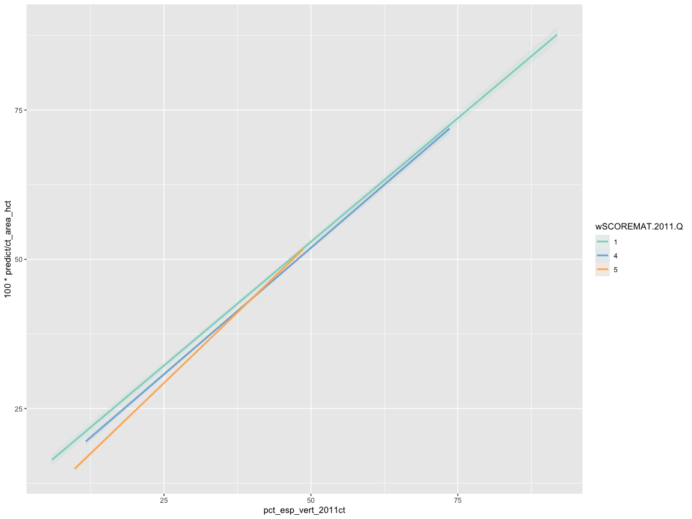<!-- -->

Transforming the model coefficients:


```r
smy.bt <- data.frame(smy$beta_table)
round(exp(res.lmm[["fixef"]]), 3) %>% 
  data.frame(fixef = ., p.value = round(smy.bt$p.value, 3)) %>%
  knitr::kable(caption="Model transformed coeffs")
```


Table: Model transformed coeffs

|                                              | fixef| p.value|
|:---------------------------------------------|-----:|-------:|
|(Intercept)                                   | 0.207|   0.000|
|factor(wSCOREMAT.2011.Q)2                     | 0.968|   0.565|
|factor(wSCOREMAT.2011.Q)3                     | 0.991|   0.877|
|factor(wSCOREMAT.2011.Q)4                     | 0.920|   0.188|
|factor(wSCOREMAT.2011.Q)5                     | 0.666|   0.000|
|pct_esp_vert_2011ct                           | 1.018|   0.000|
|factor(wSCOREMAT.2011.Q)2:pct_esp_vert_2011ct | 1.001|   0.514|
|factor(wSCOREMAT.2011.Q)3:pct_esp_vert_2011ct | 1.000|   0.806|
|factor(wSCOREMAT.2011.Q)4:pct_esp_vert_2011ct | 1.002|   0.116|
|factor(wSCOREMAT.2011.Q)5:pct_esp_vert_2011ct | 1.011|   0.000|

```r
# LRT of main effect
res.lmm.0 <- update(res.lmm, . ~ . - factor(wSCOREMAT.2011.Q))
```

```
## Warning in .sym_checked(adjMatrix, "adjMatrix"): Forcing colnames(mMatrix) <-
## rownames(mMatrix) before calling isSymmetric().
```

```r
LRT(res.lmm.0, res.lmm)
```

```
##     chi2_LR df      p_value
## p_v 31.4152  4 2.518781e-06
```

```r
# CI
data.frame(wSCOREMAT.2011.Q.2 = round(exp(ci.lmm.2$interval), 3),
           wSCOREMAT.2011.Q.3 = round(exp(ci.lmm.3$interval), 3),
           wSCOREMAT.2011.Q.4 = round(exp(ci.lmm.4$interval), 3),
           wSCOREMAT.2011.Q.5 = round(exp(ci.lmm.5$interval), 3),
           `wSCOREMAT.2011.Q.2:pct_esp_vert_2011ct` = round(exp(ci.lmm.2.i$interval), 3),
           `wSCOREMAT.2011.Q.3:pct_esp_vert_2011ct` = round(exp(ci.lmm.3.i$interval), 3),
           `wSCOREMAT.2011.Q.4:pct_esp_vert_2011ct` = round(exp(ci.lmm.4.i$interval), 3),
           `wSCOREMAT.2011.Q.5:pct_esp_vert_2011ct` = round(exp(ci.lmm.5.i$interval), 3),
           row.names = c('lower', 'upper')) %>% t() %>%
  knitr::kable(caption="Model confidence interval")
```


Table: Model confidence interval

|                                       | lower| upper|
|:--------------------------------------|-----:|-----:|
|wSCOREMAT.2011.Q.2                     | 0.867| 1.081|
|wSCOREMAT.2011.Q.3                     | 0.885| 1.110|
|wSCOREMAT.2011.Q.4                     | 0.812| 1.043|
|wSCOREMAT.2011.Q.5                     | 0.570| 0.778|
|wSCOREMAT.2011.Q.2.pct_esp_vert_2011ct | 0.999| 1.002|
|wSCOREMAT.2011.Q.3.pct_esp_vert_2011ct | 0.998| 1.002|
|wSCOREMAT.2011.Q.4.pct_esp_vert_2011ct | 1.000| 1.004|
|wSCOREMAT.2011.Q.5.pct_esp_vert_2011ct | 1.007| 1.015|

### Canopy (trees) change

Measuring high canopy (_i.e._ trees only) ratio within CT/buffer in 2011 (in %) at the Census tract level


```r
f <- area_esp_vert_high_2017ct ~ wSCOREMAT.2011.Q * pct_esp_vert_high_2011ct + offset(log(ct_area_hct))

clean_bei <- tidy_df(bei_df_aoi, CT16, f)

res.lmm <- fitme(area_esp_vert_high_2017ct ~ factor(wSCOREMAT.2011.Q) * pct_esp_vert_high_2011ct + offset(log(ct_area_hct)) + adjacency(1|ct_no),
                 data = clean_bei$df, adjMatrix = clean_bei$nbmatx,
                 family = poisson())
smy <- summary(res.lmm, details = c(p_value="Wald"))
```

```
## formula: area_esp_vert_high_2017ct ~ factor(wSCOREMAT.2011.Q) * pct_esp_vert_high_2011ct + 
##     offset(log(ct_area_hct)) + adjacency(1 | ct_no)
## Estimation of corrPars and lambda by ML (p_v approximation of logL).
## Estimation of fixed effects by ML (p_v approximation of logL).
## Estimation of lambda by 'outer' ML, maximizing logL.
## family: poisson( link = log ) 
##  ------------ Fixed effects (beta) ------------
##                                                     Estimate Cond. SE t-value
## (Intercept)                                        -2.178719 0.048382 -45.031
## factor(wSCOREMAT.2011.Q)2                          -0.175408 0.065599  -2.674
## factor(wSCOREMAT.2011.Q)3                          -0.208579 0.068404  -3.049
## factor(wSCOREMAT.2011.Q)4                          -0.346803 0.073627  -4.710
## factor(wSCOREMAT.2011.Q)5                          -0.770440 0.091522  -8.418
## pct_esp_vert_high_2011ct                            0.033510 0.001367  24.509
## factor(wSCOREMAT.2011.Q)2:pct_esp_vert_high_2011ct  0.007049 0.002179   3.236
## factor(wSCOREMAT.2011.Q)3:pct_esp_vert_high_2011ct  0.007039 0.002433   2.893
## factor(wSCOREMAT.2011.Q)4:pct_esp_vert_high_2011ct  0.015786 0.003052   5.172
## factor(wSCOREMAT.2011.Q)5:pct_esp_vert_high_2011ct  0.043246 0.005403   8.004
##                                                      p-value
## (Intercept)                                        0.000e+00
## factor(wSCOREMAT.2011.Q)2                          7.497e-03
## factor(wSCOREMAT.2011.Q)3                          2.294e-03
## factor(wSCOREMAT.2011.Q)4                          2.474e-06
## factor(wSCOREMAT.2011.Q)5                          0.000e+00
## pct_esp_vert_high_2011ct                           0.000e+00
## factor(wSCOREMAT.2011.Q)2:pct_esp_vert_high_2011ct 1.213e-03
## factor(wSCOREMAT.2011.Q)3:pct_esp_vert_high_2011ct 3.813e-03
## factor(wSCOREMAT.2011.Q)4:pct_esp_vert_high_2011ct 2.311e-07
## factor(wSCOREMAT.2011.Q)5:pct_esp_vert_high_2011ct 1.221e-15
##  --------------- Random effects ---------------
## Family: gaussian( link = identity ) 
##                    --- Correlation parameters:
##     1.rho 
## 0.1380067 
##            --- Variance parameters ('lambda'):
## lambda = var(u) for u ~ Gaussian; 
##    ct_no  :  0.008885  
## # of obs: 673; # of groups: ct_no, 673 
##  ------------- Likelihood values  -------------
##                         logLik
## logL       (p_v(h)): -1717.103
```

```r
ci.lmm.2 <- confint(res.lmm, 'factor(wSCOREMAT.2011.Q)2')
```

```
## lower factor(wSCOREMAT.2011.Q)2 upper factor(wSCOREMAT.2011.Q)2 
##                     -0.30426403                     -0.04677546
```

```r
ci.lmm.3 <- confint(res.lmm, 'factor(wSCOREMAT.2011.Q)3')
```

```
## lower factor(wSCOREMAT.2011.Q)3 upper factor(wSCOREMAT.2011.Q)3 
##                     -0.34270903                     -0.07404558
```

```r
ci.lmm.4 <- confint(res.lmm, 'factor(wSCOREMAT.2011.Q)4')
```

```
## lower factor(wSCOREMAT.2011.Q)4 upper factor(wSCOREMAT.2011.Q)4 
##                      -0.4911884                      -0.2022148
```

```r
ci.lmm.5 <- confint(res.lmm, 'factor(wSCOREMAT.2011.Q)5')
```

```
## lower factor(wSCOREMAT.2011.Q)5 upper factor(wSCOREMAT.2011.Q)5 
##                      -0.9503425                      -0.5903152
```

```r
ci.lmm.2.i <- confint(res.lmm, 'factor(wSCOREMAT.2011.Q)2:pct_esp_vert_high_2011ct')
```

```
## lower factor(wSCOREMAT.2011.Q)2:pct_esp_vert_high_2011ct 
##                                              0.002780478 
## upper factor(wSCOREMAT.2011.Q)2:pct_esp_vert_high_2011ct 
##                                              0.011350195
```

```r
ci.lmm.3.i <- confint(res.lmm, 'factor(wSCOREMAT.2011.Q)3:pct_esp_vert_high_2011ct')
```

```
## lower factor(wSCOREMAT.2011.Q)3:pct_esp_vert_high_2011ct 
##                                              0.002265341 
## upper factor(wSCOREMAT.2011.Q)3:pct_esp_vert_high_2011ct 
##                                              0.011835143
```

```r
ci.lmm.4.i <- confint(res.lmm, 'factor(wSCOREMAT.2011.Q)4:pct_esp_vert_high_2011ct')
```

```
## lower factor(wSCOREMAT.2011.Q)4:pct_esp_vert_high_2011ct 
##                                               0.00978752 
## upper factor(wSCOREMAT.2011.Q)4:pct_esp_vert_high_2011ct 
##                                               0.02176672
```

```r
ci.lmm.5.i <- confint(res.lmm, 'factor(wSCOREMAT.2011.Q)5:pct_esp_vert_high_2011ct')
```

```
## lower factor(wSCOREMAT.2011.Q)5:pct_esp_vert_high_2011ct 
##                                               0.03257925 
## upper factor(wSCOREMAT.2011.Q)5:pct_esp_vert_high_2011ct 
##                                               0.05380575
```

```r
# Testing main effect
res.lmm.0 <- update(res.lmm, . ~ . - factor(wSCOREMAT.2011.Q))
LRT(res.lmm.0, res.lmm)
```

```
##      chi2_LR df      p_value
## p_v 72.03801  4 8.437695e-15
```

```r
# Plotting interaction
.t <- clean_bei$df
.t["predict"] <- as.vector(predict(res.lmm))

g_mat_tc.categ <- ggplot(.t, aes(y=100*predict/ct_area_hct, x=pct_esp_vert_high_2011ct, colour=factor(wSCOREMAT.2011.Q), fill=factor(wSCOREMAT.2011.Q))) + 
  geom_smooth(method = "lm", alpha=.1) +
  scale_color_manual(values = qtl) +
  scale_fill_manual(values = qtl) +
  labs(colour='wSCOREMAT.2011.Q', fill='wSCOREMAT.2011.Q')
g_mat_tc.categ
```

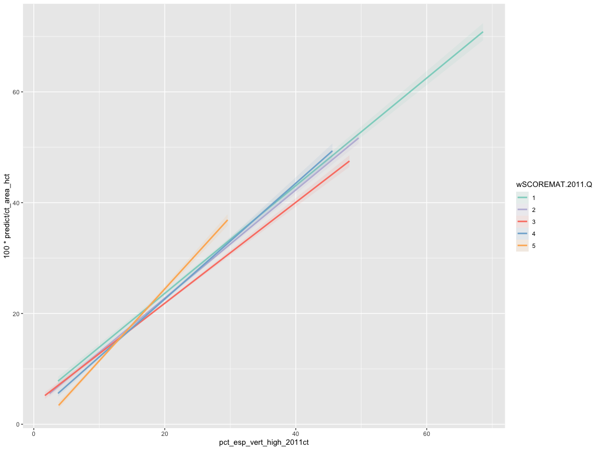<!-- -->

Transforming the model coefficients:


```r
smy.bt <- data.frame(smy$beta_table)
round(exp(res.lmm[["fixef"]]), 3) %>% 
  data.frame(fixef = ., p.value = round(smy.bt$p.value, 3)) %>%
  knitr::kable(caption="Model transformed coeffs")
```


Table: Model transformed coeffs

|                                                   | fixef| p.value|
|:--------------------------------------------------|-----:|-------:|
|(Intercept)                                        | 0.113|   0.000|
|factor(wSCOREMAT.2011.Q)2                          | 0.839|   0.007|
|factor(wSCOREMAT.2011.Q)3                          | 0.812|   0.002|
|factor(wSCOREMAT.2011.Q)4                          | 0.707|   0.000|
|factor(wSCOREMAT.2011.Q)5                          | 0.463|   0.000|
|pct_esp_vert_high_2011ct                           | 1.034|   0.000|
|factor(wSCOREMAT.2011.Q)2:pct_esp_vert_high_2011ct | 1.007|   0.001|
|factor(wSCOREMAT.2011.Q)3:pct_esp_vert_high_2011ct | 1.007|   0.004|
|factor(wSCOREMAT.2011.Q)4:pct_esp_vert_high_2011ct | 1.016|   0.000|
|factor(wSCOREMAT.2011.Q)5:pct_esp_vert_high_2011ct | 1.044|   0.000|

```r
# LRT of main effect
res.lmm.0 <- update(res.lmm, . ~ . - factor(wSCOREMAT.2011.Q))
```

```
## Warning in .sym_checked(adjMatrix, "adjMatrix"): Forcing colnames(mMatrix) <-
## rownames(mMatrix) before calling isSymmetric().
```

```r
LRT(res.lmm.0, res.lmm)
```

```
##      chi2_LR df      p_value
## p_v 72.03801  4 8.437695e-15
```

```r
# CI
data.frame(wSCOREMAT.2011.Q.2 = round(exp(ci.lmm.2$interval), 3),
           wSCOREMAT.2011.Q.3 = round(exp(ci.lmm.3$interval), 3),
           wSCOREMAT.2011.Q.4 = round(exp(ci.lmm.4$interval), 3),
           wSCOREMAT.2011.Q.5 = round(exp(ci.lmm.5$interval), 3),
           `wSCOREMAT.2011.Q.2:pct_esp_vert_high_2011ct` = round(exp(ci.lmm.2.i$interval), 3),
           `wSCOREMAT.2011.Q.3:pct_esp_vert_high_2011ct` = round(exp(ci.lmm.3.i$interval), 3),
           `wSCOREMAT.2011.Q.4:pct_esp_vert_high_2011ct` = round(exp(ci.lmm.4.i$interval), 3),
           `wSCOREMAT.2011.Q.5:pct_esp_vert_high_2011ct` = round(exp(ci.lmm.5.i$interval), 3),
           row.names = c('lower', 'upper')) %>% t() %>%
  knitr::kable(caption="Model confidence interval")
```


Table: Model confidence interval

|                                            | lower| upper|
|:-------------------------------------------|-----:|-----:|
|wSCOREMAT.2011.Q.2                          | 0.738| 0.954|
|wSCOREMAT.2011.Q.3                          | 0.710| 0.929|
|wSCOREMAT.2011.Q.4                          | 0.612| 0.817|
|wSCOREMAT.2011.Q.5                          | 0.387| 0.554|
|wSCOREMAT.2011.Q.2.pct_esp_vert_high_2011ct | 1.003| 1.011|
|wSCOREMAT.2011.Q.3.pct_esp_vert_high_2011ct | 1.002| 1.012|
|wSCOREMAT.2011.Q.4.pct_esp_vert_high_2011ct | 1.010| 1.022|
|wSCOREMAT.2011.Q.5.pct_esp_vert_high_2011ct | 1.033| 1.055|

## UI vs Visible minority {.tabset}

### Greenness change

Measuring canopy (_i.e._ greenness ~ grass & trees) ratio within CT/buffer in 2011 (in %) at the Census tract level


```r
f <- area_esp_vert_2017ct ~ vis_minority_2011.Q * pct_esp_vert_2011ct + offset(log(ct_area_hct))

clean_bei <- tidy_df(bei_df_aoi, CT16, f)

res.lmm <- fitme(area_esp_vert_2017ct ~ factor(vis_minority_2011.Q) * pct_esp_vert_2011ct + offset(log(ct_area_hct)) + adjacency(1|ct_no),
                 data = clean_bei$df, adjMatrix = clean_bei$nbmatx,
                 family = poisson())
smy <- summary(res.lmm, details = c(p_value="Wald"))
```

```
## formula: area_esp_vert_2017ct ~ factor(vis_minority_2011.Q) * pct_esp_vert_2011ct + 
##     offset(log(ct_area_hct)) + adjacency(1 | ct_no)
## Estimation of corrPars and lambda by ML (p_v approximation of logL).
## Estimation of fixed effects by ML (p_v approximation of logL).
## Estimation of lambda by 'outer' ML, maximizing logL.
## family: poisson( link = log ) 
##  ------------ Fixed effects (beta) ------------
##                                                    Estimate  Cond. SE  t-value
## (Intercept)                                      -1.5641340 0.0422445 -37.0258
## factor(vis_minority_2011.Q)2                     -0.0548760 0.0559928  -0.9801
## factor(vis_minority_2011.Q)3                     -0.0572034 0.0641486  -0.8917
## factor(vis_minority_2011.Q)4                     -0.0810112 0.0558706  -1.4500
## factor(vis_minority_2011.Q)5                     -0.2437760 0.0632134  -3.8564
## pct_esp_vert_2011ct                               0.0176047 0.0006826  25.7925
## factor(vis_minority_2011.Q)2:pct_esp_vert_2011ct  0.0009851 0.0009238   1.0664
## factor(vis_minority_2011.Q)3:pct_esp_vert_2011ct  0.0014117 0.0012208   1.1564
## factor(vis_minority_2011.Q)4:pct_esp_vert_2011ct  0.0014061 0.0009762   1.4404
## factor(vis_minority_2011.Q)5:pct_esp_vert_2011ct  0.0051993 0.0012986   4.0038
##                                                    p-value
## (Intercept)                                      0.000e+00
## factor(vis_minority_2011.Q)2                     3.271e-01
## factor(vis_minority_2011.Q)3                     3.725e-01
## factor(vis_minority_2011.Q)4                     1.471e-01
## factor(vis_minority_2011.Q)5                     1.151e-04
## pct_esp_vert_2011ct                              0.000e+00
## factor(vis_minority_2011.Q)2:pct_esp_vert_2011ct 2.863e-01
## factor(vis_minority_2011.Q)3:pct_esp_vert_2011ct 2.475e-01
## factor(vis_minority_2011.Q)4:pct_esp_vert_2011ct 1.497e-01
## factor(vis_minority_2011.Q)5:pct_esp_vert_2011ct 6.233e-05
##  --------------- Random effects ---------------
## Family: gaussian( link = identity ) 
##                    --- Correlation parameters:
##     1.rho 
## 0.1345657 
##            --- Variance parameters ('lambda'):
## lambda = var(u) for u ~ Gaussian; 
##    ct_no  :  0.002057  
## # of obs: 673; # of groups: ct_no, 673 
##  ------------- Likelihood values  -------------
##                         logLik
## logL       (p_v(h)): -1889.365
```

```r
ci.lmm.2 <- confint(res.lmm, 'factor(vis_minority_2011.Q)2')
```

```
## lower factor(vis_minority_2011.Q)2 upper factor(vis_minority_2011.Q)2 
##                        -0.16461043                         0.05568929
```

```r
ci.lmm.3 <- confint(res.lmm, 'factor(vis_minority_2011.Q)3')
```

```
## lower factor(vis_minority_2011.Q)3 upper factor(vis_minority_2011.Q)3 
##                         -0.1831642                          0.0693866
```

```r
ci.lmm.4 <- confint(res.lmm, 'factor(vis_minority_2011.Q)4')
```

```
## lower factor(vis_minority_2011.Q)4 upper factor(vis_minority_2011.Q)4 
##                        -0.19064003                         0.02960391
```

```r
ci.lmm.5 <- confint(res.lmm, 'factor(vis_minority_2011.Q)5')
```

```
## lower factor(vis_minority_2011.Q)5 upper factor(vis_minority_2011.Q)5 
##                         -0.3677580                         -0.1195351
```

```r
ci.lmm.2.i <- confint(res.lmm, 'factor(vis_minority_2011.Q)2:pct_esp_vert_2011ct')
```

```
## lower factor(vis_minority_2011.Q)2:pct_esp_vert_2011ct 
##                                          -0.0008399776 
## upper factor(vis_minority_2011.Q)2:pct_esp_vert_2011ct 
##                                           0.0027952612
```

```r
ci.lmm.3.i <- confint(res.lmm, 'factor(vis_minority_2011.Q)3:pct_esp_vert_2011ct')
```

```
## lower factor(vis_minority_2011.Q)3:pct_esp_vert_2011ct 
##                                           -0.000991913 
## upper factor(vis_minority_2011.Q)3:pct_esp_vert_2011ct 
##                                            0.003807898
```

```r
ci.lmm.4.i <- confint(res.lmm, 'factor(vis_minority_2011.Q)4:pct_esp_vert_2011ct')
```

```
## lower factor(vis_minority_2011.Q)4:pct_esp_vert_2011ct 
##                                          -0.0005154984 
## upper factor(vis_minority_2011.Q)4:pct_esp_vert_2011ct 
##                                           0.0033230989
```

```r
ci.lmm.5.i <- confint(res.lmm, 'factor(vis_minority_2011.Q)5:pct_esp_vert_2011ct')
```

```
## lower factor(vis_minority_2011.Q)5:pct_esp_vert_2011ct 
##                                            0.002653799 
## upper factor(vis_minority_2011.Q)5:pct_esp_vert_2011ct 
##                                            0.007760336
```

```r
# Testing main effect
res.lmm.0 <- update(res.lmm, . ~ . - factor(vis_minority_2011.Q))
LRT(res.lmm.0, res.lmm)
```

```
##      chi2_LR df     p_value
## p_v 16.07472  4 0.002920527
```

```r
# Plotting interaction
.t <- clean_bei$df
.t["predict"] <- as.vector(predict(res.lmm))
.t <- filter(.t, vis_minority_2011.Q %in% c(1, 2, 3, 4, 5)) # Keeping only significant interaction terms (all significant)

g_vis_gr.categ <- ggplot(.t, aes(y=100*predict/ct_area_hct, x=pct_esp_vert_2011ct, colour=factor(vis_minority_2011.Q), fill=factor(vis_minority_2011.Q))) + 
  geom_smooth(method = "lm", alpha=.1) +
  scale_color_manual(values = qtl[c(1, 2, 3, 4, 5)]) +
  scale_fill_manual(values = qtl[c(1, 2, 3, 4, 5)]) +
  labs(colour='vis_minority_2011.Q', fill='vis_minority_2011.Q')
g_vis_gr.categ
```

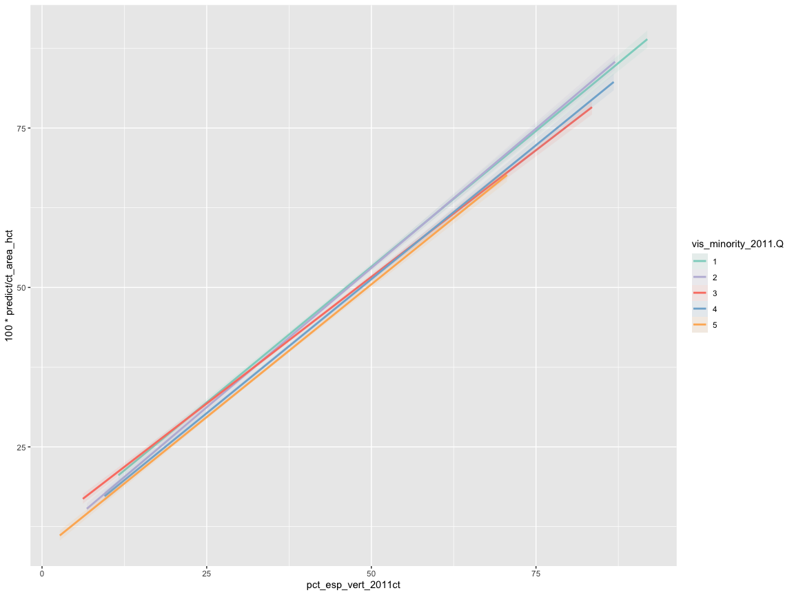<!-- -->

Transforming the model coefficients:


```r
smy.bt <- data.frame(smy$beta_table)
round(exp(res.lmm[["fixef"]]), 3) %>% 
  data.frame(fixef = ., p.value = round(smy.bt$p.value, 3)) %>%
  knitr::kable(caption="Model transformed coeffs")
```


Table: Model transformed coeffs

|                                                 | fixef| p.value|
|:------------------------------------------------|-----:|-------:|
|(Intercept)                                      | 0.209|   0.000|
|factor(vis_minority_2011.Q)2                     | 0.947|   0.327|
|factor(vis_minority_2011.Q)3                     | 0.944|   0.373|
|factor(vis_minority_2011.Q)4                     | 0.922|   0.147|
|factor(vis_minority_2011.Q)5                     | 0.784|   0.000|
|pct_esp_vert_2011ct                              | 1.018|   0.000|
|factor(vis_minority_2011.Q)2:pct_esp_vert_2011ct | 1.001|   0.286|
|factor(vis_minority_2011.Q)3:pct_esp_vert_2011ct | 1.001|   0.248|
|factor(vis_minority_2011.Q)4:pct_esp_vert_2011ct | 1.001|   0.150|
|factor(vis_minority_2011.Q)5:pct_esp_vert_2011ct | 1.005|   0.000|

```r
# LRT of main effect
res.lmm.0 <- update(res.lmm, . ~ . - factor(vis_minority_2011.Q))
```

```
## Warning in .sym_checked(adjMatrix, "adjMatrix"): Forcing colnames(mMatrix) <-
## rownames(mMatrix) before calling isSymmetric().
```

```r
LRT(res.lmm.0, res.lmm)
```

```
##      chi2_LR df     p_value
## p_v 16.07472  4 0.002920527
```

```r
# CI
data.frame(vis_minority_2011.Q.2 = round(exp(ci.lmm.2$interval), 3),
           vis_minority_2011.Q.3 = round(exp(ci.lmm.3$interval), 3),
           vis_minority_2011.Q.4 = round(exp(ci.lmm.4$interval), 3),
           vis_minority_2011.Q.5 = round(exp(ci.lmm.5$interval), 3),
           `vis_minority_2011.Q.2:pct_esp_vert_2011ct` = round(exp(ci.lmm.2.i$interval), 3),
           `vis_minority_2011.Q.3:pct_esp_vert_2011ct` = round(exp(ci.lmm.3.i$interval), 3),
           `vis_minority_2011.Q.4:pct_esp_vert_2011ct` = round(exp(ci.lmm.4.i$interval), 3),
           `vis_minority_2011.Q.5:pct_esp_vert_2011ct` = round(exp(ci.lmm.5.i$interval), 3),
           row.names = c('lower', 'upper')) %>% t() %>%
  knitr::kable(caption="Model confidence interval")
```


Table: Model confidence interval

|                                          | lower| upper|
|:-----------------------------------------|-----:|-----:|
|vis_minority_2011.Q.2                     | 0.848| 1.057|
|vis_minority_2011.Q.3                     | 0.833| 1.072|
|vis_minority_2011.Q.4                     | 0.826| 1.030|
|vis_minority_2011.Q.5                     | 0.692| 0.887|
|vis_minority_2011.Q.2.pct_esp_vert_2011ct | 0.999| 1.003|
|vis_minority_2011.Q.3.pct_esp_vert_2011ct | 0.999| 1.004|
|vis_minority_2011.Q.4.pct_esp_vert_2011ct | 0.999| 1.003|
|vis_minority_2011.Q.5.pct_esp_vert_2011ct | 1.003| 1.008|

### Canopy (trees) change

Measuring high canopy (_i.e._ trees only) ratio within CT/buffer in 2011 (in %) at the Census tract level


```r
f <- area_esp_vert_high_2017ct ~ vis_minority_2011.Q * pct_esp_vert_high_2011ct + offset(log(ct_area_hct))

clean_bei <- tidy_df(bei_df_aoi, CT16, f)

res.lmm <- fitme(area_esp_vert_high_2017ct ~ factor(vis_minority_2011.Q) * pct_esp_vert_high_2011ct + offset(log(ct_area_hct)) + adjacency(1|ct_no),
                 data = clean_bei$df, adjMatrix = clean_bei$nbmatx,
                 family = poisson())
smy <- summary(res.lmm, details = c(p_value="Wald"))
```

```
## formula: area_esp_vert_high_2017ct ~ factor(vis_minority_2011.Q) * pct_esp_vert_high_2011ct + 
##     offset(log(ct_area_hct)) + adjacency(1 | ct_no)
## Estimation of corrPars and lambda by ML (p_v approximation of logL).
## Estimation of fixed effects by ML (p_v approximation of logL).
## Estimation of lambda by 'outer' ML, maximizing logL.
## family: poisson( link = log ) 
##  ------------ Fixed effects (beta) ------------
##                                                        Estimate Cond. SE
## (Intercept)                                           -2.268054 0.053294
## factor(vis_minority_2011.Q)2                          -0.089607 0.068156
## factor(vis_minority_2011.Q)3                           0.037427 0.071195
## factor(vis_minority_2011.Q)4                          -0.264702 0.069932
## factor(vis_minority_2011.Q)5                          -0.345748 0.080989
## pct_esp_vert_high_2011ct                               0.036459 0.001653
## factor(vis_minority_2011.Q)2:pct_esp_vert_high_2011ct  0.002923 0.002281
## factor(vis_minority_2011.Q)3:pct_esp_vert_high_2011ct -0.001599 0.002657
## factor(vis_minority_2011.Q)4:pct_esp_vert_high_2011ct  0.010308 0.002581
## factor(vis_minority_2011.Q)5:pct_esp_vert_high_2011ct  0.016413 0.003426
##                                                        t-value   p-value
## (Intercept)                                           -42.5576 0.000e+00
## factor(vis_minority_2011.Q)2                           -1.3147 1.886e-01
## factor(vis_minority_2011.Q)3                            0.5257 5.991e-01
## factor(vis_minority_2011.Q)4                           -3.7851 1.536e-04
## factor(vis_minority_2011.Q)5                           -4.2691 1.963e-05
## pct_esp_vert_high_2011ct                               22.0546 0.000e+00
## factor(vis_minority_2011.Q)2:pct_esp_vert_high_2011ct   1.2815 2.000e-01
## factor(vis_minority_2011.Q)3:pct_esp_vert_high_2011ct  -0.6019 5.472e-01
## factor(vis_minority_2011.Q)4:pct_esp_vert_high_2011ct   3.9945 6.482e-05
## factor(vis_minority_2011.Q)5:pct_esp_vert_high_2011ct   4.7911 1.659e-06
##  --------------- Random effects ---------------
## Family: gaussian( link = identity ) 
##                    --- Correlation parameters:
##     1.rho 
## 0.1380284 
##            --- Variance parameters ('lambda'):
## lambda = var(u) for u ~ Gaussian; 
##    ct_no  :  0.0105  
## # of obs: 673; # of groups: ct_no, 673 
##  ------------- Likelihood values  -------------
##                         logLik
## logL       (p_v(h)): -1737.259
```

```r
ci.lmm.2 <- confint(res.lmm, 'factor(vis_minority_2011.Q)2')
```

```
## lower factor(vis_minority_2011.Q)2 upper factor(vis_minority_2011.Q)2 
##                        -0.22331594                         0.04414993
```

```r
ci.lmm.3 <- confint(res.lmm, 'factor(vis_minority_2011.Q)3')
```

```
## lower factor(vis_minority_2011.Q)3 upper factor(vis_minority_2011.Q)3 
##                         -0.1024562                          0.1771123
```

```r
ci.lmm.4 <- confint(res.lmm, 'factor(vis_minority_2011.Q)4')
```

```
## lower factor(vis_minority_2011.Q)4 upper factor(vis_minority_2011.Q)4 
##                         -0.4018329                         -0.1268827
```

```r
ci.lmm.5 <- confint(res.lmm, 'factor(vis_minority_2011.Q)5')
```

```
## lower factor(vis_minority_2011.Q)5 upper factor(vis_minority_2011.Q)5 
##                         -0.5047667                         -0.1869938
```

```r
ci.lmm.2.i <- confint(res.lmm, 'factor(vis_minority_2011.Q)2:pct_esp_vert_high_2011ct')
```

```
## lower factor(vis_minority_2011.Q)2:pct_esp_vert_high_2011ct 
##                                                 -0.00155326 
## upper factor(vis_minority_2011.Q)2:pct_esp_vert_high_2011ct 
##                                                  0.00741236
```

```r
ci.lmm.3.i <- confint(res.lmm, 'factor(vis_minority_2011.Q)3:pct_esp_vert_high_2011ct')
```

```
## lower factor(vis_minority_2011.Q)3:pct_esp_vert_high_2011ct 
##                                                -0.006814108 
## upper factor(vis_minority_2011.Q)3:pct_esp_vert_high_2011ct 
##                                                 0.003635254
```

```r
ci.lmm.4.i <- confint(res.lmm, 'factor(vis_minority_2011.Q)4:pct_esp_vert_high_2011ct')
```

```
## lower factor(vis_minority_2011.Q)4:pct_esp_vert_high_2011ct 
##                                                 0.005238727 
## upper factor(vis_minority_2011.Q)4:pct_esp_vert_high_2011ct 
##                                                 0.015391462
```

```r
ci.lmm.5.i <- confint(res.lmm, 'factor(vis_minority_2011.Q)5:pct_esp_vert_high_2011ct')
```

```
## lower factor(vis_minority_2011.Q)5:pct_esp_vert_high_2011ct 
##                                                 0.009689296 
## upper factor(vis_minority_2011.Q)5:pct_esp_vert_high_2011ct 
##                                                 0.023137153
```

```r
# Testing main effect
res.lmm.0 <- update(res.lmm, . ~ . - factor(vis_minority_2011.Q))
LRT(res.lmm.0, res.lmm)
```

```
##      chi2_LR df      p_value
## p_v 35.80911  4 3.167508e-07
```

```r
# Plotting interaction
.t <- clean_bei$df
.t["predict"] <- as.vector(predict(res.lmm))
.t <- filter(.t, vis_minority_2011.Q %in% c(1, 2, 5)) # Keeping only significant interaction terms

g_vis_tc.categ <- ggplot(.t, aes(y=100*predict/ct_area_hct, x=pct_esp_vert_high_2011ct, colour=factor(vis_minority_2011.Q), fill=factor(vis_minority_2011.Q))) + 
  geom_smooth(method = "lm", alpha=.1) +
  scale_color_manual(values = qtl[c(1, 4, 5)]) +
  scale_fill_manual(values = qtl[c(1, 4, 5)]) +
  labs(colour='vis_minority_2011.Q', fill='vis_minority_2011.Q')
g_vis_tc.categ
```

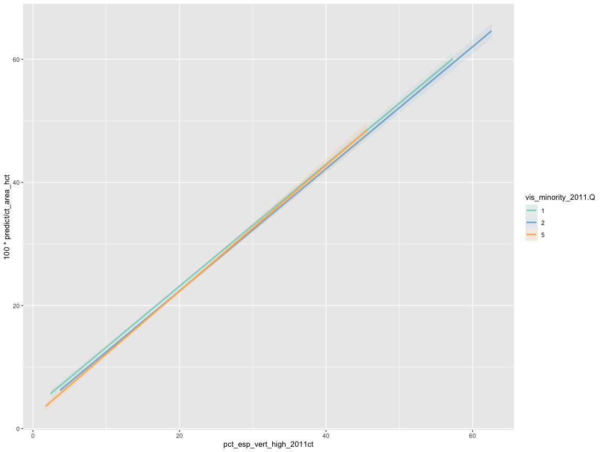<!-- -->

Transforming the model coefficients:


```r
smy.bt <- data.frame(smy$beta_table)
round(exp(res.lmm[["fixef"]]), 3) %>% 
  data.frame(fixef = ., p.value = round(smy.bt$p.value, 3)) %>%
  knitr::kable(caption="Model transformed coeffs")
```


Table: Model transformed coeffs

|                                                      | fixef| p.value|
|:-----------------------------------------------------|-----:|-------:|
|(Intercept)                                           | 0.104|   0.000|
|factor(vis_minority_2011.Q)2                          | 0.914|   0.189|
|factor(vis_minority_2011.Q)3                          | 1.038|   0.599|
|factor(vis_minority_2011.Q)4                          | 0.767|   0.000|
|factor(vis_minority_2011.Q)5                          | 0.708|   0.000|
|pct_esp_vert_high_2011ct                              | 1.037|   0.000|
|factor(vis_minority_2011.Q)2:pct_esp_vert_high_2011ct | 1.003|   0.200|
|factor(vis_minority_2011.Q)3:pct_esp_vert_high_2011ct | 0.998|   0.547|
|factor(vis_minority_2011.Q)4:pct_esp_vert_high_2011ct | 1.010|   0.000|
|factor(vis_minority_2011.Q)5:pct_esp_vert_high_2011ct | 1.017|   0.000|

```r
# LRT of main effect
res.lmm.0 <- update(res.lmm, . ~ . - factor(vis_minority_2011.Q))
```

```
## Warning in .sym_checked(adjMatrix, "adjMatrix"): Forcing colnames(mMatrix) <-
## rownames(mMatrix) before calling isSymmetric().
```

```r
LRT(res.lmm.0, res.lmm)
```

```
##      chi2_LR df      p_value
## p_v 35.80911  4 3.167508e-07
```

```r
# CI
data.frame(vis_minority_2011.Q.2 = round(exp(ci.lmm.2$interval), 3),
           vis_minority_2011.Q.3 = round(exp(ci.lmm.3$interval), 3),
           vis_minority_2011.Q.4 = round(exp(ci.lmm.4$interval), 3),
           vis_minority_2011.Q.5 = round(exp(ci.lmm.5$interval), 3),
           `vis_minority_2011.Q.2:pct_esp_vert_high_2011ct` = round(exp(ci.lmm.2.i$interval), 3),
           `vis_minority_2011.Q.3:pct_esp_vert_high_2011ct` = round(exp(ci.lmm.3.i$interval), 3),
           `vis_minority_2011.Q.4:pct_esp_vert_high_2011ct` = round(exp(ci.lmm.4.i$interval), 3),
           `vis_minority_2011.Q.5:pct_esp_vert_high_2011ct` = round(exp(ci.lmm.5.i$interval), 3),
           row.names = c('lower', 'upper')) %>% t() %>%
  knitr::kable(caption="Model confidence interval")
```


Table: Model confidence interval

|                                               | lower| upper|
|:----------------------------------------------|-----:|-----:|
|vis_minority_2011.Q.2                          | 0.800| 1.045|
|vis_minority_2011.Q.3                          | 0.903| 1.194|
|vis_minority_2011.Q.4                          | 0.669| 0.881|
|vis_minority_2011.Q.5                          | 0.604| 0.829|
|vis_minority_2011.Q.2.pct_esp_vert_high_2011ct | 0.998| 1.007|
|vis_minority_2011.Q.3.pct_esp_vert_high_2011ct | 0.993| 1.004|
|vis_minority_2011.Q.4.pct_esp_vert_high_2011ct | 1.005| 1.016|
|vis_minority_2011.Q.5.pct_esp_vert_high_2011ct | 1.010| 1.023|

## UI vs gentrified CT 

No new models here, as `gentrified` variable is already used as a pure categorical variable.

# Tables and figures

## SES map and inset map


```r
# inset map
csd_data <- get_census(dataset='CA16', regions=list(PR='24'), level='CSD', geo_format = "sf") %>%
  mutate(interact_aoi = (CD_UID %in% c(2466, 2465, 2458)) & !(GeoUID %in% c(2458033, 2458037)),
         interact_name = case_when(CD_UID == 2466 ~ 'Montréal',
                                   TRUE ~ str_remove(name, " \\([[:upper:]-]+\\)")))
pr_data <- get_census(dataset = 'CA16', regions=list(C='1'), level = 'PR', geo_format = "sf")

inset_lim <- st_bbox(st_transform(filter(CT16, interact_aoi), st_crs(4326)))
# inset_map <- ggplot() +
#   geom_sf(data = csd_data, aes(fill=factor(interact_aoi)), color = NA, show.legend = F) +
#   scale_fill_manual(values = c("TRUE" = "light blue", "FALSE" = "gray"), labels=NULL) +
#   coord_sf(xlim = c(-77, -69), ylim = c(45, 49), crs = st_crs(4326), default_crs = st_crs(4326), expand = FALSE) +
#   theme(axis.text=element_text(size=15), axis.title.x=element_blank(), axis.title.y=element_blank()) +
#   scale_x_continuous(breaks = seq(-76, -70, by = 2)) +
#   scale_y_continuous(breaks = seq(45.5, 49, by = 1)) 
# inset_map <- inset_map + 
#   annotate("rect", xmin = inset_lim['xmin'], ymin = inset_lim['ymin'], xmax = inset_lim['xmax'], ymax = inset_lim['ymax'], fill = NA, color = "black", size = 1) +
#   annotate("text", label = "Quebec, Canada", x = (-77 - 69) / 2, y = (45 + 49)/2, size = 8)

exp_fact = 1.05
inset_map <- ggplot() +
  geom_sf(data = pr_data, color = "black", show.legend = F) +
  coord_sf(xlim = c(-55, -140), ylim = c(40, 75), crs = st_crs(4326), default_crs = st_crs(4326), expand = FALSE) +
  theme(axis.text=element_text(size=15), axis.title.x=element_blank(), axis.title.y=element_blank()) +
  scale_x_continuous(breaks = seq(-130, -60, by = 20)) +
  scale_y_continuous(breaks = seq(45, 70, by = 10)) 
inset_map <- inset_map + 
  annotate("rect", 
           xmin = inset_lim['xmin'] - exp_fact * (inset_lim['xmax'] - inset_lim['xmin']), 
           ymin = inset_lim['ymin'] - exp_fact * (inset_lim['ymax'] - inset_lim['ymin']), 
           xmax = inset_lim['xmax'] + exp_fact * (inset_lim['xmax'] - inset_lim['xmin']), 
           ymax = inset_lim['ymax'] + exp_fact * (inset_lim['ymax'] - inset_lim['ymin']), 
           fill = NA, color = "red", size = 2)

  
# SES map
.ses_data_sf <- CT16 %>%
  inner_join(bei_df_aoi, by = c("GeoUID" = "CT_UID"))

.ses_data <- bi_class(.ses_data_sf, x = vis_minority_2011, y = wSCOREMAT.2011, style = "quantile", dim = 3)
ses_map <- ggplot() + 
  geom_sf(data = .ses_data, mapping = aes(fill = bi_class), color = "white", size = 0.1, show.legend = FALSE) +
  bi_scale_fill(pal = "Brown", dim = 3) +
  geom_sf_label(data = filter(csd_data, (GeoUID == "2466023") | ((CD_UID %in% c("2465", "2458")) & !(GeoUID %in% c(2458033, 2458037)))),
                aes(label=interact_name), check_overlap = T, size = 8) + 
  scalebar(data = .ses_data, dist = 5, dist_unit = "km", transform = F) +
  theme(panel.background = element_rect(fill = "white"),
        axis.ticks = element_blank(),
        axis.text = element_blank(),
        axis.title = element_blank(),
        panel.grid = element_blank())
ses_legend <- bi_legend(pal = "Brown",
                    dim = 3,
                    xlab = "Visible Minority ",
                    ylab = "Material deprivation ",
                    size = 14)
ggdraw() +
  draw_plot(ses_map, 0, 0, 1, 1) +
  draw_plot(ses_legend, 0.8, .75, 0.2, 0.2) +
  draw_plot(inset_map, 0.02, .7, 0.25, 0.25)
```

**FIXME** 

## Maps of BEC and BEI

### Greenness


```r
# Green space
g_bec_bike <- ggplot() +
   geom_sf(data=filter(bike_lane_changes, interact_aoi), mapping = aes(fill=as.numeric(Bike_lane.by.street.2011ct)), lwd = 0) +
  scale_fill_distiller(name = "Bike lane to\nstreet length (%)", palette = "YlGn", direction = 1) + 
   geom_sf(data=filter(CT16, interact_aoi), fill=NA, color="gray", size=.2, alpha=0.2) + 
  ggnewscale::new_scale_fill() +
  geom_sf(data=filter(bike_lane_changes, interact_aoi), mapping = aes(fill=factor(units::drop_units(Bike_lane.by.street.2011ct) == 0)), lwd = 0.1) +
  scale_fill_manual(name="No bike lane in CT", values = c("TRUE" = "white"), labels=NULL, na.translate = FALSE) +
  labs(title = "Normalized bike lane length in 2011")


g_bei_bike <- ggplot() +
  geom_sf(data=filter(bike_lane_changes, interact_aoi), mapping = aes(fill=as.numeric(Bike_lane_diff.by.street.2011.2016ct)), lwd=0) +
   geom_sf(data=filter(CT16, interact_aoi), fill=NA, color="gray", size=.2, alpha=0.2) + 
  scale_fill_gradient2(name = "Change in normalized\nbike lane (%)")+ 
  labs(title = "Bike lane change between 2011 and 2016")

# Green space
g_bec_green <- ggplot() +
   geom_sf(data=inner_join(filter(CT16, interact_aoi), esp_vert_ct, by="GeoUID"), mapping = aes(fill=as.numeric(pct_esp_vert_2011)), lwd = 0) +
   geom_sf(data=filter(CT16, interact_aoi), fill=NA, color="gray", size=.2, alpha=0.2) + 
  scale_fill_distiller(name = "Greenspace (%)", palette = "YlGn", direction = 1)+ 
  labs(title = "A) Proportion of greenspace in 2011")

g_bei_green <- ggplot() +
   geom_sf(data=inner_join(filter(CT16, interact_aoi), esp_vert_ct, by="GeoUID"), mapping = aes(fill=as.numeric(pct_esp_vert_diff_2011.2017)), lwd = 0) +
   geom_sf(data=filter(CT16, interact_aoi), fill=NA, color="gray", size=.2, alpha=0.2) + 
  scale_fill_gradient2(name = "Greenspace\nchange (%)")+ 
  #scale_fill_steps2(name = "Greenspace\nchange (%)", nice.breaks=T) + 
  labs(title = "C) Greenspace change between 2011 and 2017")

# Green space
g_bec_tree <- ggplot() +
   geom_sf(data=inner_join(filter(CT16, interact_aoi), esp_vert_ct, by="GeoUID"), mapping = aes(fill=as.numeric(pct_esp_vert_high_2011)), lwd = 0) +
   geom_sf(data=filter(CT16, interact_aoi), fill=NA, color="gray", size=.2, alpha=0.2) + 
  scale_fill_distiller(name = "Tree canopy (%)", palette = "YlGn", direction = 1)+ 
  labs(title = "B) Proportion of tree canopy in 2011")

g_bei_tree <- ggplot() +
   geom_sf(data=inner_join(filter(CT16, interact_aoi), esp_vert_ct, by="GeoUID"), mapping = aes(fill=as.numeric(pct_esp_vert_diff_high_2011.2017)), lwd = 0) +
   geom_sf(data=filter(CT16, interact_aoi), fill=NA, color="gray", size=.2, alpha=0.2) + 
  scale_fill_gradient2(name = "Tree canopy\nchange (%)")+ 
  labs(title = "D) Tree canopy change between 2011 and 2017")

# Create grid of maps
pcol1 <- plot_grid(
  #g_bec_bike + theme_void(), 
  g_bec_green + theme_void(), 
  g_bec_tree + theme_void(),
  align = "vh",
  #labels = c("A", "B"),
  #hjust = -1,
  ncol = 1
)

pcol2 <- plot_grid(
 #g_bei_bike + theme_void(), 
  g_bei_green + theme_void(), 
  g_bei_tree + theme_void(),
  align = "vh",
  #labels = c("C", "D"),
  #hjust = -1,
  ncol = 1
)

# output all graphs
plot_grid(pcol1, pcol2, nrow=1)
```

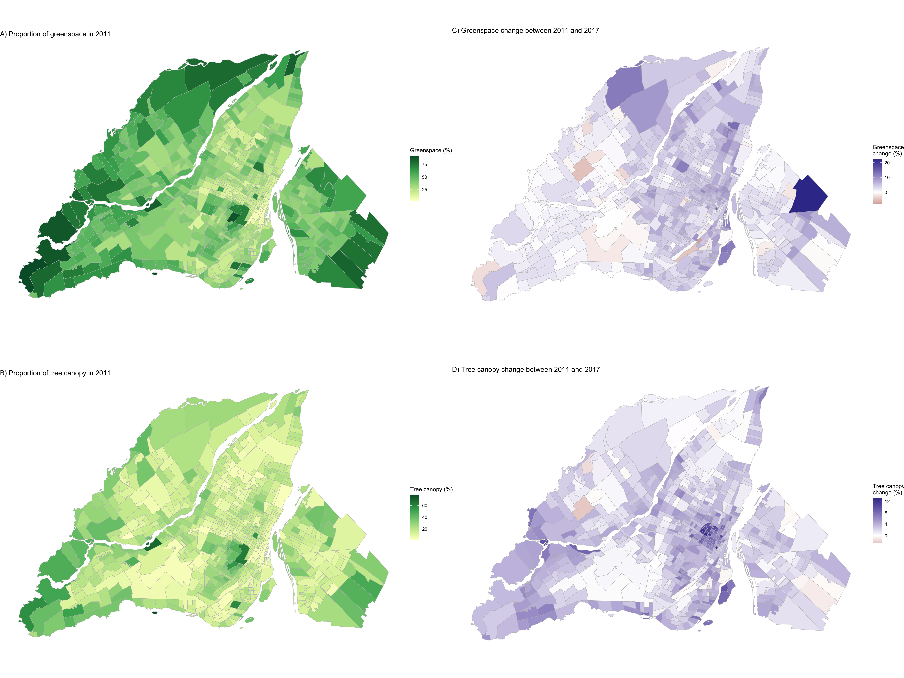


## SES and BEI outcomes


```r
# Extract SES and BEI in 2011
.tab1_2011 <- bei_df_aoi %>%
  transmute(year = "2011",
            zone = zone,
            CT_UID = CT_UID,
            Population = Population,
            `Material score` = wSCOREMAT.2011,
            `% visible minorities` = vis_minority_2011,
            `gentrified` = gentrified_2016_2011,
            `Green space area (ha)` = area_esp_vert_2011ct,
            `% green space within CT` = pct_esp_vert_2011ct,
            `Tree canopy area (ha)` = area_esp_vert_high_2011ct,
            `% tree canopy within CT` = pct_esp_vert_high_2011ct)

# Extract SES and BEI in 2016
.tab1_2016 <- bei_df_aoi %>%
  transmute(year = "2016",
            zone = zone,
            CT_UID = CT_UID,
            `Green space area (ha)` = area_esp_vert_2017ct,
            `% green space within CT` = pct_esp_vert_2017ct,
            `Tree canopy area (ha)` = area_esp_vert_high_2017ct,
            `% tree canopy within CT` = pct_esp_vert_high_2017ct)

.tab1_med <- bind_rows(.tab1_2011, .tab1_2016) %>%
  group_by(year) %>%
  summarize(across(where(is.numeric), median, na.rm=TRUE), 
            `% gentrified` = 100 * sum(`gentrified`, na.rm = TRUE) / n())
```

```
## Warning: There was 1 warning in `summarize()`.
## ℹ In argument: `across(where(is.numeric), median, na.rm = TRUE)`.
## ℹ In group 1: `year = "2011"`.
## Caused by warning:
## ! The `...` argument of `across()` is deprecated as of dplyr 1.1.0.
## Supply arguments directly to `.fns` through an anonymous function instead.
## 
##   # Previously
##   across(a:b, mean, na.rm = TRUE)
## 
##   # Now
##   across(a:b, \(x) mean(x, na.rm = TRUE))
```

```r
.tab1_p25 <- bind_rows(.tab1_2011, .tab1_2016) %>%
  group_by(year) %>%
  summarize(across(where(is.numeric), quantile, probs=.25, na.rm=TRUE))
.tab1_p75 <- bind_rows(.tab1_2011, .tab1_2016) %>%
  group_by(year) %>%
  summarize(across(where(is.numeric), quantile, probs=.75, na.rm=TRUE))
tab1 <- inner_join(.tab1_med, .tab1_p25, by="year", suffix = c("", " p25")) %>%
  inner_join(.tab1_p75, by="year", suffix = c("", " p75")) %>%
  transmute(year = year,
            Population = case_when(year == "2016" ~ "", 
                                   TRUE ~ paste0(round(`Population`,1), " (", round(`Population p25`,1), " - ", round(`Population p75`,1), ")")),
            `Material score` = case_when(year == "2016" ~ "", 
                                         TRUE ~ paste0(round(`Material score`,3), " (", round(`Material score p25`,3), " - ", round(`Material score p75`,3), ")")),
            `% visible minorities` = case_when(is.na(`% visible minorities`) ~ "", 
                                               TRUE ~ paste0(round(`% visible minorities`,1), " (", round(`% visible minorities p25`,1), " - ", round(`% visible minorities p75`,1), ")")),
            `% gentrified CTs` = case_when(year == "2016" ~ "", 
                                           TRUE ~ as.character(round(`% gentrified`, 1))),
            `Green space area (ha)` = paste0(round(`Green space area (ha)`,1), " (", round(`Green space area (ha) p25`,1), " - ", round(`Green space area (ha) p75`,1), ")"),
            `% green space within CT` = paste0(round(`% green space within CT`,1), " (", round(`% green space within CT p25`,1), " - ", round(`% green space within CT p75`,1), ")"),
            `Tree canopy area (ha)` = paste0(round(`Tree canopy area (ha)`,1), " (", round(`Tree canopy area (ha) p25`,1), " - ", round(`Tree canopy area (ha) p75`,1), ")"),
            `% tree canopy within CT` = paste0(round(`% tree canopy within CT`,1), " (", round(`% tree canopy within CT p25`,1), " - ", round(`% tree canopy within CT p75`,1), ")")) %>%
  tibble::column_to_rownames("year") %>%
  t() %>% 
  as.data.frame()

tab1 %>% knitr::kable() %>%
  kableExtra::kable_styling(bootstrap_options = c("striped", "hover", "condensed", "responsive"))
```

<table class="table table-striped table-hover table-condensed table-responsive" style="margin-left: auto; margin-right: auto;">
 <thead>
  <tr>
   <th style="text-align:left;">   </th>
   <th style="text-align:left;"> 2011 </th>
   <th style="text-align:left;"> 2016 </th>
  </tr>
 </thead>
<tbody>
  <tr>
   <td style="text-align:left;"> Population </td>
   <td style="text-align:left;"> 3808 (2612 - 5157) </td>
   <td style="text-align:left;">  </td>
  </tr>
  <tr>
   <td style="text-align:left;"> Material score </td>
   <td style="text-align:left;"> 0.007 (-0.018 - 0.032) </td>
   <td style="text-align:left;">  </td>
  </tr>
  <tr>
   <td style="text-align:left;"> % visible minorities </td>
   <td style="text-align:left;"> 21.7 (14.5 - 34.5) </td>
   <td style="text-align:left;">  </td>
  </tr>
  <tr>
   <td style="text-align:left;"> % gentrified CTs </td>
   <td style="text-align:left;"> 30 </td>
   <td style="text-align:left;">  </td>
  </tr>
  <tr>
   <td style="text-align:left;"> Green space area (ha) </td>
   <td style="text-align:left;"> 22 (8 - 59) </td>
   <td style="text-align:left;"> 25 (9 - 64) </td>
  </tr>
  <tr>
   <td style="text-align:left;"> % green space within CT </td>
   <td style="text-align:left;"> 35.6 (24.4 - 46.7) </td>
   <td style="text-align:left;"> 40.2 (29.4 - 50.4) </td>
  </tr>
  <tr>
   <td style="text-align:left;"> Tree canopy area (ha) </td>
   <td style="text-align:left;"> 10 (4 - 22) </td>
   <td style="text-align:left;"> 12 (5 - 25) </td>
  </tr>
  <tr>
   <td style="text-align:left;"> % tree canopy within CT </td>
   <td style="text-align:left;"> 16.4 (11.8 - 22.6) </td>
   <td style="text-align:left;"> 20.2 (14.5 - 26.8) </td>
  </tr>
</tbody>
</table>


```sql
WITH cnt17 AS (
	SELECT "GeoUID"
		,(pvc).value, SUM((pvc).count) As total
	FROM (SELECT "GeoUID"
			,ST_ValueCount(ST_Clip(rast, geometry)) As pvc
		FROM canopee2017
		JOIN ct16 ON ST_Intersects(geometry, rast)
	) As foo
	GROUP BY "GeoUID", (pvc).value
),
canopee17 AS (
	SELECT 2017 AS year, "GeoUID"
		,sum(total) FILTER (WHERE value in (3, 4)) AS area_esp_vert
		,sum(total) FILTER (WHERE value = 4) AS area_esp_vert_high
	FROM cnt17
	WHERE value > 0 -- discard no data, including postgis raster no data
	GROUP BY "GeoUID"
),
cnt11 AS (
	SELECT "GeoUID"
		,(pvc).value, SUM((pvc).count) As total
	FROM (SELECT "GeoUID"
			,ST_ValueCount(ST_Clip(rast, geometry)) As pvc
		FROM canopee2011
		JOIN ct16 ON ST_Intersects(geometry, rast)
	) As foo
	GROUP BY "GeoUID", (pvc).value
),
canopee11 AS (
	SELECT 2011 AS year, "GeoUID"
		,sum(total) FILTER (WHERE value in (3, 4)) AS area_esp_vert
		,sum(total) FILTER (WHERE value = 4) AS area_esp_vert_high
	FROM cnt11
	WHERE value > 0 -- discard no data, including postgis raster no data
	GROUP BY "GeoUID"
)
SELECT "year", "GeoUID"
	,st_area(geometry) ct_area -- CT area in hectares
	,COALESCE(area_esp_vert, 0) area_esp_vert
	,coalesce(area_esp_vert_high, 0) area_esp_vert_high
FROM ct16 JOIN canopee17 USING ("GeoUID")
UNION
SELECT "year", "GeoUID"
	,st_area(geometry) ct_area -- CT area in hectares
	,COALESCE(area_esp_vert, 0) area_esp_vert
	,coalesce(area_esp_vert_high, 0) area_esp_vert_high
FROM ct16 JOIN canopee11 USING ("GeoUID")

```


```r
# Computing the global proportion of greenspace/tree canopy for the area
esp_vert_ct_m %>%
  group_by(year) %>%
  summarize(`area_esp_vert (km2)` = sum(area_esp_vert) / 1000000,
            `area_esp_vert_high (km2)` = sum(area_esp_vert_high) / 1000000,
            `esp_vert (%)` = 100 * sum(area_esp_vert) / sum(ct_area),
            `esp_vert_high (%)` = 100 * sum(area_esp_vert_high) / sum(ct_area)) %>%
  knitr::kable(digits = 1) %>%
  kableExtra::kable_styling(bootstrap_options = c("striped", "hover", "condensed", "responsive"))
```

<table class="table table-striped table-hover table-condensed table-responsive" style="margin-left: auto; margin-right: auto;">
 <thead>
  <tr>
   <th style="text-align:right;"> year </th>
   <th style="text-align:right;"> area_esp_vert (km2) </th>
   <th style="text-align:right;"> area_esp_vert_high (km2) </th>
   <th style="text-align:right;"> esp_vert (%) </th>
   <th style="text-align:right;"> esp_vert_high (%) </th>
  </tr>
 </thead>
<tbody>
  <tr>
   <td style="text-align:right;"> 2011 </td>
   <td style="text-align:right;"> 2468.8 </td>
   <td style="text-align:right;"> 909.7 </td>
   <td style="text-align:right;"> 57.4 </td>
   <td style="text-align:right;"> 21.1 </td>
  </tr>
  <tr>
   <td style="text-align:right;"> 2017 </td>
   <td style="text-align:right;"> 2829.9 </td>
   <td style="text-align:right;"> 957.4 </td>
   <td style="text-align:right;"> 65.8 </td>
   <td style="text-align:right;"> 22.3 </td>
  </tr>
</tbody>
</table>

### By Q1 / Q5 

We look at Urban conditions in 2011 and 2016 within Q1 and Q5 of 2011 equity metrics


```r
# Extract SES and BEI in 2011
.tab1_2011 <- bei_df_aoi %>%
  filter(wSCOREMAT.2011.Q %in% c(1, 5) ) %>%
  transmute(year = "2011",
            quintile = case_when(wSCOREMAT.2011.Q == 1 ~ "Q1 Deprivation",
                                 wSCOREMAT.2011.Q == 5 ~ "Q5 Deprivation"),
            zone = zone,
            CT_UID = CT_UID,
            Population = Population,
            `Material score` = wSCOREMAT.2011,
            `% visible minorities` = vis_minority_2011,
            `gentrified` = gentrified_2016_2011,
            `Green space area (ha)` = area_esp_vert_2011ct,
            `% green space within CT` = pct_esp_vert_2011ct,
            `Tree canopy area (ha)` = area_esp_vert_high_2011ct,
            `% tree canopy within CT` = pct_esp_vert_high_2011ct)

# Extract SES and BEI in 2016
.tab1_2016 <- bei_df_aoi %>%
  filter(wSCOREMAT.2011.Q %in% c(1, 5) ) %>%
  transmute(year = "2016",
            quintile = case_when(wSCOREMAT.2011.Q == 1 ~ "Q1 Deprivation",
                                 wSCOREMAT.2011.Q == 5 ~ "Q5 Deprivation"),
            zone = zone,
            CT_UID = CT_UID,
            `Green space area (ha)` = area_esp_vert_2017ct,
            `% green space within CT` = pct_esp_vert_2017ct,
            `Tree canopy area (ha)` = area_esp_vert_high_2017ct,
            `% tree canopy within CT` = pct_esp_vert_high_2017ct)

.tab1_med <- bind_rows(.tab1_2011, .tab1_2016) %>%
  group_by(year, quintile) %>%
  summarize(across(where(is.numeric), median, na.rm=TRUE), 
            `% gentrified` = 100 * sum(`gentrified`, na.rm = TRUE) / n())
```

```
## `summarise()` has grouped output by 'year'. You can override using the
## `.groups` argument.
```

```r
.tab1_p25 <- bind_rows(.tab1_2011, .tab1_2016) %>%
  group_by(year, quintile) %>%
  summarize(across(where(is.numeric), quantile, probs=.25, na.rm=TRUE))
```

```
## `summarise()` has grouped output by 'year'. You can override using the
## `.groups` argument.
```

```r
.tab1_p75 <- bind_rows(.tab1_2011, .tab1_2016) %>%
  group_by(year, quintile) %>%
  summarize(across(where(is.numeric), quantile, probs=.75, na.rm=TRUE))
```

```
## `summarise()` has grouped output by 'year'. You can override using the
## `.groups` argument.
```

```r
tab1 <- inner_join(.tab1_med, .tab1_p25, by=c("year", "quintile"), suffix = c("", " p25")) %>%
  inner_join(.tab1_p75, by=c("year", "quintile"), suffix = c("", " p75")) %>%
  transmute(year.quintile = paste(year, quintile),
            Population = case_when(year == "2016" ~ "", 
                                   TRUE ~ paste0(round(`Population`,1), " (", round(`Population p25`,1), " - ", round(`Population p75`,1), ")")),
            `Material score` = case_when(year == "2016" ~ "", 
                                         TRUE ~ paste0(round(`Material score`,3), " (", round(`Material score p25`,3), " - ", round(`Material score p75`,3), ")")),
            `% visible minorities` = case_when(is.na(`% visible minorities`) ~ "", 
                                               TRUE ~ paste0(round(`% visible minorities`,1), " (", round(`% visible minorities p25`,1), " - ", round(`% visible minorities p75`,1), ")")),
            `% gentrified CTs` = case_when(year == "2016" ~ "", 
                                           TRUE ~ as.character(round(`% gentrified`, 1))),
            `Green space area (ha)` = paste0(round(`Green space area (ha)`,1), " (", round(`Green space area (ha) p25`,1), " - ", round(`Green space area (ha) p75`,1), ")"),
            `% green space within CT` = paste0(round(`% green space within CT`,1), " (", round(`% green space within CT p25`,1), " - ", round(`% green space within CT p75`,1), ")"),
            `Tree canopy area (ha)` = paste0(round(`Tree canopy area (ha)`,1), " (", round(`Tree canopy area (ha) p25`,1), " - ", round(`Tree canopy area (ha) p75`,1), ")"),
            `% tree canopy within CT` = paste0(round(`% tree canopy within CT`,1), " (", round(`% tree canopy within CT p25`,1), " - ", round(`% tree canopy within CT p75`,1), ")")) %>%
  tibble::column_to_rownames("year.quintile") %>%
  t() %>% 
  as.data.frame()

tab1 %>% knitr::kable() %>%
  kableExtra::kable_styling(bootstrap_options = c("striped", "hover", "condensed", "responsive"))
```

<table class="table table-striped table-hover table-condensed table-responsive" style="margin-left: auto; margin-right: auto;">
 <thead>
  <tr>
   <th style="text-align:left;">   </th>
   <th style="text-align:left;"> 2011 Q1 Deprivation </th>
   <th style="text-align:left;"> 2011 Q5 Deprivation </th>
   <th style="text-align:left;"> 2016 Q1 Deprivation </th>
   <th style="text-align:left;"> 2016 Q5 Deprivation </th>
  </tr>
 </thead>
<tbody>
  <tr>
   <td style="text-align:left;"> year </td>
   <td style="text-align:left;"> 2011 </td>
   <td style="text-align:left;"> 2011 </td>
   <td style="text-align:left;"> 2016 </td>
   <td style="text-align:left;"> 2016 </td>
  </tr>
  <tr>
   <td style="text-align:left;"> Population </td>
   <td style="text-align:left;"> 3092 (1999 - 4873.5) </td>
   <td style="text-align:left;"> 3946 (2991.5 - 5229) </td>
   <td style="text-align:left;">  </td>
   <td style="text-align:left;">  </td>
  </tr>
  <tr>
   <td style="text-align:left;"> Material score </td>
   <td style="text-align:left;"> -0.044 (-0.061 - -0.034) </td>
   <td style="text-align:left;"> 0.054 (0.045 - 0.071) </td>
   <td style="text-align:left;">  </td>
   <td style="text-align:left;">  </td>
  </tr>
  <tr>
   <td style="text-align:left;"> % visible minorities </td>
   <td style="text-align:left;"> 15.7 (9.3 - 22.3) </td>
   <td style="text-align:left;"> 37.5 (25.8 - 54.5) </td>
   <td style="text-align:left;">  </td>
   <td style="text-align:left;">  </td>
  </tr>
  <tr>
   <td style="text-align:left;"> % gentrified CTs </td>
   <td style="text-align:left;"> 15.6 </td>
   <td style="text-align:left;"> 40.7 </td>
   <td style="text-align:left;">  </td>
   <td style="text-align:left;">  </td>
  </tr>
  <tr>
   <td style="text-align:left;"> Green space area (ha) </td>
   <td style="text-align:left;"> 20 (4.5 - 88.5) </td>
   <td style="text-align:left;"> 15 (7 - 25) </td>
   <td style="text-align:left;"> 25 (5.5 - 93.5) </td>
   <td style="text-align:left;"> 17 (8 - 28.5) </td>
  </tr>
  <tr>
   <td style="text-align:left;"> % green space within CT </td>
   <td style="text-align:left;"> 41.1 (24.4 - 53) </td>
   <td style="text-align:left;"> 28.8 (20.8 - 35.2) </td>
   <td style="text-align:left;"> 47.1 (29.8 - 57) </td>
   <td style="text-align:left;"> 32.9 (25 - 40.8) </td>
  </tr>
  <tr>
   <td style="text-align:left;"> Tree canopy area (ha) </td>
   <td style="text-align:left;"> 12 (3 - 41) </td>
   <td style="text-align:left;"> 7 (3.5 - 10) </td>
   <td style="text-align:left;"> 15 (4 - 47) </td>
   <td style="text-align:left;"> 8 (4.5 - 12) </td>
  </tr>
  <tr>
   <td style="text-align:left;"> % tree canopy within CT </td>
   <td style="text-align:left;"> 22 (14.6 - 34.2) </td>
   <td style="text-align:left;"> 12.5 (8.8 - 15.9) </td>
   <td style="text-align:left;"> 27.9 (19 - 37.4) </td>
   <td style="text-align:left;"> 15.8 (10.4 - 19.7) </td>
  </tr>
</tbody>
</table>


```r
# Extract SES and BEI in 2011
.tab1_2011 <- bei_df_aoi %>%
  filter(vis_minority_2011.Q %in% c(1, 5) ) %>%
  transmute(year = "2011",
            quintile = case_when(vis_minority_2011.Q == 1 ~ "Q1 Vis. Minorities",
                                 vis_minority_2011.Q == 5 ~ "Q5 Vis. Minorities"),
            zone = zone,
            CT_UID = CT_UID,
            Population = Population,
            `Material score` = wSCOREMAT.2011,
            `% visible minorities` = vis_minority_2011,
            `gentrified` = gentrified_2016_2011,
            `Green space area (ha)` = area_esp_vert_2011ct,
            `% green space within CT` = pct_esp_vert_2011ct,
            `Tree canopy area (ha)` = area_esp_vert_high_2011ct,
            `% tree canopy within CT` = pct_esp_vert_high_2011ct)

# Extract SES and BEI in 2016
.tab1_2016 <- bei_df_aoi %>%
  filter(vis_minority_2011.Q %in% c(1, 5) ) %>%
  transmute(year = "2016",
            quintile = case_when(vis_minority_2011.Q == 1 ~ "Q1 Vis. Minorities",
                                 vis_minority_2011.Q == 5 ~ "Q5 Vis. Minorities"),
            zone = zone,
            CT_UID = CT_UID,
            `Green space area (ha)` = area_esp_vert_2017ct,
            `% green space within CT` = pct_esp_vert_2017ct,
            `Tree canopy area (ha)` = area_esp_vert_high_2017ct,
            `% tree canopy within CT` = pct_esp_vert_high_2017ct)

.tab1_med <- bind_rows(.tab1_2011, .tab1_2016) %>%
  group_by(year, quintile) %>%
  summarize(across(where(is.numeric), median, na.rm=TRUE), 
            `% gentrified` = 100 * sum(`gentrified`, na.rm = TRUE) / n())
```

```
## `summarise()` has grouped output by 'year'. You can override using the
## `.groups` argument.
```

```r
.tab1_p25 <- bind_rows(.tab1_2011, .tab1_2016) %>%
  group_by(year, quintile) %>%
  summarize(across(where(is.numeric), quantile, probs=.25, na.rm=TRUE))
```

```
## `summarise()` has grouped output by 'year'. You can override using the
## `.groups` argument.
```

```r
.tab1_p75 <- bind_rows(.tab1_2011, .tab1_2016) %>%
  group_by(year, quintile) %>%
  summarize(across(where(is.numeric), quantile, probs=.75, na.rm=TRUE))
```

```
## `summarise()` has grouped output by 'year'. You can override using the
## `.groups` argument.
```

```r
tab1 <- inner_join(.tab1_med, .tab1_p25, by=c("year", "quintile"), suffix = c("", " p25")) %>%
  inner_join(.tab1_p75, by=c("year", "quintile"), suffix = c("", " p75")) %>%
  transmute(year.quintile = paste(year, quintile),
            Population = case_when(year == "2016" ~ "", 
                                   TRUE ~ paste0(round(`Population`,1), " (", round(`Population p25`,1), " - ", round(`Population p75`,1), ")")),
            `Material score` = case_when(year == "2016" ~ "", 
                                         TRUE ~ paste0(round(`Material score`,3), " (", round(`Material score p25`,3), " - ", round(`Material score p75`,3), ")")),
            `% visible minorities` = case_when(is.na(`% visible minorities`) ~ "", 
                                               TRUE ~ paste0(round(`% visible minorities`,1), " (", round(`% visible minorities p25`,1), " - ", round(`% visible minorities p75`,1), ")")),
            `% gentrified CTs` = case_when(year == "2016" ~ "", 
                                           TRUE ~ as.character(round(`% gentrified`, 1))),
            `Green space area (ha)` = paste0(round(`Green space area (ha)`,1), " (", round(`Green space area (ha) p25`,1), " - ", round(`Green space area (ha) p75`,1), ")"),
            `% green space within CT` = paste0(round(`% green space within CT`,1), " (", round(`% green space within CT p25`,1), " - ", round(`% green space within CT p75`,1), ")"),
            `Tree canopy area (ha)` = paste0(round(`Tree canopy area (ha)`,1), " (", round(`Tree canopy area (ha) p25`,1), " - ", round(`Tree canopy area (ha) p75`,1), ")"),
            `% tree canopy within CT` = paste0(round(`% tree canopy within CT`,1), " (", round(`% tree canopy within CT p25`,1), " - ", round(`% tree canopy within CT p75`,1), ")")) %>%
  tibble::column_to_rownames("year.quintile") %>%
  t() %>% 
  as.data.frame()

tab1 %>% knitr::kable() %>%
  kableExtra::kable_styling(bootstrap_options = c("striped", "hover", "condensed", "responsive"))
```

<table class="table table-striped table-hover table-condensed table-responsive" style="margin-left: auto; margin-right: auto;">
 <thead>
  <tr>
   <th style="text-align:left;">   </th>
   <th style="text-align:left;"> 2011 Q1 Vis. Minorities </th>
   <th style="text-align:left;"> 2011 Q5 Vis. Minorities </th>
   <th style="text-align:left;"> 2016 Q1 Vis. Minorities </th>
   <th style="text-align:left;"> 2016 Q5 Vis. Minorities </th>
  </tr>
 </thead>
<tbody>
  <tr>
   <td style="text-align:left;"> year </td>
   <td style="text-align:left;"> 2011 </td>
   <td style="text-align:left;"> 2011 </td>
   <td style="text-align:left;"> 2016 </td>
   <td style="text-align:left;"> 2016 </td>
  </tr>
  <tr>
   <td style="text-align:left;"> Population </td>
   <td style="text-align:left;"> 3016 (2123.5 - 4213) </td>
   <td style="text-align:left;"> 4193 (3395.5 - 5644) </td>
   <td style="text-align:left;">  </td>
   <td style="text-align:left;">  </td>
  </tr>
  <tr>
   <td style="text-align:left;"> Material score </td>
   <td style="text-align:left;"> -0.018 (-0.042 - 0.013) </td>
   <td style="text-align:left;"> 0.037 (0.013 - 0.063) </td>
   <td style="text-align:left;">  </td>
   <td style="text-align:left;">  </td>
  </tr>
  <tr>
   <td style="text-align:left;"> % visible minorities </td>
   <td style="text-align:left;"> 9.1 (7.4 - 11.1) </td>
   <td style="text-align:left;"> 48.8 (43 - 58.2) </td>
   <td style="text-align:left;">  </td>
   <td style="text-align:left;">  </td>
  </tr>
  <tr>
   <td style="text-align:left;"> % gentrified CTs </td>
   <td style="text-align:left;"> 32.6 </td>
   <td style="text-align:left;"> 29.6 </td>
   <td style="text-align:left;">  </td>
   <td style="text-align:left;">  </td>
  </tr>
  <tr>
   <td style="text-align:left;"> Green space area (ha) </td>
   <td style="text-align:left;"> 20 (6 - 78) </td>
   <td style="text-align:left;"> 16 (7.5 - 33.5) </td>
   <td style="text-align:left;"> 21 (7 - 83.5) </td>
   <td style="text-align:left;"> 19 (9.5 - 37.5) </td>
  </tr>
  <tr>
   <td style="text-align:left;"> % green space within CT </td>
   <td style="text-align:left;"> 37.4 (25.2 - 53) </td>
   <td style="text-align:left;"> 30.4 (23.1 - 38.2) </td>
   <td style="text-align:left;"> 41.4 (31.9 - 56.9) </td>
   <td style="text-align:left;"> 35.8 (26.9 - 44.6) </td>
  </tr>
  <tr>
   <td style="text-align:left;"> Tree canopy area (ha) </td>
   <td style="text-align:left;"> 12 (3 - 39.5) </td>
   <td style="text-align:left;"> 7 (4 - 15.5) </td>
   <td style="text-align:left;"> 12 (4 - 44.5) </td>
   <td style="text-align:left;"> 10 (4 - 17.5) </td>
  </tr>
  <tr>
   <td style="text-align:left;"> % tree canopy within CT </td>
   <td style="text-align:left;"> 18.3 (14.5 - 29.9) </td>
   <td style="text-align:left;"> 14.5 (8.4 - 20.4) </td>
   <td style="text-align:left;"> 23.3 (18 - 34.8) </td>
   <td style="text-align:left;"> 17.4 (9.9 - 24) </td>
  </tr>
</tbody>
</table>

### By gentrification status


```r
# Extract SES and BEI in 2011
.tab1_2011 <- bei_df_aoi %>%
  filter(!is.na(gentrif_status_2016)) %>%
  transmute(year = "2011",
            quintile = gentrif_status_2016,
            zone = zone,
            CT_UID = CT_UID,
            Population = Population,
            `Material score` = wSCOREMAT.2011,
            `% visible minorities` = vis_minority_2011,
            `gentrified` = gentrified_2016_2011,
            `Green space area (ha)` = area_esp_vert_2011ct,
            `% green space within CT` = pct_esp_vert_2011ct,
            `Tree canopy area (ha)` = area_esp_vert_high_2011ct,
            `% tree canopy within CT` = pct_esp_vert_high_2011ct)

# Extract SES and BEI in 2016
.tab1_2016 <- bei_df_aoi %>%
  filter(!is.na(gentrif_status_2016)) %>%
  transmute(year = "2016",
            quintile = gentrif_status_2016,
            zone = zone,
            CT_UID = CT_UID,
            `Green space area (ha)` = area_esp_vert_2017ct,
            `% green space within CT` = pct_esp_vert_2017ct,
            `Tree canopy area (ha)` = area_esp_vert_high_2017ct,
            `% tree canopy within CT` = pct_esp_vert_high_2017ct)

.tab1_med <- bind_rows(.tab1_2011, .tab1_2016) %>%
  group_by(year, quintile) %>%
  summarize(across(where(is.numeric), median, na.rm=TRUE), 
            `% gentrified` = 100 * sum(`gentrified`, na.rm = TRUE) / n())
```

```
## `summarise()` has grouped output by 'year'. You can override using the
## `.groups` argument.
```

```r
.tab1_p25 <- bind_rows(.tab1_2011, .tab1_2016) %>%
  group_by(year, quintile) %>%
  summarize(across(where(is.numeric), quantile, probs=.25, na.rm=TRUE))
```

```
## `summarise()` has grouped output by 'year'. You can override using the
## `.groups` argument.
```

```r
.tab1_p75 <- bind_rows(.tab1_2011, .tab1_2016) %>%
  group_by(year, quintile) %>%
  summarize(across(where(is.numeric), quantile, probs=.75, na.rm=TRUE))
```

```
## `summarise()` has grouped output by 'year'. You can override using the
## `.groups` argument.
```

```r
tab1 <- inner_join(.tab1_med, .tab1_p25, by=c("year", "quintile"), suffix = c("", " p25")) %>%
  inner_join(.tab1_p75, by=c("year", "quintile"), suffix = c("", " p75")) %>%
  transmute(year.quintile = paste(year, quintile),
            Population = case_when(year == "2016" ~ "", 
                                   TRUE ~ paste0(round(`Population`,1), " (", round(`Population p25`,1), " - ", round(`Population p75`,1), ")")),
            `Material score` = case_when(year == "2016" ~ "", 
                                         TRUE ~ paste0(round(`Material score`,3), " (", round(`Material score p25`,3), " - ", round(`Material score p75`,3), ")")),
            `% visible minorities` = case_when(is.na(`% visible minorities`) ~ "", 
                                               TRUE ~ paste0(round(`% visible minorities`,1), " (", round(`% visible minorities p25`,1), " - ", round(`% visible minorities p75`,1), ")")),
            `% gentrified CTs` = case_when(year == "2016" ~ "", 
                                           TRUE ~ as.character(round(`% gentrified`, 1))),
            `Green space area (ha)` = paste0(round(`Green space area (ha)`,1), " (", round(`Green space area (ha) p25`,1), " - ", round(`Green space area (ha) p75`,1), ")"),
            `% green space within CT` = paste0(round(`% green space within CT`,1), " (", round(`% green space within CT p25`,1), " - ", round(`% green space within CT p75`,1), ")"),
            `Tree canopy area (ha)` = paste0(round(`Tree canopy area (ha)`,1), " (", round(`Tree canopy area (ha) p25`,1), " - ", round(`Tree canopy area (ha) p75`,1), ")"),
            `% tree canopy within CT` = paste0(round(`% tree canopy within CT`,1), " (", round(`% tree canopy within CT p25`,1), " - ", round(`% tree canopy within CT p75`,1), ")")) %>%
  tibble::column_to_rownames("year.quintile") %>%
  t() %>% 
  as.data.frame()

tab1 %>% knitr::kable() %>%
  kableExtra::kable_styling(bootstrap_options = c("striped", "hover", "condensed", "responsive"))
```

<table class="table table-striped table-hover table-condensed table-responsive" style="margin-left: auto; margin-right: auto;">
 <thead>
  <tr>
   <th style="text-align:left;">   </th>
   <th style="text-align:left;"> 2011 Not gentrified </th>
   <th style="text-align:left;"> 2011 Gentrified </th>
   <th style="text-align:left;"> 2011 Non eligible </th>
   <th style="text-align:left;"> 2016 Not gentrified </th>
   <th style="text-align:left;"> 2016 Gentrified </th>
   <th style="text-align:left;"> 2016 Non eligible </th>
  </tr>
 </thead>
<tbody>
  <tr>
   <td style="text-align:left;"> year </td>
   <td style="text-align:left;"> 2011 </td>
   <td style="text-align:left;"> 2011 </td>
   <td style="text-align:left;"> 2011 </td>
   <td style="text-align:left;"> 2016 </td>
   <td style="text-align:left;"> 2016 </td>
   <td style="text-align:left;"> 2016 </td>
  </tr>
  <tr>
   <td style="text-align:left;"> Population </td>
   <td style="text-align:left;"> 3833.5 (2732.5 - 5212.2) </td>
   <td style="text-align:left;"> 3176 (2257.5 - 4510.5) </td>
   <td style="text-align:left;"> 4276 (3232.2 - 5528.5) </td>
   <td style="text-align:left;">  </td>
   <td style="text-align:left;">  </td>
   <td style="text-align:left;">  </td>
  </tr>
  <tr>
   <td style="text-align:left;"> Material score </td>
   <td style="text-align:left;"> 0.024 (0.001 - 0.046) </td>
   <td style="text-align:left;"> 0.018 (-0.004 - 0.039) </td>
   <td style="text-align:left;"> -0.016 (-0.042 - 0.007) </td>
   <td style="text-align:left;">  </td>
   <td style="text-align:left;">  </td>
   <td style="text-align:left;">  </td>
  </tr>
  <tr>
   <td style="text-align:left;"> % visible minorities </td>
   <td style="text-align:left;"> 28.2 (17.5 - 43.4) </td>
   <td style="text-align:left;"> 21.1 (13.9 - 32.4) </td>
   <td style="text-align:left;"> 19.9 (12.3 - 29.1) </td>
   <td style="text-align:left;">  </td>
   <td style="text-align:left;">  </td>
   <td style="text-align:left;">  </td>
  </tr>
  <tr>
   <td style="text-align:left;"> % gentrified CTs </td>
   <td style="text-align:left;"> 0 </td>
   <td style="text-align:left;"> 100 </td>
   <td style="text-align:left;"> 0 </td>
   <td style="text-align:left;">  </td>
   <td style="text-align:left;">  </td>
   <td style="text-align:left;">  </td>
  </tr>
  <tr>
   <td style="text-align:left;"> Green space area (ha) </td>
   <td style="text-align:left;"> 17 (7.2 - 28) </td>
   <td style="text-align:left;"> 9 (4 - 22) </td>
   <td style="text-align:left;"> 66 (35.2 - 119.8) </td>
   <td style="text-align:left;"> 19 (9 - 30.8) </td>
   <td style="text-align:left;"> 10 (5 - 24.5) </td>
   <td style="text-align:left;"> 69 (40 - 123.8) </td>
  </tr>
  <tr>
   <td style="text-align:left;"> % green space within CT </td>
   <td style="text-align:left;"> 31.4 (22.7 - 38.7) </td>
   <td style="text-align:left;"> 27.5 (20.7 - 35.2) </td>
   <td style="text-align:left;"> 48.2 (40.3 - 57.9) </td>
   <td style="text-align:left;"> 36.5 (27.1 - 43.3) </td>
   <td style="text-align:left;"> 32.8 (25.6 - 40.5) </td>
   <td style="text-align:left;"> 51.2 (44.2 - 60.3) </td>
  </tr>
  <tr>
   <td style="text-align:left;"> Tree canopy area (ha) </td>
   <td style="text-align:left;"> 8 (4 - 12) </td>
   <td style="text-align:left;"> 5 (3 - 10) </td>
   <td style="text-align:left;"> 24 (14 - 52.8) </td>
   <td style="text-align:left;"> 9 (5 - 15) </td>
   <td style="text-align:left;"> 6 (4 - 12) </td>
   <td style="text-align:left;"> 28 (16 - 58.8) </td>
  </tr>
  <tr>
   <td style="text-align:left;"> % tree canopy within CT </td>
   <td style="text-align:left;"> 15.2 (11.6 - 19.7) </td>
   <td style="text-align:left;"> 15.2 (11.4 - 19.5) </td>
   <td style="text-align:left;"> 20.6 (12.9 - 30.5) </td>
   <td style="text-align:left;"> 19.1 (13.6 - 23.6) </td>
   <td style="text-align:left;"> 19.4 (15 - 23.8) </td>
   <td style="text-align:left;"> 24.3 (15.2 - 34.8) </td>
  </tr>
</tbody>
</table>

## Interactions in UI associations

### Continuous SES variables


```r
base_size_all = 20
# extract the legend from one of the plots
legend.row1 <- get_legend(
  # create some space to the left of the legend
  g_mat_gr + labs(colour='Material score\n(Quintiles)', fill='Material score\n(Quintiles)') + theme(legend.box.margin = margin(0, 0, 0, 12)) + theme_classic(base_size = base_size_all)
)

prow1.1 <- plot_grid(
  g_mat_gr + xlab("% green space within CT 2011") + ylab("% green space within CT 2016") + theme_classic(base_size = base_size_all) + theme(legend.position = "none"),
  g_mat_tc + xlab("% tree canopy within CT 2011") + ylab("% tree canopy within CT 2016") + theme_classic(base_size = base_size_all) + theme(legend.position = "none"),
  align = "vh",
  labels = c("A", "B"),
  hjust = -1,
  nrow = 1
)

prow1 <- plot_grid(prow1.1, legend.row1, rel_widths = c(3, .4))

# extract the legend from one of the plots
legend.row2 <- get_legend(
  # create some space to the left of the legend
  g_vis_gr + labs(colour='Visible minorities\n(Quintiles)', fill='Visible minorities\n(Quintiles)') + theme(legend.box.margin = margin(0, 0, 0, 12)) + theme_classic(base_size = base_size_all)
)

prow2.1 <- plot_grid(
  g_vis_gr + xlab("% green space within CT 2011") + ylab("% green space within CT 2016") + theme_classic(base_size = base_size_all) + theme(legend.position = "none"),
  g_vis_tc + xlab("% tree canopy within CT 2011") + ylab("% tree canopy within CT 2016") + theme_classic(base_size = base_size_all) + theme(legend.position = "none"),
  align = "vh",
  labels = c("C", "D"),
  hjust = -1,
  nrow = 1
)

prow2 <- plot_grid(prow2.1, legend.row2, rel_widths = c(3, .4))

# output all graphs
plot_grid(prow1, prow2, ncol=1)
```

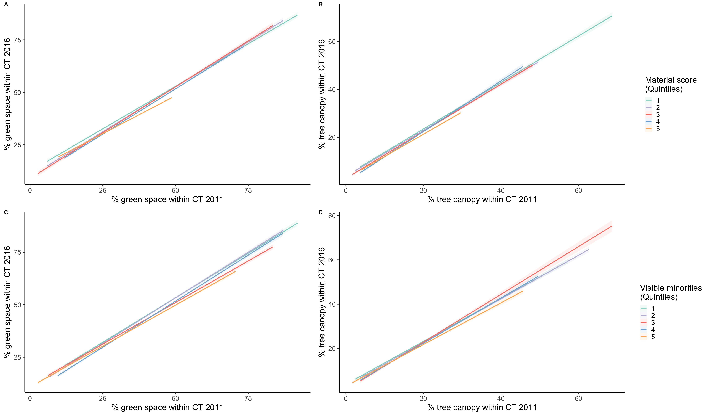


```r
base_size_all = 20

# extract the legend from one of the plots
legend.row3 <- get_legend(
  # create some space to the left of the legend
  g_gen_gr + labs(colour='Gentrified', fill='Gentrified') + theme(legend.box.margin = margin(0, 0, 0, 12)) + theme_classic(base_size = base_size_all)
)

prow3.1 <- plot_grid(
  g_gen_gr + xlab("% green space within CT 2011") + ylab("% green space within CT 2016") + theme_classic(base_size = base_size_all) + theme(legend.position = "none"),
  g_gen_tc + xlab("% tree canopy within CT 2011") + ylab("% tree canopy within CT 2016") + theme_classic(base_size = base_size_all) + theme(legend.position = "none"),
  align = "vh",
  labels = c("A", "B"),
  hjust = -1,
  nrow = 1
)

plot_grid(prow3.1, legend.row3, rel_widths = c(3, .4))
```


### Categorical SES variables


```r
base_size_all = 20
# extract the legend from one of the plots
legend.row1 <- get_legend(
  # create some space to the left of the legend
  g_mat_tc.categ + labs(colour='Material score\n(Quintiles) as\ncategorical variables', fill='Material score\n(Quintiles) as\ncategorical variables') + theme(legend.box.margin = margin(0, 0, 0, 12))+ theme_classic(base_size = base_size_all)
)

prow1.1 <- plot_grid(
  g_mat_gr.categ + xlab("% green space within CT 2011") + ylab("% green space within CT 2016")  + theme_classic(base_size = base_size_all) + theme(legend.position = "none"),
  g_mat_tc.categ + xlab("% tree canopy within CT 2011") + ylab("% tree canopy within CT 2016") + theme_classic(base_size = base_size_all) + theme(legend.position = "none"),
  align = "vh",
  labels = c("A", "B"),
  hjust = -1,
  nrow = 1
)

prow1 <- plot_grid(prow1.1, legend.row1, rel_widths = c(3, .4))

# extract the legend from one of the plots
legend.row2 <- get_legend(
  # create some space to the left of the legend
  g_vis_gr.categ + labs(colour='Visible minorities\n(Quintiles) as\ncategorical variables', fill='Visible minorities\n(Quintiles) as\ncategorical variables') + theme(legend.box.margin = margin(0, 0, 0, 12))+ theme_classic(base_size = base_size_all)
)

prow2.1 <- plot_grid(
  g_vis_gr.categ + xlab("% green space within CT 2011") + ylab("% green space within CT 2016") + theme_classic(base_size = base_size_all) + theme(legend.position = "none"),
  g_vis_tc.categ + xlab("% tree canopy within CT 2011") + ylab("% tree canopy within CT 2016") + theme_classic(base_size = base_size_all) + theme(legend.position = "none"),
  align = "vh",
  labels = c("C", "D"),
  hjust = -1,
  nrow = 1
)

prow2 <- plot_grid(prow2.1, legend.row2, rel_widths = c(3, .4))

# output all graphs
plot_grid(prow1, prow2, ncol=1)
```

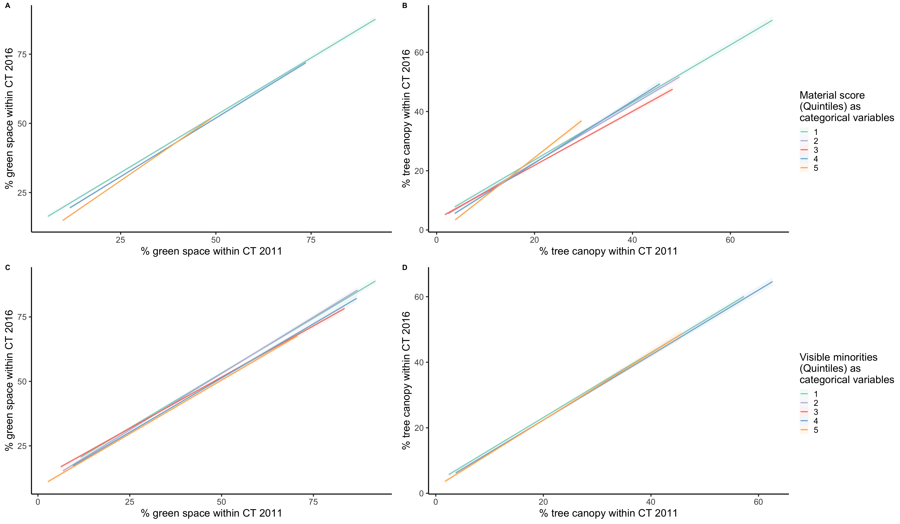

# Annexes


```
## R version 4.1.3 (2022-03-10)
## Platform: x86_64-apple-darwin17.0 (64-bit)
## Running under: macOS Big Sur/Monterey 10.16
## 
## Matrix products: default
## BLAS:   /Library/Frameworks/R.framework/Versions/4.1/Resources/lib/libRblas.0.dylib
## LAPACK: /Library/Frameworks/R.framework/Versions/4.1/Resources/lib/libRlapack.dylib
## 
## locale:
## [1] en_CA.UTF-8/en_CA.UTF-8/en_CA.UTF-8/C/en_CA.UTF-8/en_CA.UTF-8
## 
## attached base packages:
## [1] grid      stats     graphics  grDevices utils     datasets  methods  
## [8] base     
## 
## other attached packages:
##  [1] cancensus_0.5.5   rcompanion_2.4.30 stringr_1.5.0     DHARMa_0.4.6     
##  [5] stargazer_5.2.3   spaMM_4.2.1       spatialreg_1.2-8  spdep_1.2-8      
##  [9] spData_2.2.2      lme4_1.1-33       Matrix_1.4-0      cowplot_1.1.1    
## [13] biscale_1.0.0     openxlsx_4.2.5    RPostgres_1.4.5   DBI_1.1.3        
## [17] ggsn_0.5.0        ggmap_3.0.1       ggplot2_3.4.2     stars_0.6-1      
## [21] abind_1.4-5       sf_1.0-12         tidyr_1.3.0       dplyr_1.1.2      
## 
## loaded via a namespace (and not attached):
##   [1] readxl_1.4.2        systemfonts_1.0.4   lwgeom_0.2-11      
##   [4] plyr_1.8.8          sp_1.6-0            splines_4.1.3      
##   [7] TH.data_1.1-2       digest_0.6.29       htmltools_0.5.3    
##  [10] fansi_1.0.3         magrittr_2.0.3      geojsonsf_2.0.3    
##  [13] tzdb_0.3.0          readr_2.1.4         matrixStats_0.62.0 
##  [16] vroom_1.6.0         svglite_2.1.0       sandwich_3.0-2     
##  [19] timechange_0.2.0    jpeg_0.1-9          colorspace_2.0-3   
##  [22] rvest_1.0.3         blob_1.2.3          xfun_0.39          
##  [25] crayon_1.5.1        jsonlite_1.8.4      libcoin_1.0-9      
##  [28] Exact_3.2           survival_3.2-13     zoo_1.8-10         
##  [31] glue_1.6.2          kableExtra_1.3.4    registry_0.5-1     
##  [34] gtable_0.3.0        webshot_0.5.3       scales_1.2.1       
##  [37] mvtnorm_1.1-3       Rcpp_1.0.9          viridisLite_0.4.1  
##  [40] units_0.8-2         foreign_0.8-82      bit_4.0.4          
##  [43] proxy_0.4-27        stats4_4.1.3        httr_1.4.4         
##  [46] RColorBrewer_1.1-3  wk_0.6.0            ellipsis_0.3.2     
##  [49] modeltools_0.2-23   pkgconfig_2.0.3     farver_2.1.1       
##  [52] multcompView_0.1-9  sass_0.4.2          deldir_1.0-6       
##  [55] utf8_1.2.2          tidyselect_1.2.0    labeling_0.4.2     
##  [58] rlang_1.1.1         munsell_0.5.0       cellranger_1.1.0   
##  [61] tools_4.1.3         cachem_1.0.6        cli_3.6.0          
##  [64] generics_0.1.3      evaluate_0.16       fastmap_1.1.0      
##  [67] yaml_2.3.7          knitr_1.43          bit64_4.0.5        
##  [70] zip_2.2.0           purrr_1.0.1         s2_1.1.0           
##  [73] RgoogleMaps_1.4.5.3 coin_1.4-2          rootSolve_1.8.2.3  
##  [76] pbapply_1.5-0       nlme_3.1-162        slam_0.1-50        
##  [79] ROI_1.0-0           xml2_1.3.3          compiler_4.1.3     
##  [82] rstudioapi_0.14     png_0.1-7           e1071_1.7-11       
##  [85] tibble_3.2.1        bslib_0.4.0         DescTools_0.99.48  
##  [88] stringi_1.7.12      highr_0.9           RSpectra_0.16-1    
##  [91] forcats_1.0.0       lattice_0.20-45     classInt_0.4-7     
##  [94] nloptr_2.0.3        vctrs_0.6.2         pillar_1.9.0       
##  [97] LearnBayes_2.15.1   lifecycle_1.0.3     lmtest_0.9-40      
## [100] jquerylib_0.1.4     data.table_1.14.2   bitops_1.0-7       
## [103] maptools_1.1-4      lmom_2.9            R6_2.5.1           
## [106] KernSmooth_2.23-20  gld_2.6.6           codetools_0.2-18   
## [109] boot_1.3-28         MASS_7.3-55         withr_2.5.0        
## [112] nortest_1.0-4       multcomp_1.4-23     expm_0.999-6       
## [115] parallel_4.1.3      hms_1.1.2           coda_0.19-4        
## [118] class_7.3-20        minqa_1.2.4         rmarkdown_2.21     
## [121] numDeriv_2016.8-1.1 lubridate_1.9.2
```

